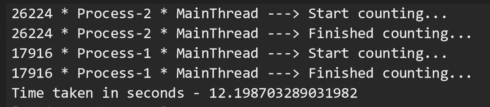

# DIY:Python 中的多线程与多处理

> 原文：<https://levelup.gitconnected.com/diy-multithreading-vs-multiprocessing-in-python-fb93698ca7f3>


DIY？你是说，自己动手？多线程？多重处理？那只是同时做多项任务，对吧？我不用担心，我的电脑会处理好的。但是怎么做呢？

在本文中，我们将学习 Python 中多线程和多重处理的内容、原因和方式。在我们深入研究代码之前(这里有[和](https://github.com/varunkumar032/python_threading_vs_multiprocessing)，让我们理解这些术语的含义。

一个**程序**是一个可执行文件，它由一组执行某项任务的指令组成，通常存储在你电脑的磁盘上。

一个**进程**就是我们所说的一个程序，它已经和它运行所需的所有资源一起被加载到内存中。它有自己的存储空间。

一个**线程**是一个进程中的执行单元。一个进程可以有多个线程作为它的一部分运行，其中每个线程使用进程的内存空间并与其他线程共享。

**多线程**是一种技术，在这种技术中，一个进程产生多个线程，在几乎相同的时间一个接一个地执行不同的任务。这给你一种线程并行运行的错觉，但它们实际上是以并发方式运行的。在 Python 中，全局解释器锁(GIL)防止线程同时运行。

**多重处理**是一种实现最真实的并行性的技术。多个进程跨多个 CPU 内核运行，这些内核之间不共享资源。每个进程可以有许多线程在自己的内存空间中运行。在 Python 中，每个进程都有自己的 Python 解释器实例来执行指令。

唷，有很多关键词。现在，事不宜迟，让我们进入程序，尝试以六种不同的方式执行两种不同类型的函数: **IO 绑定的**和 **CPU 绑定的**。在 IO 绑定的函数中，我们要求 CPU 闲置并打发时间，而在 CPU 绑定的函数中，CPU 将忙于生成一些数字。

## 要求:

1.  一台 Windows 电脑(我的机器有 6 个内核)。
2.  Python 3.x 已安装。
3.  编写 Python 程序的任何文本编辑器/IDE(我在这里使用 Sublime Text)。

下面是我们程序的结构，它在所有六个部分中都是通用的。在我提到`# YOUR CODE SNIPPET HERE`的地方，边走边用各个部分的代码片段替换。

```
import time, os
from threading import Thread, current_thread
from multiprocessing import Process, current_processCOUNT = 200000000
SLEEP = 10def io_bound(sec):
    pid = os.getpid()
    threadName = current_thread().name
    processName = current_process().name
    print(f"{pid} * {processName} * {threadName} \
        ---> Start sleeping...")
    time.sleep(sec)
    print(f"{pid} * {processName} * {threadName} \
        ---> Finished sleeping...")def cpu_bound(n):
    pid = os.getpid()
    threadName = current_thread().name
    processName = current_process().name
    print(f"{pid} * {processName} * {threadName} \
        ---> Start counting...")
    while n>0:
        n -= 1
    print(f"{pid} * {processName} * {threadName} \
        ---> Finished counting...")if __name__=="__main__":
    start = time.time() # YOUR CODE SNIPPET HERE end = time.time()
    print('Time taken in seconds -', end - start)
```

## 第 1 部分:运行两次 IO 绑定任务，一个接一个…

```
 # Code snippet for Part 1
    io_bound(SLEEP)
    io_bound(SLEEP)
```

这里，我们要求我们的 CPU 执行函数`io_bound()`，它接受一个整数(这里是 10)作为参数，并要求 CPU 休眠那么多秒。这个执行总共需要 20 秒，因为每个函数的执行需要 10 秒才能完成。注意，是同一个*主进程*使用它的默认线程*主线程*一个接一个地调用我们的函数两次。


第 1 部分的输出

## 第 2 部分:使用线程运行 IO 绑定任务…

```
 # Code snippet for Part 2
    t1 = Thread(target=io_bound, args=(SLEEP,))
    t2 = Thread(target=io_bound, args=(SLEEP,))
    t1.start()
    t2.start()
    t1.join()
    t2.join()
```

这里，让我们使用 Python 中的线程来加速函数的执行。线程 *Thread-1* 和 *Thread-2* 由我们的*主进程*启动，它们几乎同时调用我们的函数。这两个线程同时完成了休眠 10 秒的工作。这将我们整个程序的总执行时间显著减少了 50%。因此，多线程是执行任务的首选解决方案，其中 CPU 的空闲时间可以用来执行其他任务。因此，通过利用等待时间来节省时间。


第 2 部分的输出

## 第 3 部分:运行两次 CPU 绑定的任务，一个接一个…

```
 # Code snippet for Part 3
    cpu_bound(COUNT)
    cpu_bound(COUNT)
```

这里，我们将调用我们的函数`cpu_bound()`，它接受一个大数字(这里是 200000000)作为参数，并在每一步递减它，直到它为零。我们的 CPU 被要求在每次函数调用时进行倒计时，大概需要 12 秒左右(这个数字在您的机器上可能会有所不同)。因此，整个程序的执行花费了我大约 26 秒的时间。请注意，这又是我们的*主进程*在其默认线程*主线程*中一个接一个地调用该函数两次。


第 3 部分的输出

## 第 4 部分:线程化能加速我们 CPU 受限的任务吗？

```
 # Code snippet for Part 4
    t1 = Thread(target=cpu_bound, args=(COUNT,))
    t2 = Thread(target=cpu_bound, args=(COUNT,))
    t1.start()
    t2.start()
    t1.join()
    t2.join()
```

好了，我们刚刚证明了线程对于多个 IO 绑定的任务非常有效。让我们使用同样的方法来执行 CPU 受限的任务。最初，它确实同时启动了我们的线程，但是最后，我们看到整个程序的执行用了大约 40 秒！刚刚发生了什么？这是因为当*线程-1* 启动时，它获得了全局解释器锁(GIL ),这阻止了*线程-2* 使用 CPU。因此， *Thread-2* 必须等待 *Thread-1* 完成其任务并释放锁，这样它才能获得锁并执行其任务。锁的获取和释放增加了总执行时间的开销。因此，我们可以有把握地说，对于需要 CPU 处理的任务，线程不是理想的解决方案。


第 4 部分的输出

## 第 5 部分:那么，将任务分割成独立的过程有效吗？

```
 # Code snippet for Part 5
    p1 = Process(target=cpu_bound, args=(COUNT,))
    p2 = Process(target=cpu_bound, args=(COUNT,))
    p1.start()
    p2.start()
    p1.join()
    p2.join()
```

让我们开门见山吧。多重处理是答案。在这里，*主进程*旋转出两个子进程，具有不同的 PID，每个子进程都负责将数字减为零。每个进程并行运行，利用独立的 CPU 内核和自己的 Python 解释器实例，因此整个程序的执行只花了 12 秒。请注意，输出可能会以无序的方式打印，因为流程是相互独立的。每个进程在自己的默认线程*主线程*中执行该功能。在程序执行期间打开任务管理器。您可以看到 Python 解释器的 3 个实例，分别对应于*主进程*、*进程-1* 和*进程-2* 。您还可以看到，在程序执行期间，两个子进程的功耗“非常高”，因为它们正在执行的任务实际上消耗了它们自己的 CPU 内核，如 CPU 性能图中的峰值所示。



第 5 部分的输出


任务管理器中的进程:CPU 受限任务的多重处理


任务管理器的性能:CPU 受限任务的多重处理

## 第 6 部分:嘿，让我们为 IO 绑定的任务使用多处理…

```
 # Code snippet for Part 6
    p1 = Process(target=io_bound, args=(SLEEP,))
    p2 = Process(target=io_bound, args=(SLEEP,))
    p1.start()
    p2.start()
    p1.join()
    p2.join()
```

既然我们对多处理帮助我们实现并行有了一个合理的想法，我们将尝试使用这种技术来运行我们的 IO 绑定任务。我们确实观察到结果是不同寻常的，就像多线程的情况一样。由于进程 *Process-1* 和 *Process-2* 正在执行请求它们自己的 CPU 内核空闲几秒钟的任务，我们没有发现高功耗。但是创建进程本身是一项 CPU 繁重的任务，比创建线程需要更多的时间。此外，进程比线程需要更多的资源。因此，对于 IO 绑定的任务，最好将多处理作为第二选择，多线程作为第一选择。


第 6 部分的输出


任务管理器中的进程:IO 绑定任务的多重处理


任务管理器的性能:IO 绑定任务的多重处理

嗯，那真是一段旅程。我们看到了六种不同的方法来执行一项任务，大约需要 10 秒钟，这取决于任务在 CPU 上是轻是重。

**底线**:IO 绑定任务的多线程。CPU 密集型任务的多重处理。