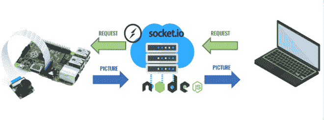

# DIY 远程相机使用树莓派，Pi 相机，和插座。超正析象管(Image Orthicon)

> 原文：<https://levelup.gitconnected.com/diy-remote-camera-using-raspberry-pi-pi-camera-and-socket-io-ec2e89ef5d39>

在某些情况下，您可能需要远程拍摄照片并进行查看。配一个树莓 Pi 单板电脑，Pi 摄像头和插座。IO 服务器，创建 DIY 远程相机从未如此简单。

要创建这个远程摄像机系统，您需要以下内容:

1.  运行 Raspbian 的 Raspberry Pi 设备
2.  Pi 照相机
3.  像 Heroku 这样的云平台

# 建筑

下图显示了系统的架构。



Pi 摄像机将连接到 Raspberry Pi 设备。Raspberry Pi 将运行一个监听套接字的节点应用程序。IO 服务器。想要拍照的客户只需请求套接字。一张图片的 IO 服务器。然后，服务器会将请求转发给 Raspberry Pi 设备。Raspberry Pi 设备会拍摄一张照片，并将其发送到服务器。服务器会将图片发送给客户端。

## 为什么我不能直接从 Raspberry Pi 请求图片？

为了能够直接向 Raspberry Pi 设备请求图片，该设备应该运行服务器。尽管这在 Raspberry Pi 设备上很有可能实现，但问题还是出现在通信上。要向 Raspberry Pi 设备发送请求，我们应该能够唯一地标识该设备。如果您只打算在家中部署这种设置，那么这就像将您的 Raspberry Pi 设备连接到本地网络并为其分配一个静态 IP 地址一样简单。

但是如果你想通过网络拍照呢？你必须从你的 ISP 那里购买一个静态 IP 地址来分配给 Raspberry Pi，正如你可能已经知道的，这是非常昂贵的。通过使用运行在云平台上的服务器，我们将拥有一个即使在互联网上也是唯一可识别的端点。由于我们的服务器运行一个简单的应用程序，我们可以利用 Heroku 这样的免费云平台来托管我们的应用程序。

## 为什么插座。IO 而不是 http 请求？

您可以通过 http 调用向服务器请求图片。但是服务器如何通过 http 调用向 Raspberry Pi 设备请求图片呢？如果 Raspberry Pi 设备要服务 http 请求，它应该运行 http 服务器，但是我们已经知道在远程设备上运行服务器是不可行的。当然，我们可以让 Raspberry Pi 设备通过 http 调用轮询服务器，以查看是否有新的请求，以便它可以拍照并通过 http 调用发送照片，但这不是实时的，可能会导致不必要的服务器负载。

什么插座。IO 所做的是在 http 上创建一个隧道，其方式类似于传输层上的 TCP/IP 套接字。这有助于客户端与服务器建立连接并保持连接活动，以便客户端和服务器可以相互请求信息。

# 服务器

让我们从编写服务器应用程序开始。这是一个 node.js 应用程序，做两件事。

1.  创建一个套接字服务器，侦听并处理来自客户端的请求
2.  从 Raspberry Pi 设备请求图片并将图片转发给相关客户端

为了建立这个应用程序，我们需要安装两个模块，即。、`express`和`socket.io`

`npm install --save express`

现在，让我们初始化这两个模块。

```
const PORT = process.env.PORT || 5000 var app=require('express')(); var socket=require('socket.io')( app.listen(PORT,()=>{ console.log("Server is listening on ",PORT); }) );
```

我们正在实例化 express 模块，并将它的 listen 方法传递给`socket.io`函数来创建一个套接字。我们现在有了一个套接字，可以用来监听连接。

插座。IO 是事件驱动的。您发出一个事件，并让一个侦听器侦听该事件。当客户端连接到服务器时，会向客户端和服务器发出一个`connection`事件。我们的服务器需要监听`connection`事件。

我们可以创建名称空间，并让套接字连接到特定的名称空间。这有助于我们分离应用程序中的关注点。

在我们的应用程序中，我们创建了一个名为`camera`的名称空间，并让客户端连接到该名称空间。

```
socket.of('camera').on("connection", io=>{ console.log("Client connected!",io.id); })
```

我们使用`of`方法来指定我们需要监听新连接的名称空间。`on`方法创建一个监听器。第一个参数引用事件，下一个参数是回调函数——它接受连接套接字作为参数——每次收到事件时都会调用这个函数。现在，每当一个套接字连接到我们的服务器时，我们的控制台将打印一条消息以及套接字的 id。

*原载于 2019 年 6 月 19 日*[*https://www.thearmchaircritic.org*](https://www.thearmchaircritic.org/tech-journals/diy-remote-camera-using-raspberry-pi-pi-camera-and-socket-io)*。*