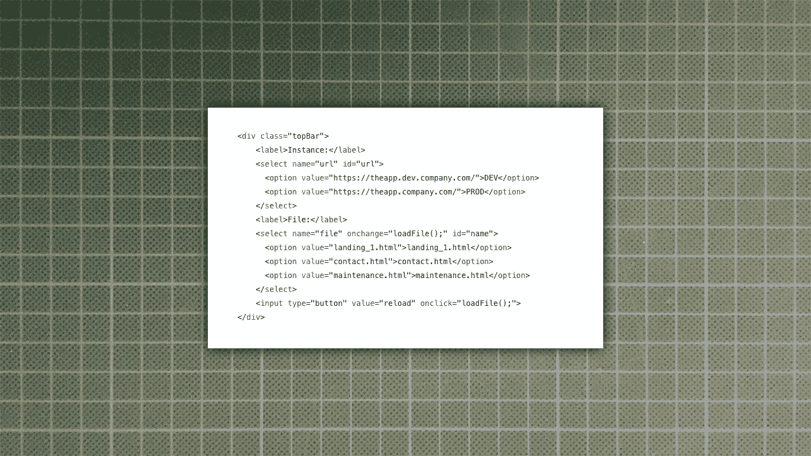

# 快速访问 HTML 片段或页面的 DIY 工具

> 原文：<https://levelup.gitconnected.com/diy-tool-for-fast-access-to-html-snippets-or-pages-940794db5d9c>

## 在做网站开发的时候，节省你的时间和精力

作者提供的图片

我的一个客户使用 Angular 构建了一个非常大的 web 应用程序。为了推广应用程序，有一些很酷的登录页面。为了帮助用户，应用程序中嵌入了许多模态对话框。

所有这些页面和对话框都是用 Angular 构建的静态 HTML 页面。大约有 15 页的应用程序的 5 个实例:开发，测试，测试 2，演示和生产。

我的任务是使用 HTML 和 CSS 创建这些静态页面。开发它很痛苦，维护它们也很乏味。其中一些页面和对话框只在应用程序的特定状态下出现。模式对话框只随父页面加载一次。所以需要大量的页面重新加载和点击来获得这些页面的最新版本。

# 今天发生了一些变化，我很害怕！

但是我有一个想法，为什么不构建一个小的 HTML 页面，在一个 DIV 中通过 AJAX 加载这些页面呢？我只需要一个浏览器插件来禁用跨源限制，我已经安装了这个插件。所以这个问题就解决了。

接下来，AJAXing 需要一些 Javascript。我用纯 JS 来保持精益。

然后是第一个测试:加载 AJAX 的一个页面没有任何问题。是的，它完美地工作了！

这些实例有不同的 URL，比如 theapp.dev.company.com、theapp.test.company.com 或 theapp.company.com。所以我添加了一个选择框来选择实例(记住:dev，test，test2，demo，prod)。第二个用于选择我想要加载的页面，例如 landingpage_1.html 或 modal_a_1.html

通过文件选择框的 onchange 事件，我从选定的实例中加载选定的页面。

# 截图和代码:

## 完整代码:

# 为什么不把它加载到 IFRAME 中呢？

当然，这是我的第一个想法，但这些页面的 CSS 嵌入在父应用程序中，所以当你将它加载到 IFRAME 中时，所有的样式都丢失了。如果你看看代码，你会看到应用程序的 CSS 文件的链接:“https://the app . company . com/static/static . CSS”

如果使用 AJAX 将 HTML 代码加载到 DIV 中，问题就解决了！

# 其他使用案例

我的工作是开发和维护大量的静态 HTML 页面和代码，这些页面和代码用在一个具有许多功能的大型应用程序中。

想象一下嵌入在服务器上运行的移动应用程序中的静态 HTML 页面。有时没有简单的方法来重新加载这样的页面，甚至加载这样的页面。然后我们有老的缓存问题。使用这个小小的加载工具节省时间和精力。

也许您正在处理一个页面，其中元素的显示或隐藏取决于 GET 参数:用户是否登录，用户是否有权查看某些元素。使用这个工具，你可以比在浏览器的地址栏中输入 GET 参数更快地加载这样的页面。

如果你对如何使用这个工具有其他想法，请告诉我。

请随意复制代码并根据您的需要进行修改。

编码快乐！