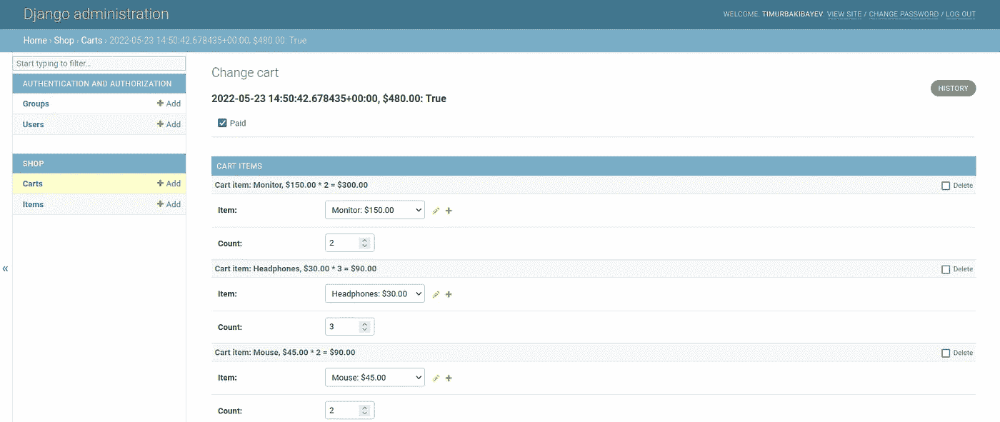

# Django 管理堆叠内联示例:多对一关系

> 原文：<https://levelup.gitconnected.com/django-admin-stacked-inline-example-many-to-many-relations-e81ae4b59f51>

你如何把几样东西加入购物车？

Django Admin 在处理数据时非常强大。许多(甚至是有经验的)开发人员都不知道的一个特性是在同一页面上有多个多对一或多对多行，如下图所示:

令人兴奋，不是吗？而且食谱很简单，大家看看吧。

# 数据(模型)

模型很简单:我们有商品，我们有购物车，我们有一个表 CartItem，用于商品和购物车之间的多对多关系。我们不能使用模型。因为我们在关系中需要这个额外的“计数”字段。我发现当我自己建立关系时，它变得更加透明。

# 管理

在 Admin 中，我们不是简单地直接注册模型，而是需要创建一个 ModelAdmin 类和一个 StackedInline 类。

想法如下。我们首先创建多行视图来绘制 CartItem 表。然后我们将这个视图添加到购物车的视图中。

这是按如下方式完成的:

就是这样，没多久，我发现它极其有用。

你喜欢这篇文章吗？关注我，阅读我关于 Django 的其他文章。

尚未订阅媒体？使用下面我的个人链接，对你来说，这在成本上没有区别，但我从每次订阅中受益。