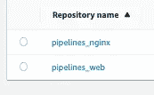
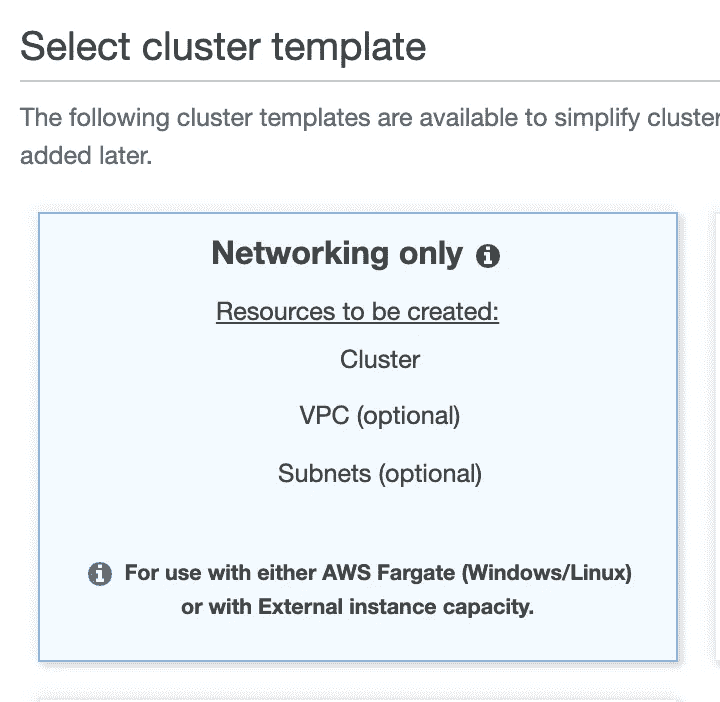
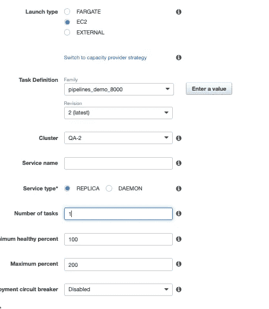
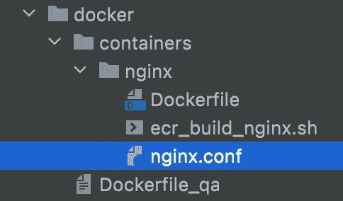
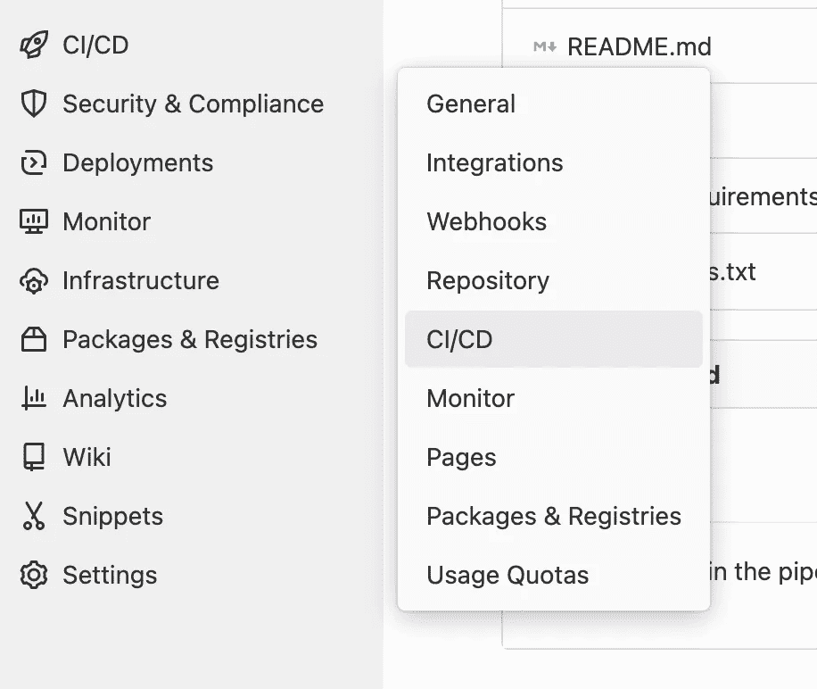
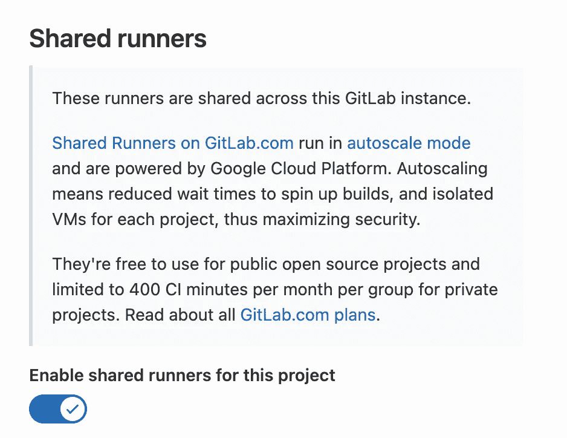
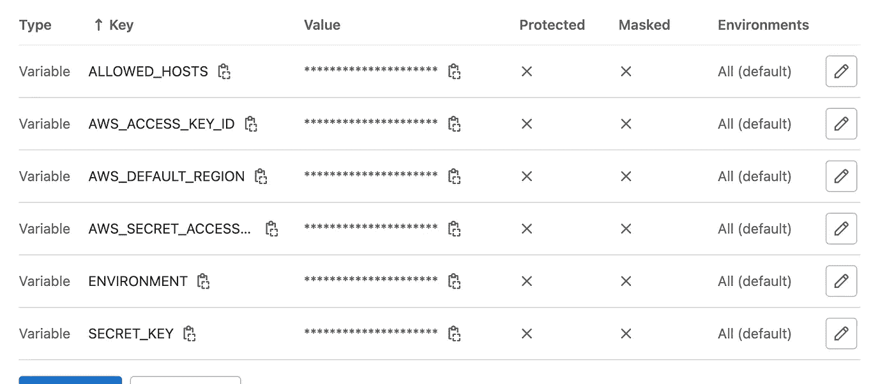

# 使用 GitLab 管道在 AWS ECS 上部署 Django 应用程序

> 原文：<https://levelup.gitconnected.com/django-app-deployed-using-gitlab-pipeline-on-aws-ecs-43689d2fc5bf>


作为一个新手，在 GitLab 中设置管道可能很麻烦。我将一步一步地向您介绍在特定分支发生合并请求时部署到 AWS ECS 容器服务的基本流程。对于这个例子，我将使用一个 Django 应用程序。

先决条件:

*   自动警报系统
*   姜戈
*   码头工人
*   网络服务

我们的第一个目标是尝试使用 Docker 和 web 服务让应用程序在本地工作，最好是在不同于通常的 80 端口上。在这个例子中，我将使用 Nginx。

检查一下你在 https://eu-west-2.console.aws.amazon.com/ecr/repositories?有 ECS 仓库吗区域=欧盟-西方-2 。您将需要 2 个，一个用于应用程序，一个用于 web 服务。这是 ECS 将使用 docker 映像从下面进一步定义的地方进行加载的地方



现在创建一个新的测试集群、服务和任务。我将使用所有默认值



创建一个新任务，可以使用向导或 json。酌情替换***部分。

json 关键对象“environment”中的值是您的应用程序所需的值。我可能有一些额外的，这是不需要一个基本的应用程序。

我启用了“日志配置”,因为这对于在 AWS Cloudwatch 中调试您的环境非常有用。

对于“端口映射”,您需要设置高端口，用于从浏览器访问应用程序。在该容器内，它本身将是端口 80。

有两个“容器定义”,一个用于 web 服务，一个来自应用程序。他们将使用早先创建的存储库，在键`image`下指定

```
{
  "ipcMode": null,
  "executionRoleArn": null,
  "containerDefinitions": [
    {
      "dnsSearchDomains": null,
      "environmentFiles": null,
      "logConfiguration": {
        "logDriver": "awslogs",
        "secretOptions": null,
        "options": {
          "awslogs-group": "/ecs/pipelines_4000",
          "awslogs-region": "eu-west-2",
          "awslogs-stream-prefix": "ecs"
        }
      },
      "entryPoint": null,
      "portMappings": [
        {
          "hostPort": 4000,
          "protocol": "tcp",
          "containerPort": 4000
        }
      ],
      "command": null,
      "linuxParameters": null,
      "cpu": 0,
      "environment": [
        {
          "name": "ALLOWED_HOSTS",
          "value": "*"
        },
        {
          "name": "AWS_ACCESS_KEY_ID",
          "value": "***"
        },
        {
          "name": "AWS_S3_REGION_NAME",
          "value": "eu-west-2"
        },
        {
          "name": "AWS_SECRET_ACCESS_KEY",
          "value": "***"
        },
        {
          "name": "AWS_STORAGE_BUCKET_NAME",
          "value": "***"
        },
        {
          "name": "BASE_URL",
          "value": "[*](https://qa-reachhf.hci.digital)**"
        },
        {
          "name": "DEBUG",
          "value": "1"
        },
        {
          "name": "DEFAULT_FROM_EMAIL",
          "value": "[*](mailto:info@reachhf.co.uk)**"
        },
        {
          "name": "DEFAULT_SUPERUSER_EMAIL",
          "value": "***"
        },
        {
          "name": "DEFAULT_SUPERUSER_PASSWORD",
          "value": "***"
        },
        {
          "name": "DEFAULT_SUPERUSER_USERNAME",
          "value": "reach_super"
        },
        {
          "name": "EMAIL_BACKEND",
          "value": "django.core.mail.backends.smtp.EmailBackend"
        },
        {
          "name": "EMAIL_HOST",
          "value": "***"
        },
        {
          "name": "EMAIL_HOST_PASSWORD",
          "value": "***"
        },
        {
          "name": "EMAIL_HOST_USER",
          "value": "***"
        },
        {
          "name": "EMAIL_PORT",
          "value": "***"
        },
        {
          "name": "EMAIL_USE_SSL",
          "value": "0"
        },
        {
          "name": "EMAIL_USE_TLS",
          "value": "1"
        },
        {
          "name": "ENVIRONMENT",
          "value": "***"
        },
        {
          "name": "RDS_DB_NAME",
          "value": "***"
        },
        {
          "name": "RDS_HOSTNAME",
          "value": "***"
        },
        {
          "name": "RDS_PASSWORD",
          "value": "***"
        },
        {
          "name": "RDS_PORT",
          "value": "***"
        },
        {
          "name": "RDS_USERNAME",
          "value": "***"
        },
        {
          "name": "SECRET_KEY",
          "value": "***"
        },
        {
          "name": "SESSION_COOKIE_DOMAIN",
          "value": "***"
        }
      ],
      "resourceRequirements": null,
      "ulimits": null,
      "dnsServers": null,
      "mountPoints": [],
      "workingDirectory": null,
      "secrets": null,
      "dockerSecurityOptions": null,
      "memory": 350,
      "memoryReservation": null,
      "volumesFrom": [],
      "stopTimeout": null,
      "image": "***.dkr.ecr.eu-west-2.amazonaws.com/pipelines-django",
      "startTimeout": null,
      "firelensConfiguration": null,
      "dependsOn": null,
      "disableNetworking": null,
      "interactive": null,
      "healthCheck": null,
      "essential": true,
      "links": null,
      "hostname": null,
      "extraHosts": null,
      "pseudoTerminal": null,
      "user": null,
      "readonlyRootFilesystem": null,
      "dockerLabels": null,
      "systemControls": null,
      "privileged": null,
      "name": "pipelines_django"
    },
    {
      "dnsSearchDomains": null,
      "environmentFiles": null,
      "logConfiguration": {
        "logDriver": "awslogs",
        "secretOptions": null,
        "options": {
          "awslogs-group": "/ecs/pipelines_4000",
          "awslogs-region": "eu-west-2",
          "awslogs-stream-prefix": "ecs"
        }
      },
      "entryPoint": null,
      "portMappings": [
        {
          "hostPort": 4001,
          "protocol": "tcp",
          "containerPort": 80
        }
      ],
      "command": null,
      "linuxParameters": null,
      "cpu": 0,
      "environment": [],
      "resourceRequirements": null,
      "ulimits": null,
      "dnsServers": null,
      "mountPoints": [],
      "workingDirectory": null,
      "secrets": null,
      "dockerSecurityOptions": null,
      "memory": 128,
      "memoryReservation": null,
      "volumesFrom": [],
      "stopTimeout": null,
      "image": "***.dkr.ecr.eu-west-2.amazonaws.com/pipelines-nginx",
      "startTimeout": null,
      "firelensConfiguration": null,
      "dependsOn": null,
      "disableNetworking": null,
      "interactive": null,
      "healthCheck": null,
      "essential": true,
      "links": [
        "pipelines_django"
      ],
      "hostname": null,
      "extraHosts": null,
      "pseudoTerminal": null,
      "user": null,
      "readonlyRootFilesystem": null,
      "dockerLabels": null,
      "systemControls": null,
      "privileged": null,
      "name": "pipelines_nginx"
    }
  ],
  "placementConstraints": [],
  "memory": null,
  "taskRoleArn": null,
  "compatibilities": [
    "EXTERNAL",
    "EC2"
  ],
  "taskDefinitionArn": "arn:aws:ecs:eu-west-2:***:task-definition/pipelines_4000:8",
  "family": "pipelines_4000",
  "requiresAttributes": [
    {
      "targetId": null,
      "targetType": null,
      "value": null,
      "name": "com.amazonaws.ecs.capability.logging-driver.awslogs"
    },
    {
      "targetId": null,
      "targetType": null,
      "value": null,
      "name": "com.amazonaws.ecs.capability.ecr-auth"
    },
    {
      "targetId": null,
      "targetType": null,
      "value": null,
      "name": "com.amazonaws.ecs.capability.docker-remote-api.1.19"
    }
  ],
  "pidMode": null,
  "requiresCompatibilities": [
    "EC2"
  ],
  "networkMode": null,
  "runtimePlatform": null,
  "cpu": null,
  "revision": 8,
  "status": "ACTIVE",
  "inferenceAccelerators": null,
  "proxyConfiguration": null,
  "volumes": []
}
```

创建一个服务，将其命名为 pipelines_demo，并关联您刚刚创建的任务



在 GitLab 中创建一个名为 Pipelines 的新存储库。

用 Python 初始化一个简单的 Django 应用程序。

现在为 Nginx 设置一个 Docker 映像



```
#Dockerfile
FROM nginx:1.19.0-alpine

RUN rm /etc/nginx/conf.d/default.conf
COPY nginx.conf /etc/nginx/conf.d
```

#ecr_build_nginx.sh

酌情替换***部分。您希望使用与您创建的存储库相同的名称，以保持一致性

```
**#!/bin/sh** aws ecr get-login-password --region eu-west-2 | docker login --username AWS --password-stdin ***.dkr.ecr.eu-west-2.amazonaws.com
# Build the docker container ( stipulating AMD chipset if on a Mac M1 )
docker build  --no-cache --platform linux/amd64 -t pipelines-nginx .
# Tag the completed build in ECR
docker tag pipelines-nginx:latest ***.dkr.ecr.eu-west-2.amazonaws.com/pipelines-nginx:latest
# Push this build to ECR as latest
docker push ***.dkr.ecr.eu-west-2.amazonaws.com/pipelines-nginx:latest
```

# nginx.conf

```
# should match name in docker-compose or container in ECR
upstream pipelines-django {
    server pipelines-django:9000;
}

server {

    listen 80;
    client_max_body_size 100M;

    location / {
        proxy_pass http://pipelines-django;
        proxy_set_header X-Forwarded-For **$**proxy_add_x_forwarded_for;
        proxy_set_header Host **$**host;
        proxy_redirect off;
    }

}
```

设置 Docker 来运行这个应用程序

```
# Dockerfile
FROM python:3.7-slim

RUN apt-get update
RUN apt-get install -y libpq-dev zip
RUN apt-get install gcc -y

COPY . /pipeline
RUN chmod +x pipeline/aws_start.sh
RUN pip install -r /pipeline/dev-requirements.txt
RUN pip install gunicorn
VOLUME /pipeline
WORKDIR /pipeline
EXPOSE 4000

ENV PYTHONUNBUFFERED 1
RUN ["chmod", "+x", "/pipeline/aws_start.sh"]
ENTRYPOINT /pipeline/aws_start.sh
```

Docker 将运行这个条目文件

```
#!/bin/sh# aws_start.sh
python manage.py migrate
python manage.py collectstatic --noinput
python manage.py create_default_superuser
gunicorn -w 3 -b :4000 pipeline.wsgi:application
```

这个脚本将创建。环境文件。你会注意到它从 AWS 系统管理器获取秘密文本。它还将构建应用程序并将其部署到 ECS

# ecr_deploy.sh

```
**#!/bin/sh** mv .env .env_local

# Copy the QA env to the project root so it is automatically picker up during docker build
echo -en 'ALLOWED_HOSTS=*\n' >> .env
AWS_ACCESS_KEY_ID=`aws ssm get-parameter --name pipelines-AWS_SECRET_ACCESS_KEY | jq -r .Parameter.Value`
echo -en 'AWS_ACCESS_KEY_ID='$AWS_ACCESS_KEY_ID'\n' >> .env
echo -en 'AWS_S3_REGION_NAME=eu-west-2\n' >> .env
AWS_SECRET_ACCESS_KEY=`aws ssm get-parameter --name pipelines-AWS_SECRET_ACCESS_KEY | jq -r .Parameter.Value`
echo -en 'AWS_SECRET_ACCESS_KEY='$AWS_SECRET_ACCESS_KEY'\n' >> .env
echo -en 'AWS_STORAGE_BUCKET_NAME=pipelines\n' >> .env
echo -en 'BASE_URL=https://pipelines.co.uk\n' >> .env
echo -en 'DATABASE_ENGINE=django.db.backends.mysql\n' >> .env
echo -en 'DATABASE_HOST=pipelines.coz8h02qupfe.eu-west-2.rds.amazonaws.com\n' >> .env
echo -en 'DATABASE_NAME=pipelines\n' >> .env
DATABASE_PASSWORD=`aws ssm get-parameter --name pipelines-DATABASE_PASSWORD | jq -r .Parameter.Value`
echo -en 'DATABASE_PASSWORD='$DATABASE_PASSWORD'\n' >> .env
echo -en 'DATABASE_PORT=3306\n' >> .env
echo -en 'DATABASE_USER=pipelines\n' >> .env
echo -en 'DEBUG=0\n' >> .env
echo -en 'DJANGO_SETTINGS_MODULE=zero_nineteen.settings\n' >> .env
echo -en 'EMAIL_BACKEND=django.core.mail.backends.smtp.EmailBackend\n' >> .env
echo -en 'EMAIL_HOST=smtp.eu.sparkpostmail.com\n' >> .env
EMAIL_HOST_PASSWORD=`aws ssm get-parameter --name pipelines-EMAIL_HOST_PASSWORD | jq -r .Parameter.Value`
echo -en 'EMAIL_HOST_PASSWORD='$EMAIL_HOST_PASSWORD'\n' >> .env
echo -en 'EMAIL_HOST_USER=SMTP_Injection\n' >> .env
echo -en 'ENVIRONMENT=qa\n' >> .env
FEEDBACK_EMAIL=`aws ssm get-parameter --name pipelines-FEEDBACK_EMAIL | jq -r .Parameter.Value`
echo -en 'FEEDBACK_EMAIL='$FEEDBACK_EMAIL'\n' >> .env
echo -en 'SEARCH_INDEX=pipelines\n' >> .env
SEARCH_URL=`aws ssm get-parameter --name pipelines-SEARCH_URL | jq -r .Parameter.Value`
echo -en 'SEARCH_URL='$SEARCH_URL'\n' >> .env
SECRET_KEY=`aws ssm get-parameter --name pipelines-SECRET_KEY | jq -r .Parameter.Value`
echo -en 'SECRET_KEY='$SECRET_KEY'\n' >> .env

# Rename the local dev Dockerfile
mv Dockerfile Dockerfile_local
# Copy the QA Docker file to root ( this one has references in to the aws_start.sh Entrypoint needed by ECR
cp docker/Dockerfile_qa Dockerfile
# Login to Elastic container registry
aws ecr get-login-password --region eu-west-2 | docker login --username AWS --password-stdin ****.dkr.ecr.eu-west-2.amazonaws.com
# Build the docker container ( stipulating AMD chipset if on a Mac M1 )docker build --no-cache --platform linux/amd64 -t pipelines-django .
# Tag the completed build in ECR
docker tag pipelines-django:latest ***.dkr.ecr.eu-west-2.amazonaws.com/pipelines-django:latest
# Push this build to ECR as latest
docker push ***.dkr.ecr.eu-west-2.amazonaws.com/pipelines-django:latest
# Update the service on the QA cluster to load the changes
aws ecs update-service --force-new-deployment --service zero_nineteen_qa --cluster QA-2
# Delete the Dockerfile with QA settings that was copied into root
rm Dockerfile
# Copy back the Dockerfile intended for local dev
mv Dockerfile_local Dockerfile
# Remove the QA ENVS
rm .env
# Restore the environment variables for local dev
cp .env_local .env
```

# docker-compose.yml

```
version: '3'
services:

  pipelines_django:
    build: .
    command: ${CMD:-bash -c "pip install -r dev-requirements.txt && python manage.py migrate && python manage.py runserver 0.0.0.0:9000"}
    container_name: pipelines_django
    ports:
      - "4000:4000"
    volumes:
      - .:/pipelines
      - ./static:/pipelines/pipelines/static
      - ./media:/pipelines/pipelines/media
    depends_on:
      - pipelines_mysql
    tty: true
    env_file:
      - .env

  pipelines_mysql:
    image: mysql/mysql-server:8.0.23
    command: --default-authentication-plugin=mysql_native_password
    volumes:
      - mysql_data:/var/lib/mysql
    ports:
      - '3306:3306'
    restart: always
    environment:
      MYSQL_ROOT_PASSWORD: pipelines
      MYSQL_DATABASE: pipelines
      MYSQL_ROOT_HOST: '%'

  *# Use for testing local nginx / QA site* pipelines_nginx:
    build: ./docker/containers/nginx
    volumes:
      - static_volume:/Users/Documents/projects/pipelines/static/
    ports:
      - 4001:80
    depends_on:
      - pipelines_mysql
      - pipelines_django

volumes:
  mysql_data:
  static_volume:

networks:
  default:
    external:
      name: pipelines_network
```

在新的 repo 中设置 CI/CD 设置。



启用跑步者下的共享跑步者。



在变量下，我创建了以下内容。您希望在您的应用程序`. gitlab-ci.yml `的 GitLab 模板文件中添加您将使用的那些



解释的变量

ALLOWED_HOSTS:用于 Django

AWS_ACCESS_KEY_ID:我为管道部署创建了专用密钥

AWS_ACCOUNT_ID:您的 AWS 帐户 ID

AWS_REGION:您将部署的区域

AWS_SECRET_ACCESS_KEY:当你创建新的访问密钥时，你也会得到这个

环境:用于应用程序

SECRET_KEY:用于应用

这些变量将被传递到容器中，这样应用程序就可以在管道部署期间访问它们

# .gitlab-ci.yml

```
image: python:latest

services:
  - name: docker:dind
    entrypoint: ["env", "-u", "DOCKER_HOST"]
    command: ["dockerd-entrypoint.sh"]

stages:
  - compile
  - build
  - test

variables:
  DOCKER_HOST: tcp://docker:2375
  DOCKER_DRIVER: overlay2
  DOCKER_TLS_CERTDIR: ""
  MOUNT_POINT: /builds/$CI_PROJECT_PATH/mnt
  REPOSITORY_URL: $AWS_ACCOUNT_ID.dkr.ecr.eu-west-2.amazonaws.com/pipelines-django
  TASK_DEFINITION_NAME: pipelines_4000
  CLUSTER_NAME: QA-2
  SERVICE_NAME: pipelines
  ARTIFACT_REPORT_PATH: "app/reports/"
  PIP_CACHE_DIR: "$CI_PROJECT_DIR/.cache/pip"

cache:
  paths:
    - .cache/pip
    - venv/

compile:
  stage: compile
  before_script:
    - python -V  *# Print out python version for debugging
#    - python -m venv venv
#    - source venv/bin/activate* - pip install -r dev-requirements.txt
  script:
    - python manage.py makemigrations
  artifacts:
    paths:
      - "*/migrations/*.py"
    expire_in: 1 day
  only:
    refs:
      - merge_requests
    variables:
      - $CI_MERGE_REQUEST_TARGET_BRANCH_NAME == "qa"

build:
  image:
    name: docker/compose:1.25.4
    entrypoint: [ "" ]
  stage: build
  before_script:
    - export IMAGE=$CI_REGISTRY/$CI_PROJECT_NAMESPACE/$CI_PROJECT_NAME
    - export WEB_IMAGE=$IMAGE/qa_django
  script:
    - apk add --no-cache bash
    - chmod +x ./setup_env.sh
    - bash ./setup_env.sh
    - docker login -u $CI_REGISTRY_USER -p $CI_JOB_TOKEN $CI_REGISTRY
    - docker-compose -f docker-compose-ci.yml build
    - docker tag pipelines_django:latest $WEB_IMAGE:latest
    - docker images
    - docker push $WEB_IMAGE:latest
  only:
    refs:
      - merge_requests
    variables:
      - $CI_MERGE_REQUEST_TARGET_BRANCH_NAME == "qa"

unittests:
  stage: test
  image: registry.gitlab.com/pipelines/pipelines/qa_django:latest
  script:
    - bash
    - echo $SHELL
    - pwd
    - ls -al venv/bin/
    - ls -al
    - bash -c "python manage.py jenkins  wellbeing --enable-coverage --coverage-format=html"
  only:
    refs:
      - merge_requests
    variables:
      - $CI_MERGE_REQUEST_TARGET_BRANCH_NAME == "qa"
```