# Django + Celery:深入了解 Python 中的后台任务

> 原文：<https://levelup.gitconnected.com/django-celery-going-deeper-with-background-tasks-in-python-fa44958cf7cd>


对于任何 web 开发人员来说，一个重要的工具就是让工作在后台进行。

当我们从 web 服务器卸载长时间运行的任务时，用户可以快速加载页面，我们(开发人员)可以并行处理。赢了，赢了！

在 Python 应用程序(Django/Flask)中，Celery 是目前最常见的后台处理工作的库。这是 Python web 开发人员必须学习的工具。

本文将带您浏览一个示例应用程序，它阐释了 Celery 的特性，并深入介绍了如何使用它们。

# 芹菜和姜戈的基本知识

我曾在一篇最受欢迎的文章中写过芹菜:

[](https://medium.com/swlh/python-developers-celery-is-a-must-learn-technology-heres-how-to-get-started-578f5d63fab3) [## 芹菜教程:Python 开发人员必须学习的技术

### 在后台处理任务的工人是任何开发人员工具箱中必不可少的&强大的工具。

medium.com](https://medium.com/swlh/python-developers-celery-is-a-must-learn-technology-heres-how-to-get-started-578f5d63fab3) 

本文假设您已经熟悉芹菜的基本知识。如果你不是，从上面的文章开始。

# 快速背景

用户不想等待长时间运行的任务。他们想要快速的页面加载。但有时工作需要时间，尤其是对于数据密集型应用程序。我们如何解决它？

我们需要把工作从网络服务器上卸下来。使用任务队列和专用的“工作”服务器，我们可以编排一种异步完成工作的方式。工作人员将在后台运行任务，并向我们更新结果。

在本文中:

*   我已经使用 Django 构建了应用程序。
*   消息队列是在 Redis 中实现的，在这里我们添加新任务，工人接收下一个任务。
*   我们使用 Celery 将所有这些放在一起，从 Django 应用程序中向队列添加任务，并运行处理队列中任务的工作服务器。

咻，短短几段话就包含了很多信息。如果你感到困惑或不明白，在开始这篇文章之前，先看看[芹菜教程](https://medium.com/swlh/python-developers-celery-is-a-must-learn-technology-heres-how-to-get-started-578f5d63fab3)的文章。

# 只想要源代码？

乐意效劳:

[](https://github.com/bennett39/celery39/tree/celery-fib/celery_tutorial) [## 芹菜 39/芹菜 _ 芹菜纤维 bennett 教程 39/芹菜 39

### 芹菜教程。在 GitHub 上创建一个帐户，为 bennett39/celery39 的发展做出贡献。

github.com](https://github.com/bennett39/celery39/tree/celery-fib/celery_tutorial) 

确保你在回购的`celery-fib`分支上！

# 视觉学习者？

我有一个包含所有这些信息的视频，另外你可以看到这个应用程序是如何工作的。

# 使用斐波那契计算器更深入

在本文中，我们将构建一个示例应用程序。为了简单起见，我们的“长期运行”任务将是一个斐波那契计算器。

不了解斐波那契也不用担心。这并不重要——只是我们的示例应用程序计算和存储结果的一个虚拟任务。


重要的是要知道——天真地实现——斐波那契计算器可能效率稍低。

*   较大的斐波那契数可能需要更长的时间来计算。
*   较小的斐波那契数计算起来相对较快。

我们将利用算法的这一特点，这样我们就可以创建不同的任务，让 Celery 处理这些任务时快时慢。

# 关于姜戈的一个注记

由于这不是 Django 教程，我将跳过构建 Django 应用程序的部分。

如果你需要姜戈的帮助，我有很多资源。

[](https://bennettgarner.medium.com/how-to-create-a-django-project-in-5-minutes-914c0de15f63) [## 如何在 5 分钟内创建一个 Django 项目

### 在 Django 开始开发非常容易

bennettgarner.medium.com](https://bennettgarner.medium.com/how-to-create-a-django-project-in-5-minutes-914c0de15f63) 

# 从一个示例 Django 应用程序开始

我构建的示例应用程序非常简单，有一个准系统 UI，只有一个特性:计算斐波那契数。

看起来是这样的:

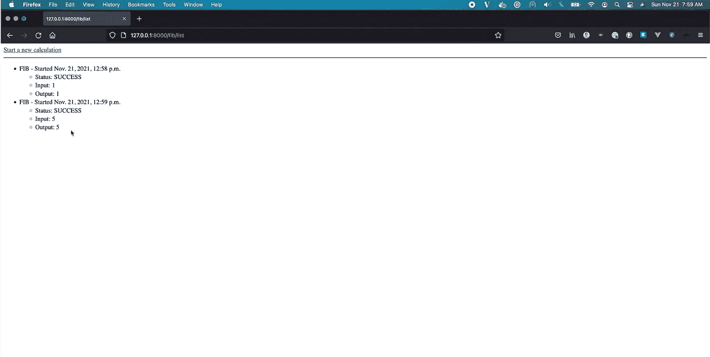

示例应用程序——并不漂亮，但很有效！

你可以看到我的计算结果。例如:

*   第一个斐波那契数列是 1
*   第五个斐波那契数是 5

在应用程序的顶部，你可以看到“开始新的计算”的链接这将带您进入开始新任务的表单:

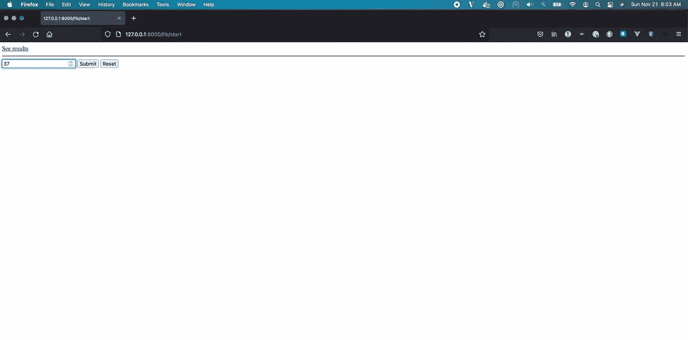

开始新任务的基本形式

计算第 37 个斐波那契数列可能要花很长时间！我的网络服务器甚至可能超时！

我们能做什么？

# 用芹菜设计解决方案

到目前为止，我们的 Django 应用程序具有以下架构:

*   网络服务器(Django)
*   数据库(SQLite)

为了在后台处理任务，我们需要添加芹菜工人。我们还需要添加一个可以添加任务的队列。

Celery 将运行自己的服务器，自动内置并发处理。我们将使用一个 Redis 服务器作为我们的队列来跟踪 Django 和 Celery 之间来回的消息。

我们的新架构看起来像这样:

*   网络服务器(Django)
*   数据库(SQLite)
*   消息队列(Redis)
*   工作服务器(Celery) —以 12 的并发性运行

因此，在一个工作者服务器上，有 12 个可能的工作者“进程”可以选择新的任务。总之，我们可以同时运行 12 个任务！

# 放在一起:Django +芹菜+ Redis

那么这一切是如何协同工作的呢？会发生什么:

1.  Django 将任务添加到 Redis 的队列中。当用户请求 Fibonacci 计算时，Django 会创建一个有效负载，告知任务的所有信息，并将该有效负载添加到 Redis。
2.  任务以先进先出(FIFO)的顺序留在 Redis 队列中。它会一直留在队列中，直到有工作进程可以完成该任务。
3.  当 12 个 Celery worker 进程中的任何一个变得可用时，它会从队列前面弹出下一个任务。Redis 的设计使得从队列中取出一个任务是原子的和无冲突的，所以工人不会意外地得到相同的任务。
4.  当另一个工作者变得可用时，它从队列的前面弹出下一个任务。其他工人在做什么，或者他们是否完成了他们的工作，这都无关紧要。每个工人独立操作。
5.  如果一项任务比另一项任务花费的时间长，那么它就需要更长的时间！所有的工作人员继续处理任务，从队列中弹出新的任务，长时间运行的任务只会降低正在处理它的工作人员的速度。
6.  当 worker 完成 Fibonacci 计算时，它将结果保存到数据库中。

# 我们来看一些代码！

我创建了一个 Django 模型来跟踪计算任务及其状态。该模型如下所示:

有一个`Calculation.equation`的选项。现在，我们能执行的唯一等式是一个`FIB`计算。将来，我们可以扩展这个应用程序，允许计算其他类型的方程。

注意，`Calculation.status`字段包括几种状态:`PENDING`、`ERROR`和`SUCCESS`。我们将使用状态字段来跟踪我们正在进行的各种计算。

# 创建新的计算

当用户想要开始新的计算时，会发生以下情况:

1.  用户获得页面。这将调用`get()`方法并显示表单。
2.  用户发布带有编号的表单。表格内容可在`request.POST`中找到—谢谢姜戈！
3.  我们使用用户发布的数字来创建一个新的`Calculation`对象。它有`equation='FIB'`、`input=<the number the user POSTed>`、&、`status='PENDING'`
4.  我们称之为`fibonacci_task.delay(calculation.id)`——这是我们开始使用芹菜的地方！！！`.delay()`方法告诉 Celery，“嘿，只要有工人可用，就在后台异步处理它”

注意我们在文件的顶部导入了`fibonacci_task`。因此，我们调用一些其他代码&，为我们刚刚创建的新计算对象发送一个`Calculation.id`参数。

让我们看看那个`fibonacci_task` …

# 斐波那契任务

这个文件应该看起来有点熟悉，因为它包含了我们的斐波那契算法的实现:

在`fib()`函数下面有`fibonacci_task`，芹菜任务的定义。需要注意的几件事:

1.  在第 18 行，我们使用`@ app.task`装饰器来定义一个新的芹菜任务。该任务通过我们的 Celery 应用程序自动注册(在其他地方定义)。`bind=True`允许我们接受`self`作为任务的第一个参数，并在任务中更新任务状态或重试任务。我倾向于在我的芹菜任务中包含`[bind=True](https://stackoverflow.com/questions/54899320/what-is-the-meaning-of-bind-true-keyword-in-celery)` [。](https://stackoverflow.com/questions/54899320/what-is-the-meaning-of-bind-true-keyword-in-celery)
2.  该任务接受`self`和`calculation_id`作为参数。当工人从队列中拉出任务时，有效负载将包括任务定义和我们想要使用的模型实例的`Calculation.id`。
3.  我们做的第一件事是在第 21 行从数据库加载`Calculation`对象。这是芹菜中常见的模式。不要使用内存中的模型实例作为任务的参数。相反，总是使用 ID 并从磁盘重新加载实例。因为我们不知道任务将在何时完成，所以我们不能相信内存中的实例是最新的。总是从数据库中重新加载模型！
4.  接下来，在`try/except`块中，我们试图计算结果。如果成功，我们更新`Calculation.output`并将`Calculation.status`设置为`SUCCESS`。如果有错误，相应地更新状态，并在`Calculation`对象上包含错误消息。
5.  最后，在第 30 行，提交对数据库的更改并结束任务。

# 芹菜配置

这是无聊的部分。有一些重要的配置步骤让芹菜工作。大部分配置都是样板文件，每次都是一样的。

我已经在第一本芹菜指南中举例说明了如何种植芹菜，所以我在这里不再赘述。如果您想在项目中从头开始安装芹菜，以下是您的指南:

[](https://medium.com/swlh/python-developers-celery-is-a-must-learn-technology-heres-how-to-get-started-578f5d63fab3) [## 芹菜教程:Python 开发人员必须学习的技术

### 在后台处理任务的工人是任何开发人员工具箱中必不可少的&强大的工具。

medium.com](https://medium.com/swlh/python-developers-celery-is-a-must-learn-technology-heres-how-to-get-started-578f5d63fab3) 

我只想说在附件中的`celery.py`和`settings.py`文件中有标准的配置内容——与上面的教程没有什么不同。如果你想/需要看一看，这就是:

[](https://github.com/bennett39/celery39/blob/celery-fib/celery_tutorial/celery_tutorial/celery.py) [## 芹菜 39/芹菜 39/芹菜 39

### 此时您不能执行该操作。您已使用另一个标签页或窗口登录。您已在另一个选项卡中注销，或者…

github.com](https://github.com/bennett39/celery39/blob/celery-fib/celery_tutorial/celery_tutorial/celery.py) 

让我们跳到有趣的部分吧！

# 试试吧！

请记住，我们的架构有几个不同的部分。我们需要把他们都发动起来。

*   用`python manage.py runserver`运行 Django(当部署到生产时，我们将使用不同的命令。目前，这是可行的！)
*   启动 Redis 服务器。在本地，你需要[安装 Redis](https://redis.io/docs/getting-started/) ，然后使用`redis-server`启动它。
*   发动芹菜工接任务。使用示例回购，命令是`celery —A celery_tutorial.celery_worker --loglevel=info`
*   我们还需要数据库。因为示例应用程序使用 SQLite 文件系统数据库，所以我们不需要为它运行服务器。如果你有一个使用不同数据库的应用，别忘了也运行那个服务器。

以下是我们的服务器在本地运行的样子:

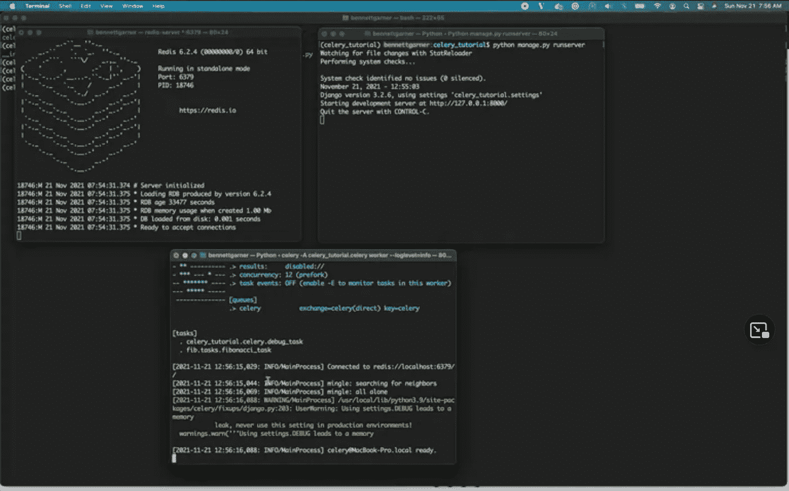

Redis，Django 和 Celery 都在我的电脑上运行

# 让我们运行一些后台任务

现在让我们看看芹菜能做什么！开始计算第一个斐波纳契数:

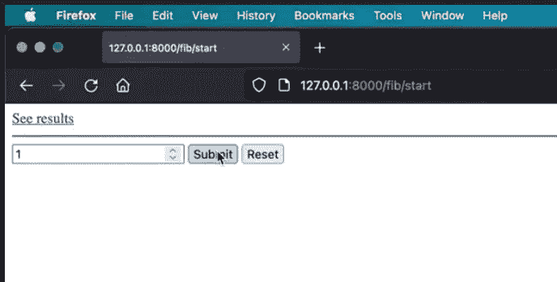

这个计算应该是相当即时的，但是为了演示，我暂停了芹菜，这样我们可以在任务被处理之前看到它:

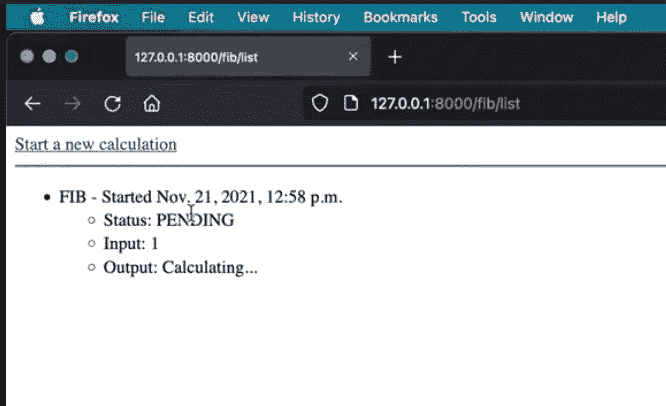

当我打开芹菜时，它会立即看到队列中的新任务。工人拿起它，在几分之一秒内完成任务:

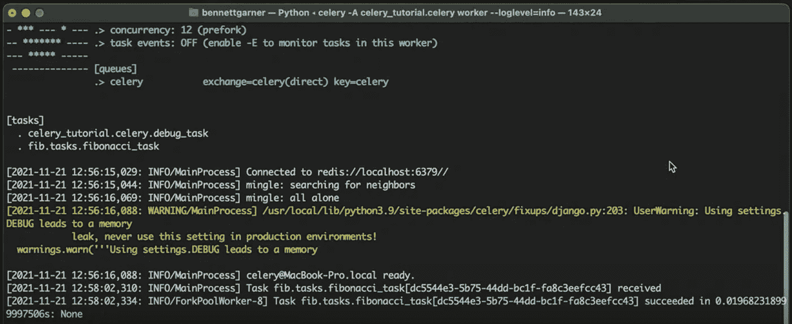

回到应用程序，我们可以看到计算成功完成，并将结果提交到数据库:

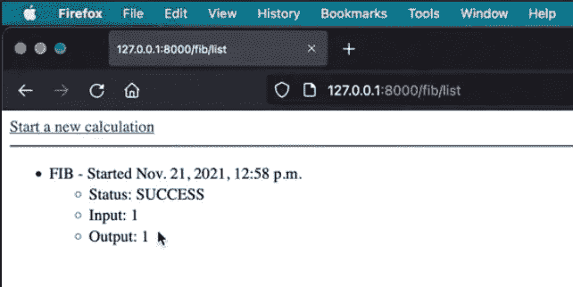

太棒了。起作用了！一个芹菜工人刚刚完成了计算，而我们的 Django web 服务器不需要做任何事情。

# 现在，让我们添加并发性

使用 Celery 的真正原因是在后台同时运行多个任务。所以，我们来试试吧！

让我们开始一系列的计算——一些更长，一些更短。让我们试试第 39、第 4、第 6 和第 32 个斐波那契数列。

同样，当我们向队列中添加新任务时，它们会被标记为待定:

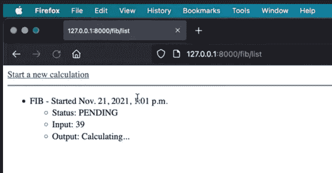

我的第一个任务。这可能需要一段时间，因为第 39 个斐波纳契数非常大！

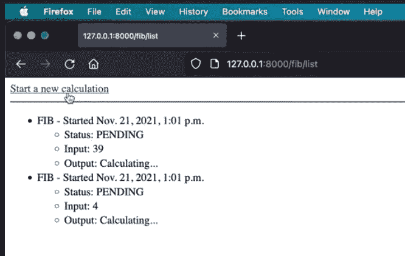

Celery 将使用单独的工作进程独立于第一个任务计算第二个任务。这个简单的计算应该在我们的第一个任务之前更快更完整。

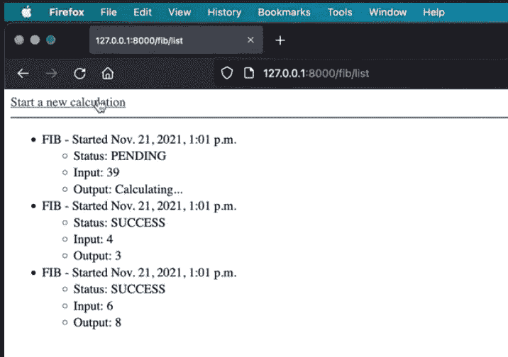

我添加了第三个任务，芹菜的计算速度已经超过了我加载页面的速度。请注意后面的两个任务都已完成，而第一个任务仍未完成。这就是异步、后台工作的神奇之处！

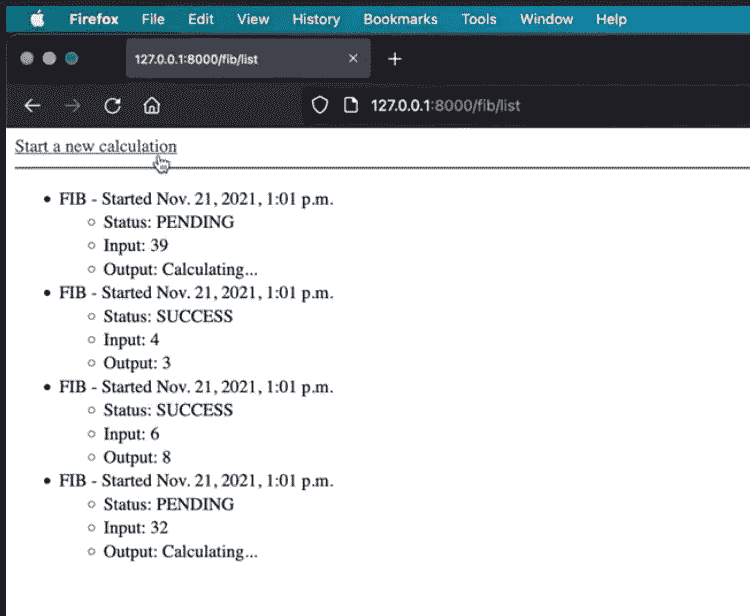

尝试再添加一个任务。这个也需要更长的时间来完成。让我们看看谁先完成？

回顾日志，我们可以看到 Celery 接收并完成了各种任务:

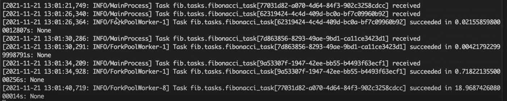

ID 为`77031d82`的任务是我们排队的第一个任务，但却是最后一个完成的任务。计算第 39 个斐波那契数花了 18 秒。

相比之下，任务`9a53307f`是我们排队的最后一个，它在`77031d82`之前完成。计算第 32 个斐波那契数只用了 0.7 秒。(看起来我们的算法有一些二次复杂度，是吧？😉)

这是结果！

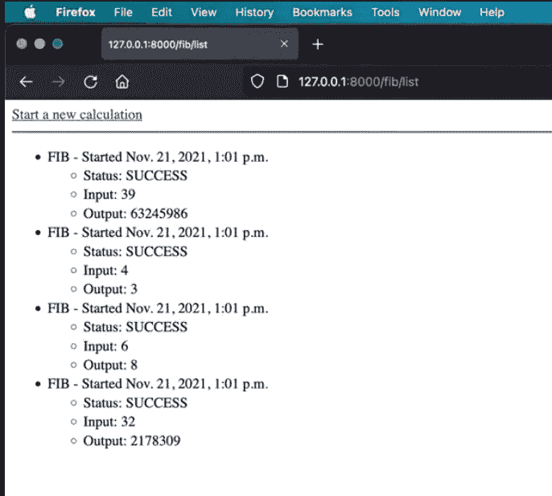

# 现场观看

要查看它的实际效果，请查看此视频。我在视频中添加了一个时间戳，这样你就可以直接跳到我们处理斐波那契任务的部分。

试图用文字描述芹菜真的很难。当你看到现场直播的时候会更有意义。

在视频中，我还进行了更多的计算。因此，你可以了解更多的斐波纳契数！

# 芹菜——必备工具

虽然斐波那契计算器是一个愚蠢的例子，但希望你能理解后台任务有多有用。

我们把网络服务器从繁重的工作中解放出来。相反，我们可以在幕后并行完成工作。在生产应用程序中，后台工作可以采取多种形式:

*   数据密集型转换
*   排队的电子邮件、通知和消息
*   每天、每周或每月的计划作业
*   将分析数据保存到数据库或外部系统
*   运行自动备份
*   等待对外部 API 的请求

超级有用。对于 Python web 开发人员来说，Celery 是构建现代的、可伸缩的应用程序的必要工具。既然您已经看到了它的实际应用，那么就试着自己用它来构建一些东西吧！

# 下载姜戈+芹菜清单


让您的员工立即投入工作

*   只想要快速版？
*   需要复制粘贴代码片段？
*   想留着以后吃吗？
*   想把它打印出来？

📕 [**下载芹菜+姜戈清单**](https://bennettgarner.ck.page/celery) (免费)📕

# 分级编码

```
Thanks for being a part of our community! More content in the [Level Up Coding publication](https://levelup.gitconnected.com/).Follow: [Twitter](https://twitter.com/gitconnected), [LinkedIn](https://www.linkedin.com/company/gitconnected), [Newsletter](https://newsletter.levelup.dev/)**Level Up is transforming tech recruiting** 👉 [**Join our talent collective**](https://jobs.levelup.dev/talent/welcome?referral=true)
```