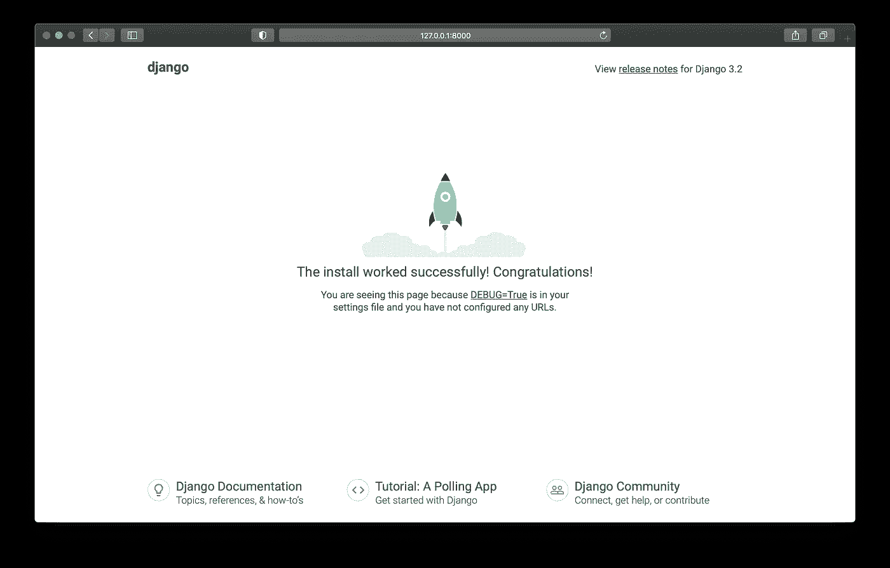
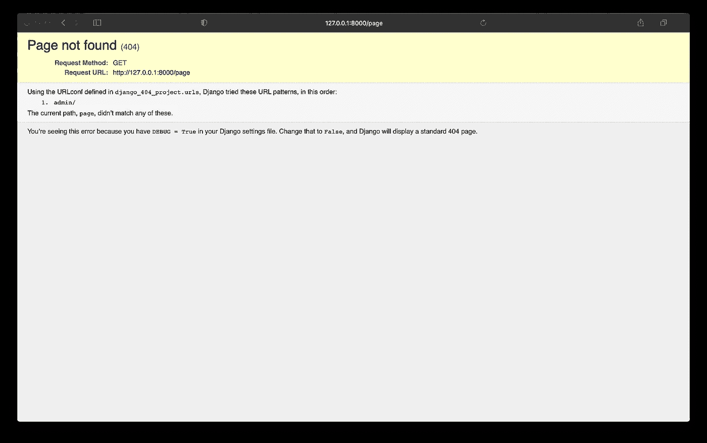
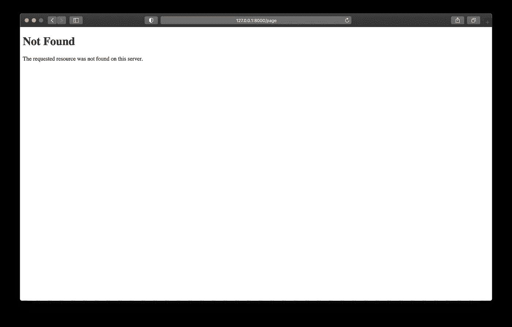
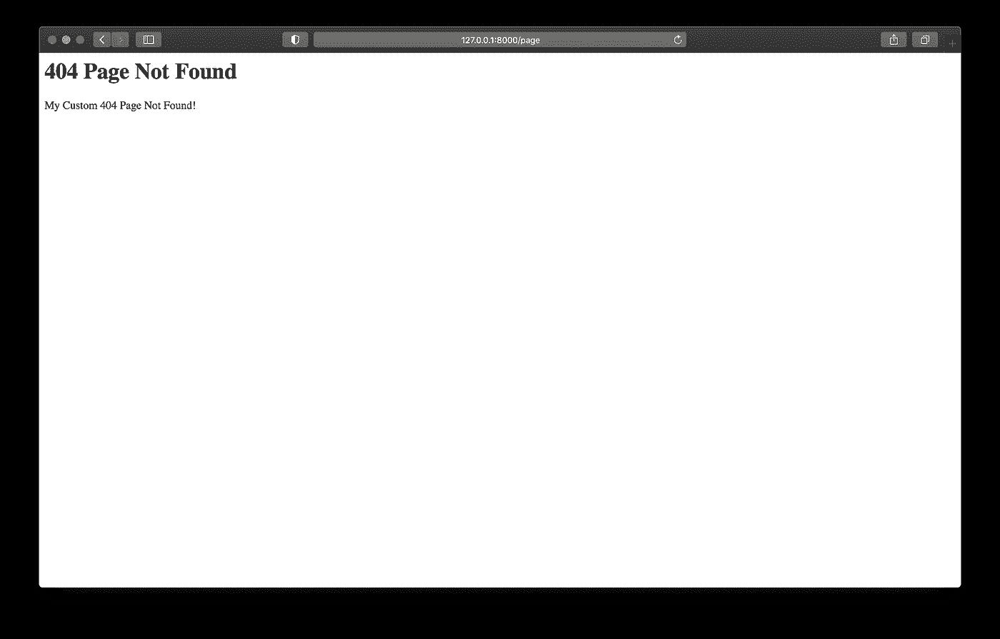

# Django:自定义 404 错误页面

> 原文：<https://levelup.gitconnected.com/django-customize-404-error-page-72c6b6277317>

定制 404 错误页面是 Django 项目中的最佳实践之一。让我们学习如何使用自定义的 404 Not Found 页面处理 404 错误。


Erik Mclean 在 [Unsplash](https://unsplash.com?utm_source=medium&utm_medium=referral) 上拍摄的照片

404 未找到页面应该是最著名的状态代码。在生产中，一个好的 Django 项目必须用自己定制的页面来处理这个错误。我将向您展示如何通过简单的步骤实现这一点。

让我们不失时机地创建一个 Django 项目。

打开您的控制台，写下这些行:

```
$ cd Desktop
$ mkdir mysite
$ cd mysite
```

然后创建一个 Django 项目:

```
$ django-admin startproject mysite .
```

我们将执行这一行来运行服务器:

```
$ python manage.py runserver
```

如果你访问 [http://127.0.0.1:8000/](http://127.0.0.1:8000/) 你会看到 Django 欢迎页面。



Django 欢迎页面(图片由作者提供)

让我们试着去我们网站上一个不存在的页面。比如我会去[http://127 . 0 . 0 . 1:8000/page](http://127.0.0.1:8000/page)。



默认 Django 未找到页面(图片由作者提供)

在这一页的底部，信息说:

```
You’re seeing this error because you have DEBUG = True in your Django settings file. Change that to False, and Django will display a standard 404 page.
```

让我们通过关闭 Django 调试模式来做到这一点。为此，我们需要更新`settings.py`文件。

```
DEBUG = FalseALLOWED_HOSTS = ['127.0.0.1']
```

注:生产中需要将`ALLOWED_HOSTS`改为`'mydomain.com'`。

刷新页面。



DEBUG = True 后未找到 Django 页面(图片由作者提供)

这是我们要用模板定制的页面。

使用该命令，在`mysite`文件夹下创建一个文件。

```
$ touch mysite/views.py
```

我知道在项目目录下有一个`views.py`文件很奇怪。我们总是被告知`views.py`是每个 app 目录下的文件，而不是项目本身。但这是[公文](https://docs.djangoproject.com/en/3.2/topics/http/views/#customizing-error-views)中建议的方式。

您的 Django 项目应该如下所示:

```
.
├── db.sqlite3
├── manage.py
└── mysite
    ├── __init__.py
    ├── __pycache__
    ├── asgi.py
    ├── settings.py
    ├── urls.py
    ├── views.py
    └── wsgi.py
```

现在我们将添加一个处理 404 错误的函数，将这些行放到`mysite/views.py`文件中:

```
from django.shortcuts import renderdef page_not_found_view(request, exception):
    return render(request, '404.html', status=404)
```

不要忘记将该函数添加到`mysite/urls.py`文件的底部:

```
handler404 = "mysite.views.page_not_found_view"
```

最后，`mysite/urls.py`文件变成了:

```
from django.contrib import admin
from django.urls import pathurlpatterns = [
    path('admin/', admin.site.urls),
]handler404 = "django_404_project.views.page_not_found_view"
```

首先，我们需要创建一个`templates`文件夹，然后我们将向该文件夹添加一个`404.html`文件。

```
$ mkdir templates
$ touch templates/404.html
```

您需要告诉 Django 您的`templates`文件夹在哪里，以便更新`settings.py`文件。

```
import osTEMPLATES **=** [
    {
        ...
        'DIRS': [os.path.join(BASE_DIR, 'templates')],
        ...
    },
]
```

在`404.html`中，你现在可以随意定制错误信息页面。我保持简单:

```
<h1>404 Page Not Found</h1>
<p>My Custom 404 Page Not Found!</p>
```

在刷新页面之前，请确保您的项目结构如下所示:

```
.
├── db.sqlite3
├── manage.py
├── mysite
│   ├── __init__.py
│   ├── __pycache__
│   ├── asgi.py
│   ├── settings.py
│   ├── urls.py
│   ├── views.py
│   └── wsgi.py
└── templates
    └── 404.html
```

现在你可以去你网站上不存在的任何页面。`404.html`模板将处理所有这些。



自定义的 404 未找到页面(图片由作者提供)

瞧啊。我们的自定义 404 页面找不到可见的任何不存在的网页在您的网站上。

感谢您阅读我的文章。我希望你喜欢它！

您可能还会对以下内容感兴趣:

[](https://python.plainenglish.io/9-python-tricks-to-become-a-better-data-scientist-eb26970b4160) [## 成为更好的数据科学家的 9 个 Python 技巧

### 你应该知道这些可怕的技巧，以便拥有更好的数据科学家职业生涯

python .平原英语. io](https://python.plainenglish.io/9-python-tricks-to-become-a-better-data-scientist-eb26970b4160)