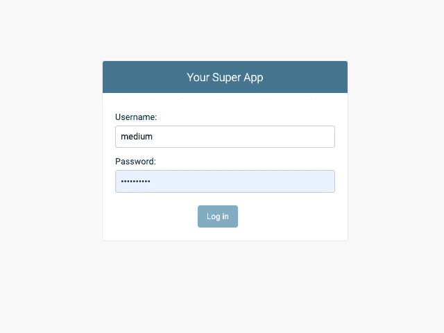

# Django:如何在 1 分钟内构建一个登录视图

> 原文：<https://levelup.gitconnected.com/django-how-to-build-a-login-view-in-1-minute-1a6bead2a3bd>

快速技巧:如何重用 Django 内置的身份验证表单



Django 默认登录视图

您是否需要验证您的用户，但不想用 CSS 编写 HTML，为此添加视图，并将该视图添加到 urls.py？

我知道这种感觉，我是来帮你的！

很可能，您的 url 模式中已经有了这个路径:

```
path(**'admin/'**, admin.site.urls),
```

现在，只需将此添加到您的任何视图中:

```
**def** index(request):
    **if** request.user.is_anonymous:
        **return** redirect(**"/admin/login/?next=/"**)
    ...
```

因此，如果用户没有通过身份验证，他/她将被重定向到 Django 系统的默认登录视图，然后，在登录之后，用户将被重定向到您在？next=参数。在这种情况下，它会将用户重定向到根目录。

我只答应登录。注销有点复杂，您需要为此添加一个 URL:

```
urlpatterns = [
    ...
    path(**'logout'**, views.logout_view),
    ...
]
```

在视图中，只需添加这个注销功能:

```
**def** logout_view(request):
    logout(request)
    **return** redirect(**"/"**)
```

就是这样！我敢打赌，你花了更多的时间来阅读这个比实现它。

参见我关于 Django 和 Python 的其他文章。