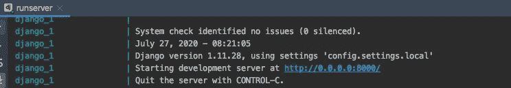
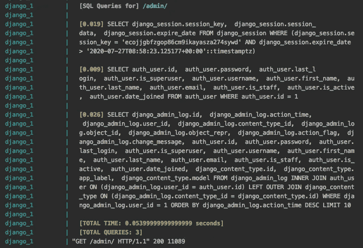

# 用 SQL 日志中间件调试 Django SQL 优化 Django:第 1 部分

> 原文：<https://levelup.gitconnected.com/django-sql-debugging-with-an-sql-log-middleware-optimising-django-part-1-ca3b5c20d892>


如果您对 web 开发感兴趣，或者只是对一般的软件工程感兴趣，您可能会遇到 Django-REST。Django-REST 已经成为想要构建 2010 年典型 web 服务器的开发人员的黄金标准:开源、REST 协议、MVS 设计模式，以及 Python。

虽然 Django 很好地将大多数肮脏的 SQL 隐藏在其模型和查询集的外表下，但在某些情况下，我们希望能够优化昂贵的数据库查询，无论是减少 RTT 还是避免浪费宝贵的服务器时间。如果你正在读这篇文章，我会认为你已经在优化你的 Django 查询了，所以至少，让我们确保你的优化已经通过测量得到了验证。

在这个小系列中，我将介绍各种技巧，您可以用它们来帮助减少查询中大量浪费的服务器处理时间。

# 在我们开始之前，有几件关于设置的事情。

我在这个系列中使用了以下内容:

IDE — Pycharm
Python 3
最新 Django 1。Django 1 支持 2020 年结束，建议使用 Django 3。幸运的是，**这个系列的大部分内容应该同样适用于 Django 2 和 3。**

**我还假设你对 Django** 有中级水平的了解，所以我可以跳过一些典型的 Django 配置。

说完了，让我们开始吧。

# 这一集:获得一个 SQL 调试中间件。

如果你不熟悉中间件，基本上你的请求会被一大堆中间件过滤掉。一些执行认证，而另一些处理 CSRF 令牌。欲了解更多信息， [Django 有一篇关于这个的文章](https://docs.djangoproject.com/en/3.0/topics/http/middleware/)。

Django 还允许您创建自己的中间件，我们将在这里充分利用它来打印出服务器收到的每个请求所执行的 SQL 查询。

Github 用户 [vstoykov](https://gist.github.com/vstoykov) 发布了一个非常有用的中间件片段，我在自己的开发中也使用了它(做了一些修改),效果很好。收到请求后，该中间件基本上:

1.  读取所有通过 django.db.connection 进行的查询，
2.  打印出每个查询的 SQL，更重要的是，打印出每个 SQL 查询执行的时间。

# 现在来看一些代码！

当你有了这样一个中间件，你可以把它添加到你的 Django 项目中的 settings.py 文件中，就像这样:

```
import os... Doing your settings file stuff ... # If you want, you can lock the middleware behind an env var.if os.environ.get('SQL_DEBUG', False):
    MIDDLEWARE += ('sql_middleware.SqlPrintingMiddleware',) ... Continue with your settings file stuff ...
```

# 接下来，让我们测试我们的新中间件。

继续用一个基本的 Django admin 运行一个示例 Django 服务器实例。可以肯定的是，您应该能够看到如下所示的服务器日志:



Django 服务器日志

现在使用 web 浏览器登录 Django admin，相应的服务器日志应该如下所示。



Django 服务器登录到管理页面后的日志

正如您所看到的，SQL 日志在每次 HTTP 调用后都被打印出来，SQL 是根据执行每次调用所花费的时间打印出来的。

# 总结一下…

可以想象，拥有一个基于视图的 SQL 日志记录器对于 SQL 调试非常有用。我们将在本系列的剩余部分中使用这个日志记录器来帮助我们优化 Django 中的 SQL 查询，减少我们在不同地方的 SQL 内存占用，同时使用这个日志记录器来确认我们的优化实际上正在按预期工作。

但同时，希望这篇文章对你有很大的帮助。即使如此，它也可以提供对应用程序中耗时的查询种类的深刻见解，允许您决定处理哪些查询。

编辑:[点击这里查看第 2 部分](/speed-up-your-django-admin-by-removing-sql-counts-optimizing-django-part-2-f5e09da667c)，在这里我们将进入 Django admin 中的第一次 SQL 优化！