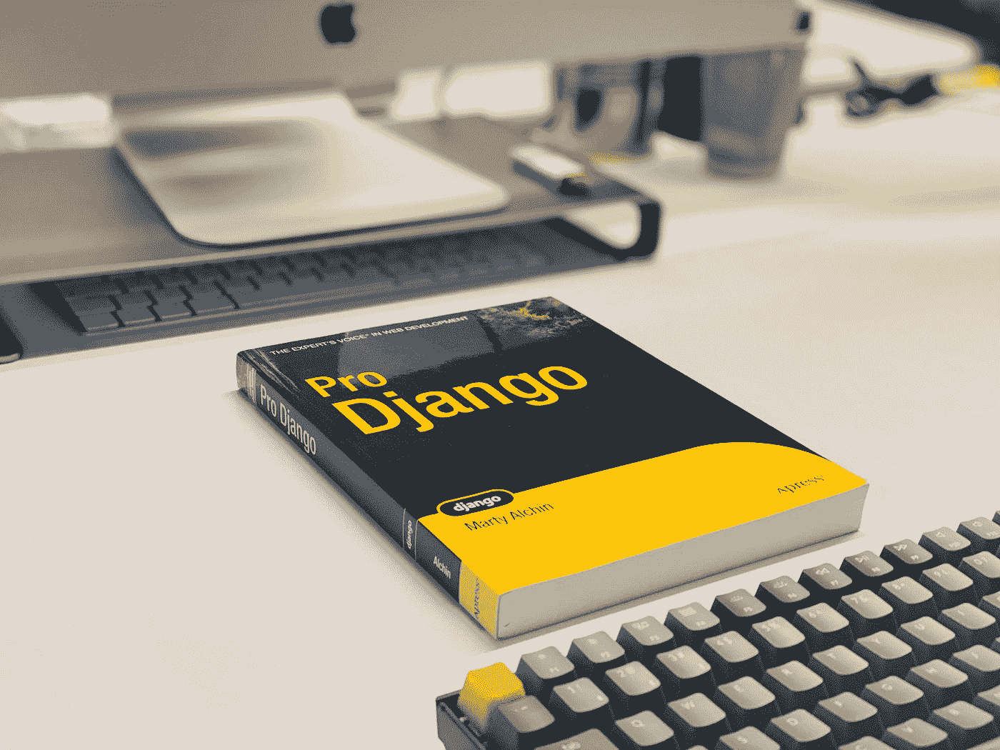

# Django:模板继承和重用

> 原文：<https://levelup.gitconnected.com/django-template-inheritance-and-reusability-e97b0fed8bcc>

## 使用标记为更多页面编写更少的代码。

费萨尔·米在 [Unsplash](https://unsplash.com?utm_source=medium&utm_medium=referral) 上的照片

Django 是一个流行的框架，通过提供现成的应用程序，它允许你用更少的代码完成更多的工作。因此，毫不奇怪，它最强大的功能之一可以帮助您轻松地在 web 应用程序的所有页面上使用一个模板。

Django 自带带有不同标签的模板语言，用于与 web 应用程序的前端交互。例如，
*{%但是还有另一个有用的标签，即 *标签。**

根据姜戈的说法，

> 模板继承允许您构建一个基本的“框架”模板，它包含站点的所有公共元素，并定义子模板可以覆盖的**块**

假设我们有一个由两个页面组成的网站——“主页”和“联系”页面。两个页面之间的公共组件是页眉和页脚。一种方法是拥有两个独立的 html 文件，每个页面一个。但是，将页眉和页脚代码复制并粘贴到两个页面上是一种不好的做法。此外，如果我们必须对页脚进行更改，我们将不得不在两个文件中都进行更改，这不符合 DRY(不要重复)原则。

Django 允许我们通过创建一个包含公共组件的“基础”模板并在所有其他模板中继承该模板来避免这种情况。可以像这样创建基础模板:

基础“骨架”模板。

** 充当我们想要在页眉和页脚之间显示的任何组件的占位符。现在，对于“主页”,不需要编写页眉和页脚的代码。所需要做的就是添加一个 ** 标签:

主页。

** 继承了基础模板的所有内容。上面的 ** 标记之间的代码被放在基本 html 的 ** 标记内，所以当 Django 处理模板时，主页是这样呈现的:

这个过程可以根据我们的需要重复多次。它非常有用，因为它允许我们只对基础模板进行更改，这些更改会自动反映在所有子页面上，如“主页”和“联系我”，因为这些页面继承了基础模板的组件。

掌握 Django 的模板继承需要一些时间，但是对于任何有抱负的 Django 开发人员来说，这是一个非常重要的小技巧。

# 资源:

1.  关于模板继承的 Django 文档。