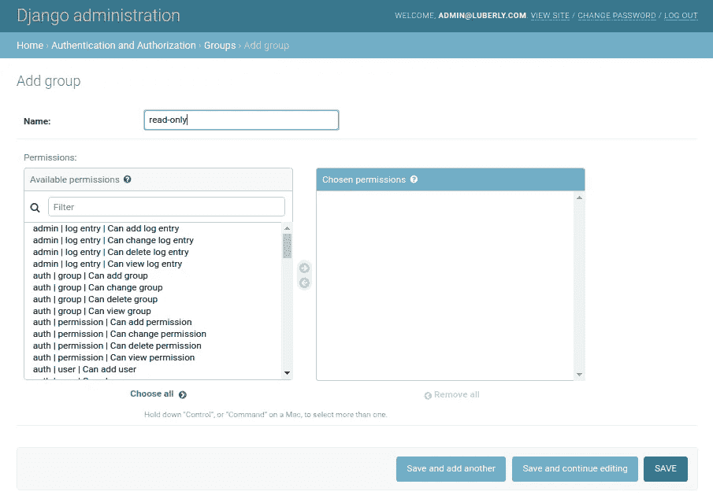

# 使用 Django Rest 框架的 Django 用户组

> 原文：<https://levelup.gitconnected.com/django-user-groups-with-django-rest-framework-f6f2bab43499>

# 情况

周末，按照客户的要求，我开始在我们的旗舰 web 应用程序中实现“只读”用户帐户。

当前的应用程序栈是一个 React 前端，由 Django web 应用程序提供服务，与 Django-Rest-Framework 后端 API 进行交互。

在过去与 Django 一起工作时，我相当确定存在一些很好的内置用户权限特性，如果不是一个完整的解决方案，将为我在我们的应用程序中添加不同级别的客户雇员帐户提供一个很好的起点。

事实上，当我再次访问 Django 文档的认证部分时，我的怀疑得到了证实。长话短说 Django 内置了一个非常漂亮的基于模型的权限系统，我在下面解释一下:

**权限**

对于 Django 项目中指定的每个模型(或数据库表),存在四种权限类型:

*   查看—读取数据库记录的能力
*   添加—能够添加数据库记录
*   更改—更改数据库记录的能力
*   删除—删除数据库记录的能力

**组**

上述权限可以分配给任何用户(即 django 用户模型的实例)，以限制该用户访问或修改数据库中记录的能力。但是，创建权限并将其分配给一个组通常更有意义。这样，添加到该组的任何用户都会继承其所有权限。

组方法的明显优势是，如果需要检查或更新权限，可以在组级别进行更改，该组的所有用户都将感受到影响，而不是审核每个用户的单独权限。

看起来很简单，对吧？

# 问题

Django 权限+组似乎是我的特性需求的完美解决方案。从表面上看，我的实现很简单，几乎不需要修改代码:

1.  只需创建一个`read-only`组
2.  将我的应用程序中每个模型的`view`权限添加到该组中。
3.  每次创建一个用户，我可以把他们添加到`read-only`组。

轻松点。至少我是这样认为的…



我继续将以下内容添加到我的`settings.py`文件中的`REST_FRAMEWORK`字典对象中:

```
"DEFAULT_PERMISSION_CLASSES": [
    "rest_framework.permissions.IsAuthenticated",
    "rest_framework.permissions.DjangoModelPermissions",
]
```

为了清楚起见，我的`settings.py`文件现在定义了以下对象:

```
REST_FRAMEWORK = {
    "DEFAULT_AUTHENTICATION_CLASSES": [
        "rest_framework.authentication.TokenAuthentication",
        "rest_framework.authentication.SessionAuthentication",
    ],
    "DEFAULT_PERMISSION_CLASSES": [
        "rest_framework.permissions.IsAuthenticated",
        "rest_framework.permissions.DjangoModelPermissions",
    ],
}
```

我认为这将是对我的应用程序代码的唯一更改，所以我重新运行了开发服务器，希望能够大获全胜。然而，正如在这种情况下经常发生的那样，事情并没有那么简单。

内置的 Django 模型权限系统与`rest_framework.views.APIView`不兼容，所以我立即遇到了以下错误:

`AssertionError: Cannot apply DjangoModelPermissions on a view that does not set `.queryset` or have a `.get_queryset()` method.`

# 解决办法

解决方案是在扫描 DRF 文档时找到的，原因是为什么会发生这种情况。公平地说，DRF 的维护者们确实在[docs(here)](https://www.django-rest-framework.org/api-guide/permissions/#djangomodelpermissions)中说得很清楚，在你的视图类中缺少一个`queryset`属性将会阻止它决定所需的权限。

在我的例子中，我在后端基于类的视图中大量使用了`rest_Framework.views.APIView`类，它既没有`queryset`属性也没有`get_queryset`方法。

根据文件，有一个简单的解决办法:

> 如果您对使用被覆盖的`get_queryset()`方法的视图使用该权限，那么该视图上可能没有`queryset`属性。在这种情况下，我们建议也用 sentinel queryset 标记视图，以便该类可以确定所需的权限。例如:
> 
> `queryset = User.objects.none()`

然而，由于我们的应用程序有大量的视图，在每个视图中包含这一行会有点麻烦。因此，我们选择如下:

在项目中的某个地方创建一个新文件(在我们的例子中称为`custom_views.py`)，并在那里创建一个继承自`rest_Framework.views.APIView`的全新视图，但添加了急需的`queryset`参数:

**custom_views.py**

```
from rest_framework.views import APIView
from django.contrib.auth.models import User

class DjangoGroupCompatibleAPIView(APIView):

    queryset = User.objects.none()
```

然后，在我的任何`views.py`文件中，只需导入这个新视图并进行更改:

```
class GetAccount(APIView):
    def get(self, request):
```

到

```
class GetAccount(DjangoGroupCompatibleAPIView):
    def get(self, request):
```

嘿，很快！我们现在有 Django 用户组在整个 DRF 后台完美地工作！

我希望这是有用的，请随时评论如下:)

斯科特