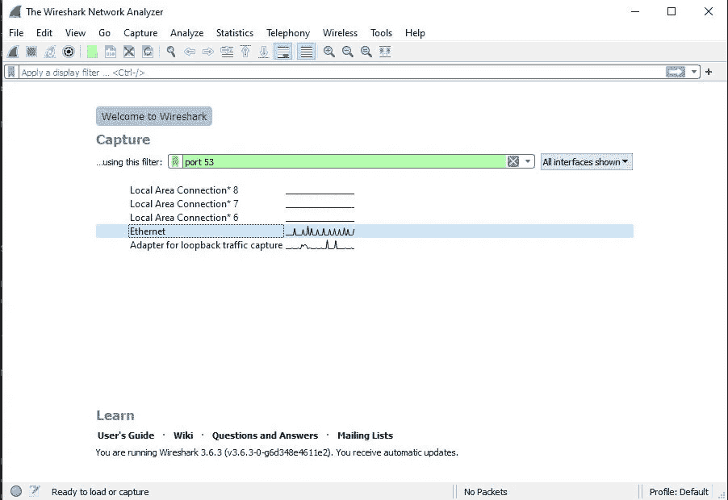
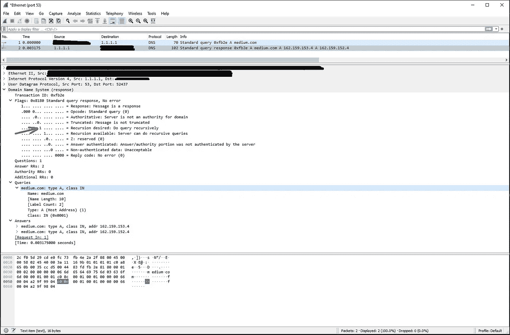

# Java 中的 DNS 请求

> 原文：<https://levelup.gitconnected.com/dns-request-and-response-in-java-acbd51ad3467>

这是集中讨论 UDP 上的 DNS 协议及其 java 实现的系列文章的第一篇。

[下一篇文章关注 DNS 服务器的响应以及如何解析它。](https://medium.com/@junkypic/dns-response-in-java-a6298e3cc7d9)

如果您对没有全部解释的代码更感兴趣，请跳到文章末尾。

最近我想用 Java 写一个 DNS 解析器。很快我就知道这并不像你想象的那么容易(我想除了我自己没人会感到惊讶)。

然而，最让我困惑的是，没有任何好文章(我能找到的)是关于如何让你的脚趾弄湿的。我能找到的唯一一个最新的 Java DNS 服务器实现是 [dnsjava](https://github.com/dnsjava/dnsjava) ，它虽然非常好，但是功能非常丰富，很难理解。我只是想找点又快又脏的东西让我继续下去。

我将使用哪些工具:

*   IntelliJ IDEA Community Edition 然而，任何可以编写代码的媒介都可以很好地工作。Eclipse，Notepad++，Vim 等。
*   Wireshark 这样我就可以拦截我将要发送的请求(以及相应的响应)。这并不是强制性的，但是我觉得我对发生的事情有了更好的理解。
*   Java 17。当然，其他版本的 java 也可以。

这个系列的最终目标是能够发送一个请求并接收一个对记录类型甚至是 [AAAA](https://en.wikipedia.org/wiki/List_of_DNS_record_types) 记录的响应。

别东拉西扯了，让我们看看到底是怎么回事。

首先，我们应该理解 DNS 请求/响应的结构。

还有什么比阅读 [RFC1035](https://datatracker.ietf.org/doc/html/rfc1035) 更好的方法呢？不想读完整本吗？我给你简单介绍一下。

**免责声明时间:** RFC1035，我认为是同类型中与 DNS 协议相关的最老的 RFC。还有其他更新的 RFC 建立在这个 RFC 之上。虽然大部分内容仍然准确，但有些内容已经过时了。在我看来，将所有与 DNS 协议相关的 RFC 作为一个人来考虑是徒劳的，因为有很多方法。相反，我将只关注这个特定的 RFC，因为它非常容易理解。

我将重点介绍 UPD 的 DNS。有许多 [DNS 协议](https://en.wikipedia.org/wiki/Domain_Name_System#DNS_transport_protocols)，但是绝大多数呼叫都是通过 UPD 的。

**解析 DNS 请求**

[摘自 RFC1035 *:*](https://datatracker.ietf.org/doc/html/rfc1035#section-4.1) *域协议内部的所有通信都以一种称为消息的格式进行。*

一条消息看起来像这样

```
 +---------------------+
    |        Header       |
    +---------------------+
    |       Question      | the question for the name server
    +---------------------+
    |        Answer       | RRs answering the question
    +---------------------+
    |      Authority      | RRs pointing toward an authority
    +---------------------+
    |      Additional     | RRs holding additional information
    +---------------------+
```

让我们从标题部分开始。

[RFC 1035 的第 4.1.1 节](https://datatracker.ietf.org/doc/html/rfc1035#section-4.1.1)详细说明了标题部分的外观。

```
 0  1  2  3  4  5  6  7  8  9  0  1  2  3  4  5
    +--+--+--+--+--+--+--+--+--+--+--+--+--+--+--+--+
    |                      ID                       |
    +--+--+--+--+--+--+--+--+--+--+--+--+--+--+--+--+
    |QR|   Opcode  |AA|TC|RD|RA|   Z    |   RCODE   |
    +--+--+--+--+--+--+--+--+--+--+--+--+--+--+--+--+
    |                    QDCOUNT                    |
    +--+--+--+--+--+--+--+--+--+--+--+--+--+--+--+--+
    |                    ANCOUNT                    |
    +--+--+--+--+--+--+--+--+--+--+--+--+--+--+--+--+
    |                    NSCOUNT                    |
    +--+--+--+--+--+--+--+--+--+--+--+--+--+--+--+--+
    |                    ARCOUNT                    |
    +--+--+--+--+--+--+--+--+--+--+--+--+--+--+--+--+
```

在我们能够正确地阅读本节(或任何其他后续章节)之前，我们必须了解数据是如何传输的。

[第 2.3.2 节](https://datatracker.ietf.org/doc/html/rfc1035#section-2.3.2)告诉我们:*本文档中描述的报头和数据的传输顺序被解析为八位字节级别。每当图表显示一组二进制八位数时，这些二进制八位数的传输顺序就是它们在英语中的正常读取顺序。*

让我们来分解一下:

*   一个八位字节等于 8 位。特别是在 Java 中，这将是一个*字节。*这里有一些东西可以刷新你对 java 中[基本类型的记忆。](https://docs.oracle.com/javase/tutorial/java/nutsandbolts/datatypes.html)
*   位的顺序总是[大端](https://chortle.ccsu.edu/assemblytutorial/Chapter-15/ass15_3.html)。这意味着请求和响应总是遵循这个约定。换句话说，正如上面的部分告诉我们的那样，我们像阅读普通英语一样阅读它。

默认情况下，Java 使用大端位顺序存储数据。

现在回到标题部分。让我们选择第一个条目，特别是 ID 。如果我们阅读上面的图表，我们可以知道 ID 有 16 位或 2 字节的数据。简单来说，它相当于 Java 中的一个 short。所以是-32，768 到 32，767 之间(含)的任何数字。

ID 的 RFC 定义是:*一个由程序分配的 16 位标识符，
生成任何类型的查询。这个标识符被复制到相应的回复中，并且可以被请求者用来匹配对未完成查询的回复。*

让我们用更具体的 Java 术语来描述这一点

```
Random random = new Random();
short ID = (short)random.nextInt(32767);
```

ID 也可以签名，所以不用担心负数。

太好了，我们找到了一个简称。让我们进入下一部分。

下一部分有点棘手。事实上，它有一个特殊的名字，[标志](https://www.iana.org/assignments/dns-parameters/dns-parameters.xhtml#dns-parameters-12)部分。

你可能已经注意到它不是一个单一的字节(在 java 中我们可以很容易地用 T2 表示的最小单位)。事实上，第一个字节包括 5 个不同的标志(QR、OpCode、AA、TC 和 RD)。

在测试了一些东西之后，我得出结论，在 java 中表示 flags 部分的最简单的方法是使用一个字符串。对，没错，一串。我本来可以使用一个[位集](https://docs.oracle.com/javase/7/docs/api/java/util/BitSet.html)，但它不是立即明显是什么标志，所以我很快放弃了这个想法。

让我们代表标志部分。总的来说，标志的长度等于 16 位或短 1 位。

QR — *一个一位字段，指定该消息是一个
查询(0)，还是一个响应(1)。*

在这种情况下，因为我们正在做一个请求，QR 是 0。

```
String flags = "0"; // QR
```

OpCode — *四位字段，指定此
消息中的查询类型。该值由查询
的发起者设置，并复制到响应中。这些值是:*

*0 个标准查询(查询)*

*1 一个逆向查询(IQUERY)*

*2 a 服务器状态请求(STATUS)*

*3–15 保留供将来使用*

在这种情况下，我们做一个标准的查询，所以操作码是 0。然而，我们需要将它表示为一个 4 位长的比特序列。

```
flags += "0000"; // OpCode
```

AA — *权威回答—该位在响应中有效，
并指定响应的名称服务器是问题部分中域名的
权威机构。*

AA 应该是 0，因为当我们发送请求时，我们需要一些东西。

```
flags += "0"; // AA
```

TC — *截断—指定该消息由于长度超过了
传输通道允许的长度而被截断
。*

关于这面旗帜的一个旁注。[第 2.3.4 节](https://datatracker.ietf.org/doc/html/rfc1035#section-2.3.4)说明 UDP 消息被限制为 512 字节或更少。*在大多数情况下*这不再适用，但是这个标志并不是完全多余的，因为一些服务器可能仍然受到 UDP 包大小的限制。

在这种情况下，消息不会被截断。注意截断指定消息是否被截断(也称为布尔值),而不是消息被截断的绝对值。所以截断不是真就是假。

```
flags += "0"; // TC
```

RD — *期望递归—该位可以在查询中设置，并且
被复制到响应中。如果 RD 被设置，它指示
名称服务器递归地进行查询。
递归查询支持是可选的。*

事实上，这是该请求的整个标志部分中唯一设置为真的位。我还没有发现不需要递归的情况。关于 DNS 中递归的更多信息。

```
flags += "1"; // RD
```

RA — *递归可用—这是在
响应中设置或清除的，表示递归查询支持在名称服务器中是否
可用。*

这将由响应服务器设置。在请求中将其设置为 false。

```
flags += "0"; // RA
```

Z- *保留供将来使用。在所有查询
和响应中必须为零。*

不言自明。

**flags+= " 000 "；// Z**

RDCODE — *响应代码—该 4 位字段设置为
响应的一部分。*

完整的 RDCODEs 列表可以在找到。出于请求的目的，RDCODE 是 0。

```
flags += "0000"; // RDCODE
```

在它的结尾，所有的 Flags 部分看起来都像这样

```
"0000000100000000"
```

这对于快速直观地检查标志来说很好，但是在实际发送标志头时完全没有用。

```
short requestFlags = Short.*parseShort*("0000000100000000", 2);
ByteBuffer flagsByteBuffer = ByteBuffer.*allocate*(2).putShort(requestFlags);
byte[] flagsByteArray= flagsByteBuffer.array();
```

将字符串表示解析为 base 2 中的 short，并创建所述 short 的总长度为 2(2 字节= 1 short)的 bytebuffer，最后将 bytebuffer 转换为字节数组。

接下来的部分由 1 个短节表示。总共有 4 个部分:

*   QDCOUNT — *一个无符号的 16 位整数，指定问题部分中
    条目的数量。*
*   ANCOUNT — *一个无符号的 16 位整数，指定答案部分中
    资源记录的数量。*
*   NSCOUNT — *一个无符号的 16 位整数，指定授权记录
    部分中名称
    服务器资源记录的数量。*
*   ARCOUNT — *一个无符号的 16 位整数，指定附加记录部分中
    资源记录的数量。*

唯一感兴趣的是 QDCOUNT 部分，因为其他部分将由响应服务器设置。请注意，我们仍然需要在请求中将它们表示为 0。

在这种特殊情况下，我们只有一个问题。

**这里有一个很小但非常重要的旁注**。从技术上来说，没有人会阻止任何人在每个查询中提出一个以上的问题，但是，我还没有看到这种情况发生。坦白地说，我甚至不知道如果每个查询有一个以上的问题会发生什么。我怀疑一个服务器能够回答每个查询 1 个以上的问题。[请看这个 stackoverflow 问题，获取更详细的答案](https://stackoverflow.com/questions/55092830/how-to-perform-dns-lookup-with-multiple-questions)。

也就是说…

```
short QDCOUNT = 1;
short ANCOUNT = 0;
short NSCOUNT = 0;
short ARCOUNT = 0;
```

将所有这些放在一起:

```
Random random = new Random();
short ID = (short)random.nextInt(32767);
ByteArrayOutputStream byteArrayOutputStream = new ByteArrayOutputStream();
DataOutputStream dataOutputStream = new DataOutputStream(byteArrayOutputStream);

short requestFlags = Short.*parseShort*("0000000100000000", 2);
ByteBuffer flagsByteBuffer = ByteBuffer.*allocate*(2).putShort(requestFlags);
byte[] flagsByteArray = flagsByteBuffer.array();

short QDCOUNT = 1;
short ANCOUNT = 0;
short NSCOUNT = 0;
short ARCOUNT = 0;

dataOutputStream.writeShort(ID);
dataOutputStream.write(flagsByteArray);
dataOutputStream.writeShort(QDCOUNT);
dataOutputStream.writeShort(ANCOUNT);
dataOutputStream.writeShort(NSCOUNT);
dataOutputStream.writeShort(ARCOUNT);
```

现在，我们有了请求的完整报头部分。

让我们进入问题部分。

问题部分实际上是最直接的部分之一。

[第 4.1.2 节。](https://datatracker.ietf.org/doc/html/rfc1035#section-4.1.2)状态:

```
The question section is used to carry the "question" in most queries,
i.e., the parameters that define what is being asked.  The section
contains QDCOUNT (usually 1) entries, each of the following format:

                                    1  1  1  1  1  1
      0  1  2  3  4  5  6  7  8  9  0  1  2  3  4  5
    +--+--+--+--+--+--+--+--+--+--+--+--+--+--+--+--+
    |                                               |
    /                     QNAME                     /
    /                                               /
    +--+--+--+--+--+--+--+--+--+--+--+--+--+--+--+--+
    |                     QTYPE                     |
    +--+--+--+--+--+--+--+--+--+--+--+--+--+--+--+--+
    |                     QCLASS                    |
    +--+--+--+--+--+--+--+--+--+--+--+--+--+--+--+--+
```

QNAME — *用一系列标签表示的域名，其中
每个标签由一个长度八位字节和其后的
个八位字节组成。域名以根的空标签的零长度八位字节
结束。注意
该字段可以是奇数个八位字节；不使用
填充。*

这里有一个小注释。通常我们可以(并且应该)对这个部分使用[消息压缩](https://datatracker.ietf.org/doc/html/rfc1035#section-4.1.4)，但是，因为它不是对请求的强制**，所以我不会这样做。当服务器响应时，域将被压缩。所以很快它将不得不被处理。**

这一部分非常简单。取一个域名(不带 scheme(http 或 https)或 www 之类的前缀)，把它分成几部分，放入一个字节数组中。

```
String domain = "medium.com";
String[] domainParts = domain.split("\\.");

for (int i = 0; i < domainParts.length; i++) {
    byte[] domainBytes = domainParts[i].getBytes(StandardCharsets.*UTF_8*);
    dataOutputStream.writeByte(domainBytes.length);
    dataOutputStream.write(domainBytes);
}dataOutputStream.writeByte(0);// no more parts
```

QTYPE — *两个八位字节的代码，指定查询的类型。
该字段的值包括对
类型字段有效的所有代码，以及一些更通用的代码，这些代码
可以匹配多种类型的 RR。*

例如 AAAA 就是一种记录。每个查询可以请求多条记录，但是，在这个例子中，我将只请求一条记录。特别是一项记录。

这里是所有可用记录的列表。

```
// Type 1 = A (Host Request)
dataOutputStream.writeShort(1);
```

QCLASS — *两个八位字节的代码，指定查询的类别。
例如，QCLASS 字段在互联网中。*

在这里可以找到完整的课程列表。

对于这个例子，我将在课堂上使用。

```
// Class 1 = IN
dataOutputStream.writeShort(1);
```

问题部分到此为止。简单。

接下来的 3 个部分(答案、权限和附加)将不会在请求中设置。响应服务器将设置它们，因此在本例中我们可以忽略它们。

Java 使用 [DatagramSockets 和 DatagramPackets](https://docs.oracle.com/javase/7/docs/api/java/net/DatagramSocket.html) 通过 UDP 发送/接收数据。

下面是发送这样一个请求的完整代码(包括上面的所有代码)。

```
InetAddress ipAddress = InetAddress.*getByName*("1.1.1.1");// cloudflare

Random random = new Random();
short ID = (short)random.nextInt(32767);
ByteArrayOutputStream byteArrayOutputStream = new ByteArrayOutputStream();
DataOutputStream dataOutputStream = new DataOutputStream(byteArrayOutputStream);

short requestFlags = Short.*parseShort*("0000000100000000", 2);
ByteBuffer flagsByteBuffer = ByteBuffer.*allocate*(2).putShort(requestFlags);
byte[] flagsByteArray = flagsByteBuffer.array();

short QDCOUNT = 1;
short ANCOUNT = 0;
short NSCOUNT = 0;
short ARCOUNT = 0;

dataOutputStream.writeShort(ID);
dataOutputStream.write(flagsByteArray);
dataOutputStream.writeShort(QDCOUNT);
dataOutputStream.writeShort(ANCOUNT);
dataOutputStream.writeShort(NSCOUNT);
dataOutputStream.writeShort(ARCOUNT);
String domain = "medium.com";
String[] domainParts = domain.split("\\.");

for (int i = 0; i < domainParts.length; i++) {
    byte[] domainBytes = domainParts[i].getBytes(StandardCharsets.*UTF_8*);
    dataOutputStream.writeByte(domainBytes.length);
    dataOutputStream.write(domainBytes);
}
// No more parts
dataOutputStream.writeByte(0);
// Type 1 = A (Host Request)
dataOutputStream.writeShort(1);
// Class 1 = IN
dataOutputStream.writeShort(1);

byte[] dnsFrame = byteArrayOutputStream.toByteArray();

System.*out*.println("Sending: " + dnsFrame.length + " bytes");
for (int i = 0; i < dnsFrame.length; i++) {
    System.*out*.print(String.*format*("%s", dnsFrame[i]) + " ");
}

DatagramSocket socket = new DatagramSocket();
DatagramPacket dnsReqPacket = new DatagramPacket(dnsFrame, dnsFrame.length, ipAddress, *DNS_SERVER_PORT*);
socket.send(dnsReqPacket);
```

现在，让我们实际发送一个请求，看看会发生什么。

要捕获请求，请在端口 53(默认 UDP 端口)上使用 Wireshark。



wireshark 端口 53

开始监听所述端口，然后使用您喜欢的方式发送请求。

我使用默认的 IntelliJ 编译器来发送请求。

发送请求后，Wireshark 中应该会出现响应



这里我们可以看到上面设置的标志(RD —需要递归)。以及包括所选域的 2 A 记录的响应。

下一篇文章将重点讨论如何回应。