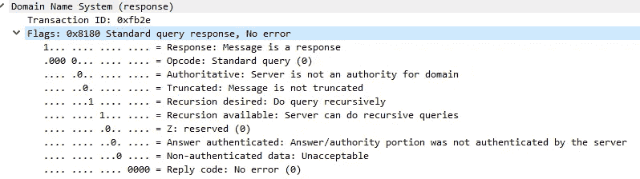
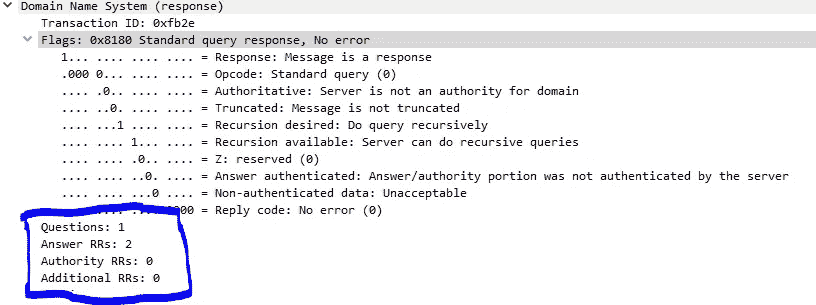
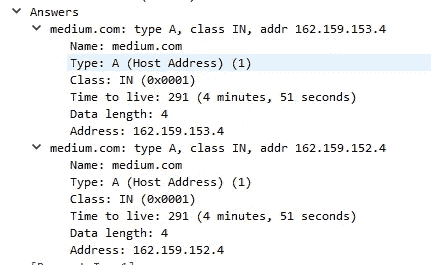

# Java 中的 DNS 响应

> 原文：<https://levelup.gitconnected.com/dns-response-in-java-a6298e3cc7d9>

Java 文章中的 [DNS 请求集中在请求部分。既然已经完成了，接下来的事情就是接收响应并实际解析它。](https://medium.com/@junkypic/dns-request-and-response-in-java-acbd51ad3467)

如果您对没有全部解释的代码更感兴趣，请跳到文章末尾。

我将坚持使用我在第一篇文章中已经使用过的工具。

快速提醒一下，DNS 协议在邮件中“说话”。消息的格式，按照 [RFC1035 第 4.1.1 节。](https://datatracker.ietf.org/doc/html/rfc1035#section-4.1.1)看起来是这样的

```
 +---------------------+
    |        Header       |
    +---------------------+
    |       Question      | the question for the name server
    +---------------------+
    |        Answer       | RRs answering the question
    +---------------------+
    |      Authority      | RRs pointing toward an authority
    +---------------------+
    |      Additional     | RRs holding additional information
    +---------------------+
```

我们将从响应的头部分开始。

在我们能够解析任何东西之前，我们必须接收来自服务器的响应。

如前一篇文章所述，Java 使用 DatagramSockets 和 DatagramPackets 通过 UDP 进行通信。

让我们试着接收响应

```
byte[] response = new byte[1024];
DatagramPacket packet = new DatagramPacket(response, response.length);
socket.receive(packet);
```

打印出一些信息

```
System.*out*.println("\n\nReceived: " + packet.getLength() + " bytes");
for (int i = 0; i < packet.getLength(); i++) {
    System.*out*.print(String.*format*("%s", response[i]) + " ");
}
System.*out*.println("\n");
```

对于 medium.com 域，我收到这个数据包

```
Received: 60 bytes
-5 46 -127 -128 0 1 0 2 0 0 0 0 6 109 101 100 105 117 109 3 99 111 109 0 0 1 0 1 -64 12 0 1 0 1 0 0 0 1 0 4 -94 -97 -104 4 -64 12 0 1 0 1 0 0 0 1 0 4 -94 -97 -103 4
```

如果您请求该域的记录，您很可能会收到相同的数据包。

解析响应

按照请求，报头响应完全相同，只是各个部分包含不同的信息。

标题部分的格式如下

```
 0  1  2  3  4  5  6  7  8  9  0  1  2  3  4  5
    +--+--+--+--+--+--+--+--+--+--+--+--+--+--+--+--+
    |                      ID                       |
    +--+--+--+--+--+--+--+--+--+--+--+--+--+--+--+--+
    |QR|   Opcode  |AA|TC|RD|RA|   Z    |   RCODE   |
    +--+--+--+--+--+--+--+--+--+--+--+--+--+--+--+--+
    |                    QDCOUNT                    |
    +--+--+--+--+--+--+--+--+--+--+--+--+--+--+--+--+
    |                    ANCOUNT                    |
    +--+--+--+--+--+--+--+--+--+--+--+--+--+--+--+--+
    |                    NSCOUNT                    |
    +--+--+--+--+--+--+--+--+--+--+--+--+--+--+--+--+
    |                    ARCOUNT                    |
    +--+--+--+--+--+--+--+--+--+--+--+--+--+--+--+--+
```

为了阅读标题部分中的信息，我们必须以适当的方式解析它。

```
DataInputStream dataInputStream = new DataInputStream(new ByteArrayInputStream(response));
```

将响应读入 dataInputStream 允许以更可控的方式进行解析。

获取 ID 就像读取输入中的第一个缩写一样简单

```
short ID = dataInputStream.readShort();
```

当然，ID 是随机生成的，所以不同的请求不可能得到相同的 ID。

但是，ID 必须与请求中发送的 ID 相同。服务器只是用它来匹配不同的请求和正确的响应。

**注意，readByte(或 readInteger 或任何其他 read*)在 DataInputStream 的内部表示中移动光标，移动量等于读取的位数。在这种情况下，它将移动 16 位。因此，下一个 readByte 将读取标志的第一个字节(或 8 位)。当然，如果我们再做一次 readShort，我们会阅读整个 Flags 部分。**

按照同样的逻辑，我们可以继续下一部分，标志部分。

这个解析起来有点复杂，readByte 会一次读取几个标志。必须做一点位移。

让我们读 QR

```
short flags = dataInputStream.readByte();
int QR = (flags & 0b10000000) >>> 7;
```

即使对于熟悉 Java 的人来说，位移也不是每天都会发生的事情，因为大部分繁重的工作都隐藏在抽象中。

我使用了二进制来尽可能清楚地说明正在发生的事情。在一个数前面加上 0b 可以让你写出它的二进制表示。

在这种情况下，10000000 是 128，因此**标志& 128** 的工作方式完全相同，但不太明显。

让我们再细分一下:

```
dataInputStream.readByte()
```

将读取响应中的第一个字节，紧跟在 ID 之后。

假设 Flags 部分的第一个字节用二进制表示，如下所示

```
10000001
```

我们可以把上面的代码归结为

```
(10000001 & 10000000) >>> 7
```

对上面的数字进行二进制 AND (&)运算会得到 10000000，因为它从左到右依次取第一个数字的每一位，并以相同的顺序对第二个数字进行 AND(&)运算。

```
10000001
&&&&&&&&
10000000
```

因此，1&1 == 1。既然真且真==真。下一位是 0，因为 false 和 false == false。最后一位，1&0 == 0，因为 true 和 false == false。

我们把&和一个非常具体的数字结合起来使用，这样我们在我们想要的比特上保持真实，但在我们不关心的比特上去掉真实。

对这些数字(10000001 & 10000000)进行“与”运算后，我们得到 10000000。

一旦我们得到了想要的结果，我们只需将第 7 位**从第 0 位**开始，向右侧 ( > > >)移动(或移动)7 个空格。

请注意，我使用了 **> > >** ，不，这不是一个错误，是的，这是一个真实的事情，它被称为逻辑右移(相对于`>>`算术右移)。对于那些来自其他语言的人来说，这可能没有意义。

Java 没有显式的有符号数字。默认情况下，java 中的每个数字都是带符号的。

在算术移位中，符号位被扩展以保持数字的有符号性。

我们真的不希望这样(虽然在这种情况下不应该有负数)，所以我们想删除符号，使其默认为无符号。

对于那些好奇的人来说，这个 stackoverflow 问题比我更好地解释了这个问题。

让我们看看这种方法是如何迭代工作的

第一次轮班将导致

```
01000000
```

第二次轮班将导致

```
00100000
```

依此类推，直到我们总共移位 7 次，结果是

```
00000001
```

这是我们的第一个标志，根据上图，它是 QR，指定消息是查询(0)还是响应(1)

二进制数 00000001 实际上是十进制数中的 1。这里的 QR 是一个响应。

既然我们知道了如何读取标志，我们必须简单地对所有其他标志遵循相同的逻辑

```
short flags = dataInputStream.readByte();
int QR = (flags & 0b10000000) >>> 7;
int opCode = ( flags & 0b01111000) >>> 3;
int AA = ( flags & 0b00000100) >>> 2;
int TC = ( flags & 0b00000010) >>> 1;
int RD = flags & 0b00000001;
System.*out*.println("QR "+QR);
System.*out*.println("Opcode "+opCode);
System.*out*.println("AA "+AA);
System.*out*.println("TC "+TC);
System.*out*.println("RD "+RD);flags = dataInputStream.readByte();
int RA = (flags & 0b10000000) >>> 7;
int Z = ( flags & 0b01110000) >>> 4;
int RCODE = flags & 0b00001111;
System.*out*.println("RA "+RA);
System.*out*.println("Z "+ Z);
System.*out*.println("RCODE " +RCODE);
```

例如，在我自己的回答中，我得到:

```
QR 1
Opcode 0
AA 0
TC 0
RD 1
RA 1
Z 0
RCODE 0
```

使用 Wireshark，我可以拦截响应，并检查我的代码是否与 Wireshark 的代码一致。



事实上似乎是这样。

现在我们可以读取头部分的其余部分:QDCOUNT、ANCOUNT、NSCOUNT 和 ARCOUNT。

这是读取下一个 short 的简单问题，因为每个条目正好是 16 位长。

```
QDCOUNT = dataInputStream.readShort();
ANCOUNT = dataInputStream.readShort();
NSCOUNT = dataInputStream.readShort();
ARCOUNT = dataInputStream.readShort();

System.*out*.println("Questions: " + String.*format*("%s",QDCOUNT ));
System.*out*.println("Answers RRs: " + String.*format*("%s", ANCOUNT));
System.*out*.println("Authority RRs: " + String.*format*("%s", NSCOUNT));
System.*out*.println("Additional RRs: " + String.*format*("%s", ARCOUNT));
```

在我的回答中

```
Questions: 1
Answers RRs: 2
Authority RRs: 0
Additional RRs: 0
```



同样，我使用 Wireshark 验证结果。

现在来解析回答中的问题部分。

```
 0  1  2  3  4  5  6  7  8  9  0  1  2  3  4  5
    +--+--+--+--+--+--+--+--+--+--+--+--+--+--+--+--+
    |                                               |
    /                     QNAME                     /
    /                                               /
    +--+--+--+--+--+--+--+--+--+--+--+--+--+--+--+--+
    |                     QTYPE                     |
    +--+--+--+--+--+--+--+--+--+--+--+--+--+--+--+--+
    |                     QCLASS                    |
    +--+--+--+--+--+--+--+--+--+--+--+--+--+--+--+--+
```

这可以通过遵循 RFC 中的说明很容易地理解

QNAME — *用一系列标签表示的域名，其中
每个标签由一个长度八位字节和其后的
个八位字节组成。域名以根的空标签的零长度八位字节
终止。注意
这个字段可能是奇数个八位字节；不使用
填充。*

所以我们可以预期:一个特定的长度— label — 00 len octet 来完成阅读。

简单地说，medium.com 将会是

6 介质 3com0

6 —下一个单词的总长度

媒介——文字本身

…

0 —结束序列

```
String QNAME = "";
int recLen;
while ((recLen = dataInputStream.readByte()) > 0) {
    byte[] record = new byte[recLen];
    for (int i = 0; i < recLen; i++) {
        record[i] = dataInputStream.readByte();
    }
    QNAME = new String(record, StandardCharsets.*UTF_8*);
}
short QTYPE = dataInputStream.readShort();
short QCLASS = dataInputStream.readShort();
System.*out*.println("Record: " + QNAME);
System.*out*.println("Record Type: " + String.*format*("%s", QTYPE));
System.*out*.println("Class: " + String.*format*("%s", QCLASS));
```

现在有趣的部分来了。阅读回复的答案部分。

第 4.1.3 节。RFC 告诉我们

```
The answer, authority, and additional sections all share the same
format: a variable number of resource records, where the number of
records is specified in the corresponding count field in the header.
```

所以我们通过 ANCOUNT、NSCOUNT 和 ARCOUNT 知道每个部分有多少个条目。我们也知道它们是相同的格式。

说到格式，在这里(针对所有版块)。请注意，RDATA 的格式取决于类型，因此在 A 记录和 CNAME 记录之间会有所不同。

```
 0  1  2  3  4  5  6  7  8  9  0  1  2  3  4  5
    +--+--+--+--+--+--+--+--+--+--+--+--+--+--+--+--+
    |                                               |
    /                                               /
    /                      NAME                     /
    |                                               |
    +--+--+--+--+--+--+--+--+--+--+--+--+--+--+--+--+
    |                      TYPE                     |
    +--+--+--+--+--+--+--+--+--+--+--+--+--+--+--+--+
    |                     CLASS                     |
    +--+--+--+--+--+--+--+--+--+--+--+--+--+--+--+--+
    |                      TTL                      |
    |                                               |
    +--+--+--+--+--+--+--+--+--+--+--+--+--+--+--+--+
    |                   RDLENGTH                    |
    +--+--+--+--+--+--+--+--+--+--+--+--+--+--+--+--|
    /                     RDATA                     /
    /                                               /
    +--+--+--+--+--+--+--+--+--+--+--+--+--+--+--+--+
```

[第 4.1.4 节。](https://datatracker.ietf.org/doc/html/rfc1035#section-4.1.4)告诉我们如何阅读姓名条目。但长话短说:

*   11 的 2 位表示偏移的开始
*   2 位 00 代表实际标签
*   一直读到以 00 结尾

因此，我们必须阅读前两位，看看我们的立场。

```
byte firstBytes = dataInputStream.readByte();
int firstTwoBits = (firstBytes & 0b11000000) >>> 6;
```

显然，这里我们假设我们从服务器得到了一个答案。更好的方法是检查 ANCOUNT、NSCOUNT 和 ARCOUNT 是否大于 0。

但是为了这个练习的目的，我们知道 ANCOUNT 是 2。

```
for(int i = 0; i < ANCOUNT; i++) {
  if(firstTwoBits == 3) { // 00000011 first 2 bits
      // more code here }else if(firstTwoBits == 0){
      System.*out*.println("It's a label");
  }

  firstBytes = dataInputStream.readByte();
  firstTwoBits = (firstBytes & 0b11000000) >>> 6;}
```

读取前 2 位，如果是 11，则是偏移。

现在，从 0 到 100 真的很快

```
byte firstBytes = dataInputStream.readByte();
int firstTwoBits = (firstBytes & 0b11000000) >>> 6;

ByteArrayOutputStream label = new ByteArrayOutputStream();
Map<String, String> domainToIp = new HashMap<>();

for(int i = 0; i < ANCOUNT; i++) {
    if(firstTwoBits == 3) {
        byte currentByte = dataInputStream.readByte();
        boolean stop = false;
        byte[] newArray = Arrays.*copyOfRange*(response, currentByte, response.length);
        DataInputStream sectionDataInputStream = new DataInputStream(new ByteArrayInputStream(newArray));
        ArrayList<Integer> RDATA = new ArrayList<>();
        ArrayList<String> DOMAINS = new ArrayList<>();
        while(!stop) {
            byte nextByte = sectionDataInputStream.readByte();
            if(nextByte != 0) {
                byte[] currentLabel = new byte[nextByte];
                for(int j = 0; j < nextByte; j++) {
                    currentLabel[j] = sectionDataInputStream.readByte();
                }
                label.write(currentLabel);
            } else {
                stop = true;
                short TYPE = dataInputStream.readShort();
                short CLASS = dataInputStream.readShort();
                int TTL = dataInputStream.readInt();
                int RDLENGTH = dataInputStream.readShort();
                for(int s = 0; s < RDLENGTH; s++) {
                    int nx = dataInputStream.readByte() & 255;
                    RDATA.add(nx);
                }

                System.*out*.println("Type: " + TYPE);
                System.*out*.println("Class: " + CLASS);
                System.*out*.println("Time to live: " + TTL);
                System.*out*.println("Rd Length: " + RDLENGTH);
            }

            DOMAINS.add(label.toString(StandardCharsets.*UTF_8*));
            label.reset();
        }

        StringBuilder ip = new StringBuilder();
        StringBuilder domainSb = new StringBuilder();
        for(Integer ipPart:RDATA) {
            ip.append(ipPart).append(".");
        }

        for(String domainPart:DOMAINS) {
            if(!domainPart.equals("")) {
                domainSb.append(domainPart).append(".");
            }
        }
        String domainFinal = domainSb.toString();
        String ipFinal = ip.toString();
        domainToIp.put(ipFinal.substring(0, ipFinal.length()-1), domainFinal.substring(0, domainFinal.length()-1));

    }else if(firstTwoBits == 0){
        System.*out*.println("It's a label");
    }

    firstBytes = dataInputStream.readByte();
    firstTwoBits = (firstBytes & 0b11000000) >>> 6;
}

domainToIp.forEach((key, value) -> System.*out*.println(key + " : " + value));
```

这导致了

```
Type: 1
Class: 1
Time to live: 291
Rd Length: 4
Type: 1
Class: 1
Time to live: 291
Rd Length: 4
162.159.153.4 : medium.com
162.159.152.4 : medium.com
```



Wireshark 再次同意我的结果。

但是让我们仔细看看这里发生了什么，因为它很重要。

最重要的部分是域名的压缩。

感觉[第 4.1.4 节。](https://datatracker.ietf.org/doc/html/rfc1035#section-4.1.4)在解释这一点上做得比我好得多，但从上述章节中最重要的收获是这张图表

```
For example, a datagram might need to use the domain names F.ISI.ARPA,
FOO.F.ISI.ARPA, ARPA, and the root.  Ignoring the other fields of the
message, these domain names might be represented as: +--+--+--+--+--+--+--+--+--+--+--+--+--+--+--+--+
    20 |           1           |           F           |
       +--+--+--+--+--+--+--+--+--+--+--+--+--+--+--+--+
    22 |           3           |           I           |
       +--+--+--+--+--+--+--+--+--+--+--+--+--+--+--+--+
    24 |           S           |           I           |
       +--+--+--+--+--+--+--+--+--+--+--+--+--+--+--+--+
    26 |           4           |           A           |
       +--+--+--+--+--+--+--+--+--+--+--+--+--+--+--+--+
    28 |           R           |           P           |
       +--+--+--+--+--+--+--+--+--+--+--+--+--+--+--+--+
    30 |           A           |           0           |
       +--+--+--+--+--+--+--+--+--+--+--+--+--+--+--+--+

       +--+--+--+--+--+--+--+--+--+--+--+--+--+--+--+--+
    40 |           3           |           F           |
       +--+--+--+--+--+--+--+--+--+--+--+--+--+--+--+--+
    42 |           O           |           O           |
       +--+--+--+--+--+--+--+--+--+--+--+--+--+--+--+--+
    44 | 1  1|                20                       |
       +--+--+--+--+--+--+--+--+--+--+--+--+--+--+--+--+

       +--+--+--+--+--+--+--+--+--+--+--+--+--+--+--+--+
    64 | 1  1|                26                       |
       +--+--+--+--+--+--+--+--+--+--+--+--+--+--+--+--+

       +--+--+--+--+--+--+--+--+--+--+--+--+--+--+--+--+
    92 |           0           |                       |
       +--+--+--+--+--+--+--+--+--+--+--+--+--+--+--+--+
The domain name for F.ISI.ARPA is shown at offset 20\.  The domain name
FOO.F.ISI.ARPA is shown at offset 40; this definition uses a pointer to
concatenate a label for FOO to the previously defined F.ISI.ARPA.  The
domain name ARPA is defined at offset 64 using a pointer to the ARPA
component of the name F.ISI.ARPA at 20; note that this pointer relies on
ARPA being the last label in the string at 20.
```

在我们的例子中，名称实际上是指向问题部分的 QNAME 的指针。为什么？因为完全是同一个领域，所以没有必要再写了(呵呵)。节省了响应中非常需要的空间。

我就不一一赘述了，因为它相当容易理解，只是乍一看有点吓人。然而，你们中的一些人可能已经注意到了这一小部分

```
for(int s = 0; s < RDLENGTH; s++) {
    int nx = dataInputStream.readByte() & 255;
    RDATA.add(nx);
}
```

更具体地说

```
dataInputStream.readByte() & 255;
```

这是我们正在阅读的 RDATA 部分，专门针对 A 记录。

每种记录类型都有自己特定的 RDATA 格式，所以以正确的方式读取它很重要。

[第 3.4.1 节。](https://datatracker.ietf.org/doc/html/rfc1035#section-3.4.1)告诉我们，对于 A 记录，RDATA 部分如下所示

```
 +--+--+--+--+--+--+--+--+--+--+--+--+--+--+--+--+
    |                    ADDRESS                    |
    +--+--+--+--+--+--+--+--+--+--+--+--+--+--+--+--+

where:

ADDRESS         A 32 bit Internet address.
```

这很简单。

然而，IP 地址(即 IPv4)实际上是由一个点分隔的一系列 4 个字节。不幸的是，java 没有带符号的数字(嗯…所有的整数类型都是带符号的(除了 char)，它没有显式声明带符号的整数)，所以例如 255.255.255.255 ip 地址将溢出为负数(这可不好玩)，因为 java 字节保存的数字的最小值为-128，最大值为 127(包括 127)。

因此，我们必须将其“下溢”回正确的数字。对 11111111 使用按位运算(&)将得到正确的值。如果它已经是一个正确的值，它将保持原样。

其他部分 NSCOUNT 和 ARCOUNT 的读取方式与 ANCOUNT 完全相同，因为它们的格式完全相同。

当然，您必须记住，RDATA 是特定于类型的。

以及完整的代码，包括请求和响应

```
import java.io.*;
import java.net.DatagramPacket;
import java.net.DatagramSocket;
import java.net.InetAddress;
import java.nio.ByteBuffer;
import java.nio.charset.StandardCharsets;
import java.util.*;

public class Main {
    private static final int *DNS_SERVER_PORT* = 53;

    public static void main(String[] args) throws IOException {

        InetAddress ipAddress = InetAddress.*getByName*("1.1.1.1");

        Random random = new Random();
        short ID = (short)random.nextInt(32767);
        System.*out*.println(ID);
        ByteArrayOutputStream byteArrayOutputStream = new ByteArrayOutputStream();
        DataOutputStream dataOutputStream = new DataOutputStream(byteArrayOutputStream);

        short requestFlags = Short.*parseShort*("0000000100000000", 2);
        ByteBuffer byteBuffer = ByteBuffer.*allocate*(2).putShort(requestFlags);
        byte[] flagsByteArray = byteBuffer.array();

        short QDCOUNT = 1;
        short ANCOUNT = 0;
        short NSCOUNT = 0;
        short ARCOUNT = 0;

        dataOutputStream.writeShort(ID);
        dataOutputStream.write(flagsByteArray);
        dataOutputStream.writeShort(QDCOUNT);
        dataOutputStream.writeShort(ANCOUNT);
        dataOutputStream.writeShort(NSCOUNT);
        dataOutputStream.writeShort(ARCOUNT);
        String domain = "medium.com";
        String[] domainParts = domain.split("\\.");

        for (int i = 0; i < domainParts.length; i++) {
            byte[] domainBytes = domainParts[i].getBytes(StandardCharsets.*UTF_8*);
            dataOutputStream.writeByte(domainBytes.length);
            dataOutputStream.write(domainBytes);
        }
        // No more parts
        dataOutputStream.writeByte(0);
        // Type 0x01 = A (Host Request)
        dataOutputStream.writeShort(1);
        // Class 0x01 = IN
        dataOutputStream.writeShort(1);

        byte[] dnsFrame = byteArrayOutputStream.toByteArray();

        System.*out*.println("SendataInputStreamg: " + dnsFrame.length + " bytes");
        for (int i = 0; i < dnsFrame.length; i++) {
            System.*out*.print(String.*format*("%s", dnsFrame[i]) + " ");
        }

        DatagramSocket socket = new DatagramSocket();
        DatagramPacket dnsReqPacket = new DatagramPacket(dnsFrame, dnsFrame.length, ipAddress, *DNS_SERVER_PORT*);
        socket.send(dnsReqPacket);

        byte[] response = new byte[1024];
        DatagramPacket packet = new DatagramPacket(response, response.length);
        socket.receive(packet);

        System.*out*.println("\n\nReceived: " + packet.getLength() + " bytes");
        for (int i = 0; i < packet.getLength(); i++) {
            System.*out*.print(String.*format*("%s", response[i]) + " ");
        }
        System.*out*.println("\n");

        DataInputStream dataInputStream = new DataInputStream(new ByteArrayInputStream(response));
        System.*out*.println("\n\nStart response decode");
        System.*out*.println("Transaction ID: " + dataInputStream.readShort()); // ID
        short flags = dataInputStream.readByte();
        int QR = (flags & 0b10000000) >>> 7;
        int opCode = ( flags & 0b01111000) >>> 3;
        int AA = ( flags & 0b00000100) >>> 2;
        int TC = ( flags & 0b00000010) >>> 1;
        int RD = flags & 0b00000001;
        System.*out*.println("QR "+QR);
        System.*out*.println("Opcode "+opCode);
        System.*out*.println("AA "+AA);
        System.*out*.println("TC "+TC);
        System.*out*.println("RD "+RD);
        flags = dataInputStream.readByte();
        int RA = (flags & 0b10000000) >>> 7;
        int Z = ( flags & 0b01110000) >>> 4;
        int RCODE = flags & 0b00001111;
        System.*out*.println("RA "+RA);
        System.*out*.println("Z "+ Z);
        System.*out*.println("RCODE " +RCODE);

        QDCOUNT = dataInputStream.readShort();
        ANCOUNT = dataInputStream.readShort();
        NSCOUNT = dataInputStream.readShort();
        ARCOUNT = dataInputStream.readShort();

        System.*out*.println("Questions: " + String.*format*("%s",QDCOUNT ));
        System.*out*.println("Answers RRs: " + String.*format*("%s", ANCOUNT));
        System.*out*.println("Authority RRs: " + String.*format*("%s", NSCOUNT));
        System.*out*.println("Additional RRs: " + String.*format*("%s", ARCOUNT));

        String QNAME = "";
        int recLen;
        while ((recLen = dataInputStream.readByte()) > 0) {
            byte[] record = new byte[recLen];
            for (int i = 0; i < recLen; i++) {
                record[i] = dataInputStream.readByte();
            }
            QNAME = new String(record, StandardCharsets.*UTF_8*);
        }
        short QTYPE = dataInputStream.readShort();
        short QCLASS = dataInputStream.readShort();
        System.*out*.println("Record: " + QNAME);
        System.*out*.println("Record Type: " + String.*format*("%s", QTYPE));
        System.*out*.println("Class: " + String.*format*("%s", QCLASS));

        System.*out*.println("\n\nstart answer, authority, and additional sections\n");

        byte firstBytes = dataInputStream.readByte();
        int firstTwoBits = (firstBytes & 0b11000000) >>> 6;

        ByteArrayOutputStream label = new ByteArrayOutputStream();
        Map<String, String> domainToIp = new HashMap<>();

        for(int i = 0; i < ANCOUNT; i++) {
            if(firstTwoBits == 3) {
                byte currentByte = dataInputStream.readByte();
                boolean stop = false;
                byte[] newArray = Arrays.*copyOfRange*(response, currentByte, response.length);
                DataInputStream sectionDataInputStream = new DataInputStream(new ByteArrayInputStream(newArray));
                ArrayList<Integer> RDATA = new ArrayList<>();
                ArrayList<String> DOMAINS = new ArrayList<>();
                while(!stop) {
                    byte nextByte = sectionDataInputStream.readByte();
                    if(nextByte != 0) {
                        byte[] currentLabel = new byte[nextByte];
                        for(int j = 0; j < nextByte; j++) {
                            currentLabel[j] = sectionDataInputStream.readByte();
                        }
                        label.write(currentLabel);
                    } else {
                        stop = true;
                        short TYPE = dataInputStream.readShort();
                        short CLASS = dataInputStream.readShort();
                        int TTL = dataInputStream.readInt();
                        int RDLENGTH = dataInputStream.readShort();
                        for(int s = 0; s < RDLENGTH; s++) {
                            int nx = dataInputStream.readByte() & 255;// and with 255 to
                            RDATA.add(nx);
                        }

                        System.*out*.println("Type: " + TYPE);
                        System.*out*.println("Class: " + CLASS);
                        System.*out*.println("Time to live: " + TTL);
                        System.*out*.println("Rd Length: " + RDLENGTH);
                    }

                    DOMAINS.add(label.toString(StandardCharsets.*UTF_8*));
                    label.reset();
                }

                StringBuilder ip = new StringBuilder();
                StringBuilder domainSb = new StringBuilder();
                for(Integer ipPart:RDATA) {
                    ip.append(ipPart).append(".");
                }

                for(String domainPart:DOMAINS) {
                    if(!domainPart.equals("")) {
                        domainSb.append(domainPart).append(".");
                    }
                }
                String domainFinal = domainSb.toString();
                String ipFinal = ip.toString();
                domainToIp.put(ipFinal.substring(0, ipFinal.length()-1), domainFinal.substring(0, domainFinal.length()-1));

            }else if(firstTwoBits == 0){
                System.*out*.println("It's a label");
            }

            firstBytes = dataInputStream.readByte();
            firstTwoBits = (firstBytes & 0b11000000) >>> 6;
        }

        domainToIp.forEach((key, value) -> System.*out*.println(key + " : " + value));
    }
}
```

如果你认为这看起来非常丑陋，我同意你的观点。

事实上，我计划上传一个更干净的版本到我的 GitHub 上。与此同时，如果出于某种原因你想要一个 java dns，你可以使用 [dnsjava](https://github.com/dnsjava/dnsjava) 。