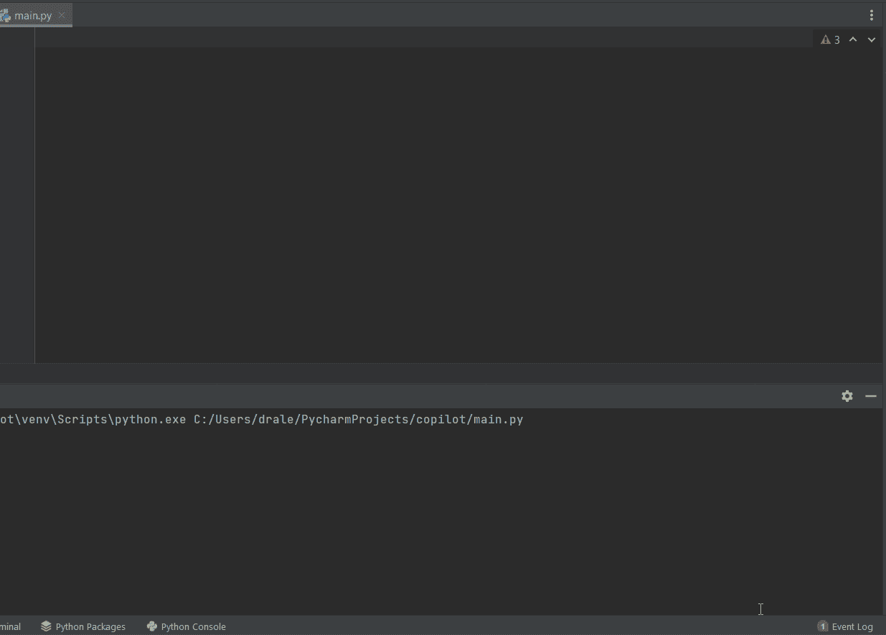
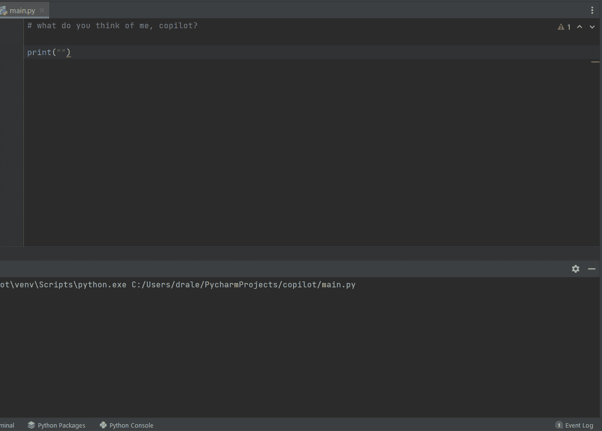
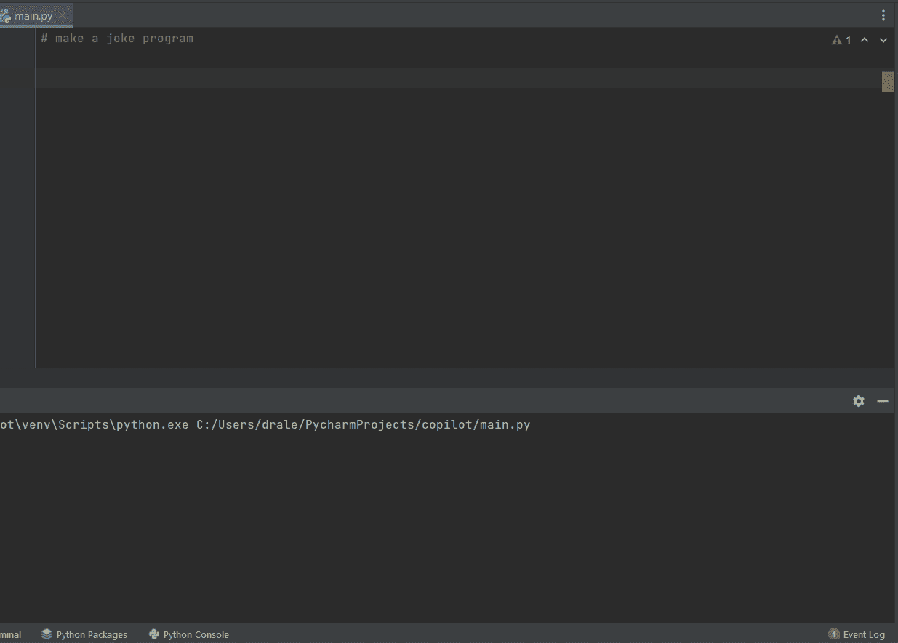
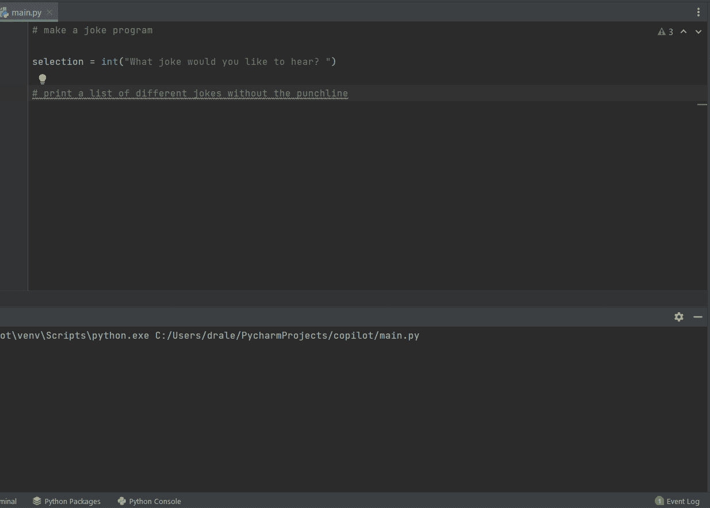
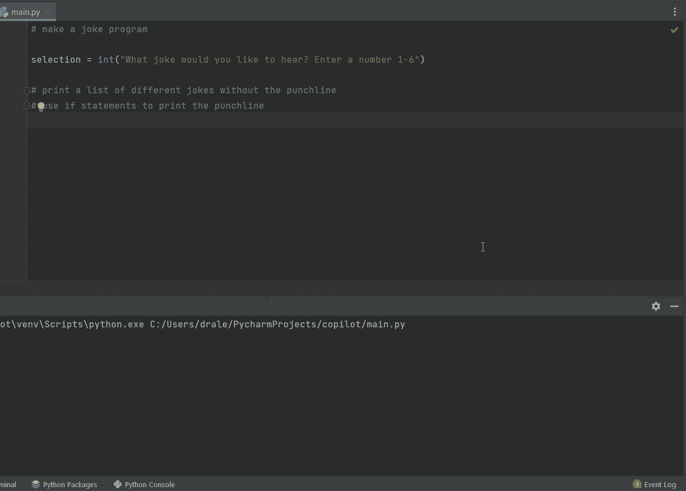

# 人工智能讲好笑话吗？让我们看看 GitHub Copilot 能否让我开怀大笑。

> 原文：<https://levelup.gitconnected.com/do-ais-tell-good-jokes-let-s-find-out-if-github-copilot-can-make-me-laugh-1df3d0c19a07>

罗曼·辛克维奇在 [Unsplash](https://unsplash.com?utm_source=medium&utm_medium=referral) 上拍摄的照片

当我第一次听说 [GitHub copilot](https://copilot.github.com/) 以及它是一个“代码完成”扩展时，我心想这有多棒——又一个无用的付费程序，偶尔会将我的变量填入错误的值。

我大错特错了。

对于那些不知道 GitHub Copilot 是什么的人来说，它不仅仅是一个代码完成程序:它产生的结果非常可怕，让我担心我的职业生涯。它使用高度先进的 GPT-3 深度学习算法来“合成”适合您项目的代码。

> 生成式预训练 Transformer 3 是一个自回归语言模型，它使用深度学习来产生类似人类的文本。这是由旧金山人工智能研究实验室 OpenAI 创建的 GPT-n 系列中的第三代语言预测模型。
> 
> [-维基百科](https://en.wikipedia.org/wiki/GPT-3)

现在，当你有了这个星球上最先进的程序之一，还有什么比问它笑话更好的使用这项技术呢？

# 有趣的事情

副驾驶偶尔会有一些精神障碍，所以你可能需要把它推向正确的方向。让我们请它给我们讲个笑话。

## 副驾驶是斯特罗加诺夫吗？

面条？

> “你管假面条叫什么？”
> 
> "副驾驶:一个傻瓜！"

这……好吧。可以上几堂站立课。没有真的笑，但仍然令人印象深刻。

*   幽默:3/10

## 别耍我，副驾驶

我其实很害怕蛇

我真的笑了。这是关于在 Python 中的自我意识，实际上很有趣。

*   幽默:5/10

## 你觉得我怎么样，副驾驶？

我想如果整个计算机科学的事情不成功，我总是可以成为一名飞行员。我很感激副驾驶信任我。

*   鼓励:7/10

# 压力测试

到目前为止，我们已经做了一些非常好的例子，但是让我们看看我们能把 copilot 推进多远。

让我们看看能否让它用 Python 编写一个笑话程序。

## 用户输入

副驾驶明白我们在做什么类型的程序吗？

用了几个字符，但它似乎理解得惊人地快。如果我们要求它列出一些笑话选项呢？

## 列举笑话

几乎是我们想要的！仍然非常令人印象深刻，但让我们看看我们是否可以在不立即打印笑点的情况下获得它。

*   创造力:6/10

## 用户选择

虽然这些笑话还需要一点努力，但副驾驶立刻知道我想要什么是令人难以置信的。我可能不会笑得在地板上打滚，但我几乎被它完全知道我想要什么的能力惊呆了。

性能:10/10

# 结束语

Copilot 的性能绝对令人惊讶，当我第一次看到它时，我不敢相信。OpenAI 的人们真的超越了他们自己，我非常感激成为封闭测试的一部分。