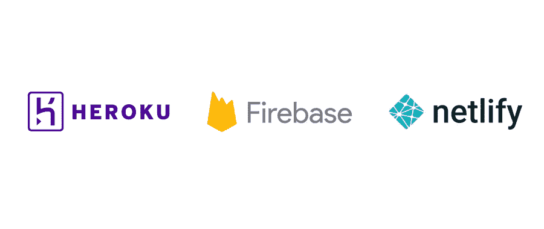

# 我的 React Gatsby 实时应用程序使用 Heroku、Netlify 还是 Firebase？

> 原文：<https://levelup.gitconnected.com/do-i-use-heroku-netlify-or-firebase-for-my-react-gatsby-realtime-application-1797557a1153>

所以在过去的几周里，我一直致力于为实时应用程序创建一个应用程序生成器。一个主要的需求是它需要包含应用工程师需要的所有东西。这也意味着平台部署。

好酷。我将从 Heroku、Firebase 和 Netlify 这样的小平台开始，逐步发展到更大的 AWS、GCP 和 Azure 平台。

首先是 Netlify。

# 实时应用的 Netlify？

我实话实说。我很高兴能和 Netlify 一起工作，因为我听到了关于它的好消息。它承诺无缝连接到您的 git 存储库，并自动构建和部署您的静态站点和云功能到云中。

不需要管道。

构建和部署。为你做的。

这让我开发应用程序生成器变得很容易。把我的手擦干净，噗。

# 利益

*   **非常适合静态站点生成的 ui:**好的。Netlify 很酷。它非常适合部署静态的站点生成的应用程序。LunarBaby 应用程序生成器在引擎盖下使用 React Gatsby，非常棒。Netlify 知道该做什么。我根本不需要做任何设置。只需使用他们的 UI 连接到我的 Gitlab repo，并将我的代码推送到 master。Netlify 做剩下的。
*   **云函数做得很好:**这里可能使用了一点作弊代码，但他们使用了 AWS Lambda 函数。事实证明，Netlify 是 AWS 上非常容易使用的包装器。在我看来这没什么。部署无服务器功能就像构建和部署静态内容一样简单……就像将您的代码推送到 repo 一样简单。
*   **非常适合本地开发:**我选择将我的函数 repo 从我的 UI 中分离出来，所以我没有充分利用这个功能。但是对于无服务器的功能来说，这是非常巧妙的。在本地工作可能是构建无服务器功能的痛苦。Netlify 需要。你的。痛苦。走开。
*   **价格被 Gouda:** 实话实说吧。平台价格很重要。我们都知道，当使用这些 PAAS 工具时，它会迅速失控。我非常喜欢 Netlify 的定价模式。它对我的需求是免费的。如果你需要任何复杂的东西，它仍然不贵。不会螺旋上升。

# 缺点

*   **没有暂存环境和变量。**所以你通常至少有 3 个主要环境。你当地的环境。试运行/测试环境和生产环境。这在 Netlify 中是不容易实现的。一开始，您得到的只是一个生产环境。想做“网络生活开发”吗？它默认下拉生产配置。您确实可以选择设置一个 Toml 文件，并对设置一个本地环境进行一些更改…但是要分阶段。那完全是另一回事。你得摆正姿势。圆孔它。需要设置一个自定义配置不同的应用程序。
*   没有长期存在的后端服务。功能不错，但实时网络应用需要一个 websocket 才能最好地工作。这在网络生活中是不可能的。实时应用程序需要一个事件消息系统。这些在网络生活中都是不可能的。它有一个做得很好的特定用例。但是它在整个服务器层支持方面不是很好。
*   **数据库和消息队列在哪里？**没有现成的数据库平台支持。你可以为 FaunaDB 安装一个非常酷的插件。但这是另一个外部平台。事件消息传递也是如此。实时应用程序必须有发布和订阅消息的方法。你需要另一个平台来管理它。

# 总体推荐:非常适合 JAMstack 应用。不适用于实时应用程序。

现在，如果您正在构建一个实时 web 应用程序。不要用 Netlify。它不太适合这个平台。你会在站台地狱里结束。我喜欢 Netlify 的原型和某些用例。实时应用程序不是吗？

# 实时应用的 Heroku？

下一个。赫罗库。我一直对赫罗库情有独钟。对于初创公司和小型应用程序来说，这是一个很好的平台。设置起来很容易。为项目添加一个 git remote，然后推开。设置 ci / cd 管道非常简单。我经常用它做原型和咨询。

但是，对于实时应用来说，它是合适的工具吗？

# 利益

*   **仍然从容部署。** Heroku 还是很好部署的。它不提供 Netlify 提供的自动化构建工具，但我们离更复杂的基础设施部署还有一段距离。您可以通过几个 Heroku 命令或者相当容易地编写一个 ci/cd 管道来手动完成。Gitlab & CircleCI(不确定其他的)有一个你可以使用的模板。
*   **可以处理 Websockets &后端服务。你可以在 Heroku 部署全功能的微服务。这意味着您的应用程序可以有 websockets。这是一个复选标记。Heroku 没有像 Netlify 那样的 FAAS 系统，有点臭。但是它支持 websockets 需求。**
*   【Kafka 支持事件消息传递。另一个复选标记(稍后会有说明)。Heroku 确实有卡夫卡的附加品。你完全有能力在 Heroku 平台上构建一个完整的实时应用程序。

# 缺点

*   价格不可持续:Heroku 通常都是这样，但在实时应用中几乎不可能。Kafka 附加软件每月 100 美元起步。大多数使用 Heroku 的初创企业和顾问都是因为他们需要一种快速、廉价的方式来获得概念验证。当他们开始需要扩展时，他们会转向更大的平台。在用 Heroku 构建实时应用程序时，这个选项实际上是不可用的。你的起价是 100 美元/月。然后它会随着你的扩展而快速跳跃。

# 总体建议:用 Heroku 构建实时应用程序是可能的，但不现实

你能做到吗？是啊，当然。你应该这样做吗？大概不会。

房间里不那么秘密的大象是 Heroku 不能很好地伸缩。它对创业公司和小型应用程序很有效，但是一旦一个项目发展到实质性的东西，它很快就会变得昂贵。嗯，实时应用程序开始时很复杂。他们不是你的典型筹码。在 websockets 和事件消息系统之间，你有标准应用程序不需要的复杂性。

Heroku 上的一个原型实时应用程序仅为 Kafka 服务，起价为每月 100 美元。仅仅是从原型到专业应用，在你拥有第一个用户之前，你就要花 200 美元。

我喜欢 Heroku。但它不是这项工作的合适工具。

# 实时应用的 Firebase？这是正确的

所以只剩下一个平台。火焰基地。

很简单，这不是一场公平的战斗。Firebase 的 Firestore 数据库就是为此用例而构建的。它是作为移动和网络应用的实时数据库进行销售的。这个平台就是为这个挑战而设计的。

也就是说，虽然 Firebase 可能是实时应用程序的正确选择，但我确实对该平台有些担忧。

# 利益

1.  **它就是为此用例而构建的。** Firebase 是为实时移动和 web 应用程序开发人员打造的平台。它有你需要的一切，并且是开发者友好的。您不必经历平台地狱来构建这种类型的应用程序。只要设置好 Firebase，你就可以开始了。
2.  **易于构建和部署。**这和 Netlify 和 Heroku 都是一样的。他们都在无行动圈里跑。Firebase 有一个 cli 工具，允许您构建、测试和部署您的需求。与您的 CI/CD 管道集成也很容易。你可以在一个周末内完成概念验证。
3.  **价格是豪达。我们又回到了现实。在 Firebase 中构思和推出实时应用程序的成本可以忽略不计。在看到真正的吸引力之前，你可能不会花太多钱。在实时数据库、在桶中托管 UI、无服务器功能之间，你暂时不会付出任何代价。随着实时应用程序的增长，这一点非常重要。**
4.  Firebase 真的只是谷歌云平台。当你使用 Firebase 服务时，你实际上是在使用 GCP 服务。Firebase 只是网络移动应用开发者与 GCP 互动的一种有用方式。它提供了一个无操作平台。但是整个 Firebase 工具套件在更大的谷歌云平台生态系统中是可用的。这意味着，当您需要额外的资源时，您将避免平台地狱。

# 缺点

1.  **Firebase 真的只是谷歌云平台。** Salesforce 拥有 Heroku。Netlify 只是 AWS 的一个包装，但是 Firebase 项目实际上是 Google 云平台项目。这可能是好的也可能是坏的，但是随着应用程序的增长，您基本上是将自己捆绑到一个更大的平台中。这是谷歌的明智之举。这对你来说是一个好的举动吗？
2.  **凡士多让我害怕。** Firestore 的实时数据库真的很酷。但也有点吓人。通过 web 用户界面来管理数据库是非常糟糕的做法。一般来说太危险了。这正是 firebase 所推荐的。从您的 web 用户界面直接与 Firestore 交互。我将否认他们有非常强大的防火墙和规则来阻止可疑的访问。此外，我们可能不直接使用数据库，而是使用一些 api 包装它。这仍然令我担忧。
3.  Firestore 让我害怕。是的。你没看错。我重复了一遍。Firestore 是一个非常独特的文档数据库。我还没有遇到任何其他使用相同范例的数据库。如果您要切换到不同的文档存储，您将需要清空存储逻辑并重新开始。随着应用程序域的增长，管理模式和关系也变得非常困难。Mongo 并没有很好地处理关系，但它确实提供了比 Firestore 更好的解决方案。有了 Firestore，他们基本上说。当您想要处理多对多关系时，除了您的两个主集合之外，再创建两个关系集合。说什么？
4.  我害怕 Firestore。好的。我又做了一次。Firestore 是一种专有的数据库服务。这意味着在您的本地环境中不能有 dockerized 版本。你一直在使用 Firestore 网络服务。对于您的需求来说，这可能不是一件可怕的事情，但是我真的不喜欢我的数据库永远被锁定在一个特定的供应商身上。

# 总体建议:启动实时应用程序的理想选择

最后，Firebase 是在 noOps 空间中启动实时应用程序的正确解决方案。你拥有一切你需要的东西。的确，您需要小心 Firebase 的供应商锁定，但这可以通过良好的应用程序架构来管理。您不希望因为受到基础架构供应商的束缚而在未来 3 到 5 年内不得不重新构建整个应用程序。这将是一个非常昂贵的修复。

从一开始就做好。构建您的应用程序架构，以便您可以尽可能轻松地更换任何平台。构建有供应商锁定的东西会更快，但这一点点额外的时间将会为您节省大量时间和金钱。

# 过着令人敬畏的编程生活

将我的每周编程见解发送到您的收件箱。这些是我从 20 年的软件开发生涯中学到的技巧、秘密和信息。

[https://thatmiracle.com/newsletter/](https://thatmiracle.com/newsletter/)