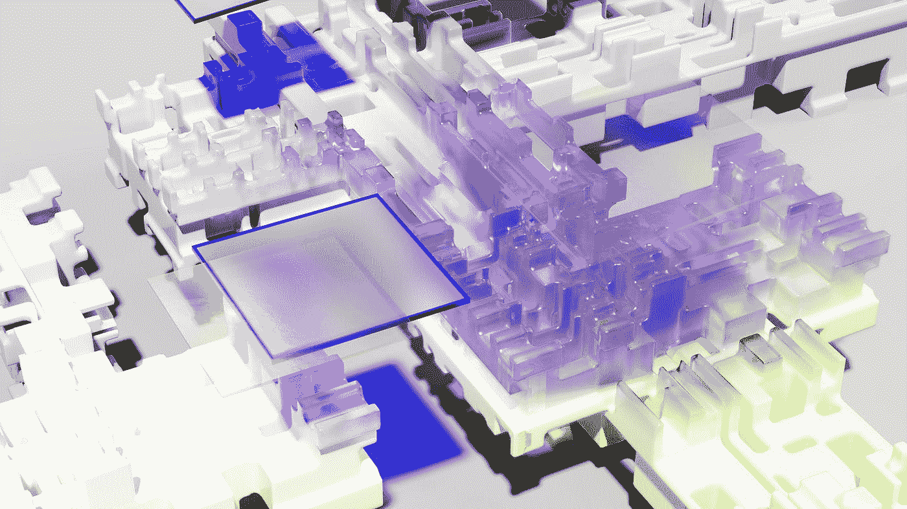
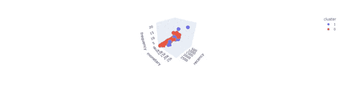
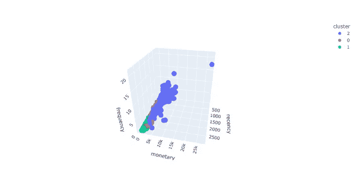

# 如何用 PHP 做机器学习

> 原文：<https://levelup.gitconnected.com/do-machine-learning-in-php-83bb226d5262>

## 比你想象的容易！✨

照片由 [DeepMind](https://unsplash.com/@deepmind?utm_source=medium&utm_medium=referral) 在 [Unsplash](https://unsplash.com?utm_source=medium&utm_medium=referral) 上拍摄

目前，我正在进行一个客户群细分项目，以验证我的机器学习工程师头衔。我让我的 2 名数据营销硕士学生从事一个由 [PrestaShop](https://www.prestashop-project.org/) 开发的电子商务网站的细分工作。

由于 PrestaShop 基于 PHP/MySQL 组合，我想知道我们是否有一天可以开发一个或多个模块，为电子零售商提供更多关于他们客户的信息，而不需要来自 [Google Analytics](https://analytics.google.com/analytics/web/) 或 [Matomo](https://fr.matomo.org/) 的数据。

奇怪的巧合是，谷歌分析解决方案的使用目前在欧盟被认为是非法的，因为它不尊重 GDPR。

我读过一些营销团队或电子零售商在客户知识方面所做的工作，我的印象是，他们中 99%的人只是通过基于跟踪工具的“网站上的客户之旅”来看待客户知识。

然而，一旦你有了一点历史，那么多的信息和决策都可能不被追踪！

## 但是什么是细分呢？RFM 的例子

追踪解决方案的目标至少是对那些被认为有相同行为和相同购买习惯的顾客群体进行研究。

这就是我们所说的细分，目标是采取营销行动，而不是在整个客户群的规模上，而是根据他们的路径和在网站上采取的行动来确定细分的基础。

在最著名的分割例子中，RFM 分割是最容易解释的。

对于数据库中的每个客户，我们收集以下指标:

*   最后一次购买的日期(也称为“**最近**”)；
*   一定时期内的**购买频率**:例如每月；
*   在现场花费的总金额(也称为“**货币**”)；

此外，您还可以随意使用其他信息(如注册日期、城市、年龄、性别等。)，我们可以通过建立 RFM 评分，根据这些指标对客户进行分组。

例如，在研究了这些指标的值之后，我们可以将它们分成四分位数(25%)，并给它们分配几个点。

**总消费金额:**

*   第一个四分位数得 1 分；
*   第二个四分位数给 2 分；
*   等等…

**对于最后一次购买的日期，则相反！**

一般来说，我们更喜欢最近购买过的客户。因此，我们可以计算最后一次购买日期和今天之间的天数，并以四分位数进行“评分”:

*   第一个四分位数给 4 分；
*   第二个四分位数给 3 分；
*   等等…

如果你做得对，在不了解任何机器学习的情况下，你将很快获得一个包含你的客户群的表格，然后是 RFM 评分。

然后，您必须研究这些聚合，并为每个组建立一个角色和营销活动！

> 如果你想在 PrestaShop 数据库上试验 RFM 分段，我已经贡献了 SQL 查询给[在“PrestaShop 之友”GitHub 组织中收集。](https://github.com/friends-of-presta/SQL-request/blob/main/1.7/orders/rfm_complete_statistics.sql)

## 该死的！我们想用 PHP 做机器学习😣

放松，我快到了😅

最终，我们试图将客户聚集在具有**同质行为**的群体中。

机器学习的一整个分支都致力于这个问题，叫做**无监督学习**。

目标是为算法提供一定量的数据，以便它们自己对个体进行分组。

在前面的示例中，我们必须手动对客户进行细分，并在细分市场上建立我们的条件(得分从 0 到 1，然后从 2 到 3，等等。).

这里，是机器学习模型将使用数学假设和约束来建立群组🙂

> 请注意，您仍需要对这些群体进行解读，以建立角色和营销活动 *⛔*

但事情是这样的，PHP 中的机器学习是不存在的:你必须做 Python，R，Java …

但直到最近我也是这么想的！那是在我发现 Rubix ML 库之前🤩

## 使用 Rubix ML 进行客户细分

*你会在 GitHub 上找到* [*完整的代码*](https://github.com/mickaelandrieu/php_customers_segmentation) *。*

为了对客户群进行细分，我选择以 RFM 行为指标为基础，训练一个名为 K-Means 的机器学习模型。

我就不解释 K 均值了。这是一个关于这个主题的非常好的视频:

PHP Rubix ML 可以执行以下操作:

*   **将你的数据**加载到一个名为“Dataset”的结构中；
*   应用数据准备操作；
*   **创建一个模型**实例(这里指 K-Means)；
*   **用你的数据训练它**；

一旦模型定型(可能很长)，它就用于预测数据库中每个客户的细分市场。

我们选择了三个部分:可能这个值不是最相关的！您必须执行几项测试，以确定哪个数量的细分市场最能代表您的客户。

下面是我们如何使用训练好的模型通过 Rubix ML 预测细分市场:

我们在一个 CSV 文件中恢复了一个名为“cluster”的新列，它将包含客户的细分预测。

因为我们选择了 3 个集群，所以可能的值是 0、1 和 2:

## 好吧，但我怎么知道它是否被正确分割？

这是 PHP 生态系统的担忧；没有专门用于数据分析和可视化的库🤔

为了结束本文，下面是使用 Rubix ML 获得的集群的可视化表示:

Rubix ML 集群的图形表示(5 万客户)

正如我们所看到的，很难区分哪些部分是不同的。

出于好奇，通过对相同的数据应用相同的转换，下面是使用 Python [Scikit-Learn](https://scikit-learn.org/stable/) 库呈现的相同训练:

Scikit-Learn 集群的可视化表示(50，000 客户)

我们这次看到 Scikit-Learn 能够检测到第三个片段，即使理解不同组之间的区别仍然很复杂:

*   0 组不是很清楚😯；
*   组 1 似乎有一个低频率和总购买量🙄；
*   第 2 组看起来是最好的客户群，但可能会再次被分开🤨；

> 我很失望，我以为我可以做机器学习*😑*

我明白，但是机器学习不同于传统的软件开发(网络、移动、桌面)，它需要一些非常高级的数学技能🤓。

为了更好地对我们的数据进行**聚类**，我必须在这篇文章中引入许多数据分析概念，并理解 K-Means 是如何工作的😶

然而，这里有一些建议给那些想改善结果的人:

*   在保留客户 id 的同时训练模型值得吗？
*   您确定客户 id 是唯一的吗？
*   数据集中有异常值吗？
*   每个变量的值的分布是什么？
*   K-Means 模型有哪些特定的条件/优化？
*   考虑 3、4 或 5 个集群会有什么结果？
*   如果我们只相信得分的中间四分位数而不相信原始值，会有什么结果？

如果您喜欢这篇文章，并希望在未来文章发布时得到通知，请随时[关注我](https://mickael-andrieu.medium.com/)并添加一些掌声！