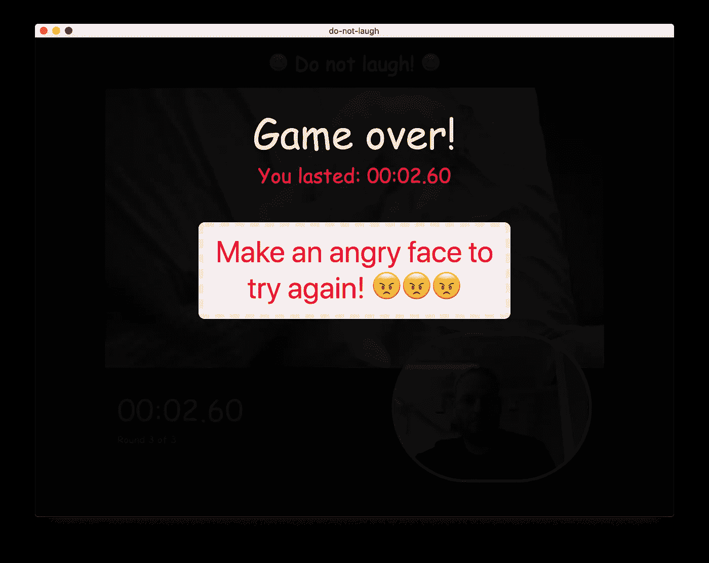

# 不要笑——一个简单的人工智能驱动的游戏，使用 TensorFlow.js 和 Electron

> 原文：<https://levelup.gitconnected.com/do-not-laugh-a-simple-ai-powered-game-3e22ad0f8166>

很长一段时间以来，我一直在评估如何利用人工智能技术来平衡数字应用程序的用户体验，甚至实现全新的 UI / UX 概念。

最近我偶然发现了几篇 [文章](https://medium.com/@jsflo.dev/training-a-tensorflow-model-to-recognize-emotions-a20c3bcd6468)，描述了如何训练 CNN(卷积神经网络)识别一个人通过面部表情表达的情绪。这听起来像是一个创建用户界面的有趣想法，所以为了测试它，我想出了一个简单的游戏，叫做“不要笑”。

游戏本身非常简单。它会从 YouTube 上随机播放一段有趣的视频，你唯一的工作就是:不要笑！**如果人工智能发现你在笑，游戏就结束了。**所以我开始用 Vue.js 和最近成为我首选的前端框架的 Electron 创建这个游戏。


请原谅漫画书的随意使用

在基于 HTML5 / JavaScript 的应用程序中使用人工智能和机器学习技术是一件相当新的事情，所以我决定在本文中写下我的经验，并与您分享一些最佳实践。如果你对所有的细节不感兴趣，你也可以从这里下载所有的源代码。

# 如何给一个 Vue.js +电子 app 添加 TensorFlow

如果你以前玩过人工智能或机器学习代码，你可能已经见过一个名为 [TensorFlow](https://www.tensorflow.org/) 的库在运行。TensorFlow 是谷歌用于机器学习(ML)的开源人工智能框架，它被广泛用于图像分类等任务——这正是我们的小游戏所需要的。唯一的缺点是，它是一个 Python 库，只能使用 nVidia GPUs 进行加速。是的，在做任何与 ML 相关的事情时，你绝对需要 GPU 加速。

## 输入 TensorFlow.js 和 WebGL GPU 加速

幸运的是，TensorFlow 团队已经将该库移植到 JavaScript，并发布了 [TensorFlow.js](https://www.tensorflow.org/js) (tfjs)，让我们可以在电子应用程序中使用它。更好的是，他们更进一步，添加了基于 WebGL 的 GPU 加速，支持任何现代 GPU，不再限制我们使用支持 nVidia 和 CUDA 的硬件👋 👋 👋。为此干杯🍺！


## 使用 face-api.js 让事情变得更加简单

在这一点上，我们基本上都设置好了。我们手头有一个强大的库，并且有预训练的模型可用于情绪检测。这意味着我们可以节省时间和麻烦来训练我们自己的模型。

当我写一些初始代码时，我发现[文森特·米勒](https://medium.com/u/ffd42e31db07?source=post_page-----3e22ad0f8166--------------------------------)已经创建了一个名为 [face-api.js](https://itnext.io/face-api-js-javascript-api-for-face-recognition-in-the-browser-with-tensorflow-js-bcc2a6c4cf07) 的高级 api，它基于 TensorFlow.js 构建，包装了所有低级操作，并为人脸识别和情感检测等常见任务提供了一个方便的 API。他还在他的 [GitHub 库](https://github.com/justadudewhohacks/face-api.js)上提供了许多示例代码，所以我能够在几分钟内构建我的第一个情感识别器。

# 将应用程序放在一起

先说整体游戏架构。使用电子意味着我们有一个铬渲染器过程，这将成为我们的游戏用户界面。它会回放视频文件，显示你的直播镜头，当然还会运行游戏逻辑——你笑了，你就输了。

那么，在这种情况下，实际的情绪检测发生在哪里呢？要回答这个问题，你需要记住两件事:

*   实时情感检测是一项非常耗费资源的任务。即使是一个好的 GPU 也可能只能产生大约 20-30 FPS 的速度。
*   在电子渲染器中运行资源密集型任务将导致该渲染器的 UI 变得无响应。

为了保持事情顺利进行，我们需要一种方法将繁重的工作转移到一个单独的流程中。幸运的是，Electron 可以使用隐藏渲染器做到这一点。因此，我们最终的游戏架构看起来像这样:


在隐藏渲染器中运行 TensorFlow.js / face-api

在这个场景中，我们让 face-api 在一个隐藏的渲染器(“检测工作器”)中运行，不断评估现场摄像机流中的情绪。如果检测到情绪，工作者将向游戏发送带有检测到的情绪的 IPC 消息。在游戏中，我们可以简单地将这些消息视为事件，并做出相应的反应。

## 创建新的 Vue.js /电子应用程序

要创建你的应用样板文件[，你可以按照我这里的说明](https://medium.com/@andreas.schallwig/building-html5-kiosk-applications-with-vue-js-and-electron-c64ac928b59f)。从“准备好您的环境”一节开始，按照说明操作，直到您可以使用`npm run electron:serve`成功运行空白应用程序。

接下来安装 face-api.js:

```
npm i --save face-api.js
```

## 背景检测工作进程

首先，我们创建后台工作进程，它将处理所有的检测工作(又名。“重物提升”)。继续在`public`目录下创建一个文件`worker.html`:

```
<!DOCTYPE html>
<html lang="en">
<head>
  <meta charset="utf-8">
  <title>Worker</title>
</head>
<body>
  <video id="cam" autoplay muted playsinline></video>
</body>
</html>
```

注意这里的`<video>`标签。我们将在 worker 中引用这个元素来从相机流中检索图像数据。

接下来在`src`目录中创建`worker.js`。这是一个更长的文件，你可以在这里看到完整的版本。我将对其进行分解，并向您解释最重要的部分:

```
import * as faceapi from 'face-api.js';// init detection options
const minConfidenceFace = 0.5;
const faceapiOptions = new faceapi.SsdMobilenetv1Options({ minConfidenceFace });
```

在这里，我们包括并配置 face-api.js。在内部，face-api.js 使用 SSD MobileNet v1 模型来识别图片中的人脸，因此我们需要提供一个`minConfidenceFace`配置参数，该参数将模型配置为识别至少 50%置信度的人脸。


这家伙不是故意笑的！

```
// configure face API
faceapi.env.monkeyPatch({
  Canvas: HTMLCanvasElement,
  Image: HTMLImageElement,
  ImageData: ImageData,
  Video: HTMLVideoElement,
  createCanvasElement: () => document.createElement('canvas'),
  createImageElement: () => document.createElement('img')
});
```

这一部分是为了使 face-api.js 在电子应用程序中正常工作的一种变通方法。在正常的浏览器环境中，这是不需要的。然而，我们在隐藏的渲染器中启用了`nodeIntegration`,这导致 TensorFlow.js 认为我们在 NodeJS 环境中。[这就是为什么我们需要手动将环境打回浏览器环境](https://github.com/justadudewhohacks/face-api.js/issues/157)。如果你跳过这一步，你会收到一个错误`Uncaught (in promise) TypeError: Illegal constructor at createCanvasElement [...]`。

```
let loadNet = async () => {
  let detectionNet = faceapi.nets.ssdMobilenetv1;
  await detectionNet.load('/data/weights');
  await faceapi.loadFaceExpressionModel('/data/weights');
  return detectionNet;
};
```

接下来，我们加载 MobileNet V1 网络的预训练模型权重以及面部表情模型。因为我想让我的应用程序离线工作，所以我从本地 URL `/data/weights`加载它们，这个 URL 会转换成你的项目目录中的`/public/data/weights`文件夹。你可以从 [Vincent Mühler 的 GitHub 库](https://github.com/justadudewhohacks/face-api.js/tree/master/weights)下载需要的文件。


将这些模型和权重文件下载到目标目录

```
let cam;
let initCamera = async (width, height) => {
  cam = document.getElementById('cam');
  cam.width = width;
  cam.height = height;
  const stream = await navigator.mediaDevices.getUserMedia({
    audio: false,
    video: {
      facingMode: "user",
      width: width,
      height: height
    }
  });
  cam.srcObject = stream;
  return new Promise((resolve) => {
    cam.onloadedmetadata = () => {
      resolve(cam);
    };
  });
};
```

上面的代码几乎是从连接到你的计算机的摄像机中获取视频流的标准代码。我们只是为了方便把它包在承诺里。

现在一切就绪，我们可以直接继续检测部分。我只是添加了一些方便的方法来将事件消息发送到游戏 UI 渲染器:

```
let onReady = () => {
  notifyRenderer('ready', {});
};let onExpression = (type) => {
  notifyRenderer('expression', { type: type });
};let notifyRenderer = (command, payload) => {
  ipcRenderer.send('window-message-from-worker', {
    command: command, payload: payload
  });
}
```

`onReady`在模型初始化“预热”并准备好检测时触发。此后，每当检测到表达式时，`onExpression`将通过 IPC 将检测到的表达式转发给主进程。

现在是实际检测部分:

```
let detectExpressions = async () => {
  // detect expression
  let result = await faceapi.detectSingleFace(cam, faceapiOptions)
    .withFaceExpressions();
  if(!isReady) {
    isReady = true;
    onReady();
  }
  if(typeof result !== 'undefined') {
    let happiness = 0, anger = 0;
    if(result.expressions.hasOwnProperty('happy')) {
      happiness = result.expressions.happy;
    }
    if(result.expressions.hasOwnProperty('angry')) {
      anger = result.expressions.angry;
    }
    if(happiness > 0.7) {
      onExpression('happy');
    } else if(anger > 0.7) {
      onExpression('angry');
    }
  }
  if(isRunning) {
    detectExpressions();
  }
};
```

这个函数基本上是一个无限循环，它将首先检测相机图片中的一张脸，然后尝试确定该脸上的面部表情(=情绪)。

`detectSingleFace().withFaceExpression()`的结果将返回一个带有`expressions`字典的结果对象，包含给定表达式(如“生气”或“高兴”)的概率(0-1)。在我的例子中，我决定将触发`onExpression`事件的概率阈值设置为 0.7 (70%)。

就是这样！我们现在可以使用以下代码运行检测工作器:

```
loadNet()
.then(net   => { return initCamera(640, 480); })
.then(video => { detectExpressions(); });
```

## 配置 Vue.js 以使用隐藏的背景渲染器

检测人员就位后，下一步是配置 Vue.js 和 Electron 来运行隐藏的渲染器。打开(或创建)应用根目录下的文件`vue.config.js`,插入/添加以下配置:

```
module.exports = {
  pages: {
    index: {
      entry: 'src/main.js', //entry for the public page
      template: 'public/index.html', // source template
      filename: 'index.html' // output as dist/*
    },
    worker: {
      entry: 'src/worker.js',
      template: 'public/worker.html',
      filename: 'worker.html'
    }
  },
  devServer: {
    historyApiFallback: {
      rewrites: [
        { from: /\/index/, to: '/index.html' },
        { from: /\/worker/, to: '/worker.html' }
      ]
    }
  }
};
```

这个配置将为工作人员在 Vue 的 WebPack 配置中添加第二个入口点，并创建一个别名以使其在开发过程中工作。

最后对`background.js`做如下修改:

```
import { app, protocol, BrowserWindow, ipcMain } from 'electron'
import {
  createProtocol,
  installVueDevtools
} from 'vue-cli-plugin-electron-builder/lib';const isDevelopment = process.env.NODE_ENV !== 'production';let win;
let workerWin;// check if the "App" protocol has already been created
let createdAppProtocol = false;// Scheme must be registered before the app is ready
protocol.registerSchemesAsPrivileged([{
  scheme: 'app', privileges: {
    secure: true,
    standard: true,
    corsEnabled: true,
    supportFetchAPI: true
  }
}])function createWindow () { // create the game UI window
  win = new BrowserWindow({
    width: 1024, height: 790,
    webPreferences: { nodeIntegration: true }
  }); if (process.env.WEBPACK_DEV_SERVER_URL) {
    win.loadURL(process.env.WEBPACK_DEV_SERVER_URL)
  } else {
    win.loadURL('app://./index.html');
  } win.on('closed', () => {
    // closing the main (visible) window should quit the App
    app.quit();
  });
}function createWorker(devPath, prodPath) { // create hidden worker window
  workerWin = new BrowserWindow({
    show: false,
    webPreferences: { nodeIntegration: true }
  }); if(process.env.WEBPACK_DEV_SERVER_URL) {
    workerWin.loadURL(process.env.WEBPACK_DEV_SERVER_URL + devPath);
  } else {
    workerWin.loadURL(`app://./${prodPath}`)
  } workerWin.on('closed', () => { workerWin = null; });
}function sendWindowMessage(targetWindow, message, payload) {
  if(typeof targetWindow === 'undefined') {
    console.log('Target window does not exist');
    return;
  } targetWindow.webContents.send(message, payload);
}[...]app.on('ready', async () => {
  if (isDevelopment && !process.env.IS_TEST) {
    // Install Vue Devtools
    try {
      await installVueDevtools()
    } catch (e) {
      console.error('Vue Devtools failed to install:', e.toString())
    }
  } if(!createdAppProtocol) {
    createProtocol('app');
    createdAppProtocol = true;
  } // create the main application window
  createWindow(); // create the background worker window
  createWorker('worker', 'worker.html'); // setup message channels
  ipcMain.on('window-message-from-worker', (event, arg) => {
    sendWindowMessage(win, 'message-from-worker', arg);
  });
})[...]
```

让我们看看我在这里所做的更改和添加。最明显的是第二个窗口`workerWin`，它将是我们隐藏的渲染器。为了使事情更易于管理，我创建了函数`createWorker`，它是默认函数`createWindow`的镜像，只是满足隐藏工作者的特定需求。

接下来，我修改了`app`协议，以启用 CORS 和对`fetch` API 的支持。这是允许从本地`/public`文件夹加载模型权重所必需的。

最后，我为`window-message-from-worker`通道添加了一个 IPC 监听器，通过`sendWindowMessage`方法将来自检测工作者的消息转发给游戏。

## 添加游戏用户界面

我不会过多地讨论如何构建 HTML / CSS，而是集中讨论如何接收和处理来自检测人员的“情绪”消息。提醒一下，所有代码都可以在我的 GitHub 库上找到，供您查看。


我又输给了猫队🐱

我们来看一下`src/views/Play.vue`里面的这部分源码:

```
this.$electron.ipcRenderer.on('message-from-worker', (ev, data) => { if(typeof data.command === 'undefined') {
    console.error('IPC message is missing command string');
    return;
  } if(data.command == 'expression') {
    if(data.payload.type == 'happy') {
      this.onLaugh();
      return;
    } if(data.payload.type == 'angry') {
      this.onAngry();
      return;
    }
  }});
```

在这里，我们开始监听通过`message-from-worker`通道传入的 IPC 消息。如果消息包含一个`expression`命令，我们触发一个与消息相关的游戏事件。在我的游戏中，`onLaugh`会包含当你被抓到大笑时的逻辑，`onAngry`会在游戏结束后重新开始游戏。



通过做一个愤怒的表情来重新开始游戏😠

就是这样！如果你对已经完成的项目感兴趣，请从我的 GitHub 页面下载。你可以随意修改它或者把它作为你自己游戏的基础——我很乐意看到你想出的所有酷的东西！

**非常感谢您的阅读！**