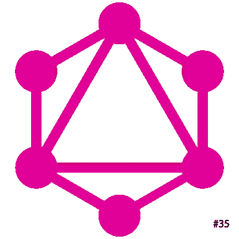
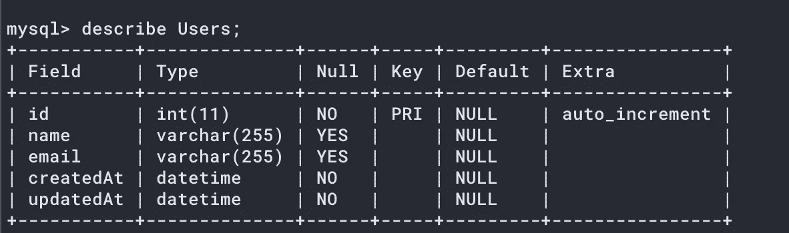
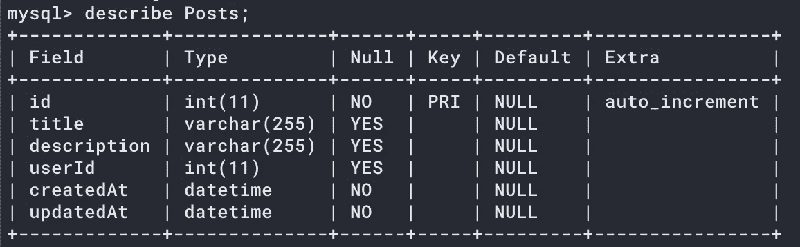
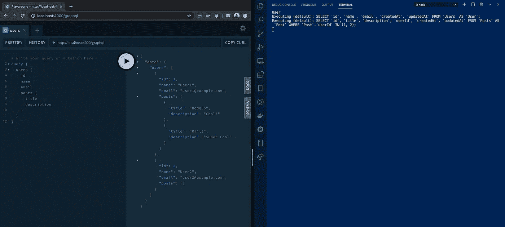
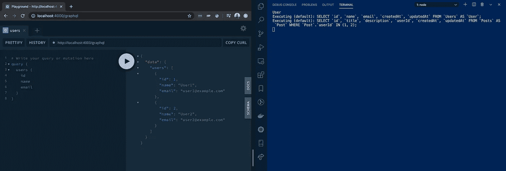
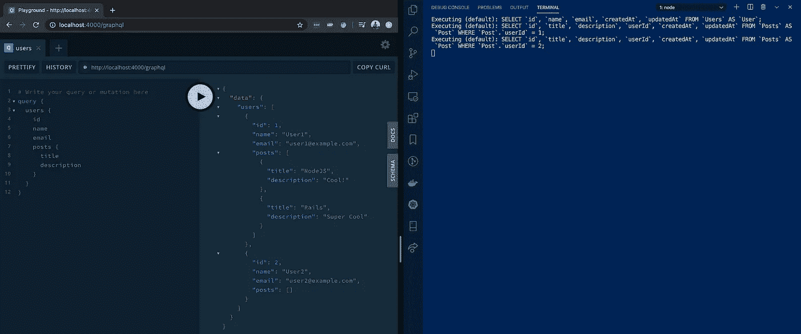
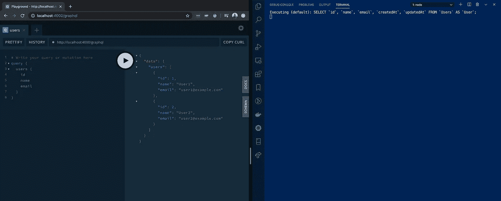

# 不要像 REST 端点一样解析 GraphQL 字段

> 原文：<https://levelup.gitconnected.com/do-not-resolve-your-graphql-fields-like-a-rest-endpoint-ac43242f269>

使用 GraphQL 的优势是巨大的。下面是其中的几个。

1.多个客户端可以使用同一个 API，因为我们可以有条件地从一个 API 查询必要的数据。
2。减少了客户端的数据使用量，因为只从服务器传输所需的数据。
3。后端 API 与使用它的地方没有紧密的联系。

但是从后端角度来看，最重要的优势之一是:

> **后端服务器根据客户端的查询减少处理。**

注意，这不是 GraphQL 现成提供的东西。如果您没有以正确的方式编码，那么无论客户端的查询是什么，后端服务器上的负载都将是相同的。

也就是说，您不应该像编写 REST 端点那样编写代码。

# 方案

让我们看一个由用户和他们的帖子组成的例子。下面是两个表的结构:

用户表

帖子表

假设我需要一个解析器来列出用户及其帖子。我该怎么写这个解析器呢？

> 注意:我将使用 Apollo GraphQL 服务器和 Sequelize 编写一个 NodeJS 应用程序来解释这个问题和解决方案。

# 一种可能的解决方案

您可以按如下方式定义模式:

您的用户的解析器如下所示:

当然，这解决了我们的需求。 ***但是这样有效率吗？***

我们来看看两种情况下的日志。

> 注意:下面截图的左侧(LHS)包含执行的查询及其结果。右侧(RHS)包含在执行 GraphQL 查询时执行的应用程序日志。

## 案例 1 —使用帖子数据查询用户

使用用户的帖子数据查询用户数据

## 案例 2 —查询没有帖子数据的用户

查询没有帖子数据的用户

> **正如您从日志中看到的，获取帖子的查询总是被执行，不管客户端的查询是什么。也就是说，即使客户端不请求发布数据。**

那么我们该如何对此进行优化呢？

# 更好的解决方案

GraphQL 允许我们解析字段中存在的每个字段。这是我们需要做的。

如您所见，我们正在解析`UserType`的字段`posts`(这是由`users`解析器返回的类型)。这允许 GraphQL 服务器仅在客户端明确查询该字段时才解析它。

## 案例 1 —使用帖子数据查询用户

## 案例 2—查询没有帖子数据的用户

# 从日志中可以明显看出，当`posts field` 没有被查询时，获取`posts`的查询也没有被执行。

现在，您可能已经注意到，正在执行多个查询来获取帖子。*也就是说，每个用户有一个 post 查询被触发*。这是我们将在下一篇博客中解决的问题。对于好奇的少数人，这里有一个小提示——你可能需要看看[数据加载器](https://github.com/graphql/dataloader)。

希望这有用。敬请关注下一篇博客！

 [## 编写面试问题

### 一个完整的平台，在这里我会教你找到下一份工作所需的一切，以及…

技术开发](https://skilled.dev)