# Python 工具对实时文档“有用”吗？

> 原文：<https://levelup.gitconnected.com/do-python-tools-cut-the-mustard-for-living-documentation-7303e1a2ff6>

## python 和文档工具的实验


照片由[在](https://unsplash.com/@elevatebeer?utm_source=medium&utm_medium=referral)[的](https://unsplash.com?utm_source=medium&utm_medium=referral)上提升

> 符合要求

只是为了给任何困惑的番茄酱爱好者解释一下这个标题，表达“ [**切芥末**](https://www.dictionary.com/e/cut-the-mustard/) ”的意思是达到要求的标准。

更准确地说，本文描述了一段时间内使用各种工具记录 python 代码并将设计文档注入代码的实验。这种实时同步被称为[实时文档](https://medium.com/geekculture/living-documentation-brief-history-and-evolution-of-the-concept-4492fafb5d7)，旨在遵循 [DRY 原则](https://thevaluable.dev/dry-principle-cost-benefit-example/)(不要重复自己)保持所有文档紧密链接。

由于时间有限，我只介绍了有限的一组工具，但是如果您有任何其他工具建议，请对本文进行评论。

# 工具应该做什么？

根据行进方向，有多种记录方法，向前**或向后**或向后**移动**。

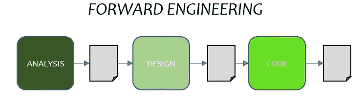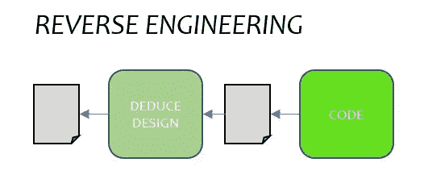

一旦代码被积极地处理，特别是在支持阶段，那么这也增加了

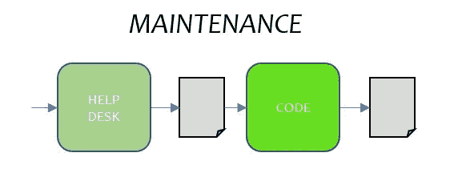

然后是给客户的文档。

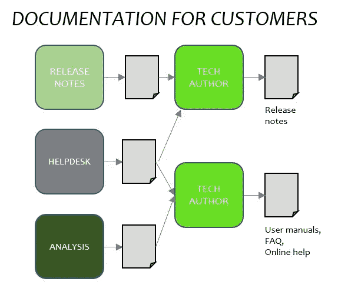

# 前沿工程实验

为设计创建一个简单的流程图，并将其输入到进行代码开发的 IDE 中。

**实验一**

*   目标:使用 mermaid markdown 语法编写一个流程图，并使用**内置的**渲染器插件，通过相关的 python 代码(作为 sidecar 文件)保存在项目文件夹的 markdown 文件中。
*   方法:安装 pycharm，安装 markdown 插件，在设置中启用美人鱼语法支持，写一个简单的流程图

```
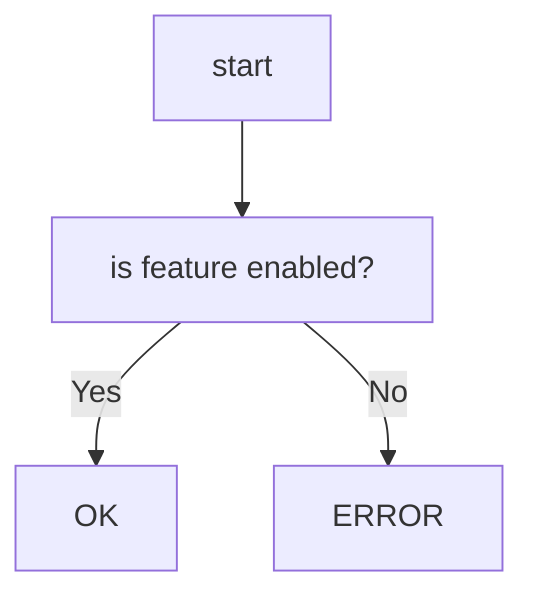
```

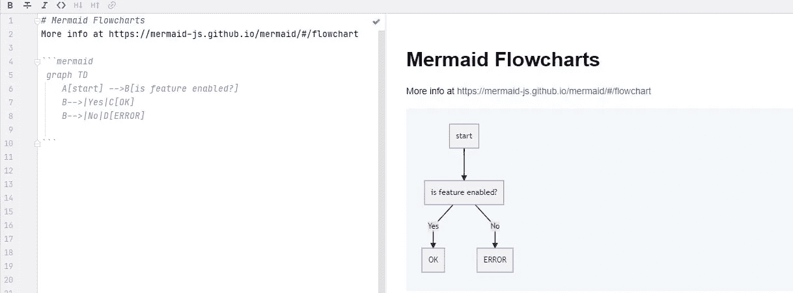

美人鱼降价渲染

*   观察:
    易于设置和使用，在 markdown 中呈现美人鱼语法(。md)文件很好地放入 IDE
    中，如果语法不正确，那么除了基本的错误消息之外，反馈是有限的。

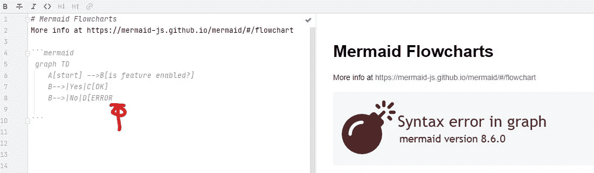

美人鱼降价出错

**实验二**

*   目标:使用 mermaid markdown 语法编写一个流程图，并通过相关的 python 代码(作为 sidecar 文件)保存在项目文件夹的 markdown 文件中，并使用**付费的**渲染器插件。
*   方法:安装 **pycharm** ，禁用内置 markdown 编辑器，下载 markdown navigator 增强版免费试用，重启 IDE，启用 Plantuml 扩展，启用 java chromium embedded，启用 gitlab 美人鱼扩展，显示编辑器&预览。
*   观察:
    易于设置和使用，在 markdown 中呈现美人鱼语法(。md)文件很好地放入 ide 中。
    具有简单的用户界面编辑功能，可编辑带有基本文本格式按钮的降价文本，如粗体、项目符号、表格、链接。
    有多种方式显示渲染图像(隐藏、向右、上方/下方)
*   创建 markdown 的 HTML 输出渲染，plantUML 显示为图像，但 mermaid 没有生成图像，
    如果语法不正确，则只得到一个没有解释的粉红色框。

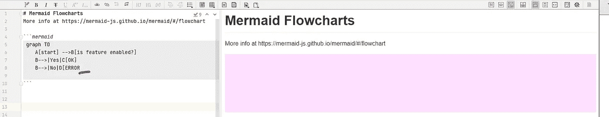

美人鱼降价出错

**实验三**

*   目标:在 markdown 文件中查看 PlantUML 流程图(UML 活动图)
*   方法:
*   观察结果:
*   PlantUML 只能从上到下绘制活动图，它不支持从左到右的图。它确实比美人鱼有更多的选择。
    它具有与基本代码/伪代码相似的外观和感觉，例如支持 if..其他..结构。
    plant UML 语法中的任何错误都有详细解释。

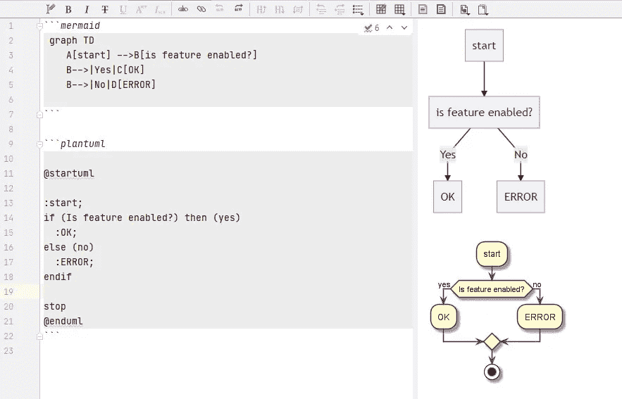

用等效美人鱼图渲染的 Plantuml

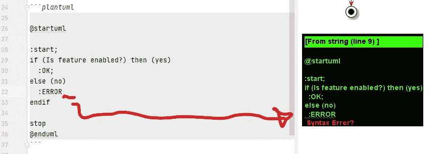

plantuml 语法错误

# 逆向工程实验

**实验四**

*   目标:从简单的 python 源代码创建一个流程图(作为图像)
*   方法:使用 pip 下载 py workflow，运行代码以 pase 文件并生成 DSL 输出，将 DSL 转换为渲染图像(使用[http://flowchart.js.org/](http://flowchart.js.org/)
*   观察:

```
python -m pyflowchart flowchart.py
```

产生以下输出

```
op1980837339976=>operation: '\n*multi line comment*\n\n```mermaid\n graph TD\n    A[start] -->B[is feature enabled?]\n    B-->|Yes|C[OK]\n    B-->|No|D[ERROR]\n```\n\n'
st1980837340552=>start: start start
io1980837340808=>inputoutput: input:
e1980837341384=>end: end function returnop1980837339976->st1980837340552
st1980837340552->io1980837340808
io1980837340808->e1980837341384
```

然后进入[http://flowchart.js.org/](http://flowchart.js.org/)渲染成图像

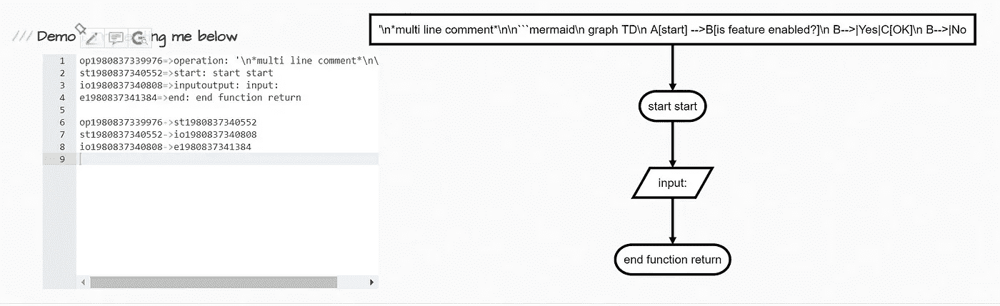

*   观察:
    直接从命令行安装和运行，然后必须将输出输入到另一个工具以转换成图像，最终的图像不是 python 代码的一个很好的表示。

**实验五**

*   目的:使用 **pycallgraph** 绘制一个测试程序。
*   方法:pip 安装 **pycallchart** ，添加代码调用测试程序，运行程序，查看生成的 png 文件

```
pip install pycallgraph
```

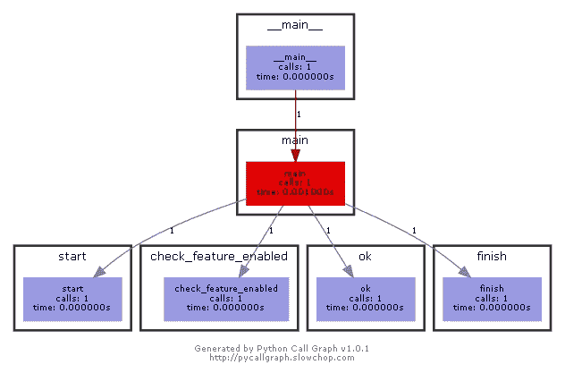

*   观察:生成一个调用树，该树也有关于动态执行的信息(每个函数的时间和调用次数)，直接在一个文件中创建一个渲染图像
    不显示在该特定运行中没有执行的任何代码。

**类图**

**实验六**

*   Aim:查看一个基本 python 文件的类图。
*   方法:下载 **pynsource** for windows，运行安装程序，打开应用程序，导入 python 源文件，查看图表
*   观察:
    免费社区版本似乎没有将图像导出为文件的能力。

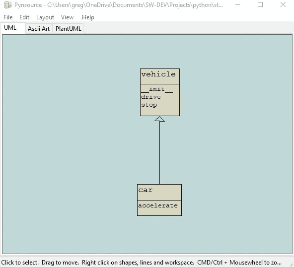

**实验七**

*   Aim:查看一个基本 python 文件的类图。
*   方法:安装 **pylint** (其中包含 **pyreverse** )，运行 **pyreverse**

```
pip install pylint
```

运行命令来解析文件 vehicle.py 并创建 png 输出文件

```
pyreverse -A -f ALL -m y -o png vehicle
```

*   观察:
    易于安装，在没有任何参数的情况下执行命令时提供清晰的帮助信息。

工具产生的文件 classes.png

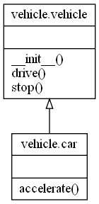

# 最后的想法

有一些软件模块能够生成能够增加价值的图表，使用其中一个创建的图表来总结这里测试的工具似乎是合适的:


然而，尽管这篇文章展示了设置工具的一些潜力和简单性，但它需要更多来创建一个真正的**活文档**的完整工具链。

就像**芥末**称赞热狗做一顿饭一样，在这种情况下，它需要更多的工具、经验和努力来创建一个自动化管道。

# 工具列表

**流程图**

*   [**py charm**](https://www.jetbrains.com/pycharm/)—Python 开发的 IDE
*   **pycharm markdown 插件** — [Markdown —智能插件| JetBrains](https://plugins.jetbrains.com/plugin/7793-markdown)
*   **pycharm markdown navigator 增强版** d 插件(免费试用)——[Markdown Navigator 增强版——IntelliJ IDEs | JetBrains](https://plugins.jetbrains.com/plugin/7896-markdown-navigator-enhanced)
*   **py 流程图**—[https://pypi.org/project/pyflowchart/](https://pypi.org/project/pyflowchart/)解析静态 Python 代码，创建一个结构化的文本文件，该文件可以渲染成显示代码流程的图表。

**通话图表**

*   **pycallcallgraph**—[https://pycallgraph.readthedocs.io/en/master/index.html#](https://pycallgraph.readthedocs.io/en/master/index.html#)—追踪 python 软件的动态执行，生成调用树。

**类图**

*   **pyn source**—【https://github.com/abulka/pynsource】T42—解析静态 python 代码以生成 UML 类图，参见 [gituml](https://gituml.com/) 中的操作
*   https://www.pylint.org/为 graphviz/dot 生成 UML 类图。
*   【gravizo.com】gravi zio—[您的自述文件 Graphviz、UMLGraph 或 PlantUML](http://gravizo.com/)

# 标准和参考文献列表

*   **降价文件的降价语法**—[https://www.markdownguide.org/basic-syntax/](https://www.markdownguide.org/basic-syntax/)
*   **降价文件的美人鱼语法**—[https://mermaid-js.github.io/mermaid/#/](https://mermaid-js.github.io/mermaid/#/)
*   **pycharm 美人鱼降价支持**——[https://www.jetbrains.com/help/idea/markdown.html](https://www.jetbrains.com/help/idea/markdown.html)
*   **plantUML 语法【https://plantuml.com/】——[T21](https://plantuml.com/)**

# 进一步阅读

[](https://medium.com/geekculture/living-documentation-brief-history-and-evolution-of-the-concept-4492fafb5d7) [## 活文档——概念的简史和演变

### 第一部分

medium.com](https://medium.com/geekculture/living-documentation-brief-history-and-evolution-of-the-concept-4492fafb5d7) [](https://medium.com/geekculture/code-as-diagrams-whats-the-point-13dbe6053738) [## 以图表形式编码——有什么意义？

### 活文档—第 3 部分

medium.com](https://medium.com/geekculture/code-as-diagrams-whats-the-point-13dbe6053738) [](https://medium.com/outsource-dev/book-review-living-documentation-c06bc2248a9) [## 书评——生活文档

### 一本由 Cyrille Martraire 设计的关于持续知识共享的书

medium.com](https://medium.com/outsource-dev/book-review-living-documentation-c06bc2248a9) 

# 关于作者的更多信息

**Greg** 是一名经验丰富的软件专业人士，也是[**outsource . dev**](https://outsource.dev/)**，**的首席技术官，他曾在多家公司工作过，现在热衷于帮助他人在软件开发、管理和外包方面取得成功。

如果你喜欢这篇文章，请鼓掌👏和**跟着**我。