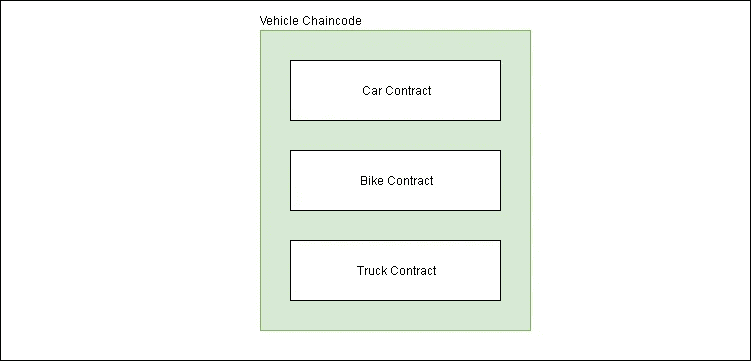

# 智能合同和链码在 Hyperledger 结构中相同吗？

> 原文：<https://levelup.gitconnected.com/do-smart-contract-and-chaincode-are-same-in-hyperledger-fabric-1b4c3034d593>

Hyperledger Fabric 用户通常会互换使用智能合同和链码这两个术语。让我们首先了解什么是智能合同:

> 智能合同是一种计算机协议，旨在以数字方式促进、验证或执行合同的协商或履行。智能合约允许在没有第三方的情况下进行可信的交易。这些交易是可追踪和不可逆转的。— [维基百科](https://en.wikipedia.org/wiki/Smart_contract)

让我们用简单的语言来推导这一点——如果合同满足合同条款，没有任何第三方的干涉，它就可以自行执行。

在 Hyperledger 结构中:

> 智能协定定义了控制世界状态中包含的业务对象的生命周期的事务逻辑。

太技术化？我们来简化一下。让我们以一辆车主是爱丽丝的汽车为例。对象是汽车，它保存在世界状态中。

> 世界状态存储任何对象的最新状态，而区块链存储对象从创建到当前状态的所有历史。

*   现在，爱丽丝想把这辆车卖给鲍勃。
*   Alice 将启动一个交易提议，将所有权从她更改为 Bob。
*   智能契约将根据事务逻辑改变世界状态中汽车的所有权。

在 Fabric 中，智能合同被打包到链码中，然后链码被部署到区块链网络。为了便于理解，您可以将 chaincode 视为智能合约的超集。

同一个链码内可以定义多个智能合约。

车辆可以有一个链码，并且可以有多个智能合同，如汽车合同、自行车合同和卡车合同。

draw.io

在区块链网络上部署每个链码时，每个链码都有一个关联的认可策略。该认可策略将应用于其中定义的所有智能合同。

> 背书政策是定义哪些组织必须签署交易以声明交易有效的指导方针。

简而言之，智能合约管理事务逻辑或业务逻辑，而 chaincode 管理其中定义的智能合约。

在 Fabric 文档中，chaincode 的定义会因受众而有所不同。

在“关键概念”中，定义精确而简短。初学者的理想选择。根据关键概念，chaincode 是一个根据其中编写的业务逻辑工作的程序。

对于开发人员来说，链码通常由管理员用来对相关的智能合约进行分组以进行部署，但也可用于 Fabric 的低级系统编程。

如需更深入了解面料概念，请继续阅读。

**参考文献:**

 [## 智能合同和链码- hyperledger-fabricdocs 主文档

### 从应用程序开发人员的角度来看，智能合同与分类帐一起构成了一个应用程序的核心

hyperledger-fabric . readthedocs . io](https://hyperledger-fabric.readthedocs.io/en/release-1.4/smartcontract/smartcontract.html)  [## 链码教程- hyperledger-fabricdocs 主文档

### 链码通常处理网络成员同意的业务逻辑，因此它可以被认为是“智能的……

hyperledger-fabric . readthedocs . io](https://hyperledger-fabric.readthedocs.io/en/release-1.4/chaincode.html)  [## 开发人员链码- hyperledger-fabricdocs 主文档

### 其方法被调用以响应接收的事务。特别是当一个链码…

hyperledger-fabric . readthedocs . io](https://hyperledger-fabric.readthedocs.io/en/release-1.4/chaincode4ade.html)