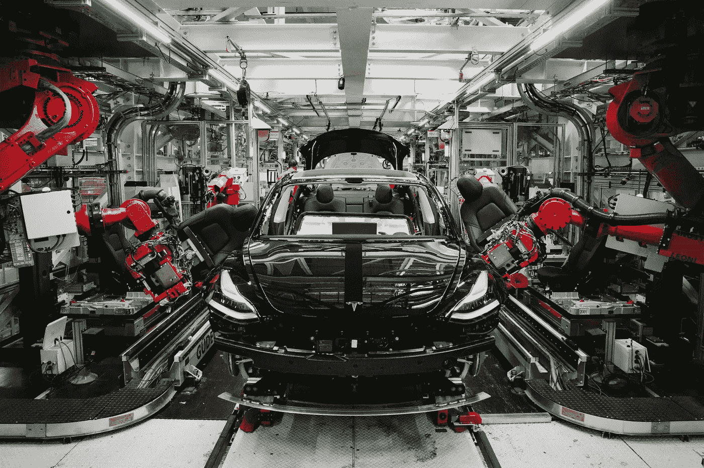

# 2022 年我们还需要 QA 工程师吗？(#11)

> 原文：<https://levelup.gitconnected.com/do-we-still-need-qa-engineers-in-2022-11-7f86b871bab6>

特斯拉 Model 3 由机器人在特斯拉巨型工厂组装

距离我上一篇博客已经过去一年多了，因此，我 2022 年的新年决心之一就是重新开始写作，所以期待更多的东西:)

我决定从一个困扰我一段时间的话题开始，但是，这是你进来的地方，有你想要我写的话题吗？请在下面评论或者 ping 我！

**因为我很重视你的时间，我意识到我用了一个点击诱饵作为标题，所以我先给你一个底线。2022 年我们还需要 QA 工程师吗？我相信答案是否定的，至少不是我们大多数人认为 QA 工程师做什么的方式。迷茫？让我解释一下。**

# 质量很重要

不管你开发的是什么类型的应用，是网络应用还是移动应用，或者两者都是。质量可能是你应该提供给用户的最重要的东西。

质量意味着没有错误，没有性能问题，没有 UI 故障，伟大的 UX 等等。这一点非常重要，因为如果质量不好，用户可能会生气，甚至可能会对你的产品失去信任，这可能会导致寻找替代品，这是一种耻辱。

毫无疑问，我相信我们应该尽我们所能为我们的产品达到最好的质量。也就是说，我相信这样做有好的方法和坏的方法。

# 手工测试已经死了

信不信由你，一些科技公司仍然手动测试他们的产品。这种方法过时、容易出错、不可扩展、缓慢且昂贵。这不仅是一个提高质量的坏方法，它也减慢了你的整个开发周期，这可能是对你的产品最糟糕的事情，更重要的是，对你的用户。

# 自动化是王道

我很高兴地说，我们已经到了一个点，特别是在 2022 年，我们有这么多自动化测试的好选择。我们现在可以轻松地实现单元测试、集成测试、UI 测试以及最后但同样重要的模拟用户活动的流程测试(也称为 E2E 或端到端测试)。

此外，我们有很好的方法来监控流量和错误，使我们能够在问题或错误变得严重之前就捕捉到它们。我们还有很棒的技术，比如使用功能标志来打开/关闭功能，这可能是我最喜欢的技术，能够向一组用户或一定比例的用户推出特定的功能，而不是一次性向所有用户推出。

如果你把所有这些选项结合在一起，你会得到一个非常棒的方法来为你的用户提供高质量的产品。

**你不仅会获得一个更可扩展、更可靠、更快速的测试产品的方法，你的开发周期也会加快。这将允许您更频繁地部署变更，您的用户将会高度赞赏。**

# 连续交货

大概软件开发的圣杯就是实现持续交付。这种技术仅仅意味着任何代码的修改，一个 bug 的修复或者一个新的特性，一旦被完全测试和批准，就被部署到产品中。

这种技术将允许您停止管理版本，设置代码冻结，最重要的是，一次更频繁地部署更少的更改。避免偶尔进行一次有大量风险的变更的部署。

如果你想了解更多关于持续交付的知识，可以看看我去年在一次聚会上的演讲，我应该说是希伯来语的。

# 让我们弄清楚一些事情

我并不是说我们不再需要 QA 工程师了，只是测试应该更加自动化，这意味着 QA 工程师应该编写代码。

这样做会缩小 QA 工程师和软件工程师之间的差距。更重要的是，我相信在一个理想的世界里，所有的软件工程师都应该参与编写代码和测试代码，从我的经验来看，这真的很有用。

**祝你在 2022 年度过美好的一年，这一年没有 Covid，也没有任何形式的人工测试！**

# 想要更多吗？

*   [获得你的第一份软件工程师工作可能很难，但并非不可能(#10)](https://nirpeled.medium.com/landing-your-first-software-engineer-job-can-be-hard-but-not-impossible-10-44cd6ed48cb0)
*   [如何在 2020 年提升你的软件工程师职业(#9)](https://nirpeled.medium.com/how-to-boost-your-career-as-a-software-engineer-in-2020-701b7016c5ec)
*   [什么时候是重构代码的最佳时机？(#8)](https://theblog.workey.co/when-is-the-best-time-to-refactor-your-code-32be104701dd)

***有什么问题或意见吗？平我上***[***LinkedIn***](https://www.linkedin.com/in/nirpeled/)***或者下面评论。如果你喜欢这篇文章，请鼓掌并分享给你所有的朋友和家人。***