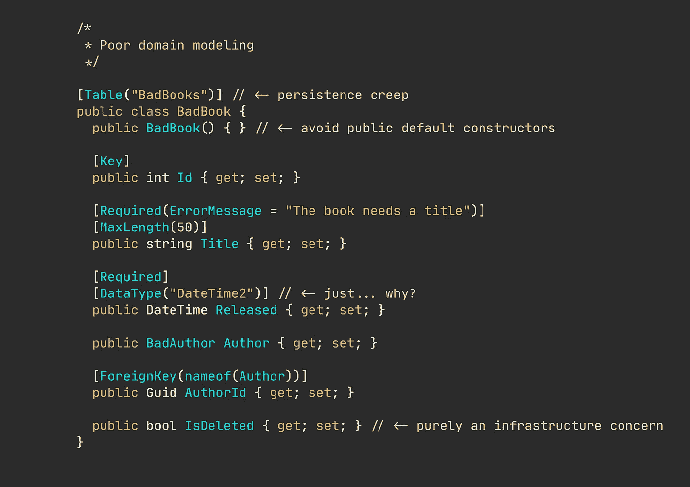

# 您是否考虑将您的域从您的持久性逻辑中分离出来？

> 原文：<https://levelup.gitconnected.com/do-you-consider-separating-your-domain-from-your-persistence-logic-5db3e3dae917>

## 固执己见的观点(简式)

## 干净的领域模型是持久性不可知的。

建模不良的领域类

我假设大多数开发人员通过对象关系映射(ORM)技术与他们的数据库进行交互。如今，作为应用程序开发人员，您很少编写原始 SQL。

这带来了一系列全新的问题。

混合关注通常会导致软件开发中的坏事情。我发现将您的领域模型与您的持久性逻辑结合起来是最糟糕的混合关注类型之一。

> 你不应该为了取悦外部框架而牺牲你的领域设计。

这种做法有[多重不利影响](/is-your-database-bullying-you-bc0b2d587be6)。你不仅在你的领域项目中需要不必要的库依赖，而且你突然告诉你的领域*数据是如何存储的。灵活性也消失了。将您的模型与持久性逻辑紧密耦合，例如 ORM 关注点，可能需要您放松域不变检查，因为 ORM 通常需要某些模式或访问修饰符。*

🔔[想要更多这样的文章吗？在这里签名。](https://nmillard.medium.com/subscribe)

## 归结起来就是两件事…

你有多了解你的工具，你愿意付出多大的努力来将你的领域从持久性中分离出来。

我不想撒谎，学习如何正确使用你选择的表单确实需要一些努力，而且简单地创建没有什么逻辑的愚蠢的贫血模型*要容易得多，所有的属性/字段都是 setters 公开的。*

这是一条危险的道路。您允许无效状态的存在和持续——几乎不可能解释什么是有效的，对于加入您团队的新开发人员来说更是如此。

了解您可以使用的工具。了解来龙去脉，缺点，以及如何解决这些问题。如果您的工具提供了这个选项，那么就利用 fluent 配置——最重要的是，让持久性(基础设施)问题远离您的领域模型。

## 您是否考虑过专门的基础设施模型？

有时候太难了，你的 ORM 不想打球。正是在这个时候，许多开发人员的士气崩溃，他们屈服于持久性蠕变。我去过那里。很多很多次。

如果你愿意，可以称之为“务实”。但是为了取悦外部框架而牺牲自己的领域是不现实的。

最近，我在创建专门的基础设施模型方面取得了很多成功。这些只能在基础设施项目中访问。例如，您将拥有一个存储库，该存储库获取并合并基础架构模型，然后映射并返回域模型。

因此，您的领域完全是持久性不可知的，并且只知道它自己的模型。

# 临别赠言…

不要仅仅为了更容易地使用数据库或 ORM 而损害您的域。首先，深入学习您的工具，并使用它提供的任何模型配置(如果有的话)——并且，尝试选择不同的途径，比如直接映射到域模型的特定于基础设施的模型。

# 让我们保持联系！

[在这里注册我的简讯](https://nmillard.medium.com/subscribe)并查看新的 YouTube 频道[*(@尼可拉斯·米勒德)*](https://www.youtube.com/channel/UCaUy83EAkVdXsZjF3xGSvMw)

*连接上* [*LinkedIn*](https://www.linkedin.com/in/nicklasmillard/)

# 好奇者的资源

*   [由 Vladimir Khorikov 在 ORM](https://enterprisecraftsmanship.com/posts/separation-of-concerns-in-orm/) 中分离关注点
*   [你的数据库/ORM 是不是也让你做傻事？尼古拉斯·米勒德](/is-your-database-bullying-you-bc0b2d587be6)