# 你了解 Visual Studio 代码中的标尺吗？

> 原文：<https://levelup.gitconnected.com/do-you-know-about-rulers-in-visual-studio-code-f754b221a135>

## 作为编码时的指导，它们非常有用

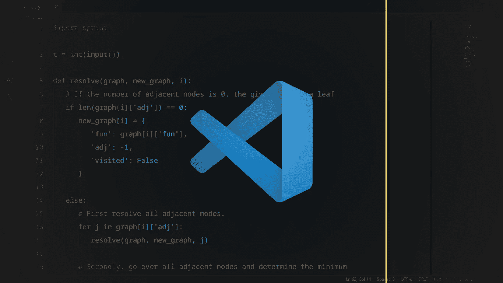

Visual Studio Code 是最好的自由编码编辑器之一。

它可以通过很多很多方式进行配置。(*这种强调非常必要)。*

我们可以改变编辑器的颜色主题，其中的图标集，字体，字体大小，行高；使用给定的操作配置键绑定；设置各种任务；还有更多。

Visual Studio 代码中有如此多的*可配置内容，以至于我们可以轻松地写一篇超过 10，000 字的文章，只需*稍微*解释其中的一些内容；更不用说每种配置的详细解释了。*

在本文中，我们将了解 Visual Studio 代码编辑器的一个非常有用的特性— ***标尺*** 。

# 什么是尺子？

简单来说:

> 标尺只是一个视觉向导，帮助我们在触及一行代码的字符限制时确定正确的位置。

那太多了，不是吗？

让我们一步一步来…

标尺是一个 ***视觉向导*** ，即它实际上是在编辑器窗口中可视化显示的，它帮助我们确定*的‘某样东西’。*

当我们触及一行代码的字符限制时，就会出现“某事”。

假设我们正在编写一长串超过 100 个字符的代码。如果我们将标尺放在第 60 个字符的位置，那么它可以帮助我们在输入该行时准确地看到何时达到了 60 个字符的限制。

这就是为什么我们说尺子是一把 ***指南*** 。

编写代码时，标尺非常有用。很多时候，在编码的时候，我们倾向于输入某些行，这些行会一直持续下去。

有一个标尺意味着我们可以准确地注意到何时达到了该行的最大字符限制，从而在新的一行上键入后续的代码。

总的来说，这保持了代码的整洁和可读性。

# 如何添加尺子？

在 Visual Studio 代码中添加标尺极其简单。

简而言之，我们只需转到当前工作区或当前用户的 **settings.json** 文件，在那里添加属性`**"editor.rulers"**`，然后将其设置为整数的**数组，每个整数指定一个**标尺位置**。**

具体地说，我们应该这样做。

## 第一步。打开 settings.json 文件

打开 Visual Studio 代码，然后单击左下角的设置图标，如下图所示:

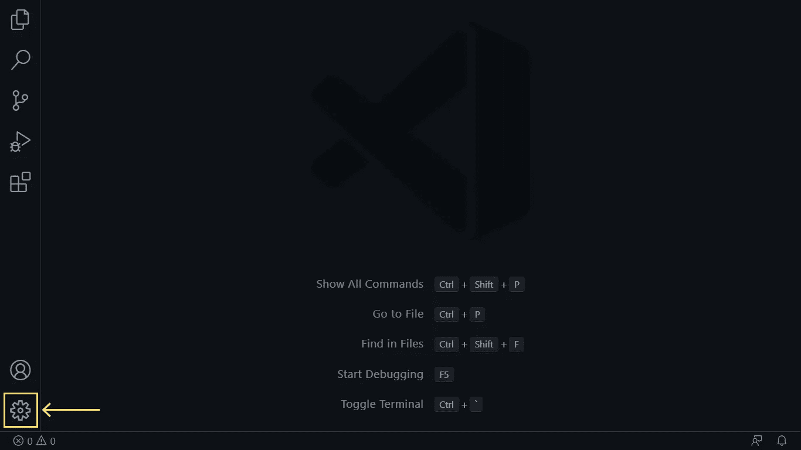

从随后出现的对话框中选择**设置**选项，如下图所示:

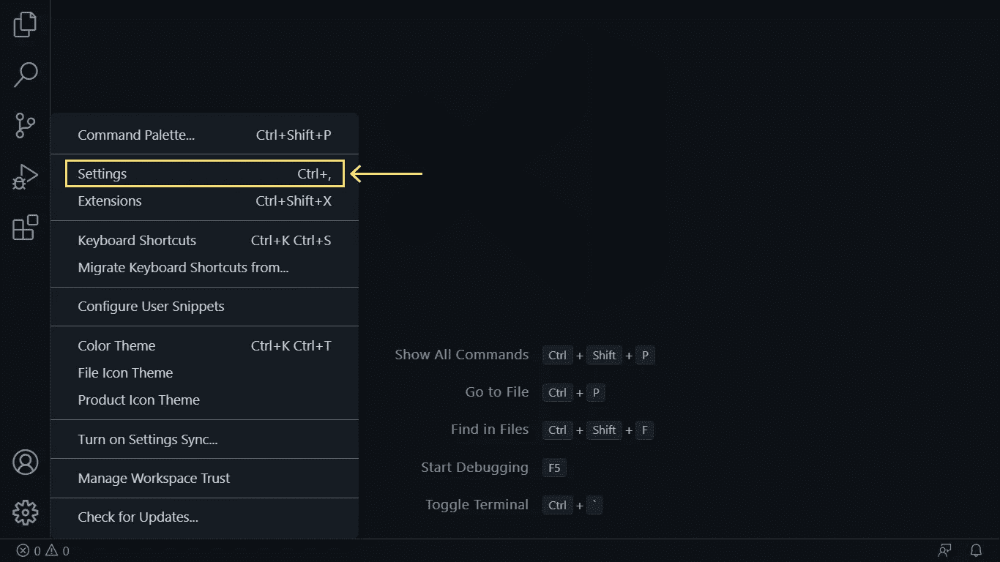

这将打开一个类似如下的窗口:

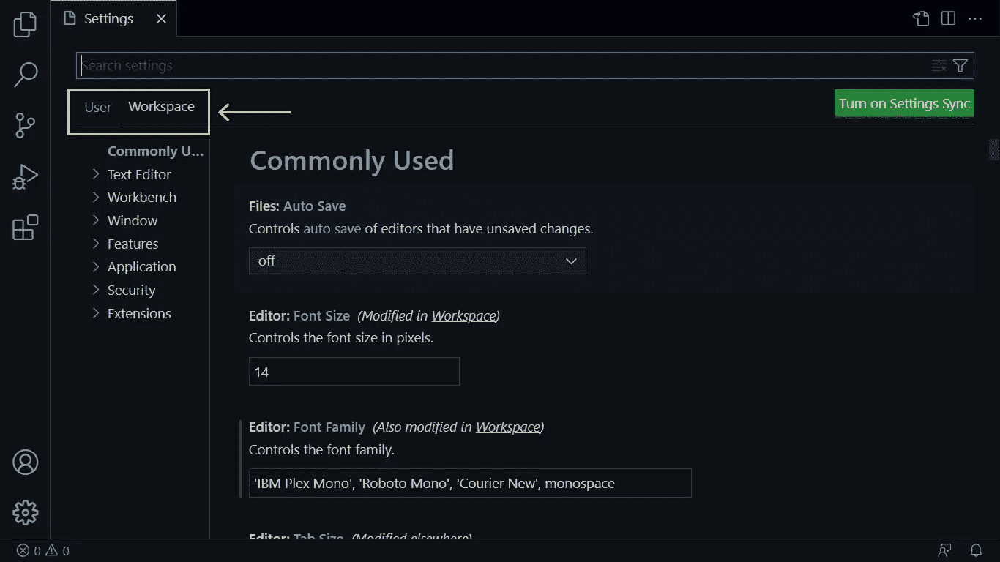

在该窗口的左上角，如上图所示，有两个选项，分别是**用户**和**工作区**。

*   **用户**在当前的 Visual Studio 代码安装中应用给定的设置。您可以将**用户**视为*全局*设置。
*   **工作空间**将给定设置仅应用于当前*工作空间*。一个*工作空间*仅仅是一个文件夹，我们在 Visual Studio 代码中打开它作为一个给定项目的入口点。如果我们在 Visual Studio 代码中打开不同的文件夹，我们实际上打开了不同的工作区。

如果您保持选择 **User** 选项卡，您将在 Visual Studio 代码安装中的所有工作区中应用标尺。

另一方面，如果您保持选择**工作区**选项卡，您将只对当前工作区应用标尺。

我们将应用标尺，同时保持选择**用户**标签(如上所示，在**用户**下面有一条线表示它被选择)，因为我们希望在 Visual Studio 代码中编辑的每个代码文件中都有这些有用的指南。

现在当**用户**标签被选中时，我们将通过点击窗口右上角的小文件图标打开其对应的 **settings.json** 文件，如下图所示:

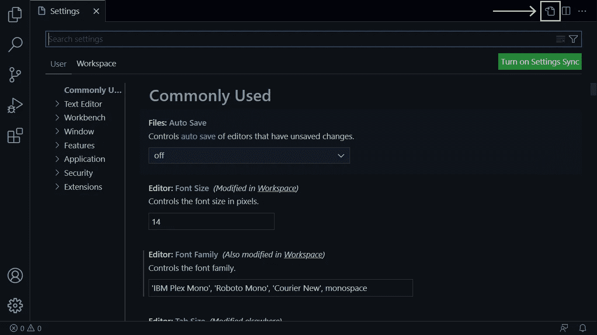

这将打开当前**用户**设置的 **settings.json** 文件，如下所示:

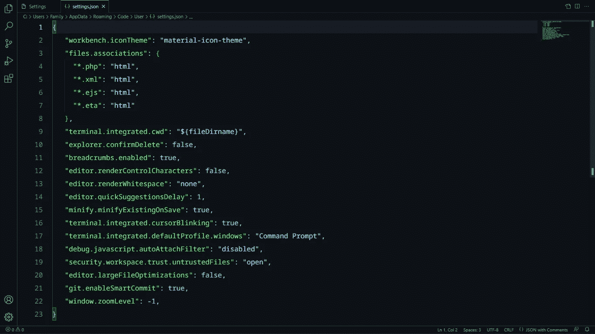

根据您的设置，该文件中可能已经有一些代码。我们在 **settings.json** 文件中也有一些代码可以开始使用(因为我们之前做了一些配置)。

文件 **settings.json** 中是否已经有一些代码不应该与我们有关。我们只对在文件中添加一个新设置感兴趣，以便设置一个标尺。

## 第二步。添加“editor.rulers”属性

下一步是向我们在上一步中打开的 JSON 文件添加一个`**editor.rulers**`属性。

`editor.rulers`简单地保存一个包含整数的数组，每个整数代表一个标尺在编辑器中的位置。这就是为什么它被称为*编辑器.统治者*！

位置是根据从给定行开始的字符数来确定的。位置也可以被认为是列号。

也就是说，整数`60`意味着标尺将正好出现在编辑器中的 60 个字符之后，或者出现在第 60 列的右边。

> 注意，这里我们假设您知道如何使用 JSON，或者一般来说，知道如何使用 JavaScript 对象文字。

继续到代码的末尾，就在右大括号结束字符(`}`)之前，添加`editor.rulers`属性，将其值设置为一个空数组。

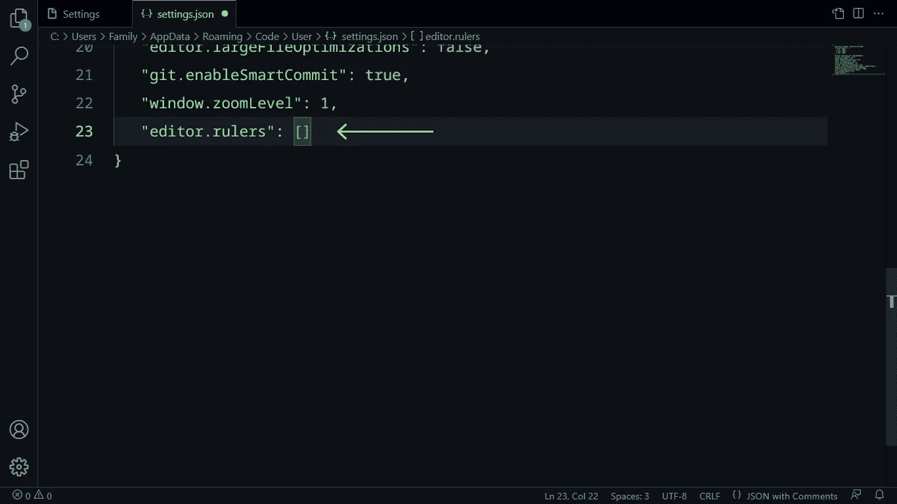

之后，根据您需要多少个标尺，向数组中添加整数，每个整数代表编辑器中一个标尺的位置。

我们将只添加一个标尺，它将位于`80`的位置，如下图所示:

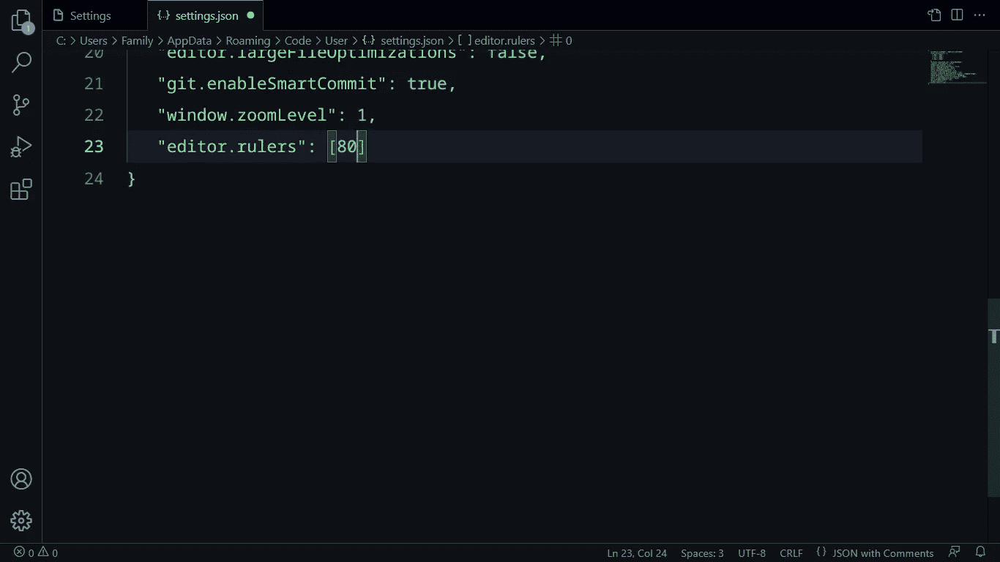

现在你可能会想，为什么是 80 后？

在编码领域，对于一段代码中的单行字符来说，80 个字符是一个非常传统的限制。

*就这样。*

一旦你输入了值`80`，继续保存 **settings.json** 文件。

现在，在新的选项卡中，打开一个新的代码文件。

> 打开新代码文件的一个快速方法是双击编辑器窗口顶部，就在表示当前选项卡的框旁边。

## 第三步。庆祝

瞧吧！

现在，您可以看到刚刚在上面添加的标尺:

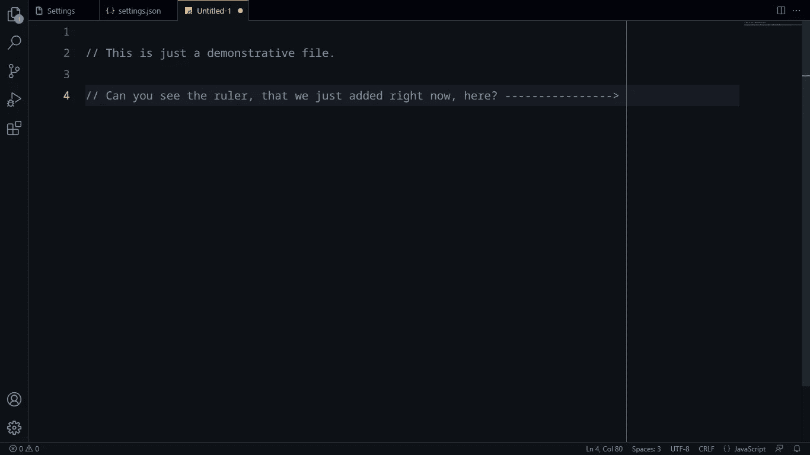

# 更改标尺的颜色

我们上面说过`editor.rulers`是一个整数数组。准确地说，这是错误的。

更好的说法是`editor.rulers`是一个由*项*组成的数组，这些项可以是以下任一项:

*   一个**整数**，表示应该添加标尺的位置。
*   一个**对象**，包含两个属性，即`column`和`color`，分别代表应该添加标尺的位置及其颜色。

在下面的代码中，我们向前面的`editor.rulers`属性添加了另一个标尺，这次使用的是对象而不是整数。

位置设置为`90`，而颜色设置为`#ffcc00`(亮黄色)。

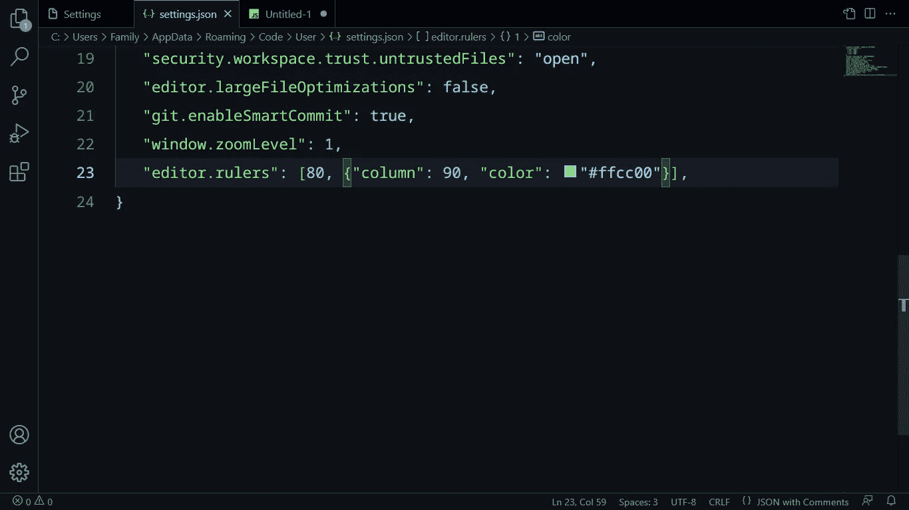

让我们保存文件，然后见证我们的新统治者。

> **注意:**通常，对设置的更改不会立即显示在当前的 Visual Studio 代码窗口中。您必须重新启动 Visual Studio 代码才能应用这些更改。

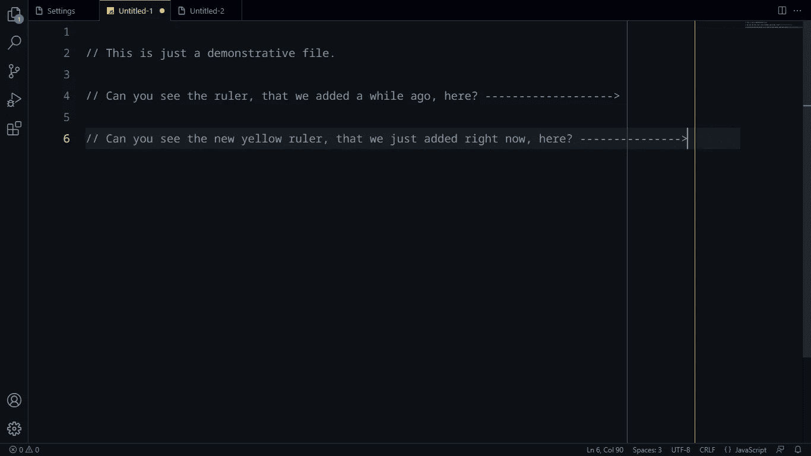

# 好了

最后，我们想问一个简单的问题？

在这篇文章之前，你知道 Visual Studio 代码中的标尺吗？你曾经使用过它们吗？

`if (yes) { console.log('Good 👍') }`

`else { wouldYouNowUseThem('❔') }`

我希望你喜欢阅读这篇文章。

# 更多我们的文章

 [## 你必须知道的 7 大计算机技术书籍出版商

### 以及如何从其中一本开始。

levelup.gitconnected.com](/top-7-publishers-of-books-on-computer-technologies-that-you-must-know-b36d51e29bc1)  [## 到底什么是 SPA(单页应用程序)以及如何自己构建一个？

### 过去，当万维网在其领域还是一项新技术时，很少有人会想到在未来…

levelup.gitconnected.com](/what-exactly-is-a-spa-single-page-application-and-how-to-build-one-yourself-dad2ca24d0d8)  [## JavaScript 字符串到底是什么？8 位单位序列还是 16 位单位序列？

### 几乎每次编写 JavaScript 代码时，我们都会用到字符串。知道如何与…

levelup.gitconnected.com](/what-exactly-are-javascript-strings-sequences-of-8-bit-units-or-16-bit-units-b731b74c78c0) 

# 分级编码

感谢您成为我们社区的一员！在你离开之前:

*   👏为故事鼓掌，跟着作者走👉
*   📰查看[级编码出版物](https://levelup.gitconnected.com/?utm_source=pub&utm_medium=post)中的更多内容
*   🔔关注我们:[推特](https://twitter.com/gitconnected) | [LinkedIn](https://www.linkedin.com/company/gitconnected) | [时事通讯](https://newsletter.levelup.dev)

🚀👉 [**加入升级人才集体，找到一份惊艳的工作**](https://jobs.levelup.dev/talent/welcome?referral=true)