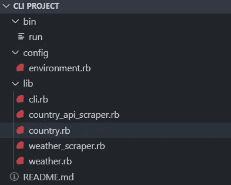
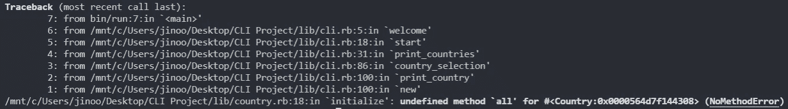
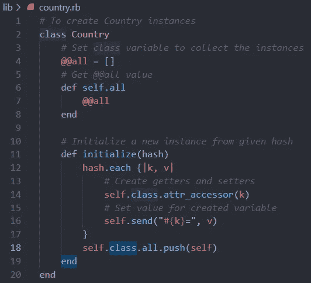
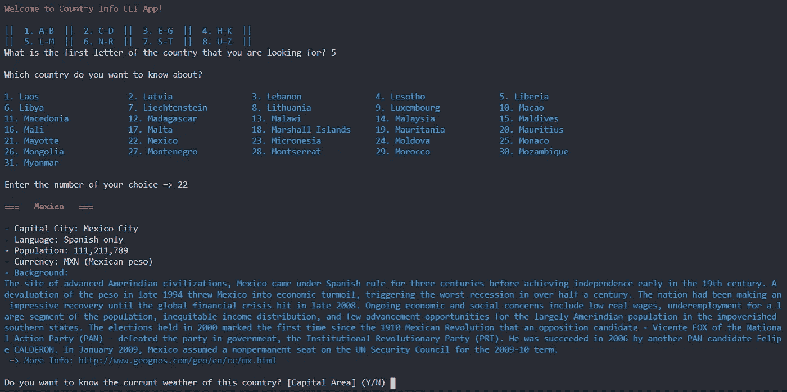
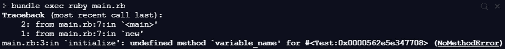
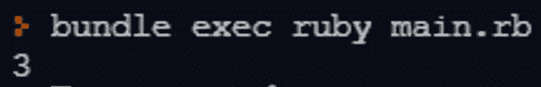

# 你了解你自己吗？

> 原文：<https://levelup.gitconnected.com/do-you-know-your-self-c6d47a43c1e4>


安妮·斯普拉特在 [Unsplash](https://unsplash.com/s/photos/yourself?utm_source=unsplash&utm_medium=referral&utm_content=creditCopyText) 上拍摄的照片

很难很好地了解你的`self`，不仅仅是哲学，编程也是如此。我在做我的 Ruby CLI 应用程序项目时发现它是真实的。事情是这样发生的。

我的应用程序是用户选择的任何国家的简单介绍者。为了实现这个目标，我有两个模型类和两个刮刀类:



2 个模型类别的 country.rb 和 weather.rb 个刮刀类别的 country_api_scraper.rb 和 weather_scrape.rb

从 API 数据加上抓取数据，我的`Country`类获得国家信息来创建实例。为了不从 API 获得相同的数据并重复抓取，我想将任何新的`Country`实例保存到一个名为`@@all`的类变量中。以下是我首先做的:

```
 1| class Country
 2|   @@all = [] # Set class variable to collect the instances
 3|   def self.all # Get @@all value
 4|     @@all
 5|   end
 6| 
 7|   def initialize(hash) # Initialize a new instance from hash
 8|     hash.each {|k, v|
 9|       self.class.attr_accessor(k) # Create getters and setters
10|       self.send("#{k}=", v) # Set value for created variable
11|     }
12|     self.all.push(self)
13|   end
14| end
```

但是，这会引发一个错误:



未定义的方法“all”！！！

发现问题了吗？答案在第 12 行:`self.all.push(self)`。嗯……为什么呢？因为我忘了我的`self`是什么。

每当你想使用`self`时，你必须考虑你的`self`在它的上下文中是什么。在我的例子中，我的`self`的直接上下文是初始化方法`#initialize`。

然后，你要决定`#initialize`是什么样的方法。是*类方法*还是*实例方法*？实例方法！！！所以，这里的`self`是新创建的`Country`类的实例。如您所见，没有名为`#all`的实例方法，尽管有一个类方法`#all`，一个类变量`@@all`的 getter。这就是电脑无法理解`self.all`的原因。

要解决这个问题，您需要从这个类的实例中访问类变量`@@all`，即`self`。怎么做呢？`self.class`会给你一个返回值`Country`。现在，在这个类级别，你可以使用类方法`#all`。耶！下面是结果:



谢谢你，Annabel~^^~



太好了！墨西哥的货币是比索。

它完美地工作。每当您访问同一个国家时，应用程序都会查看`@@all`数组，以确定是否已经创建了特定的`Country`实例，完全没有问题。

关于在类中获取实例变量的一个小技巧。有两种方法可以获得实例变量值:1)直接访问变量`@variable_name`，2)对变量`self.variable_name`使用 getter(=reader)方法。这两种方法的区别在于，第二种方法需要在类中使用一个名为`#variable_name`的 getter 方法(当然，这是一个实例方法)。让我们看看这个例子。

```
1| class Test
2|   def initialize(value)
3|     @variable_name = value
4|     puts self.variable_name
5|   end
6| end
```



未定义的方法“variable_name ”,这意味着实例变量没有 getter 方法

上面的代码不能工作，因为还没有名为`#variable_name`的 getter。尽管`Test`类的新实例有一个实例变量`@variable_name`，但是没有 getter 方法。所以，下一个代码块将解决这个问题。

```
### By creating a getter method ###
 1| class Test
 2|   def initialize(value)
 3|     [@variable_name](http://twitter.com/variable_name) = value
 4|     puts self.variable_name
 5|   end
 6|
 7|   def variable_name
 8|     [@variable_name](http://twitter.com/variable_name)
 9|   end
10| end
```

或者，

```
### By using attr_reader ###
1| class Test
2|   attr_reader :variable_name
3|   def initialize(value)
4|     [@variable_name](http://twitter.com/variable_name) = value
5|     puts self.variable_name
6|   end
7| end
```

或者，你可以直接访问变量:

```
1| class Test
2|   def initialize(value)
3|     @variable_name = value
4|     puts @variable_name
5|   end
6| end
```

要测试所有 3 个代码块，您可以键入`Test.new(3)` ( `3`作为一个随机值)，并运行您的 ruby 文件:



完全没问题。他们都将成功地推出预期的结果，`3`。

总之，`self`在任何编程语言中都既有用又复杂，包括 Ruby。因此，我们不要忘记它的背景是什么！(对于 Ruby，使用`binding.pry`是了解`self`是什么的一个非常好的解决方案。有关`pry`的更多信息，请访问[此链接](https://github.com/pry/pry)。)

如果你想更多地使用我的国家信息 CLI 应用程序，请参考这个 [Github 库](https://github.com/jinook929/_flatiron_project1)。