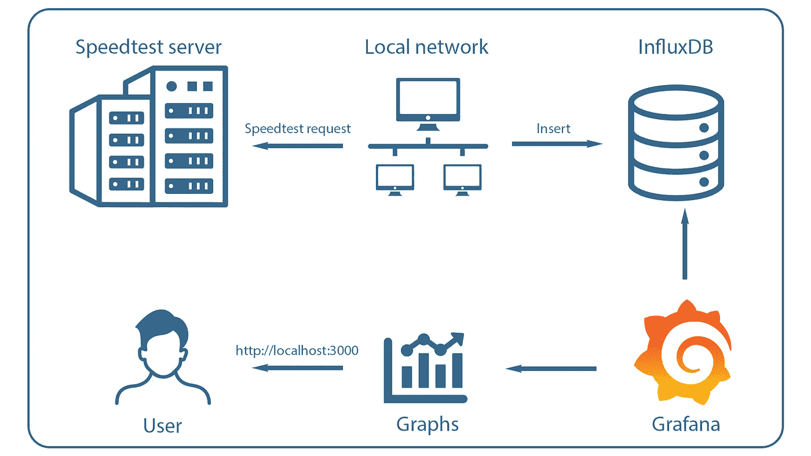
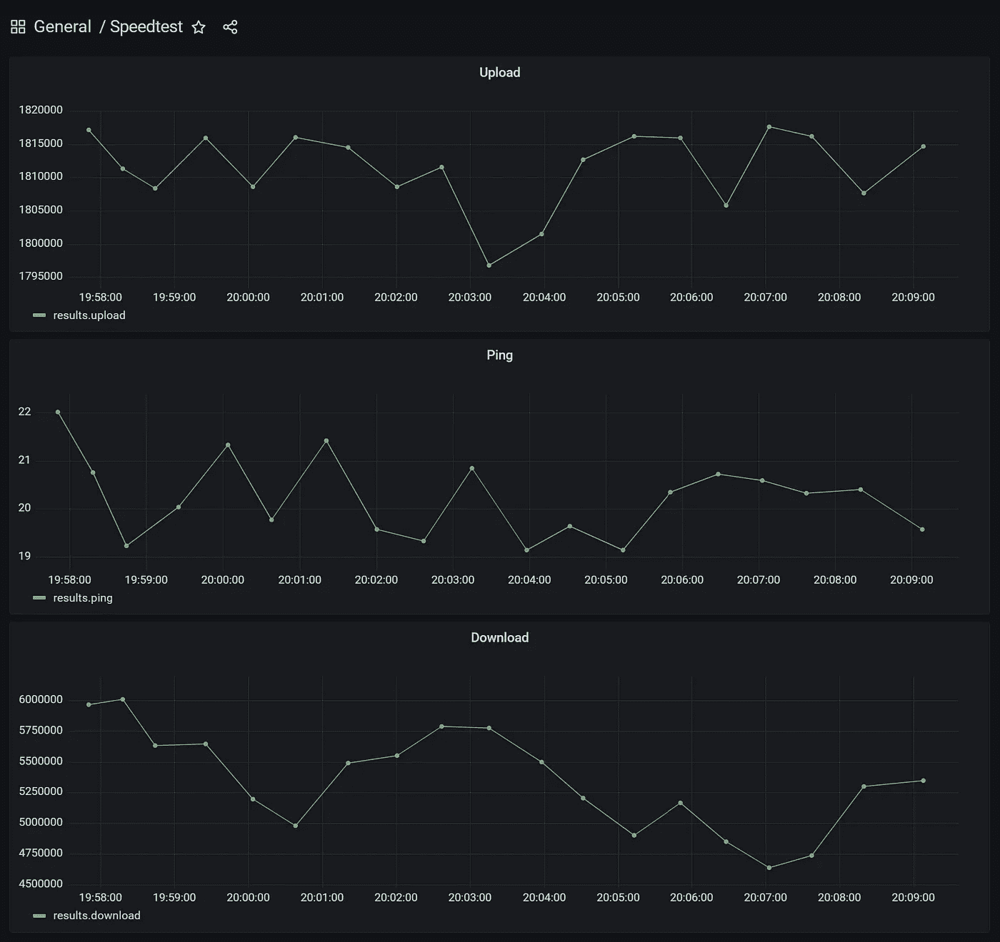

# 你为你的网络合同支付太多吗？

> 原文：<https://levelup.gitconnected.com/do-you-pay-too-much-for-your-network-contract-e768e489b0bb>

## 你也是那些为家里网速慢而苦恼的人之一吗？这篇文章可以帮助你！

照片由[弗雷德里克·利普费尔特](https://unsplash.com/@frederikli?utm_source=medium&utm_medium=referral)在 [Unsplash](https://unsplash.com?utm_source=medium&utm_medium=referral) 上拍摄

# 介绍

我们每个人可能都知道这个情况。你坐在家里，想下载一些东西，甚至只想看你在网飞的系列节目，但有一个问题。你的网络连接又太慢了。这篇文章将向你展示如何在家里监控你的网速，并试图说服你的提供商获得更快的连接，或者至少支付更少的费用。

# 系统结构

要在家监控您的网络速度，需要以下步骤:

1.  在一天的不同时间从您的本地网络重复进行速度测试
2.  数据库中 speedtest 结果的集合(在本例中为 InfluxDB)
3.  用 Grafana 实现数据的可视化

speedtest 工具的部件，*图片由作者*提供

本文将描述所有需要的步骤，所有需要的工具都可以在这个 Github 资源库中找到:

 [## GitHub - eklatzer/speedtest-tool:用于收集和可视化 speedtest 统计数据的工具

### 用于收集和可视化关于你的本地网络的速度测试统计数据的工具

github.com](https://github.com/eklatzer/speedtest-tool) 

# 先决条件

为了能够建立一个类似 unix 的操作系统，需要 Docker 和 Docker Compose。这两个工具的安装说明可以在这里找到:

*   码头引擎:[https://docs.docker.com/engine/install/](https://docs.docker.com/engine/install/)
*   https://docs.docker.com/compose/install/

# 设置

需要完成以下步骤来设置工具，以监控您的下载、上传和 ping 统计数据，并自动显示它们。为了获得真实的值，应该选择有线互联网连接，而不是无线连接。

## CLI 工具

设置的第一步是安装所需的 CLI 工具，它们是:`speedtest, jq, curl`。

*   speedtest:运行速度测试的 CLI 工具
*   jq:一个处理 JSON 的工具
*   curl:一个发出服务器请求的工具(在本例中是安装过程中的 HTTP 调用，并将数据插入数据库)

工具可以手动安装，也可以使用`install.sh`。

关于`speedtest-cli`的更多安装说明可以在这里找到:[安装说明](https://www.speedtest.net/apps/cli)

要执行速度测试，必须使用命令`speedtest`。第一次使用时，必须接受许可证。输出包含一些关于所使用的 speedtest-server 和 speedtest-result 的详细信息。

为了得到 JSON 格式的结果，必须使用参数`--format=json`。

## InfluxDB & Grafana

InfluxDB 是一个时序数据库，在这种情况下用于存储 speedtest-results。Grafana 用于不太费力地将值可视化。为了简化这个过程，使用了 Docker 或更详细的 Docker Compose。开发 Docker Compose 是为了帮助定义和共享多容器应用程序。在这种情况下，使用了两个容器`influxdb:1.8`和`grafana/grafana:latest`。通常情况下，当使用 Docker 时，当容器停止时，数据就消失了。为了保存数据，使用了`volumes`。此外，还设置了环境变量，例如设置服务凭证所需的环境变量。凭证存储在文件`.env`中:

该文件的值在下面的`docker-compose.yml:`中使用

要访问预定义的仪表板和访问 Grafana 中的 InfluxDB 所需的数据源，需要目录`grafana`。它利用了 Grafana 提供的[配置](https://grafana.com/docs/grafana/latest/administration/provisioning/)功能，在本例中是通过卷`./grafana:etc/grafana/provisioning`完成的。

使用命令`docker-compose up`启动数据库和 Grafana。为了验证服务的状态，使用命令`docker-compose ps`:

两种服务都应该处于并保持在状态`Up`。

## 速度测试执行

要将数据输入数据库，必须完成以下步骤:

1.  执行速度测试
2.  从结果中提取所需的值
3.  将值插入数据库

因此，可以使用下面的 bash 脚本，它执行以下步骤:

1.  从`.env`加载变量
2.  使用标志`--format=json`运行 speedtest，指示 speedtest 以 JSON 的形式返回结果
3.  从 JSON 中提取所需的值(ping、下载、上传)
4.  将值插入 InfluxDB

## 自动化

为了自动化速度测试，可以使用 cronjob。Cron 用于在类 unix 操作系统上调度任务。因此，必须配置一个在给定时间间隔运行`speedtest.sh`的 cron job([Crontab-Guru](https://crontab.guru/))。要配置 cronjob，必须使用命令`crontab -e`。在文件的末尾，必须插入以下行:

`* * * * * /path/to/speedtest.sh`

为了得到更具体的调度表达式，可以使用 [Crontab Guru](https://crontab.guru/) 。

# 形象化

Grafana 用于可视化已经收集并插入到数据库中的统计数据。如果启动了 Docker 设置，可以通过在浏览器中打开`http://localhost:3000`来访问 Grafana(默认凭证:`user=admin, password=admin`)。要查看 speedtest stats 的图表，必须使用左侧导航栏打开仪表板`Speedtest`。仪表板和对 InfluxDB 的访问已经预配置，因为使用了配置功能。上传和下载的单位是字节每秒。ping 的单位是毫秒。

Speedtest 统计，*图片作者*

# 结论

在一段时间内和一天中的不同时间收集您的 speedtest 统计数据后，可以将结果与您的提供商提供的带宽进行比较。留下评论，比较你的期望值和你真正得到的带宽。

可以在以下位置找到 speedtest 工具的存储库:

 [## GitHub - eklatzer/speedtest-tool:用于收集和可视化 speedtest 统计数据的工具

### 用于收集和可视化关于你的本地网络的速度测试统计数据的工具

github.com](https://github.com/eklatzer/speedtest-tool)