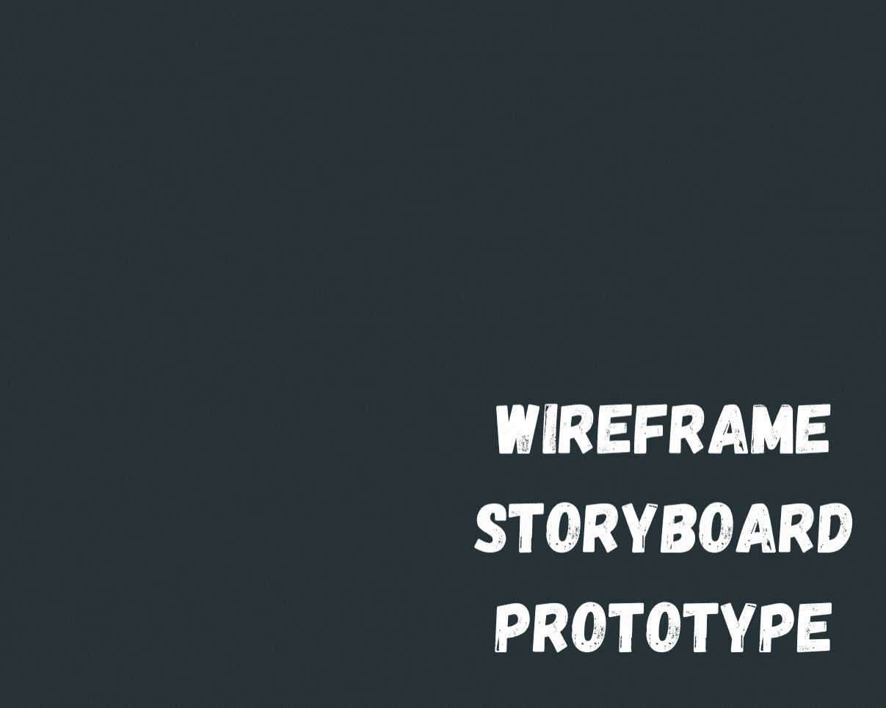
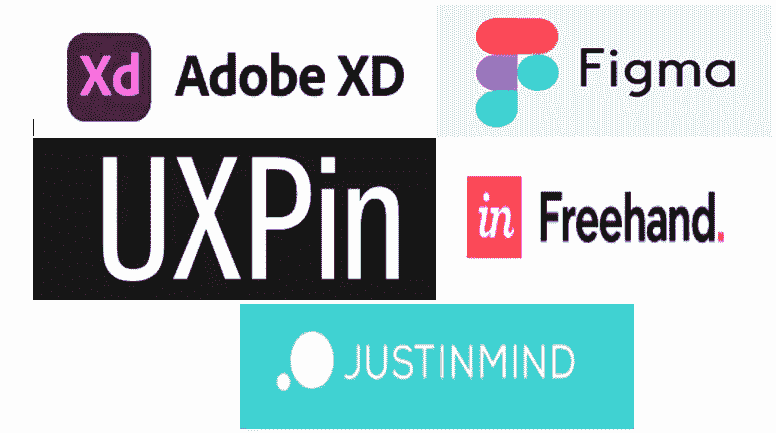
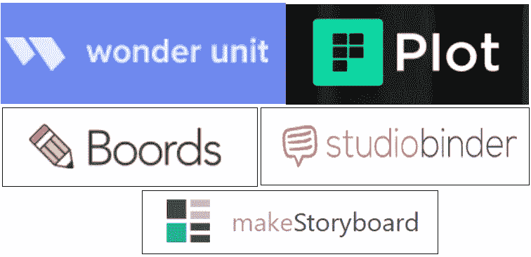
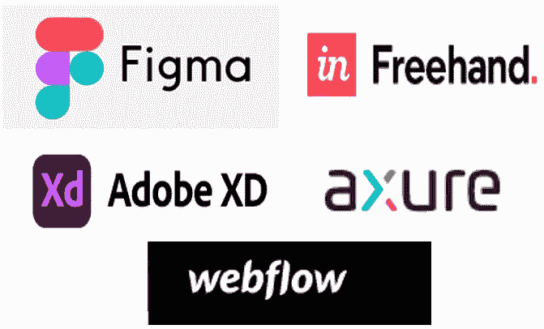

# 你真的了解 UX 设计吗？

> 原文：<https://levelup.gitconnected.com/do-you-really-know-about-ux-design-c9588ac502a0>

## 线框、故事板和原型制作

作者 GIF

用户界面和 UX 术语是相互关联的，大多数时候它们是放在一起的。但是你知道它们实际上是什么意思吗？

作者 GIF

UI——用户界面，是界面设计的方式。它基本上描绘了用户和系统之间的通信是如何发生的。UI 涵盖了“外观”方面。

UX——用户体验是指用户与界面交互的方式，它有助于确定与界面交互的难易程度。UX 负责“感觉”方面。

对于 UX 设计，我们需要更好地理解线框、故事板和原型，因为它有助于组织我们的应用程序，也可以用来在发布商业应用程序之前确定我们的应用程序是否满足用户需求。

基本上，线框，故事板和原型使用 3 个不同层次的 UX 设计开发。

## 原始期

收集用户的需求，并通过这一阶段确认它们，线框工具可用于根据收集的用户需求创建一些视觉模型，这些视觉模型可用于从客户那里获得反馈。

什么是**线框**？

这是一个粗略的计划或者是将要建立的系统的草图。线框简单易懂。它不包含全部信息，但包含必要的信息。为了绘制线框，我们不需要任何编码材料，它只是一个粗略的草图和内嵌注释。对于线框设计，确保不要使用用户分散注意力的颜色，大多数时候会使用灰色主题。

有用的**线框工具**？

线框工具:Adobe XD、Figma、UXPin、Freehand、Justinmind

## 细部设计阶段

在通过初始阶段确认用户需求和功能后，可以转移到屏幕流程设计。详细设计阶段用于验证应用程序开发的路径。在此阶段，故事板概念用于提供所设计系统的细节。

什么是**故事板？**

因此，故事板是一个线框的展示，并按照初始阶段开发的顺序排列已经开发的线框。因此，故事板有助于以一种廉价的方式可视化系统功能的流程。

有用的**故事板工具**？

故事板工具:Wonderunit，The Plot，Studiobinder，Boords，makeStoryboard

## 原型演示阶段

在详细设计阶段之后，我们可以进入最终阶段，即原型演示阶段。在这个阶段，我们可以使用原型来演示最终产品。

什么是**原型**？

原型是最终产品的草稿版本，涵盖了整个设计视图。原型可以是代表实际用户交互和用户界面的文书工作或基于计算机的工艺。

原型制作提供了最具成本效益的变化来进行样本演示，而不是对实际产品进行演示。然后我们才能做出符合用户期望的最终产品。

有用的**原型工具**？

原型工具:Figma，Freehand，Adobe XD，axure，webflow

为了做 UX 设计，你应该更好地理解 UX 设计的三个层次以及线框、故事板和原型的重要性。本文通过涵盖上述主题的主要方面，提供了关于该主题的简短且最相关的细节。

希望你喜欢这篇文章，如果你这样认为，请鼓掌。

感谢您的阅读！！！🤗