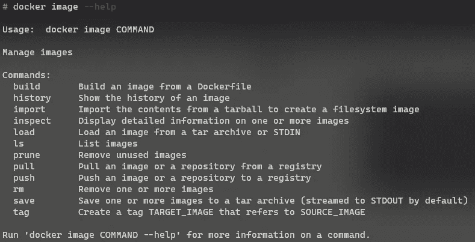

# 文档 101:第 2 部分-图像

> 原文：<https://levelup.gitconnected.com/docker-101-part-2-images-cf845d1a4fcb>


在上一篇文章中，我们研究了一些与容器相关的基本概念，以及容器与虚拟机的区别。在本文中，我们将研究容器注册表、Docker 图像以及与图像相关的主要命令。

为了跟进，需要在我们的系统上安装 Docker 引擎，这可以通过遵循 [Docker 文档](https://docs.docker.com/engine/install/)上给出的说明来实现

# Docker 图像

如前所述，映像只是一个包，其中包含程序及其依赖项和元数据，这是映像运行所必需的。

映像不包含内核，甚至不包括驱动程序，因为这些底层组件是由安装 Docker 引擎的主机系统提供的。

Docker 图像由层组成，每层都有一个与之关联的[哈希](https://www.sentinelone.com/cybersecurity-101/hashing/)。每层的[散列](https://www.sentinelone.com/cybersecurity-101/hashing/)用于唯一标识该层。Docker 利用[联合文件系统(UFS)](https://stackoverflow.com/questions/32775594/why-does-docker-need-a-union-file-system) 将多个图层组合在一起，组成一幅图像。如果有多个图像共享一个图层，则共享的图层只需下载一次。

这是容器的基本思想之一，使它们如此轻量级和健壮，这种方法允许节省空间和尽可能重用图像的一部分。当我们运行一个容器时，Docker 使用它的基本映像，并在它的顶部添加一个临时读/写层，一旦容器完成了它的工作并被用户删除，只需要删除临时层。这样，只要需要，就可以重复使用相同的基本映像，而不会改变其状态。

因此，如果我们旋转一个图像的 5 个实例，Docker 不会制作基础图像的 5 个副本，而是使用基础图像的单个副本并制作 5 个临时层(5 个实例中的每一个都有一个)。

这种分层方法也有助于安全性，每一层都是孤立的，看不到其他层中的内容。只有当 UFS 合并这些层时，属于同一个目录的不同文件才会看起来像是在一起。

# 集装箱登记处

容器注册表是存储和管理容器映像的中心位置。你可以把它想象成 Google Drive，但它是针对图像的。除了存储之外，注册中心通常还提供一些附加功能，如漏洞分析、映像版本控制、访问控制和 CI/CD 集成。

有几家公司提供容器注册，有些是公共的，有些是私人的。最流行的注册表公共注册表是 [Docker Hub](https://hub.docker.com/search?q=&type=image) 。


# 拉动图像

现在，让我们来看看如何将图像拉至我们的本地系统。在 Docker Hub 上，让我们找到一个要下载的图像，我将使用这个例子中的[阿尔卑斯山](https://hub.docker.com/_/alpine)图像，但是这个过程对于所有的图像都是一样的。一旦 Docker 启动并运行，打开一个终端并键入以下命令。

```
docker image pull alpine
```


这将拉下阿尔卑斯山图像的最新版本。

请注意写着“pull complete”的那一行，它前面有一个散列，这是组成该图像的层的散列。如果我们拉下一个更大的图像，我们会看到多个这样的层被下载，然后由 UFS 合并在一起，形成一个单一的图像。


在这里，我们可以看到有 5 层组成了这个 python 图像。如果我们试图下载两个共享相同层的图像，我们将看到 Docker 不会重新下载我们系统中已经存在的层。

我们可以使用“image ls”命令查看所有下载的和本地可用的图像。

```
docker image ls
```


我们可以看到标签为**最新**的阿尔卑斯山图片已经下载到我们的系统中。这是下载最新版本图像的默认行为。现在，如果我们不想下载图像的最新版本，我们如何指定下载图像的哪个版本呢？这可以通过指定图像的**标签**来实现。


在 Docker Hub 上，我们可以查看图像的“支持的标签”部分，以找到可用的标签。或者，我们可以访问图像拉取命令下方的“查看可用标签”链接，以查看相同的信息。标签在图像名称后指定，以下载该版本的图像。

```
docker image pull alpine:3.15
```


现在，如果我们列出这些图片，我们会看到 Alpine 现在有两个版本。


# 图像元数据

我们可以通过查看“图像历史”和“图像检查”命令来查看各种与图像相关的元数据。

history 命令向我们展示了组成图像的不同层，以及用来制作图像的命令的快照(创建图像将在以后的文章中讨论)。


不需要担心在第一列中出现的遗漏，只有最后一层被认为是图像，因此只为它显示散列。

“图像检查”命令可用于查看组成图像的不同层和配置的所有元数据。


不是每个人都能理解这里显示的所有信息，这很好，重要的是知道我们可以使用上面的命令查看与图像相关的元数据。

# 移除图像

一旦我们正在使用一个映像，我们可以使用“image rm”命令将它从我们的系统中删除以释放空间。让我们在我们的系统上删除 Alpine 的两个版本中的一个。

我们可以使用“image rm”命令从系统中删除映像。

```
docker image rm <image-name>
```


# 帮助命令

要查看 Docker 提供的所有与图像相关的命令，我们可以使用`--help`标志

```
docker image --help
```



## 前一篇文章

[](https://david-varghese.medium.com/docker-101-part-1-the-basics-d0dfa595e0a4) [## Docker 101:第一部分-基础知识

### 在本帖中，我们将会看到一些对理解 Docker 很重要的基本概念，并有一个…

david-varghese.medium.com](https://david-varghese.medium.com/docker-101-part-1-the-basics-d0dfa595e0a4) 

## **下一篇**

[](https://david-varghese.medium.com/docker-101-part-3-containers-e2328ed3dda6) [## 码头工人 101:第 3 部分-集装箱

### 到目前为止，我们已经了解了与容器和用于管理图像的各种 Docker 命令相关的基础知识。在这个…

david-varghese.medium.com](https://david-varghese.medium.com/docker-101-part-3-containers-e2328ed3dda6) 

## 参考

*   [https://stack overflow . com/questions/32775594/why-do-docker-need-a-union-file-system](https://stackoverflow.com/questions/32775594/why-does-docker-need-a-union-file-system)
*   [https://en.wikipedia.org/wiki/UnionFS](https://en.wikipedia.org/wiki/UnionFS)
*   [https://hub.docker.com/search?q=&类型=图像](https://hub.docker.com/search?q=&type=image)
*   [https://docs.docker.com/engine/reference/commandline/image/](https://docs.docker.com/engine/reference/commandline/image/)