# 码头工人 101:第 3 部分-集装箱

> 原文：<https://levelup.gitconnected.com/docker-101-part-3-containers-e2328ed3dda6>

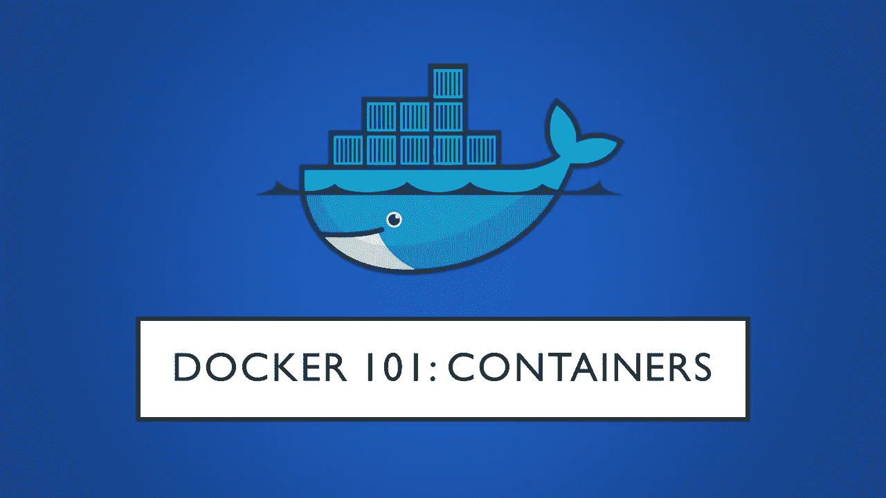

到目前为止，我们已经了解了与容器和用于管理图像的各种 Docker 命令相关的基础知识。在本文中，我们将更深入地研究容器及其相关的命令。

# 容器生命周期

容器在其整个生命周期中可以存在 5 种状态。这些状态如下图所示。

在本文中，我们将讨论使用容器需要了解的三种主要状态——运行、停止和删除

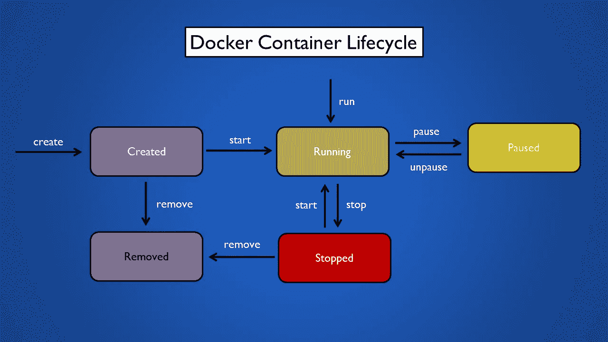

码头集装箱生命周期

> **注:**在 Docker CLI 中，处于运行状态的集装箱显示为**上升**，处于停止状态的集装箱显示为**退出。**

# 集装箱运行模式

运行图像有两种主要模式:

*   前台模式(默认)
*   分离/守护模式

前台模式进一步分为交互和非交互两种类型

## 前台模式(非交互)

可以使用“容器运行”命令启动容器。

```
docker image pull hello-worlddocker container run hello-world
```

> **注意:**要运行一个容器，不需要预先将映像下载到本地。如果在我们的系统上找不到映像，docker run 命令会从 Docker Hub 中提取映像

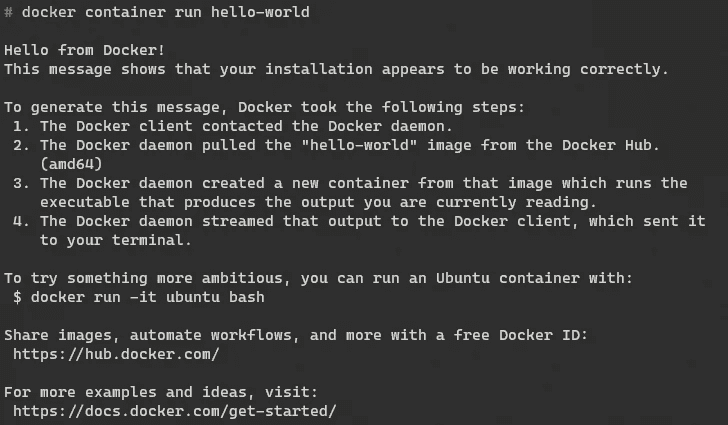

如你所见，容器**开始**运行**命令**，然后**退出**。值得注意的是，在非交互前台模式中，顾名思义，我们不能与正在运行的容器进行交互。

**容器在启动时是如何知道要执行什么的？**

启动时运行的命令由用于构建映像的 Dockerfile 决定(我们将在以后的文章中详细讨论这一点)。Dockerfile 文件中指定了一个名为 CMD 的命令，它决定了容器运行时要执行的命令。

有多种方法可以找出将在容器开始时执行的命令。一种检查方法是使用“图像检查”命令

```
docker image inspect hello-world
```

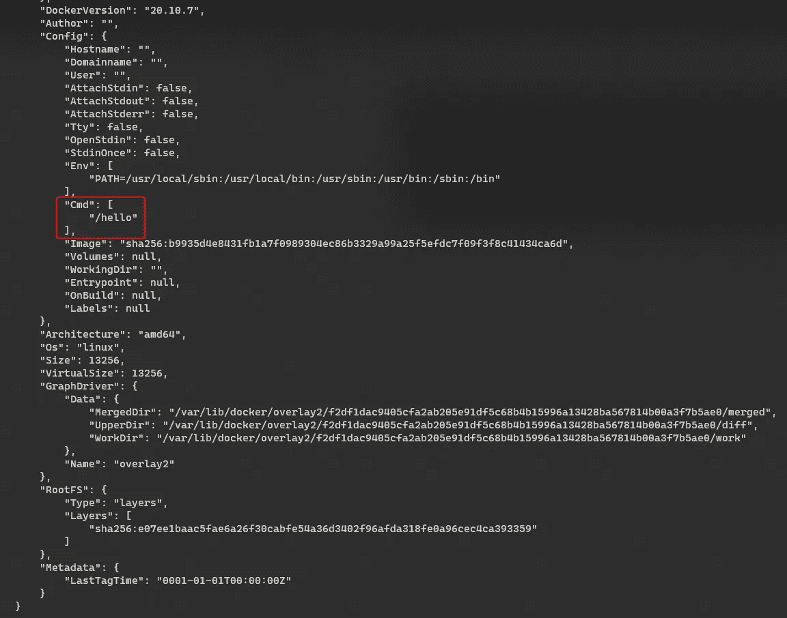

输出向我们显示了与图像相关的所有元数据。我们正在寻找的密钥是 CMD(在上面的图像中突出显示)

获取此信息的另一种方法是直接查看 Docker 文件。这可以通过单击图像的 Docker Hub 页面上指定的标签来完成，这将带我们进入一个 [GitHub](https://github.com/docker-library/hello-world/blob/3332fbee4210b41738d83f6cfdc301a42b96e30d/amd64/hello-world/Dockerfile) repo，其中包含用于构建图像的 Docker 文件(用于创建图像的 Docker 文件是开源的，任何人都可以查看)

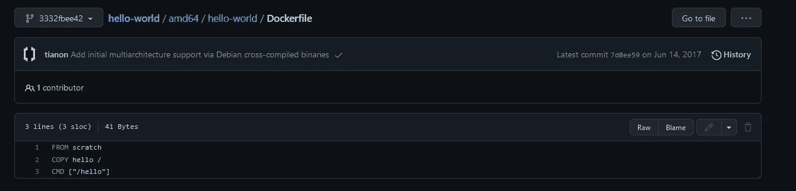

最后一行 CMD 是我们正在寻找的，它与我们从“image inspect”命令看到的结果相匹配

## 前台模式(交互式)

要在交互模式下运行容器，需要将一些附加参数传递给“容器运行”命令

```
docker container run --name alpine -it alpine /bin/sh
```

让我们来分解一下上面的命令,`--name`标志用于给图像(容器)的运行实例命名。这是一个可选标志，如果没有指定，将被随机分配。`-it`标志用于指定我们希望以交互模式运行容器，并将容器的 stdin 附加到我们的终端(这允许我们在容器上执行命令)。`/bin/sh`是我们希望在容器启动后运行的命令。

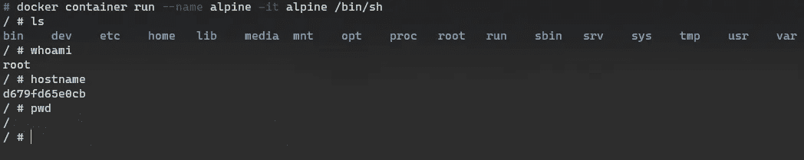

我们在映像名称后指定的任何命令都将覆盖在映像创建期间在 docker 文件中指定的 CMD 语句。

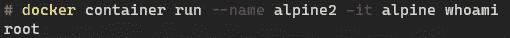

> **注意:**当我们使用 run 命令启动一个容器 Docker 时，首先在内部运行 **create** 命令，该命令创建一个图像实例，并在其上添加一个可修改层。在这一点上，容器仍未启动，处于就绪状态，即，启动容器的配置已完成。在这个码头工人真正启动集装箱之后。

# 列出容器

正如前面在生命周期一节中所讨论的，Docker 容器在其生命周期中可以处于多种状态。要查看**所有**容器，而不考虑它们的状态，我们可以使用“容器 ls -a”命令。

```
docker container ls -a
```

如果未使用`-a`标志，则仅显示运行中的集装箱。

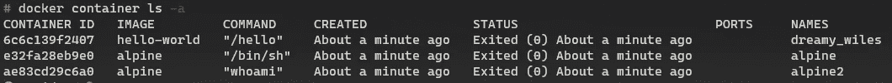

在上图中，所有容器的状态都显示为 Exited，这意味着它们都处于 Stopped 状态。

> 对于任何想知道自动分配给容器的名字的人来说，总是一个形容词**后跟一个科学家的名字**

# **移除容器**

**一旦容器完成执行，它将进入退出(停止)状态。rm 命令用于清理此类容器。**

```
docker container rm <container-name>
```

**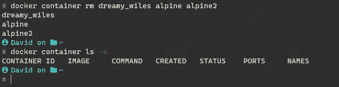**

**如果我们不希望交互式容器在我们使用后继续存在，那么我们可以在创建容器时传递`--rm`标志。**

```
docker container run --rm hello-world
```

**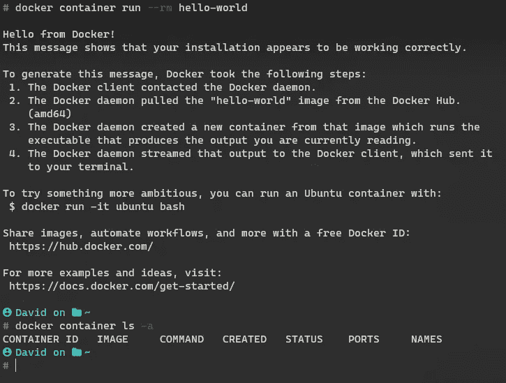**

**正如我们这次所观察到的，一旦容器执行完毕，我们就不会在容器列表中看到处于 exited 状态的容器。**

# **分离/守护模式**

**以分离模式启动的容器在后台启动，不会将自己附加到我们的终端。让我们使用 [MySQL](https://hub.docker.com/_/mysql) 图片来尝试一下。**

```
docker image pull mysqldocker container run --name mysql -d -e MYSQL_ROOT_PASSWORD=password -e MYSQL_ROOT_HOST=% mysql
```

**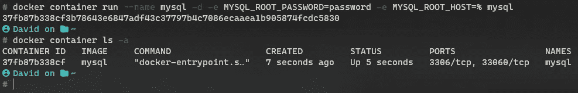**

**一些 Docker 图像允许定义用于配置图像所使用的一些参数的环境变量。我们可以使用`-e`标志设置这些参数。**

**可在图像上设置的参数列表可通过查看 Docker Hub 上图像的[页面](https://hub.docker.com/_/mysql)找到。**

**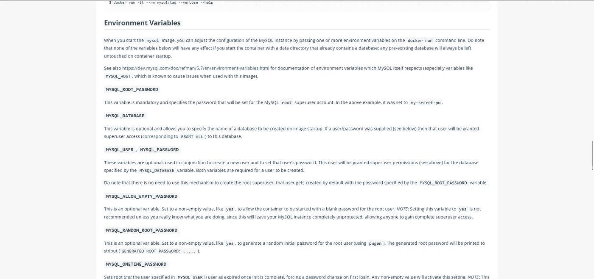**

**上图中的 ports 列将在下一篇文章中详细介绍。但简而言之，Docker 允许我们在容器上公开一些端口，这些端口允许我们连接到容器并与容器中运行的服务进行交互。**

**需要注意的是，这一次容器是在后台运行的，并且没有连接到您的终端。**

# **停止容器**

**与交互式容器不同，分离的容器需要由用户显式停止(除非它们崩溃，在这种情况下它们会自动进入停止停止状态)**

**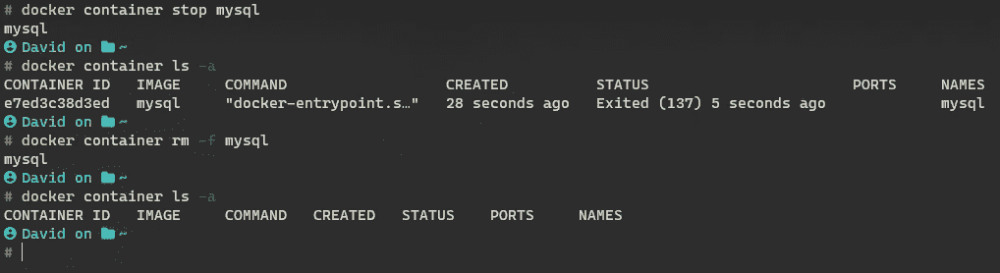**

**因此，一旦我们使用完一个容器，我们需要使用“容器停止”命令来停止它。**

```
docker container stop <container-name>
```

**或者，我们可以跳过 stop 命令，将`-f`标志传递给 rm 命令，强制删除正在运行的容器。**

```
docker container rm -f <container-name>
```

**另一种停止容器的方法是使用“容器终止”命令，虽然这两个命令的最终结果是相同的(停止容器),但它们以不同的方式执行。**

```
docker container kill <container-name>
```

> ***docker****stop***命令发出 **SIGTERM** 信号，而*docker****kill***命令发出 **SIGKILL** 信号**

**SIGTERM 和 SIGKILL 是 Linux 信号，用于向进程表示事件的发生。需要理解的关键一点是，SIGTERM 是 SIGKILL 的驯服操作。Stop 命令导致容器进程被感激地终止(给容器中的进程几秒钟的时间来正确关闭)，不像 kill 命令会立即终止它。**

**对于码头工人的日常使用，最好坚持使用“集装箱停止”命令，除非有特殊原因需要使用 kill 命令。我附上了关于这个主题的参考资料，可以参考更多的细节。**

# **集装箱日志**

**一些 Docker 容器启用了日志记录，以便于调试和查找使用容器生命周期可能发生的错误。可以使用“容器日志”命令来访问这些日志。**

```
docker container logs <container-name>
```

**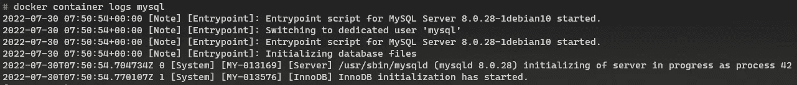**

**可以将`-f`标志传递给上述命令，以跟踪由容器实时生成的日志。**

# **启动停止的容器**

**假设我们有一个停止的容器，我们想再次启动它，那么我们可以使用“容器启动”命令。**

**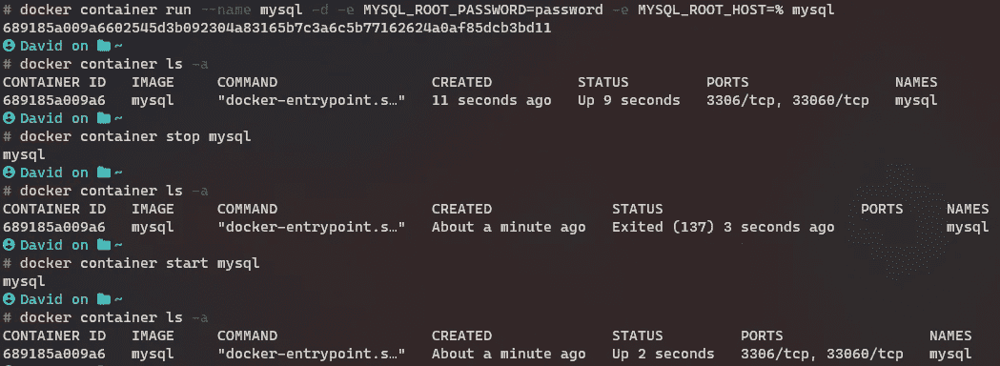**

**从上图中我们可以看到 mysql 容器是以分离模式启动的，过了一段时间容器被停止了，然后被停止的容器又被启动了。**

**默认情况下，容器将以使用“容器运行”命令创建时的模式重新启动。要在交互模式下重启分离的模式容器，可以使用`-ai`标志。**

```
docker container start -ai <container-name>
```

# ****执行容器上的命令****

**比方说，我们有一个正在运行的容器，我们想快速地对它运行一个命令，或者我们想调试容器中发生的一些错误，在这些情况下，我们可以使用“容器执行”命令。**

**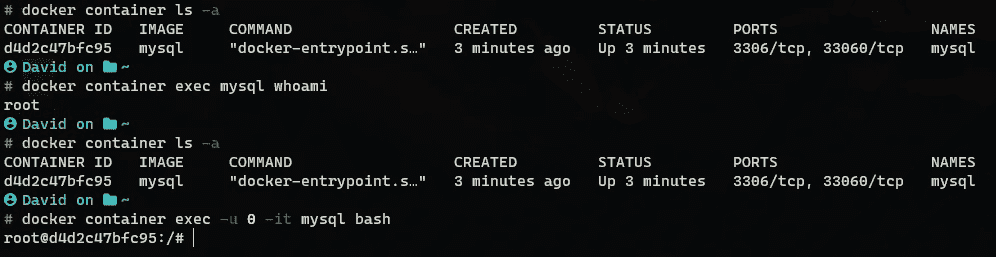**

**在上图中，我们可以看到 MySQL 容器以分离模式启动，然后使用 exec 命令打印出当前用户的名称。**

**与“容器运行”命令不同，即使我们在容器上执行了一个命令，入口点也不会被覆盖，容器会继续正常运行。**

**通过使用`-it`标志，exec 命令也可以用于在交互模式下连接到容器。`-u`标志用于指定运行容器的用户的用户名 id。**

> ****注意:**使用`Ctrl + P + Q`快捷方式可以将一个交互容器转换成一个分离/守护容器，这甚至适用于使用“开始”和“运行”命令以交互模式启动的容器。**

# **集装箱统计**

**我们可以使用“container top”命令查看容器内部正在运行的所有进程。**

```
docker container top <container-name>
```

**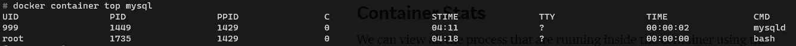**

**类似地，要查看系统上运行的所有容器的资源利用率，可以使用“容器状态”命令。**

```
docker container status
```

**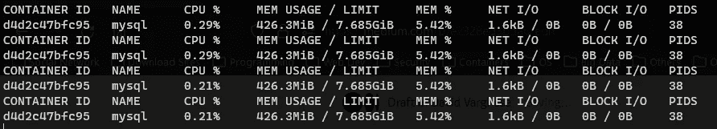**

**要查看与容器相关的所有元数据信息，可以使用“容器检查”命令。**

```
docker container inspect <container-name>
```

**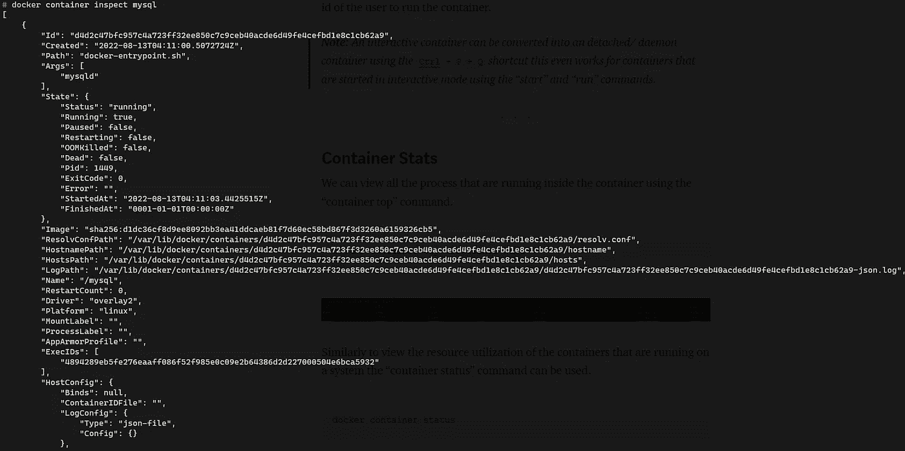**

## **前一篇文章**

**[](/docker-101-part-2-images-cf845d1a4fcb) [## 文档 101:第 2 部分-图像

### 在上一篇文章中，我们看了一些与容器相关的基本概念，以及容器与……

levelup.gitconnected.com](/docker-101-part-2-images-cf845d1a4fcb)** 

*   **[https://www.baeldung.com/ops/docker-stop-vs-kill](https://www.baeldung.com/ops/docker-stop-vs-kill)**
*   **[https://super user . com/questions/756999/docker-stop-and-docker-kill](https://superuser.com/questions/756999/whats-the-difference-between-docker-stop-and-docker-kill)**
*   **[https://stack overflow . com/questions/28339469/which-one-should-I-use-docker-kill-or-docker-stop](https://stackoverflow.com/questions/28339469/which-one-should-i-use-docker-kill-or-docker-stop)**
*   **[https://k21 academy . com/docker-kubernetes/docker-container-life cycle-management/](https://k21academy.com/docker-kubernetes/docker-container-lifecycle-management/)**