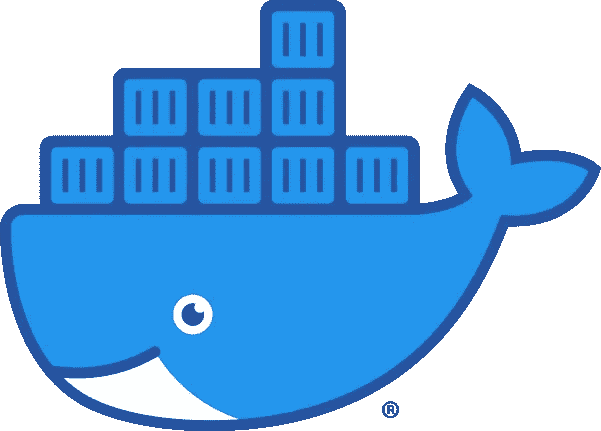

# Docker 命令食谱

> 原文：<https://levelup.gitconnected.com/docker-commands-cookbook-959bfb8261f4>

## 给初学者的码头烹饪书



[黑社会地球动力学社团](https://www.underworldcode.org/content/images/size/w600/2020/08/Moby-logo-1.png)

获取所有 Docker 命令的列表:

```
docker -h
```

# 管理命令:

*   `builder`管理构建
*   `config`管理 Docker 配置
*   `container`管理集装箱
*   `engine`管理 docker 引擎
*   `image`管理图像
*   `network`管理网络
*   `node`管理群节点
*   `plugin`管理插件
*   `secret`管理码头工人机密
*   `service`管理服务
*   `stack`管理 Docker 堆栈
*   `swarm`管理蜂群
*   `system`管理码头工人
*   `trust`管理对 Docker 图像的信任
*   `volume`管理卷

# `docker image`

*   `build`从 dockerfile 文件构建映像
*   `history`显示图像的历史
*   `import`从 tarball 导入内容以创建文件系统映像
*   `inspect`在一个或多个图像上显示详细信息
*   `load`从 tar 文件或标准输入中加载图像
*   `ls`列表图片
*   `prune`删除未使用的图像
*   `pull`从注册表中提取图像或存储库
*   `push`将图像或存储库推送到注册表
*   `rm`删除一个或多个图像
*   `save`将一个或多个图像保存到一个 tar 文件中(默认情况下传输到标准输出)
*   `tag`创建一个引用源图像的标记目标图像

# `docker container`

*   `attach`将本地标准输入、输出和错误流附加到正在运行的容器中
*   `commit`根据容器的更改创建新图像
*   `cp`在容器和本地文件系统之间复制文件/文件夹
*   `create`创建新的容器
*   `diff`检查容器文件系统中文件或目录的变化
*   `exec`在运行容器中运行命令
*   将容器的文件系统导出为 tar 归档文件
*   `inspect`显示一个或多个容器的详细信息
*   `kill`杀死一个或多个正在运行的容器
*   `logs`取出集装箱中的原木
*   `ls`列出容器
*   `pause`暂停一个或多个容器中的所有流程
*   `port`列出端口映射或容器的特定映射
*   `prune`移除所有停止的容器
*   `rename`重命名容器
*   `restart`重启一个或多个容器
*   `rm`移除一个或多个容器
*   `run`在新容器中运行命令
*   `start`启动一个或多个停止的容器
*   `stats`显示容器资源使用统计的实时流
*   `stop`停止一个或多个运行中的容器
*   `top`显示容器的运行过程
*   `unpause`取消暂停一个或多个容器中的所有进程
*   `update`更新一个或多个容器的配置
*   `wait`阻塞直到一个或多个集装箱停止，然后打印它们的退出代码

# `docker container run`

*   `--help`打印用法
*   `--rm`退出时自动移除容器
*   `-d`、`--detach`后台运行容器并打印容器 ID
*   `-i`，`--interactive`保持 STDIN 打开，即使没有连接
*   `--name string`给容器指定一个名称
*   `-p`，`--publish list`向主机发布容器的端口
*   `-t`、`--tty`分配一个伪 TTY
*   `-v`、`--volume list`挂载卷(挂载的绑定类型)
*   `--mount mount`将文件系统挂载到容器
*   `--network string`将容器连接到网络(默认为“默认”)

创建一个容器并附加到它:

```
docker container run -it busybox
```

创建一个容器并在后台运行它:

```
docker container run -d nginx
```

创建一个您命名的容器，并在后台运行它:

```
docker container run -d -name myContainer busybox
```

# 公开和发布容器端口

如何公开容器上的端口，以及如何发布它们。

# 暴露:

*   公开一个端口或一系列端口
*   这不会发布端口
*   使用`--expose [PORT]`

```
docker container run --expose 1234 [IMAGE]
```

# 发布:

*   将容器的端口映射到主机的端口
*   `-p`或`--publish`向主机发布容器的端口
*   `-P`或`--publish-all`将所有暴露的端口发布给随机端口

```
docker container run -p [HOST_PORT]:[CONTAINER_PORT] [IMAGE]docker container run -p [HOST_PORT]:[CONTAINER_PORT]/tcp -p [HOST_PORT]:[CONTAINER_PORT]/udp [IMAGE]docker container run -P
```

列出容器的所有端口映射或特定映射:

```
docker container port [Container_NAME]
```

# 执行容器命令

让我们看看在容器上执行命令的三种不同方式。

## 执行命令:

*   Dockerfile 文件
*   在码头运行期间
*   使用 exec 命令

命令可以是:

*   一个和完成命令
*   长时间运行的命令

使用命令启动容器:

```
docker container run [IMAGE] [CMD]
```

在容器上执行命令:

```
docker container exec -it [NAME] [CMD]
```

示例:

```
docker container run -d -p 8080:80 nginx docker container ps docker container exec -it [NAME] /bin/bash docker container exec -it [NAME] ls /usr/share/nginx/html/
```

# 音量命令

列出所有 Docker 音量命令:

```
docker volume -h
```

*   `create`:创建一个卷。
*   `inspect`:显示一个或多个卷的详细信息。
*   `ls`:列出卷。
*   `prune`:移除所有未使用的本地卷。
*   `rm`:移除一个或多个卷。

创建新卷:

```
docker volume create test-volume
```

创建卷时获取可用标志:

```
docker volume create -h
```

检查卷:

```
docker volume inspect test-volume
```

删除卷:

```
docker volume rm test-volume
```

删除所有未使用的卷:

```
docker volume prune
```

# 绑定安装

绑定挂载从 Docker 早期就已经出现了。与卷相比，它们的功能有限。使用绑定装载，主机上的文件或目录被装载到容器中。

卷使用在主机上 Docker 的存储目录中创建的新目录，Docker 管理该目录的内容。

**使用挂载标志:**

```
docker container run -d --name <NAME> --mount type=bind, source=<SOURCE>, target=<TARGET> <IMAGE>
```

**使用音量标志:**

```
docker container run -d --name <NAME> -v <SOURCE>:<TARGET> <IMAGE>
```

# 文档文件

`FROM`:初始化新的构建阶段并设置基础映像

`RUN`:将执行新图层中的任何命令

`CMD`:为执行容器提供默认值。docker 文件中只能有一条 CMD 指令

`LABEL`:向图像添加元数据

`EXPOSE`:通知 Docker 容器在运行时监听指定的网络端口

`ENV`:将环境变量`<key>`设置为值`<value>`

`ADD`:从`<src>`复制新文件、目录或远程文件 URL，并将其添加到路径`<dest>`的镜像文件系统中。

`COPY`:从`<src>`复制新的文件或目录，并将它们添加到路径`<dest>`的容器的文件系统中。

`ENTRYPOINT`:允许配置将作为可执行文件运行的容器

`VOLUME`:创建具有指定名称的挂载点，并将其标记为保存来自本机主机或其他容器的外部挂载卷

`USER`:设置用户名(或 UID)和可选的用户组(或 GID ),以在运行映像时使用，并用于 docker 文件中其后的任何`RUN`、`CMD`和`ENTRYPOINT`指令

`WORKDIR`:为 Dockerfile 中跟随其后的`RUN`、`CMD`、`ENTRYPOINT`、`COPY`和`ADD`指令设置工作目录

`ARG`:定义一个变量，用户可以在构建时用`docker build`命令传递给构建器，使用`--build-arg <varname>=<value>`标志

`ONBUILD`:当图像用作另一个构建的基础时，向图像添加将在以后执行的触发指令

`HEALTHCHECK`:告诉码头工人如何测试一个集装箱，以检查它是否还在工作

`SHELL`:允许用于命令外壳形式的默认外壳被覆盖

# 如何从 Dockerfie 构建图像:

```
docker image build -t [NAME]:[TAG] .
```

有用的标志:

*   `-f`、`--file string`:这是 Dockerfile 文件的名称(默认为`PATH/Dockerfile`)。
*   `--force-rm`:务必取出中间容器。
*   `--label list`:设置图像的元数据。
*   `--rm`:成功构建后移除中间容器(默认为`true`)。
*   `--ulimit ulimit`:设置`ulimit`选项(默认为[])。

# 使用 URL 构建图像:

```
docker image build -t <NAME>:<TAG> <GIT_URL>#<REF>docker image build -t <NAME>:<TAG> <GIT_URL>#:<DIRECTORY>docker image build -t <NAME>:<TAG> <GIT_URL>#<REF>:<DIRECTORY>
```

# 从 zip 文件构建图像:

```
docker image build -t <NAME>:<TAG> - < <FILE>.tar.gz
```

# 在 Docker Hub 上分发图像

[创建 Docker Hub 账户](https://hub.docker.com/)

# 码头推送:

```
docker image push <USERNAME>/<IMAGE_NAME>:<TAG>
```

# 参考资料:

[1] [Linux](https://linuxacademy.com/cp/courses/lesson/course/3823/lesson/1/module/314) [](https://linuxacademy.com/cp/modules/view/id/314)[学院](https://linuxacademy.com/cp/courses/lesson/course/3823/lesson/1/module/314)

*原载于*[*https://predictivehacks.com*](https://predictivehacks.com/?all-tips=docker-commands-cookbook)*。*