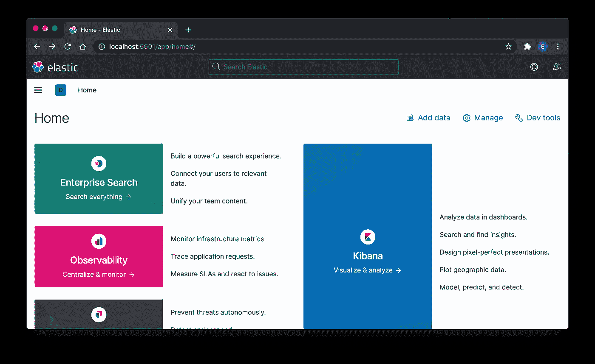

# 用 Elasticsearch 和 Kibana 使 Docker-Compose 变得简单

> 原文：<https://levelup.gitconnected.com/docker-compose-made-easy-with-elasticsearch-and-kibana-4cb4110a80dd>

## 学习软件系统

## 使用 docker-compose 轻松启动和关闭软件系统


费德里科·贝卡里在 [Unsplash](https://unsplash.com?utm_source=medium&utm_medium=referral) 上拍摄的照片

有了 Docker，在我们的计算机上建立一个临时设置来测试本地服务变得很容易。我们可以随时安装和拆除它。

我们可以有一个 Linux 或 Ubuntu 或任何操作系统，并在其上运行任何数据库或软件，并提供我们需要的服务，而不会污染我们实际的机器环境。这就是 Docker 的力量，分享如下。

[](/docker-from-the-very-basic-64f15ac38ed7) [## 最基础的码头工人

### 将 Docker 理解为独立的本地环境

levelup.gitconnected.com](/docker-from-the-very-basic-64f15ac38ed7) 

但是，如果我们正在运行多个本地服务(docker 容器),并且我们需要它们进行通信，这怎么可能呢？

# docker 设置越复杂

是的，可以设置允许服务相互通信。为了演示这一点，我将设置一个 Elasticsearch 服务，并将其连接到 Kibana(可以与 Elasticsearch 通信的控制台)。


## 设置 docker 网络

为了让两个服务(容器)相互通信，尽管它们向我们的本地机器公开了它们的端口，但是容器并不通过我们的本地机器公开的端口进行通信。

相反，我们需要建立一个内部网络(我将其命名为 docker network)桥，以允许它们相互通信。

为此，我们只需键入下面的命令，其中`es-net`是我提供的名称。

```
docker network create **es-net** --driver=bridge
```

> `--driver=bridge`表示我们正在使用可用的`bridge`网络作为驱动程序，这是可选的，因为这是默认设置。

要查看网络，只需输入`docker network ls`，我们将得到如下内容

```
NETWORK ID NAME DRIVER SCOPE
acd9ccf2f539 bridge bridge local
f14ca1c8849e **es-net** bridge local
6840debcb248 host host local
f514cb30a663 none null local
```

> 注意:`host`、`none`、`bridge`默认可供 docker 使用。

## 连接弹性搜索服务

现在，我们只需要将 Elasticsearch Docker 映像下载下来，并将其作为一个容器运行。将这个 Elasticsearch Docker 作为一个独立的服务运行与将其暴露给其他容器之间的区别只是通过添加一个 Docker 网络，它应该使用`--net`参数来连接

```
docker run -d \
--name es-container \
**--net es-net** \
-p 9200:9200 \
-e xpack.security.enabled=false \
-e discovery.type=single-node \
docker.elastic.co/elasticsearch/elasticsearch:7.11.0
```

其他参数只是默认使用的 docker 参数，例如将其命名为`es-container`(或其他喜欢的名称)，通过`9200`端口暴露，并设置一些环境变量。

## 连接基巴纳服务

最后，我们希望获得 Kibana 映像，并将其作为容器运行。类似于 Elasticsearch，我们需要使用`--net`将其连接到`es-net`。

```
docker run -d \
--name kb-container \
**--net es-net** \
-p 5601:5601 \
-e ELASTICSEARCH_HOSTS=[http://es-container:9200](http://es-container:9200) \
docker.elastic.co/kibana/kibana:7.11.0
```

除了正常的参数(如名称和暴露端口`5601`，这里需要注意的一点是我们需要设置的环境。这里我们明确使用 Elasticsearch 的名称`es-container`来指代 Kibana 要连接的 Elasticserach 主机。即

```
-e ELASTICSEARCH_HOSTS=[http://es-container:9200](http://es-container:9200)
```

## 经营基巴纳

现在我们只需要浏览`[http://localhost:5601](http://127.0.0.1:5601,)`，等待服务准备好，我们会看到如下内容。



## 关闭服务

在使用它之后，当我们想要关闭服务时，我们必须停止所有的容器，也就是运行下面的两个命令。

```
docker container stop kb-container
docker container stop es-container
```

停止它之后，容器会占用一些空间，以为我们以后可能要重新启动它。运行下面的命令也会显示那些停止的容器。

```
docker ps -a
```

要删除它们并重新获得一些磁盘空间，我们需要运行以下命令

```
docker container prune
```

# Docker-compose，将所有内容压缩成一个文件

我们可以将上述命令组合成一个脚本文件，并轻松地运行它，来启动所有的服务。

```
docker network create es-net --driver=bridgedocker run -d \
--name es-container \
--net es-net \
-p 9200:9200 \
-e xpack.security.enabled=false \
-e discovery.type=single-node \
docker.elastic.co/elasticsearch/elasticsearch:7.11.0docker run -d \
--name kb-container \
--net es-net \
-p 5601:5601 \
-e ELASTICSEARCH_HOSTS=[http://es-container:9200](http://es-container:9200) \
docker.elastic.co/kibana/kibana:7.11.0
```

我们还可以通过将所有命令组合成另一个脚本文件来轻松关闭它

```
docker container stop kb-container
docker container stop es-container
docker container prune -f
```

这意味着我们有两个文件。此外，除非知道所有的参数缩写，否则启动脚本不容易理解。

## docker-file.yml

为了提高可读性，docker-compose 开始发挥作用，让所有这些信息清楚地建立一个文件名`docker-compose.yml`

我们需要输入的内容如下

```
version: "3.0"services:
  elasticsearch:
    container_name: es-container
    image: docker.elastic.co/elasticsearch/elasticsearch:7.11.0
    environment:
      - xpack.security.enabled=false
      - "discovery.type=single-node"
    networks:
      - es-net
    ports:
      - 9200:9200 kibana:
    container_name: kb-container
    image: docker.elastic.co/kibana/kibana:7.11.0
    environment:
      - ELASTICSEARCH_HOSTS=[http://es-container:9200](http://es-container:9200)
    networks:
      - es-net
    depends_on:
      - elasticsearch
    ports:
      - 5601:5601networks:
  es-net:
    driver: bridge
```

以上相对不言自明。

要启动服务，只需输入

```
docker-compose up -d
```

`-d`是在分离模式下启动，这样用户仍然可以使用终端

有趣的是，要停止服务，我们可以使用相同的脚本，只需运行下面的命令

```
docker-compose down 
```

就是这样，它将处理停止服务和删除容器。

希望以上内容能让你更容易理解 Docker-Compose 是什么。干杯。