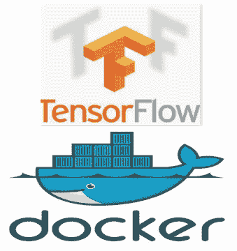
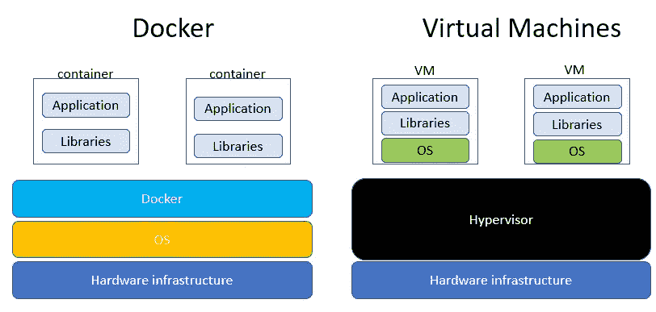
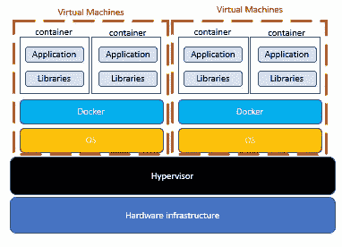
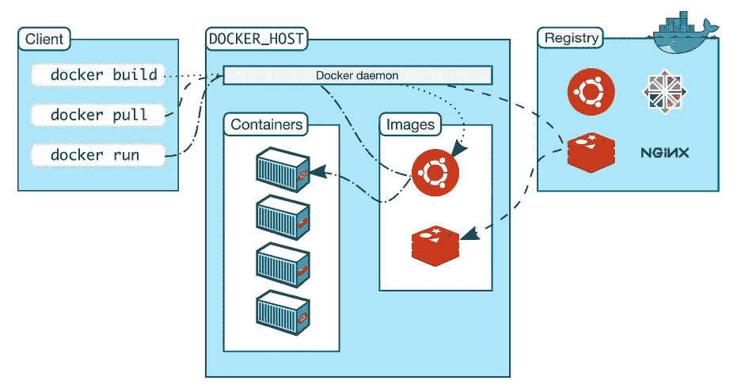
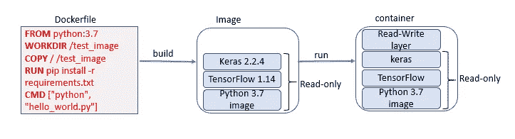
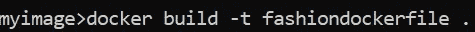
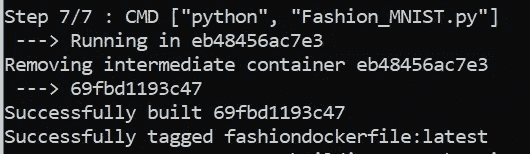
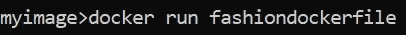

# 深度学习的 Docker 容器

> 原文：<https://levelup.gitconnected.com/docker-containers-for-deep-learning-77e8b7e10ef1>

## 了解什么是 docker 容器，我们为什么需要 docker 容器，以及如何创建深度学习的 docker 容器。



图片来源:[https://docs.docker.com/](https://docs.docker.com/)和[https://www.tensorflow.org/](https://www.tensorflow.org/)

***在这篇文章中，我们将了解 Docker 是什么以及它是如何帮助我们的。我们将了解虚拟机(VM)和 Docker 之间的区别。理解 docker 架构以及图像、容器、docker 文件和卷等概念，并最终使用 TensorFlow 为深度学习算法创建 Docker 文件。***

# Docker 是什么，我们为什么需要它？

您已经使用 TensorFlow (TF)编写了用于分类的 Python 代码，并且获得了极好的精度和召回率。你现在想和你的朋友分享代码。代码在你的机器上运行良好，但在他们的计算机上出现错误。

你发现问题出在不同版本的 TF 上。

如果你能把你的代码和所有相关的库打包，并把它发送给你的朋友会怎么样？

这就是码头工人来救你的地方。

> Docker 是一个构建、发布和部署应用程序的开放平台，它将应用程序与所有相关的库打包在一起，以确保代码可以在您的机器以及任何其他具有相同操作系统内核的机器上运行。
> 
> Docker 为所有使用容器的开发人员创建了一个标准化的环境，该环境封装了应用程序及其所有依赖库
> 
> Docker 将应用程序从基础设施中分离出来，使它变得轻量级和快速
> 
> Docker 很容易以近乎实时的方式扩展或删除应用程序和服务。

***虚拟机(VM)不也是为了同样的目的吗？***

VM 和 Docker 是有区别的



Docker 和 VM 的区别

*   Docker 运行多个容器；容器是封装应用程序和相关库的隔离环境
*   容器是开发、测试和部署应用程序的单元
*   **与 VM 相比，集装箱重量较轻。Docker 映像没有虚拟机管理程序那样的额外负载。** VM 使用大量的磁盘空间，通常以 GB 为单位，而容器是轻量级的，通常以 MB 为单位。
*   **容器直接在操作系统内核中运行**。**每个虚拟机内部都有一个操作系统，**每个虚拟机在相同的硬件基础架构上可以有不同的操作系统
*   **与虚拟机相比，在相同的硬件上可以运行更多的容器，因为它们是轻量级容器，并且使用相同的操作系统内核。**

一个更好的架构是在一个 VM 上使用 Docker 和多个容器，如下所示



# 码头建筑

Docker 是一种客户端-服务器架构。docker 客户端使用 REST API 与 Docker 守护进程通信。

**Docker 守护进程监听 API 请求，负责构建、运行和部署/分发 Docker 容器、卷等。**

**Docker 注册表存储 Docker 图片。**



图片:[https://docs.docker.com/engine/docker-overview/](https://docs.docker.com/engine/docker-overview/)

*让我们了解一些与 Docker 相关的关键术语:图像和容器*

## 图片:

**docker 图像是由一系列层构建而成的只读模板。**每一层都堆叠在下一层的顶部。使用包含源代码、相关库、工具或文件的 docker 文件中的指令来构建层，以使应用程序运行。

## 容器

**容器是紧凑、隔离和便携的单元，用于一致地运行和部署应用**，因此**支持持续集成和持续交付**。

图像和容器的区别在于

*   图像是只读的，而容器的顶层是可写的。
*   如果图像被视为一个类，那么容器就是图像类的一个实例。
*   多个容器共享对同一底层映像的访问，但可以有不同的数据。

## 卷

当我们运行只读 Docker 映像来创建容器时，容器的顶层是可写的。默认情况下，数据**不是**持久存储在容器之外。如果我们修改在现有容器上运行的文件，该文件总是从只读层复制到可写层。对文件的任何更改在容器中都不可用，并且总是从只读映像中存在的文件的旧版本构建。为了解决数据持久化的问题，我们使用 Docker Volume。

**卷有助于将数据保存在一个容器中，以及在几个 Docker 容器之间共享数据。卷是主机文件系统上的一个目录**

## Dockerfile 文件

Dockerfile 是一个文本文件，我们在其中指定了 Docker 客户端调用来构建图像的命令列表

Dockerfile 包含四个命令，每个命令创建一个堆叠在另一个之上的层

*   **FROM** :设置将在新图像创建过程中使用的容器图像
*   **复制**:将文件和目录复制到容器的文件系统中
*   **运行**:指定要运行的命令，并捕获到新的容器映像中
*   **CMD:** 设置部署容器映像实例时运行的默认命令

docker 文件中的其他命令

**WORKDIR** :设置运行容器映像实例的工作目录

**EXPOSE** :设置需要暴露的端口号。它通知 Docker 容器正在运行时监听指定的端口号



# 为深度学习分类模型创建 docker 文件

我在一个文件 [Fashion_MNIST.py](https://github.com/arshren/Classification-Fashion-MNIST/blob/master/Fashion_MNIST.py) 中使用 Keras 和 TensorFlow 为时尚 MNIST 编写了深度学习多类分类代码，该文件包含读取数据集、标准化数据、创建和训练模型并最终进行预测的代码。我想与您分享这段代码，以便它可以在您的机器上无缝运行。

我有一个 docker file**fashion docker file**

```
# use python 3.7 as base image
**FROM python:3.7**# set the working directory to test_image
**WORKDIR /test_image**# copy current directory files to test_image
**COPY / /test_image**# install dependencies
**RUN pip install tensorflow==1.14.0
RUN pip install -r requirements.txt**#Run Fashion_MNIST.py when container is launced
**CMD ["python", "Fashion_MNIST.py"]**
```

requirements.txt 包含以下依赖库

```
**numpy==1.16.1
matplotlib==3.0.2 
keras==2.2.4**
```

我们现在构建图像



一旦构建了映像，我们会看到以下消息



我们最后运行图像来创建一个容器



你现在可以在你的机器上运行深度学习模型，没有任何问题

## 结论:

Docker 运行多个容器，这些容器是独立的环境，封装了可以共享和部署的应用程序和相关库

## 参考资料:

[https://www.docker.com/resources/what-container](https://www.docker.com/resources/what-container)