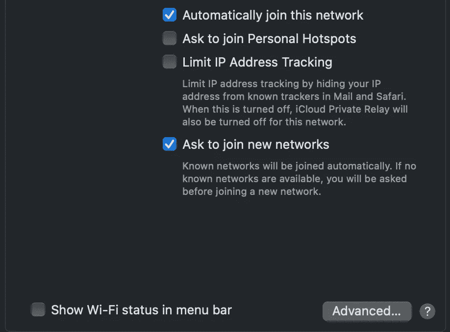
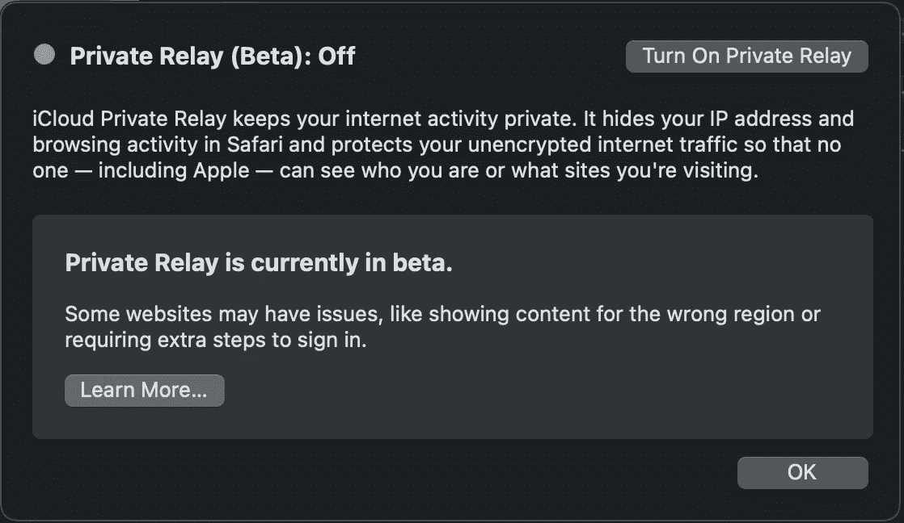

# Docker 桌面在 macOS 上没有互联网

> 原文：<https://levelup.gitconnected.com/docker-desktop-doesnt-have-internet-on-macos-59a81d59eaac>


[伊恩·泰勒](https://unsplash.com/@carrier_lost?utm_source=medium&utm_medium=referral)在 [Unsplash](https://unsplash.com?utm_source=medium&utm_medium=referral) 上拍照

## Docker 和 iCloud 私有中继的一个棘手问题

我最近在运行 macOS Monterey 的 MacBook 上运行 Docker Desktop 时遇到了这个棘手的问题。

我发布这个小帖子是为了找到是否有人有同样的问题。

## 问题

[](https://github.com/docker/for-mac/issues/6030) [## 无法从 debian 容器执行 apt-get 更新或安装问题#6030 docker/for-mac

### 此时您不能执行该操作。您已使用另一个标签页或窗口登录。您已在另一个选项卡中注销，或者…

github.com](https://github.com/docker/for-mac/issues/6030) 

当容器无法访问互联网时的解决方案，例如:

```
root@docker-desktop:/# apt update
Err:1 [http://archive.ubuntu.com/ubuntu](http://archive.ubuntu.com/ubuntu) groovy InRelease
  Cannot initiate the connection to archive.ubuntu.com:80 (2001:67c:1360:8001::24). - connect (101: Network is unreachable) Cannot initiate the connection to archive.ubuntu.com:80 (2001:67c:1360:8001::23). - connect (101: Network is unreachable) Could not connect to archive.ubuntu.com:80 (91.189.88.142), connection timed out Could not connect to archive.ubuntu.com:80 (91.189.88.152), connection timed out
Err:2 [http://archive.ubuntu.com/ubuntu](http://archive.ubuntu.com/ubuntu) groovy-updates InRelease
  Cannot initiate the connection to archive.ubuntu.com:80 (2001:67c:1360:8001::24). - connect (101: Network is unreachable) Cannot initiate the connection to archive.ubuntu.com:80 (2001:67c:1360:8001::23). - connect (101: Network is unreachable)
Err:3 [http://archive.ubuntu.com/ubuntu](http://archive.ubuntu.com/ubuntu) groovy-backports InRelease
  Cannot initiate the connection to archive.ubuntu.com:80 (2001:67c:1360:8001::24). - connect (101: Network is unreachable) Cannot initiate the connection to archive.ubuntu.com:80 (2001:67c:1360:8001::23). - connect (101: Network is unreachable)
Err:4 [http://security.ubuntu.com/ubuntu](http://security.ubuntu.com/ubuntu) groovy-security InRelease
  Cannot initiate the connection to security.ubuntu.com:80 (2001:67c:1562::15). - connect (101: Network is unreachable) Cannot initiate the connection to security.ubuntu.com:80 (2001:67c:1360:8001::24). - connect (101: Network is unreachable) Cannot initiate the connection to security.ubuntu.com:80 (2001:67c:1360:8001::23). - connect (101: Network is unreachable) Cannot initiate the connection to security.ubuntu.com:80 (2001:67c:1562::18). - connect (101: Network is unreachable) Could not connect to security.ubuntu.com:80 (91.189.88.142), connection timed out Could not connect to security.ubuntu.com:80 (91.189.91.38), connection timed out Could not connect to security.ubuntu.com:80 (91.189.88.152), connection timed out Could not connect to security.ubuntu.com:80 (91.189.91.39), connection timed out
Reading package lists... Done
```

## 解决办法

解决方案是禁用 iCloud 私有中继功能，请注意，这不足以限制特定网络的 IP 地址跟踪，但有必要在系统范围内禁用它。



macOS 12.1 网络设置。图片作者。

前往->System 偏好设置->iCloud->iCloud 私人中继



macOS iCloud 设置。图片作者。

并且**关闭** [iCloud 私有中继](https://support.apple.com/en-us/HT212614)。