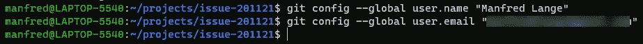

# WSL2 上的 Docker 桌面:混合文件系统的问题

> 原文：<https://levelup.gitconnected.com/docker-desktop-on-wsl2-the-problem-with-mixing-file-systems-a8b5dcd79b22>

## 将 Windows 目录装入容器时，如何避免因缺少文件更改事件而导致的问题


在本文中:

*   查找使用 WSL2 时将 NTFS 文件夹装入 dev 容器的问题的根本原因
*   正在安装 Linux 版本 2 的 Windows 子系统(WSL2)
*   在 WSL2 中安装 Linux 发行版
*   配置 git 以便在 Linux 发行版中使用
*   在 Linux 发行版中启动 VS 代码
*   启动并连接到开发容器
*   避免常见陷阱

# 介绍

最初，我以为这篇文章是关于。网芯。然后，当我运行使用 NTFS 文件夹的 dev 容器时，我遇到了我认为的 VS 代码扩展的问题。

在过去，我的设置非常有效。然而，最近在我阅读了几份报告后，我转向了 WSL2，特别是文件操作快了 2 到 4 倍。问题是在切换到 WSL2 之后开始的。

我观察到的一个问题是，C#扩展，即 OmniSharp，在引用一个类型时，停止提出诸如是否添加 using-statement 的建议。此外，代码中有许多红色的曲线。过去，要解决这个问题，我只需重启 OmniSharp。这在某种程度上仍然有效，但现在我必须每隔几分钟重启一次。然后，Roslynator，我最喜欢的扩展之一，开始出现问题，并最终停止工作。

因此，我决定把这件事弄个水落石出。

## 根本原因

为了理解根本原因，我们需要深入研究一些技术细节。

在我的研究结束时，我得出结论，根本原因本质上是从 WSL1 到 WSL2 的回归。例如，这篇来自 2016 年 10 月的[博客文章指出 inotify &文件系统更改通知被添加到 WSL1 中。然而，](https://devblogs.microsoft.com/commandline/wsl-adds-inotify-filesystem-change-notification-support/)[在 Build 2019](https://youtu.be/lwhMThePdIo) 上的讲话和[在 Docker Desktop for Windows 的一个问题上的评论](https://github.com/docker/for-win/issues/8479#issuecomment-692827857)证实了 WSL2 的 inotify 问题。在 Build 2019 的演讲中，演讲者说 inotify 支持是为未来计划的(参见演讲结尾的 Q & A 部分)。在 Github 上提交的这个问题表明，在撰写本文时，inotify 还没有实现。项目经理 Craig Loewen 的评论也证实了这一点(他是

下图显示了我的设置(LXFS = Linux 文件系统，NTFS = NT 文件系统)。请注意，这个图表并不完全准确。它的唯一目的是帮助说明问题。


在此设置中，文件夹托管在 Windows 上。这意味着它在 NT 文件系统(NTFS)中。当 dev 容器启动时，NTFS 文件夹被挂载到容器中。然而，该容器使用 Linux 文件系统(LXFS)。当使用 VS 代码在 dev 容器中远程工作时，所有 VS 代码扩展也在那里执行。然而，在这个设置中，从 dev 容器的角度来看，我们混合了文件系统。大部分是 Linux 文件系统，但是挂载的文件夹其实是 NTFS。

这种混合导致了问题。因为 NTFS 和 LXFS 非常不同，例如权限管理，所以需要映射两者之间的功能。这包括有关目录和文件更改的通知。对于 WSL1，通知(即对 inotify 的支持)已经实现并起作用。对于 WSL2，如上所述，还不支持 inotify。

一些 VS 代码扩展依赖于在文件或目录改变时得到通知。例如，当创建一个新文件时，OmniSharp 会对其进行分析，然后提出建议或指出错误。显然，当关于改变的文件或目录的通知没有被发送时，这不再起作用。

因此，我现在需要一个不同的解决方案来完成这项工作。找到这个解决方案始于我在上面提到的一个问题中发现的评论:

“是的，将您的文件保存在 WSL 2 文件系统中。不要跨虚拟机边界共享它们，因为这样做性能不佳，而且会失去智能。”(来源:[评论此处](https://github.com/docker/for-win/issues/8479#issuecomment-692827857))

不幸的是，我无法找到关于工作设置的足够详细的信息，所以决定根据各种来源的信息来弄清楚。具体来说，我不确定如何“将所有内容保存在 Linux 文件系统中”。本文描述了如何实现这一点，以及一个有效的开发环境是什么样子的。

## 先决条件

跟随这篇文章你需要的是:

*   Windows 10 版本 1909 内部版本 18362 或更高版本
*   [Docker 桌面 Windows 版](https://www.docker.com/products/docker-desktop)2.5.0.1，使用 WSL2 集成(见下文)
*   【Windows 版 Git
*   [Git 凭证管理器](https://github.com/Microsoft/Git-Credential-Manager-for-Windows)(注意:在编写新的 [Git 凭证管理器核心](https://github.com/microsoft/Git-Credential-Manager-Core)时，它还处于测试阶段，所以我们不会在本文中使用它)

# 用于 Linux 的 Windows 子系统(WSL)，版本 1 和 2

Docker 如果运行在 Linux 上效果最好。这是因为当它这样做时，它可以与主机共享操作系统资源。Windows 作为一个操作系统与 Linux 非常不同，这使得同样的紧密集成非常困难。这就是为什么，微软几年前推出了 Linux 的 Windows 子系统(WSL)。

Windows 在 20 世纪 90 年代被称为 Windows NT。很多人没有意识到的是，Windows NT 从一开始就被设计成有多个子系统。最初有 OS/2、POSIX 和 Win32 的子系统。当程序启动时，它可以指示它需要这些“个性”中的哪一个，即它想要使用哪一组 API。

随着时间的推移，这些最初的子系统被淘汰。但是，Windows NT 内核保持了支持 Win32 以外的子系统的能力。用于 Linux 的 Windows 子系统(WSL1)使用这种机制(参见[“用于 Linux 的 Windows 子系统概述”](https://docs.microsoft.com/en-us/archive/blogs/wsl/windows-subsystem-for-linux-overview))。为了允许本机 Linux ELF64 二进制文件运行，子系统将模拟 fork()之类的系统调用。系统调用将被翻译成对 Windows NT 内核的调用。WSL1 没有使用 Linux 内核。


WSL1 架构

WSL2 改变了这一点。微软开发了一个合适的 Linux 内核，并使其与 NT 内核共存。WSL2 不使用模拟器调用 Windows NT 内核，而是使用真正的 Linux 内核，它与 Windows NT 内核并行运行。

两个内核都运行在一个薄薄的管理程序层上。事实上，当您在 Windows 10(即 Hyper-V)上启用虚拟化服务时，虚拟机管理程序就会接管，而 NT 内核只是运行在虚拟机管理程序之上的虚拟机。这种设计允许 WSL2 在与 Windows NT 内核并行运行的独立虚拟机中使用真正的 Linux 内核。


WSL2 架构

现在有几个 Linux 发行版可以安装在 WSL2 上，甚至可以同时安装几个。您可以将其中一个设置为默认值。你可以随意切换。下图显示了这种设置。请注意，多个 Linux 实例运行在同一个 Linux VM 中。


带有多个 Linux 发行版的 WSL2

现在有几个 Linux 发行版可以安装在 WSL2 上，甚至可以同时安装几个。您可以将其中一个设置为默认值。你可以随意切换。下图显示了这种设置。请注意，多个 Linux 实例运行在同一个 Linux VM 中。

# 装置

## WSL2 和 Linux 发行版

我不会详细讨论安装启用 WSL2 的所有先决条件。这取决于你使用的 Windows 10 的版本和版本。在某些情况下，您必须升级到更新的版本。最低版本是内部版本号 18362。我使用的是 1909 版本，编译号是 18363。我还没有更新到 Windows 10 版本 2004 或更高的版本号。

要安装必备软件，请参考这篇[文章](https://docs.microsoft.com/en-us/windows/wsl/install-win10)。那篇文章还描述了您选择的 Linux 发行版的安装。截至发稿时，有 12 个可供选择。出于本文的目的，我选择了“Ubuntu 20.04 LTS ”,因为它已经预装了“git ”,而且我过去也使用过 Ubuntu。如果你已经有其他发行版，没问题。只要确保其中一个是 Ubuntu 20.04，如果你想跟踪这篇文章。

## 安装 Docker 桌面

当您安装 Docker Desktop for Windows 时，请确保您选择了 WSL2 集成。如果您在安装/启用 WSL2 之前安装了 Docker，那么请完全卸载 Docker 并重新安装。重新安装时，选择 WSL2 集成。

## 配置 Docker 桌面

一旦您按照步骤安装了 WSL2 和 Linux，现在是时候确保我们可以在我们的开发环境中使用发行版了。特别是，我们需要确保 Docker 与我们的发行版相集成。

在 Windows 上，打开 Docker 桌面，进入“设置”。然后选择“资源”，然后选择左侧的“WSL 集成”:


与 WSL2 和发行版集成的 Docker 设置

确保选中了与默认 WSL 发行版的集成，并且启用了与“Ubuntu 20.04”的集成。

# 查找主目录

# 在文件资源管理器中查找主目录

在 Windows 中，打开文件资源管理器，并在地址栏中键入“\\wsl$”。您应该会看到类似下面的内容:


任何发行版中的 Linux 文件系统在 Windows 资源管理器中都显示为网络驱动器。Windows 是客户机，每个 Linux 发行版充当文件服务器。

目前您应该有三个这样的“网络驱动器”:

*   " docker-桌面"
*   " docker-桌面-数据"
*   " Ubuntu-20.04 "

前两个是由 Docker Desktop 创建的，我们可以放心地忽略它们。我们对标有“Ubuntu-20.04”的那个感兴趣。这个网络驱动器让我们能够访问我们刚刚安装的发行版的 Linux 文件系统。在幕后，Linux 使用 9P 协议运行一个文件服务器。在这种情况下，Windows 资源管理器是一个 9P 客户端。

“Ubuntu-20.04”的内容应该类似于以下内容:


正如您可能注意到的，这是 Linux 文件系统顶部的一组标准目录。让我们看看“home”目录的内部。


Linux 上主目录的内容

通常，“home”目录包含每个用户的子目录(除了“root”)。您应该会看到一个这样的目录。它有你安装 Ubuntu 发行版时选择的任何用户的名字。在我的例子中，我选择了“曼弗雷德”，没有明显的原因。

让我们检查一下用户目录的内容。您应该选择您在安装发行版时选择的用户目录，在我的例子中是“manfred ”:


用户主目录的内容

在您的情况下，该目录的内容可能会有所不同。

在这种情况下，通过使用 Windows 文件资源管理器，我们可以从 Windows 的角度查看该目录。不过，你看到的文件是在 Linux 文件系统中。这是 Linux 和 Windows 之间集成变得明显的一个地方。

## 在 Linux 中查找主目录

接下来，让我们从 Linux 的角度，即从我们安装在 WSL2 上的发行版中找到我们的主目录。我们将使用在终端内部运行的 bash 来访问 Linux 发行版。

使用“开始”按钮或 windows 键，然后开始键入“Ubuntu ”,直到您看到“Ubuntu 20.04 LTS 应用程序”作为建议:


启动 Ubuntu 终端

当你点击“Ubuntu 20.04 LTS”时，你应该会发现自己在一个运行 bash 的终端窗口中:


Bash 在终端中——用户在他们的主目录中(“~”)

在您的情况下，提示符将显示不同的用户名和计算机名。在终端中输入并执行以下命令:

```
ls -lart
```

这列出了当前目录的内容:


Linux 发行版上用户主目录的内容

将该命令的输出与我们上面使用的 Windows 资源管理器的内容进行比较。除了额外的两个条目“.”之外，内容是相同的还有“..”它们表示 Linux 中的当前目录和父目录。

接下来，我们在终端窗口中运行命令“pwd ”,它显示了当前目录的完整路径:


所以，我们确实在“/home/manfred”目录中(或者你选择的用户名是什么……我想你明白了)。在 Linux 中没有驱动器号。一切都从根开始，根是“/”。

注意提示符(“$”)前面的“~”(波浪号)。这是主目录的简短表示。为了方便起见，在 Linux 中当你输入“cd ~”时，你将被带到你的主目录。

那么，我们下一步做什么？我们需要弄清楚如何让 VS 代码运行起来。我们需要让它运行起来，这样它不仅可以运行，还可以使用 Linux 文件系统，也就是说，本质上是运行在 WSL2 上的发行版的文件系统。听起来很复杂，但实际上只是我们已有产品的延伸。

## 潜在的陷阱

如果你打开一个终端，你可能会发现自己在一个名为“/mnt/c/User/ <username>”的文件夹中。例如:</username>


不要在这个目录中启动 VS 代码。此目录是从 NTFS 装载的，因此不会发送文件更改通知。请使用“cd ~”切换到您的个人目录:


使用“pwd”进入主目录(“~”)

您可以使用命令“pwd”来确认您是否在正确的目录中。

**记住:**目录“/mnt/c/Users/ <用户名>和“/home/ <用户名>不一样。前者是从 NTFS 挂载的。后者是 Linux 文件系统真正的一部分。

# 将 Repo 克隆到 WSL2 上的 Ubuntu 中

随着 Ubuntu 终端的打开，我们接下来将创建一个回购场所。在终端中，确保您在主目录中。可以用“pwd”来确认。如果您不在主目录中，您可以随时使用“cd ~”到达那里。

然后执行以下命令:

```
mkdir projects
```

这将创建一个新的目录“projects ”,我们将使用它来克隆存储库。用“cd 项目”切换成项目。

在本文中，我们将使用我用来诊断 windows 和 Linux 文件系统间同步问题的 repo。使用以下命令克隆该存储库:

```
git clone [https://github.com/ManfredLange/issue-201121.git](https://github.com/ManfredLange/issue-201121.git)
```

如果你愿意，你也可以叉这个回购。这将为您带来优势，即您还可以在试验此回购时推送提交。

输出应该类似于以下内容:


从 github 克隆 git repo

因为我们想使用 git，所以我们需要确保我们已经设置了我们的名字和电子邮件。为此，请使用以下命令:

```
git config — global user.name “<your user name>”
git config — global user.email “<your email address>”
```

例如:



在发行版中配置 git 客户端

最后一步是配置 git 凭证管理器，因为我们不想为每个可能需要它的 git 操作输入凭证。好消息是:由于 WSL2 的集成，我们可以使用安装在主机上的 git 凭证管理器，例如在 Windows 中。我们需要做的就是执行这个一次性命令(全部在一行中):

```
git config — global credential.helper “/mnt/c/Program\ Files/Git/mingw64/libexec/git-core/git-credential-manager.exe”
```

这是一次性的。如果我们创建了一个新的发行版或者重置了一个现有的发行版，我们只需要为 git 重复这些配置步骤。

# 开始 VS 代码

配置好 git 并将存储库克隆到“项目”目录中后，我们就可以开始 VS 代码了。在目录“~/projects/issue-201121”中，执行以下命令:

```
code .
```

由于 WSL2 和 Windows 系统之间的集成，这将无缝地工作。WSL2 提供的集成允许它在服务器上找到命令“代码”。我们将当前目录作为参数传递。当前目录由“.”表示。

VS 代码启动后，看一下 VS 代码窗口的左下角。它将显示类似“WSL: Ubuntu-20.04”的内容:


VS 代码远程连接到 WSL2 上的 Ubuntu

接下来，在 VS 代码中打开一个终端窗口。这应该类似于以下内容:


VS 代码中进入发行版的终端窗口

这表明终端正在发行版内部运行。

此时，VS 代码前端正在主机上运行。后端，即 vscode-server，运行在发行版内部。当我们启动命令(例如 git)或终端时，它们也会在发行版内部执行。

# 启动开发容器

最后一步是启动 Dev 容器。由于 backed 运行在发行版内部，这也意味着 docker 命令可以在那里执行。因为我们已经打开了 docker 和我们的发行版之间的集成，docker 命令将与在不同的“发行版”中运行的 docker 引擎交互，这个发行版是 Docker 已经安装的(见上文)。

在 VS 代码窗口中点击绿色左下角。这将显示一个与远程工作相关的命令菜单:


我们将选择“远程容器:在容器中重新打开”。当这个命令执行时，请注意 VS 代码窗口的绿色左下角的文本是如何变成类似“Dev Container: repro”的内容的:


请注意用户如何更改为“repro ”,机器名称如何更改为 dev 容器的名称。现在显示的路径是“/workspace”，如果我们运行“ls -lart ”,我们会看到类似下面的内容:


## 在开发容器中构建并运行

显然，我们还需要检查这个设置实际上是否有效。使用命令切换到子目录“CmdLine ”:

```
cd CmdLine
```

然后执行命令:

```
dotnet run
```

如果我们看到熟悉的“你好，世界！”与下面类似，我们知道我们可以构建并运行这个简单的控制台程序:


“你好，世界！”从运行在 WSL2 上的 dev 容器内部

# 结论

总之，我们现在有了一个设置，我们在 Windows 主机上运行 VS 代码前端，在 dev 容器中运行 VS 代码后端(VS Code-server ), dev 容器又在 docker-engine 中运行。docker 也运行在 Linux VM 中。下图说明了这种新的设置:


WSL2 的新设置

在这个设置中，我们将 git 存储库克隆到 Linux 文件系统中，而不是 NTFS。当 dev 容器启动时，带有 repo 克隆的目录被挂载。由于我们现在运行的是一个真正的 Linux 内核，并且对发行版中的原始文件夹和 dev 容器中的原始文件夹使用相同的文件系统，所以文件夹和文件的更改通知会按预期发送。

最后，扩展再次像魔法一样工作。性能真的很好，虽然不是惊人的快。但话说回来，性能取决于许多不同的因素。我可以确定的是，这个设置到目前为止运行可靠，速度很快，并且最终解决了经常中断工作流程的问题。

虽然这是一篇相当专业的文章，但我希望通过分享这篇文章，我能帮你节省一些时间。如果你喜欢这篇文章，请考虑关注我或者通过[我的推荐页面](https://manfredmlange.medium.com/membership)订阅 Medium。

感谢您的阅读！

# 参考资料和附加材料

和往常一样，这里有一些相关和附加材料的链接，如果您想了解更多细节或想探索相邻的主题，这些链接可能会有所帮助。因为本文的主题非常专业，所以下面的列表比通常的要长:

*   在 Github 上提交的问题回复通知:["[wsl 2]Windows 文件系统上 Windows 应用程序所做的文件更改不会触发 Linux 应用程序的通知"](https://github.com/microsoft/WSL/issues/4739)
*   用于 Linux 的 Windows 子系统[用于 Windows 10 的安装指南](https://docs.microsoft.com/en-us/windows/wsl/install-win10)。这是为了更新到 WSL2(可以与 WSL1 共存)和安装新的发行版
*   微软教程:[“在 Linux 的 Windows 子系统上开始使用 Git”](https://docs.microsoft.com/en-us/windows/wsl/tutorials/wsl-git)
*   微软于 2016 年 4 月 22 日发布的博客文章，简要介绍了 windows 子系统的历史和 WSL 第一版的技术细节:[“Linux 的 Windows 子系统概述”](https://docs.microsoft.com/en-us/archive/blogs/wsl/windows-subsystem-for-linux-overview)
*   微软教程:[《Docker 远程容器入门》](https://docs.microsoft.com/en-us/windows/wsl/tutorials/wsl-containers)
*   中型文章:[“为。净芯"](https://manfredmlange.medium.com/building-a-dev-container-for-net-core-e43a2236504f?sk=36b027cd308db721daec6d5b726da367)。这包括作为非根用户运行的说明。
*   [“面向 Linux 架构的全新 Windows 子系统:深度探讨”](https://youtu.be/lwhMThePdIo) (58 分钟)，在 Microsoft Build 2019 上的演讲
*   微软文档:[“比较 WSL1 和 wsl 2”](https://docs.microsoft.com/en-us/windows/wsl/compare-versions)
*   Docker 文章:[《Docker 桌面 WSL2 后端》](https://docs.docker.com/docker-for-windows/wsl/)。这篇文章还指出“如果原始文件存储在 Linux 文件系统中，Linux 容器只接收文件更改事件(inotify)”。然而，没有进一步的细节是什么意思。如果你对 Windows、WSL2 和 Linux 如何协同工作了解不够，这可能是一个陌生的领域。