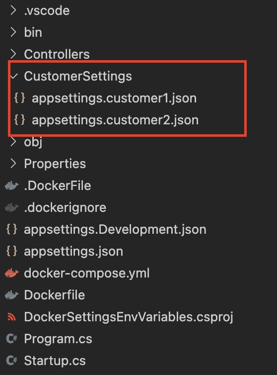

# 码头工人和。Net —环境变量和 appsettings.json

> 原文：<https://levelup.gitconnected.com/docker-environment-variables-appsettings-json-net-bdac052bf3db>


卡尔·帕夫洛维奇在 [Unsplash](https://unsplash.com?utm_source=medium&utm_medium=referral) 的照片

如果你已经和。网络，又名。你可能已经注意到在 *appsetting.json* 文件中存储一些设置是多么方便。除了使用一个 *JSON* 文件的灵活性之外，获取和管理这些信息的方式非常简单。

但是，如果您在 Docker 容器中运行应用程序，并且出于某种原因想要对其进行更改，这可能会有点复杂。
尽管如此，使用环境变量的概念还是很有帮助的。

# 问题是

假设我们的应用程序运行在 Docker 容器中。但是，我们需要每个客户有一个或多个容器，每个客户有不同的设置。那么，我们能做些什么来解决这个问题呢？

# 应用程序

为了说明这个问题，我创建了一个只有一个端点的非常简单的 Web API。这个端点的功能很简单，只需要从 appsettings.json 中读取设置并显示出来即可。如果你愿意，你可以从 Github 克隆完整的源代码:

```
git clone https://github.com/lbazetto/DockerEnvironmentVariablesDotNet
```

## appsettings.json 文件

在 appsettings.json 中，我们保留了所有的默认值，只是增加了两个部分:
- MyFirstValueCustomConfig —简单字符串
- ComplexConfig —带有子对象的数组

完整文件:

## web API 端点

因为端点为我们做的唯一事情是从 appsettings.json 文件中读取数据，所以我们的代码可以是这样的:

## 文档文件

Dockerfile 文件也非常基本:

## 输出

运行应用程序，到达端点([http://localhost:5000/settings](http://localhost:5000/settings))我们将得到结果:

```
["I'm the first custom setting","Hi, Complex!"]
```

好了，现在我们有了问题和应用，让我们探索解决方案。

# 解决方法

我们的想法是尝试展示不同的解决方案，以及每种方案的优缺点。

## 解决方案 1 —每个客户一个 Docker 图像

首先，我们可以用所有默认设置创建一个基础图像。然后，为每个客户建立一个包含这些新价值的新形象。

优点:
-每个客户的独立定义
-在您想要为特定客户实现某些东西的场景中会很有帮助(这是我一直试图避免的😂)

缺点:
-难以维护
-存储消耗高

## 解决方案 2 — Docker 卷

其次，我们可以使用卷。这是什么？遵循关于[卷](https://docs.docker.com/storage/volumes/)的 docker 定义，我们有:

> 卷是保存 Docker 容器生成和使用的数据的首选机制。

在我看来，这将比我们的第一个解决方案更好，因为我们可以对所有客户使用相同的基础映像，并且每个客户只有一个不同的文件。

假设我们在根目录中有一个名为 CustomerSettings 的文件夹，如下所示:



客户设置

该卷的另一个优点是无需编码就能自动重命名文件/文件夹。这样，不管我们在容器外部为文件选择什么名称，在容器内部我们总是期望相同的名称(appsettings.json)。docker-compose 文件可能是这样的:

docker-用卷合成文件

然而，这种方法的缺点是要按照您的容器编制器/云提供商的规则/要求来管理和配置数据存储。这个提案的概述是:

优点:
-所有客户的基本形象相同

缺点:
-存储管理

## 解决方案 3 —环境变量

除此之外，还有另一种非常有用的方法，可以混合上述解决方案的优点，即[环境变量](https://docs.microsoft.com/en-us/aspnet/core/fundamentals/environments)。
根据维基百科[的定义](https://en.wikipedia.org/wiki/Environment_variable):

> 环境变量是一个动态命名的值，它可以影响计算机上正在运行的进程的行为方式。它们是流程运行环境的一部分。

除此之外，Docker 有一个很好的机制来处理这个资源。

同样，解决方案 2 的想法是只有一个基础映像，并为每个容器设置数据。按照上面例子的相同概念，我们将使用 docker-compose 文件来注入信息。但是现在，我们将替换环境变量的卷:

优点:
-所有客户使用相同的基本映像
-没有存储管理

缺点:
-依赖于变量/结构的数量可能很难维护

# 结论

在 docker 容器中使用环境变量可能是一个很好的匹配，因为您可以提取这种组合的优点，而无需向应用程序添加额外的代码。

那么，你觉得怎么样？你喜欢用另一种方法吗？这对你有帮助吗？随时欢迎反馈！

非常感谢您的宝贵时间！👋