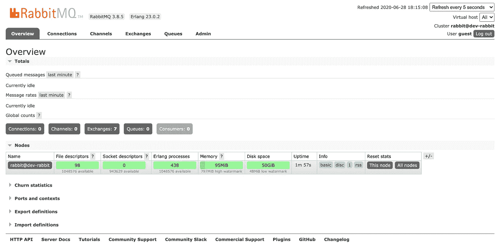
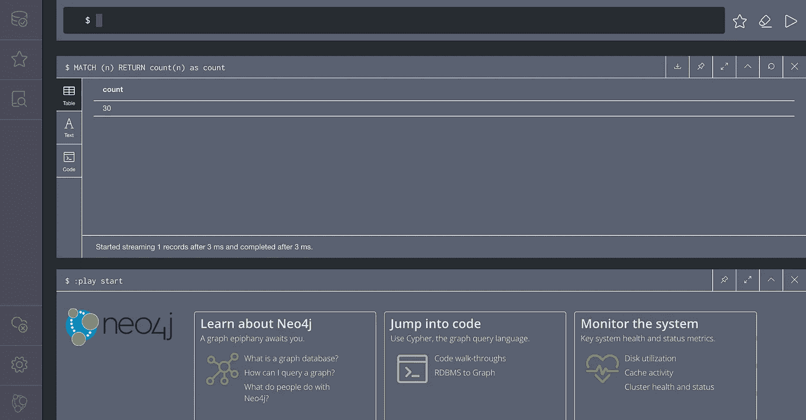
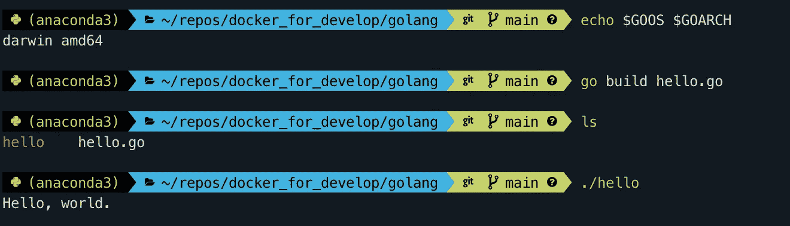
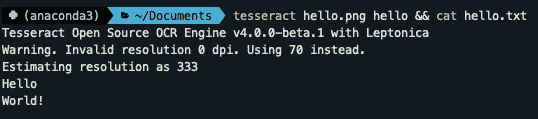

# Docker for Development:服务容器与可执行容器

> 原文：<https://levelup.gitconnected.com/docker-for-development-service-containers-vs-executable-containers-9fb831775133>


作者通过 [Flickr](https://www.flickr.com/photos/cmmorrow/8129936745) 拍摄的照片

通常，软件项目依赖于第三方服务和软件。示例包括关系数据库、消息代理或电子邮件服务。当开始一个新的软件项目或加入一个现有项目的开发团队时，安装所有必需的依赖项可能是一项艰巨而耗时的任务。您可以使用 Docker 来确保您使用的是所需软件的正确版本和配置，而不是大量的入门说明和一丝不苟地安装所有必需的软件依赖项。这就是使用 Docker 容器的美妙之处！

## Docker 是什么？

Docker 是一个用于启动和管理容器的软件平台。Docker 容器是运行进程和命令的自包含环境。它与主机操作系统的其余部分以及其他 Docker 容器相隔离。每个容器都有自己的网络、文件系统，并且启动速度很快，因为它不具备完整操作系统中的所有功能(比如图形用户界面)。容器是从图像实例化的，其中图像是您希望 Docker 运行的所有“东西”。映像从一个基础映像开始，它可能是一个特定版本的 [Postgresql](https://www.postgresql.org/) 数据库、 [Ubuntu](https://ubuntu.com/) Linux 发行版或者任何其他可以在 Linux 上运行的定制软件。您甚至可以通过在其他图像上分层定制配置来制作自己的 Docker 图像！

## 发展码头

Docker 是一个很棒的工具，通过使项目的软件依赖可靠、可重复、易于安装和运行，可以使开发更容易。然而，对于 Docker 的所有灵活性来说，一个陡峭的学习曲线和 Docker 最佳实践的智慧。在某些情况下，你可能认为直接在你的机器上安装软件更容易。在你的机器上本地安装软件和使用 Docker 容器有点像买书和从图书馆借书。随着你开始买越来越多的书，你必须在家里为所有这些书腾出空间。如果你经常从图书馆借书，你可以在看完之后把它们还回去，这样就不需要额外的书架空间了。

不熟悉 Docker 的开发人员经常遇到的另一个问题是知道什么软件值得作为 Docker 容器运行。在一个 Docker 容器中运行多个应用程序和框架或者完全在一个 Docker 容器中开发可能很有吸引力。这是构建大型容器或使您的开发环境比需要的复杂得多的一种可靠方法。简单性是关键，坚持只运行 Docker 容器中的单个服务或可执行文件，可以节省时间，提高工作效率。

## 服务容器

通常，服务很适合作为 Docker 容器运行。服务是作为单独、独立、长期运行的后台进程运行的任何第三方软件，您的项目将与之交互。示例包括数据库、web 服务器和全栈应用程序，如 JIRA 或詹金斯。将服务作为 Docker 容器在本地运行很容易，因为您将安装项目所需的服务版本，而不必安装它的所有依赖项。(它们已经包含在容器中了！)

作为一个例子，让我们看看如何将 [RabbitMQ](https://www.rabbitmq.com/) 消息代理作为 Docker 容器运行。首先，确保你已经安装了 Docker。你可以按照这里的说明[为你的操作系统安装 Docker。接下来，在终端中复制并执行下面的代码:](https://docs.docker.com/get-docker/)

这个命令有什么作用？它将基于标记为`management`的官方 RabbitMQ Docker 映像，以分离模式运行一个名为`dev-rabbit`的新 Docker 容器。它还会将容器的主机名改为`dev-rabbit`，并将容器的端口 15672 映射到我们主机的端口 15672。这一切意味着什么？如果主机上不存在官方 RabbitMQ Docker 镜像，将从 Docker Hub 下载，特别是将下载并使用`management`标记的版本。一分钟后会有更多的介绍。通过设置端口映射和主机名，容器中的 RabbitMQ 将像 RabbitMQ 在本地 Linux 主机上运行一样工作。`management`标记的版本包括管理插件，所以我们可以使用 user/pass `guest/guest`进入`[http://localhost:15672](http://localhost:15672)`来访问 RabbitMQ 管理插件的基于浏览器的 UI。



容器将继续运行，直到主机关闭，或者我们手动告诉 Docker 停止运行容器。我们可以随时使用命令`docker stop dev-rabbit`停止集装箱，并使用`docker start dev-rabbit`再次手动启动集装箱。因为我们最初是以分离模式运行 Docker 容器的，`dev-rabbit`容器将始终作为后台进程运行，并且可以用`docker logs dev-rabbit`查看它到 stdout 的输出。

让我们看看服务容器的另一个例子。让我们将 [Neo4j](https://neo4j.com/) 图形数据库作为 Docker 容器运行。运行下面的终端命令来配置和启动容器:

该命令基于标记为`latest`的官方`neo4j` Docker 映像，在分离模式下运行一个名为`dev-neo4j`的新 Docker 容器。该命令还将主机上的端口 7474 和 7687 映射到容器中的端口 7474 和 7687。这个例子与 RabbitMQ 例子的主要区别是`--volume`选项。该选项将主机上的`$HOME/neo4j/data`目录(在类似 Unix 的操作系统上)映射到 Docker 容器中的`/data`目录。`/data`目录恰好是 Neo4j 存储数据库数据的地方。通过以这种方式使用`--volume`选项，我们增加了数据持久性，这意味着即使容器被删除，数据仍将保留在主机的磁盘上。您可以通过向新的 Neo4j 数据库添加几个节点来测试这一点(访问 [http://localhost:7474](http://localhost:7474) 以使用 Neo4j)，然后运行以下命令来删除容器:

```
docker rm dev-neo4j
```

运行下面的命令将显示数据仍然存在！

```
ls $HOME/neo4j/data
```

这意味着相同的数据可以用于不同版本的 Neo4j，甚至不同的 Docker 容器。



正如您所看到的，在您的机器上本地运行服务容器是简单明了且易于管理的。通过更改标记的版本，或者运行带有`latest`标记的 Docker 容器，甚至可以很容易地升级到服务的新版本。由于有许多官方 Docker 映像的标记版本，找到与您的生产部署相匹配的服务版本应该不成问题。此外，如果您完成了项目工作，并且不再需要本地安装的服务，那么只需使用以下命令删除 Docker 容器，就可以从您的机器上删除该服务:

```
docker rm [container name]
```

## 可执行容器

服务是 Docker 容器最常见的用例。然而，可执行的命令行应用程序也可以作为 Docker 容器运行！可执行文件是一个命令行应用程序，它启动、执行一个操作，并在完成或遇到错误时退出。它们是短暂的，而且异常专注。可执行文件的一些例子是命令行工具，如`grep`、`ls`和`cp`。其他例子是你可能已经安装的命令行应用程序，如 [curl](https://curl.haxx.se/) 、 [ImageMagick](https://imagemagick.org/index.php) 或 [git](https://git-scm.com/) 。事实证明，只要多做一点工作，您也可以将可执行文件作为 Docker 容器来运行！

但是，为什么要将命令行应用程序作为容器来运行呢？从软件包管理器或安装程序安装应用程序非常容易。事实证明，这并不总是那么简单。如果需要安装同一个应用程序的不同版本怎么办？如果您的操作系统没有可用的安装程序，或者软件包管理器中没有可用的应用程序，该怎么办？如果您唯一的选择是从源代码安装，该怎么办？为了减轻这些情况带来的痛苦，您可以创建一个临时的 Docker 容器来运行您的应用程序，并在完成后销毁该容器。

让我们看一个例子。比方说，你正在做一个 [Python](https://www.python.org/) 项目，其中有一部分是用 [Go](https://golang.org/) 编写的。你可以在你的机器上安装 Go 并在你完成项目后移除它，或者你可以安装`[go](https://golang.org/cmd/go/)` [命令](https://golang.org/cmd/go/)作为 Docker 容器。这将允许你为目标系统编译 Go 代码，不管你在什么操作系统上开发，都不需要安装 Go！

首先，让我们使用下面的 Hello World 程序示例作为我们要编译的 Go 代码。将下面的代码复制到名为`hello.go`的文件中:

接下来，我们需要创建 Docker 容器`run`命令作为 shell 脚本，我们可以从命令行调用它。将以下代码复制到名为`go`的文件中:

这个 shell 脚本通过使用 Docker Hub 官方最新的`golang`映像来运行一个新的 Docker 容器。重要的是，`--rm`选项告诉 Docker“remove”，也就是说，当它执行完后删除容器。我们还需要一种将 Go 代码放入容器的方法。使用`--volume`选项，通过将环境变量`$PWD`(运行 shell 脚本的目录)映射到容器中的`/usr/src/app`来实现这一点。`-w`选项将容器中的工作目录设置为`/usr/src/app`——Go 代码将被编译的目录。`-e`选项设置容器中的环境变量，在本例中`GOOS`和`GOARCH`设置为 shell 中`$GOOS`和`$GOARCH`的值。Go 语言具有真正有用的能力，可以为特定的操作系统和架构交叉编译 Go 代码，而不管你编译的是什么操作系统和架构。这两个环境变量都允许我们设置要为哪个操作系统和架构编译代码。我们的 shell 脚本的最后一行告诉 Docker 运行容器中的`go`命令以及传递给 shell 脚本的任何参数。注意这次没有`--name`选项。如果没有这个选项，Docker 将为容器分配一个随机的匿名名称。

接下来，将`go`文件保存到`/usr/local/bin`或您的`$PATH`中的等效目录。通过使用以下命令更改权限，确保文件是可执行的:

```
chmod 755 /usr/local/bin/go
```

请确保您的系统中尚未安装 Go。如果您这样做了，请确保我们刚刚创建的 shell 脚本将被调用:

```
which go
```

只要结果是`/usr/local/bin/go`，您就一切就绪，否则，您需要将您的`go` shell 脚本移动到之前在`$PATH`中调用的另一个目录，修改您的`$PATH`顺序，或者重命名`go` shell 脚本。

确保为您当前使用的机器设置您的`$GOOS`和`$GOARCH`环境变量。这一点很重要，因为它可能会阻止编译后的程序可执行。在我的例子中，我使用的是 macOS，所以我将环境变量设置为:

```
export GOOS=darwin
export GOARCH=amd64
```

导航到保存`hello.go`的目录。现在，在终端上运行下面的命令来编译`hello.go`:

```
go build hello.go
```

一两秒钟后，编译将完成，您将在当前目录中拥有一个`hello`可执行文件。用`./hello`运行编译好的程序。



恭喜你，你没有安装 Go 就编译了 Go 代码！

让我们看最后一个例子。我们可以使用可执行的 Docker 容器运行开源的 [Tesseract](https://tesseract-ocr.github.io/tessdoc/Home.html) OCR(光学字符识别)命令行应用程序。在这种情况下，Docker Hub 上没有正式的映像，但是我们可以通过创建 Docker 文件为 Tesseract 创建一个 Docker 映像。Docker 文件包含构建 Docker 映像的所有说明。将下面的代码复制到名为 Dockerfile 的新文件中:

第 1 行表明`ubuntu` Docker 图像将被用作我们新 Docker 图像的基础。第 3 行表示一旦 Docker 容器运行，就安装 Tesseract 包。第 4 行表示工作目录应该更改为`/tesseract`。最后，执行`tesseract`命令。当我们从这个映像创建一个新的 Docker 容器时，这些命令将按顺序运行，但是在运行我们的容器之前，我们首先需要构建 Docker 映像。

我们可以使用下面的命令在 Docker 文件所在的目录中构建 Docker 映像:

```
docker build -t tesseract_ocr:latest .
```

`-t`选项用标签`latest`将图像的名称指定为`tesseract_ocr`。

现在我们有了一个 Tesseract 图像，我们可以编写一个 shell 脚本来创建并执行一个基于`tesseract_ocr`图像的 Docker 容器。将下面的代码复制到名为`tesseract`的新文件中:

这个 shell 脚本使用我们的`tesseract_ocr`图像运行一个新的 Docker 容器。就像 Go 脚本一样，`--rm`选项告诉 Docker“删除”，也就是说，当它完成执行时删除容器。第一个卷绑定将执行 Tesseract 的目录映射到`/tesseract`目录，您可能还记得，这是`tesseract_ocr`映像的工作目录。第二个卷绑定将`/var/folders`目录映射到主机上 Tesseract 用于临时文件存储的同一目录。最后，最后一行执行`tesseract_ocr`图像，然后执行`tesseract`命令以及我们提供的任何命令行参数。

将`tesseract`脚本复制到`/usr/local/bin`或`$PATH`中的另一个目录，并确保使用以下命令更改权限:

```
chmod 755 /usr/local/bin/tesseract
```


hello.png

使用上面的图像`hello.png`，我们可以将图像传递给 Tesseract 来读取文本*“Hello World！”*来自图片。以下命令在`hello.png`上运行 Tesseract OCR，将文本保存到`hello.txt`，并将结果显示到 stdout:

```
tesseract hello.png hello && cat hello.txt
```



很酷吧？

## 结论

我们已经看到了服务容器和可执行容器的例子。服务容器相当简单，运行需要启动和停止的长时间运行的流程。可执行容器通常更复杂，难以配置和运行单一焦点、短命的应用程序。两者都有自己的用例，可以帮助你更有效地工作。通过一点创造性和试验，您将能够将任何服务或可执行文件转换成 Docker 容器。黑客快乐！