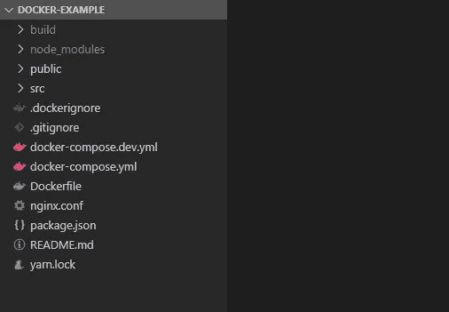

# 面向前端开发人员的 Docker

> 原文：<https://levelup.gitconnected.com/docker-for-frontend-developers-4eeaedf10dc7>


Philippe Oursel 在 [Unsplash](https://unsplash.com?utm_source=medium&utm_medium=referral) 上的照片

当一个新的开发人员进来时，他面临着启动开发环境的任务。直到最近，它经常变得像用手鼓跳舞。安装 10 个不同版本的包，结果你自己的宠物项目需要不同的版本，甚至可能是同一作品中的另一个项目。每次专家都以他自己的方式摆脱了这种情况，但是除了在这种配置上花费的时间之外，主要的问题仍然是不能保证从开发人员到开发人员或运行人员的性能。

幸运的是——这个问题在现代世界的发展中得到了解决，即使没有完全解决，也在更大程度上解决了。码头工人来救我们了。

这篇文章是为不熟悉 Docker 的前端开发人员做的。我们将分析一些与优化发布流量相关的问题，并触及一些安全问题。

## 安装 Docker

Docker 安装非常简单，在[官方文档](https://docs.docker.com/get-docker/)中有详细描述。

我们工作也需要 docker-compose，比如对于 MacOS，安装 Docker Desktop 的时候也会自动安装，但是在 linux 系统上就要单独安装。

## Docker 桌面包括什么

Docker 是作为模块化架构开发的，所以当你安装 Docker Desktop 的时候，你一次就可以得到几个程序。

## 码头引擎

Docker 引擎包括容器构建工具、容器注册表、编排工具、运行时等等。它是一个用 Go 编写的开源项目。它作为一个守护进程运行，为执行命令提供 RESTful API。

## Docker CLI 客户端

Docker 引擎 API 的控制台客户端。

## Docker 撰写

描述和运行多容器应用程序的工具。开发中极其有用的东西。

docker 和 docker-compose 支持 root 和命令的- help 标志:

```
docker --help
docker ps --help
docker-compose --help
docker-compose up --help
```

## 面向前端开发者的 Docker 词典

现在给前端开发者一些松散的类比，说明这个工具和我们作为前端开发者所熟悉的东西有很多共同点，比如 Node.js 和 NPM。
`*Docker Image*`我们可以在某个地方发布，比如 DockerHub。我们也可以发布 NPM 套餐。
`Dockerfile`
采集图像的配方。我们没有菜谱，但是我们有一个包/应用程序清单——package . JSON .
`docker build` 构建 docker 映像。我们正在前端 npm 运行构建中构建我们的应用程序。

`DockerHub`

不要与另一个受欢迎的枢纽混淆。这是 docker 图像注册表。我们有自己的登记处——NPM 登记处。
`docker run` 启动容器的控制台命令。与前端世界最相似的是 npm start 命令。

## 简单的例子

这里以[为例](https://github.com/evgeniykravtsov/docker-example)的代码。

我们使用 react 项目的常用模板- create-react-app。

我添加了 4 个新文件。分别是 Dockerfile，docker-compose.dev.yml，docker-compose.yml，nginx.conf。



## 发展模式

docker-compose.dev.yml -这个文件足够开发了。第一步:我们声明“web”服务。选择将要构建的映像:node:16.10-alpine3.11 最好详细说明所使用的版本，值得让它们与生产构建版本完全相同。

第二步:我们选择端口，这些端口将反映我们的主机系统中正在运行的容器的端口。

第 3 步:我们把当前目录下的所有东西挂载到容器中。这是必要的，以便本地更改立即调用重建

第四步:“环境”允许你设置你感兴趣的环境变量。

第 5 步:‘working _ dir’指定容器内的工作目录，后续命令将针对该目录执行。

6 步骤:安装依赖项，开始开发。

用命令开始开发:

```
docker-compose -f docker-compose.dev.yml up
```

## 生产模式

docker-compose.yml 配置与开发版有什么不同？

—从 Dockerfile 指定构建，而不是使用映像

— NODE_ENV 环境变量已更改:开发->生产

—没有命令部分，因为静态将由 nginx 提供。

nginx 配置尽可能简单，不会增加提供文件的过程的负担，也不会在他们试图获取一些不存在的文件时退回到/index.html。最有趣的是 Dockerfile:多阶段构建，用于减少产生的伪像。

## Dockerfile 文件

第一阶段是建造

1 行。为此，我们将用于开发 FROM node: 16.10-alpine3.11 的同一个源映像指定为 build Important！我们将该阶段命名为 build，以便在接下来的阶段中，将通过其名称而不是其索引来调用它，如果我们包含其他阶段，索引可能会改变。

2 线。指定工作目录/应用程序

3-5 行。这里我们讲的更详细:
问题:为什么我们首先只复制 package.json 并安装？
答案(不会让自己等待太久):第一次运行时，差异不会明显，但在下一次构建尝试中，差异会很明显。

如果“package.json”没有变化，那么 docker 构建的层将不会改变，这些步骤将简单地从缓存中取出。这将大大加快进程，并将网络负载降低数倍。我们只是需要这个。

第六行。复制剩余的文件并运行 build。

第二阶段是一件艺术品的形成。在我们的例子中，工件的核心是一个具有静态的 nginx 容器。
8 线。我们指定 nginx 图像作为基础。
第九行。我们将第一阶段的文件复制到我们将从中分发静态数据的文件夹中。
10 行。将 nginx 配置文件复制到工件
中
您可以像这样运行工件:

```
 docker-compose up
```

## 结论

毫无疑问，集装箱化的主题是非常广泛的，我们只涉及了很小的一部分，但我们已经涵盖了必要的基础开始。如果这篇文章成为 Docker 中 FE 开发的起点，我会很高兴。