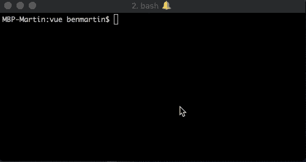
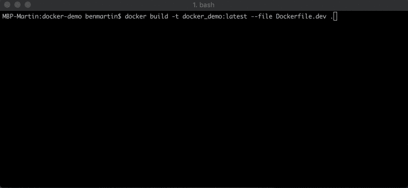
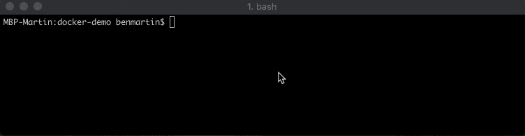
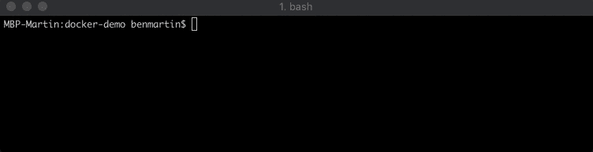
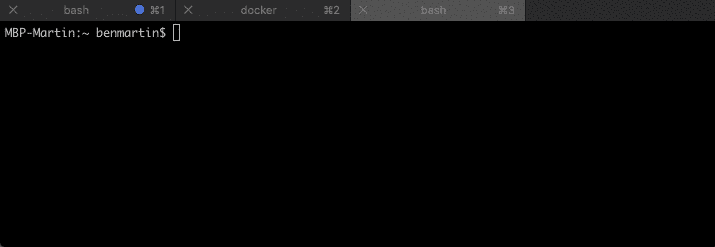

# 用于前端开发的 Docker:用于开发的自定义 Docker 映像

> 原文：<https://levelup.gitconnected.com/docker-for-frontend-devs-custom-docker-images-for-development-121322ac18d8>

作者:本杰明·马丁


让我们花一点时间来考虑什么对当地发展是重要的。对我来说，我希望确保我的所有开发人员都使用相同的依赖项，我不想担心他们安装了什么版本。不再有“但是它在我的机器上工作”的借口。同时，我想确保我们保留了 HMR(热模块替换)的便利性，这样开发人员就不需要不断刷新应用程序来查看他们的更改。我们不想失去快速反馈。

在本文中，我们将了解如何使用定制的`Dockerfile`为样板 VueJS 应用程序设置 Docker，我们的图像和容器将从这些应用程序中构建，以及我们如何从中获得效率。

如果您错过了本系列的第一部分，[查看这里以了解 Docker 附带的命令行界面](https://blog.rangle.io/learning-docker-command-line-interface/)的更多信息。在本节中，我们需要使用那篇文章中的命令。如果您已经熟悉 Docker CLI，请继续学习。

# 先决条件:创建我们的项目

这当然是一篇 Docker 文章，所以请确保你已经安装了 Docker。你可以按照[Docker 的官方安装说明在这里](https://docs.docker.com/install/)。自从我使用 Vue 以来，我已经用 VueCLI 和`vue create docker-demo`快速创建了一个工作区。

> *我选择的配置(见下文)将与 E2E 测试和单元测试相关，这将成为我们 CI/CD 管道的一部分。*



一旦一切都安装完毕，`cd`进入我们的新项目文件夹，打开一个 IDE，让我们开始工作。

# 用于开发的自定义 Docker 图像

如果你玩过 Docker 但没有构建自己的映像，你可能知道我们在执行`docker run`命令时指定了一个映像。这些映像是从 Docker Hub 或其他远程存储库中提取的(如果在本地没有找到该映像)。但是在我们的例子中，我们想要构建一个定制的图像。

在我们项目的根目录下，创建一个名为`Dockerfile.dev`的文件。这将是我们的发展形象。在该文件中，将以下代码复制到其中。

```
# Base Image FROM node:9.11.1 ENV NODE_ENV=development ENV PORT=8080 WORKDIR /usr/src/app COPY package*.json /usr/src/app/ RUN cd /usr/src/app && CI=true npm install EXPOSE 8080 CMD ["npm", "run", "serve"]
```

好吧……但是这一切有什么用呢？让我们深入研究一下。

# Dockerfile 命令和关键字

`**FROM**`指定预先存在的图像，在其上构建我们的自定义图像。因为我们正在运行一个节点应用程序，所以我们选择了他们的一个官方 Docker 映像。

> *FROM node:9.11.1 意味着我们的应用程序映像将从 node v 9.11.1 映像开始*

`**ENV**`设置环境变量

> `***ENV PORT=8080***` *设置环境变量* `*PORT*` *以备后用*
> 
> `***ENV NODE_ENV=development***` *设置环境变量* `*NODE_ENV*` *以便在我们的应用*中使用

`**WORKDIR**`设置容器内的工作目录

> `***WORKDIR /usr/src/app***` *定义* `*/usr/src/app/*` *为我们在 docker 镜像*内的工作目录

`**COPY**`将新文件、目录或远程文件复制到容器/映像中

> `***COPY package*.json /usr/src/app/***` *将我们的* `*package.json*` *和* `*package-lock.json*` *复制到我们的工作目录*

`**RUN**`在当前图像顶部的新图层中执行命令并提交。当您运行构建时，您将看到一个代表最终图像每一层的散列

> `***RUN cd /usr/src/app/ && CI=true npm install***` *将工作目录更改为* `*package.json*` *所在的位置，并将我们所有的依赖项安装到映像中的这个文件夹。这使得映像保存依赖项的冻结副本。我们的 Docker 映像，而不是我们的主机，对我们的依赖性负责*

`**EXPOSE**`允许我们从我们的主机访问容器上的端口

> `***EXPOSE 8080***` *在容器内匹配我们的应用程序运行的端口，并允许我们从我们的主机访问我们的应用程序*

`**CMD**`提供创建容器时运行的默认初始化命令，就像启动脚本一样

> `***CMD ["npm", "run", "serve"]***` *当我们启动我们的容器时，设置这个为默认命令。这不是在构建映像时运行的，它只定义当容器启动时应该运行什么命令。*

我知道你很想让它运行起来，但是不要着急。让我们更仔细地观察我们的`Dockerfile.dev`并理解*为什么*我们会这样做。

# Dockerfile 文件结构建议

那么，*我的 app 呢？*

没错。我们没有使用`COPY`命令来复制我们的整个工作空间。如果我们这样做了，我们需要为每一个代码变更运行`docker build`和`docker run`。我们不想为了发展而一遍又一遍地这样做。我们可以更有效率

## 缓存依赖项

我们正在利用 Docker 如何分层图像。当 Docker 构建我们的图像时，你会看到每一层的散列。更重要的是，Docker 也缓存了这些层。如果 Docker 可以看到该层与以前的版本相比没有任何变化(并且以前的层也是相同的)，那么 Docker 将使用该层的缓存版本，为您和您的开发人员节省宝贵的时间！当图层发生变化时，该图层上的任何缓存图层都将失效，并将重新构建。

*因此，如果我们的* `*package.json*` *或* `*package-lock.json*` *没有变化，那么我们的整个图像是可缓存的，不需要重建！*

## 优先

这也是为什么你想让其他的`Dockerfile`命令在我们文件的顶部附近不那么频繁的改变。一旦我们缓存的一层失效，例如，如果您将`ENV PORT=8080`更改为另一个端口，该缓存层及其后的每个缓存层都会失效，Docker 将不得不重建这些层。

# 构建自定义 Docker 映像

现在，用这个命令构建图像:`docker build --tag docker_demo:latest --file Dockerfile.dev .`



> *在* `*docker build*` *命令中使用允许我们从* `*docker run*` *命令*中轻松引用该图像
> 
> *`*.*`*`*docker build*`*命令引用了我们自定义* `*Dockerfile*` *的上下文。所以，这个命令应该从我们的项目目录*的根目录运行**

**你可以用`docker run docker_demo:latest`来运行它，但是不幸的是，我们还需要做更多的工作来让它从命令行快速而容易地工作。**

# **运行我们的容器:提高生活质量**

**我们将每天执行我们的`docker run`命令，如果不是更频繁的话。然而，如果我们简单地执行`docker run docker_demo:latest`命令，Docker 每次都会创建一个*新的*容器。Docker 不会停止旧容器，除非你明确地这样做。这在许多情况下非常有用，但是因为我们已经硬编码了主机端口，所以我们将在我们的主机上遇到端口冲突。**

**为了让我们能够轻松地停止和移除我们的旧容器，我们应该给它们命名，以便我们以后能够轻松地引用它们。此外，如果我取消正在运行的进程，我希望正在运行的容器被删除。**

```
**docker run --rm -it \ --name docker_demo_container \ docker_demo:latest**
```

****

## **添加了什么？**

**我们在运行命令的末尾添加了一个`--name`字段。这允许我们引用容器而不用查找散列。现在，我们可以很容易地通过名字来停止我们的容器。**

**我们还在我们的`docker run`命令中添加了`--rm`和`-it`标志。`--rm`标志告诉码头工人在集装箱停止时移除集装箱。一旦容器启动，`-it`标志保持终端活动和交互。**

## **装载主机目录**

**让我们回到我们的`docker run`命令，让我们找到一种方法将我们的工作空间目录挂载到我们的容器中的一个文件夹。我们可以通过在`docker run`命令中向我们的容器添加一个挂载点来做到这一点。这将告诉 Docker，我们想要在我们的主机的文件夹(`src`)和 Docker 容器文件夹(`dst`)之间创建一个活动链接。我们的新命令应该如下所示:**

```
**docker run --rm -it \ --name docker_demo_container \ --mount type=bind,src=`pwd`,dst=/usr/src/app \ docker_demo:latest**
```

**但是这可能会与我们主机的`node_modules`文件夹冲突，因为我们将整个`pwd`挂载到我们的应用程序在映像中的位置(以防我们的开发人员不小心在他们的主机上运行了`npm install`)。因此，让我们添加一个卷，以确保我们保存容器中的`node_modules`。**

```
**docker run --rm -it \ --name docker_demo_container \ --mount type=bind,src=`pwd`,dst=/usr/src/app \ --volume /usr/src/app/node_modules \ docker_demo:latest**
```

## **访问容器内部的端口**

**如果您尝试了上面的命令(并且您正在运行 VueJS 应用程序)，您应该会看到:**

```
**App running at: - Local: http://localhost:8080/ It seems you are running Vue CLI inside a container. Access the dev server via http://localhost:<your container's external mapped port>/**
```

**Docker 给你一个提示，我们需要从我们的容器中公开一个端口，并在我们的主机上发布。我们通过在运行命令中添加`--publish`标志来实现这一点。(我们的`Dockerfile.dev`中已经有了`EXPOSE`命令)**

> ***告诉 Docker 端口* `*<host-port>*` *上的主机流量(即通过本地主机)应该被定向到您定义的* `*<container-port>*` *处的容器。***

# **`docker run`在一个命令中**

**让我们看一下我们的最终运行命令:**

```
**docker run --rm -it \ --name docker_demo_container \ --publish 4200:8080 \ --mount type=bind,src=`pwd`,dst=/usr/src/app \ --volume /usr/src/app/node_modules \ docker_demo:latest**
```

****

**运行上面的命令将最终允许我们通过 [http://localhost:4200](http://localhost:4200) 访问我们的应用程序。**

# **测试它**

**让我们构建一个新的副本并运行它。如果你试着改变我们文件的一个模板，你会发现一切都正常运行。**

**但是说到测试，单元测试呢？一旦我们的容器开始运行，我们就可以打开一个新的终端，并在容器中运行一个命令。**

```
**docker exec -it docker_demo_container npm run test:unit**
```

****

**上面的命令将创建一个与我们的容器`docker_demo_container`的交互式终端连接，并在其中执行命令`npm run test:unit`，允许我们为我们的应用程序运行单元测试。**

# **最后**

**我们现在有一种方法来构建我们的开发映像并在本地运行它们，同时保持热模块替换的便利性，以保持我们的开发工作流的效率。我们的开发人员不需要担心他们的主机上的依赖项与映像中的那些相冲突。不再有“但是它在我的机器上工作”的借口。此外，我们还有一个可以轻松运行的命令来执行我们的单元测试。**