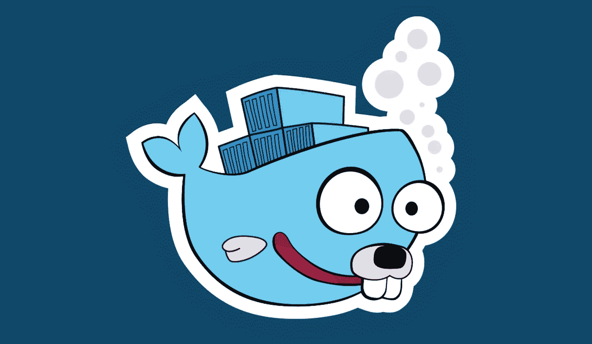
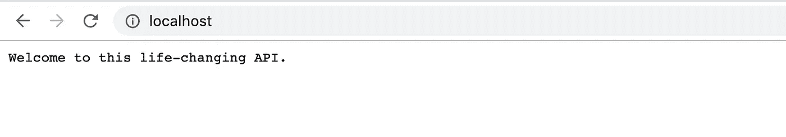
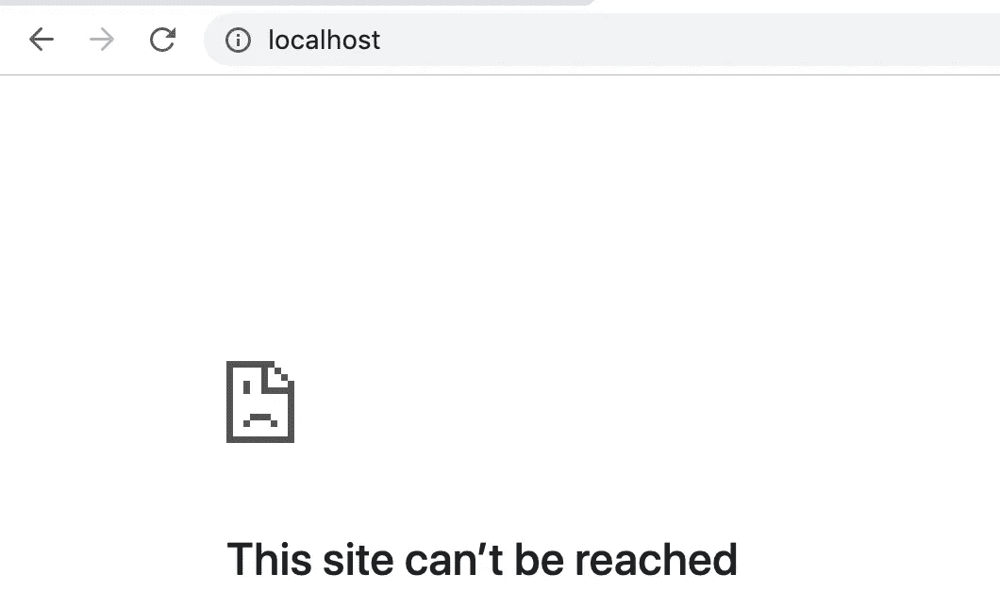
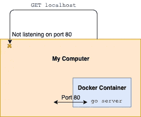
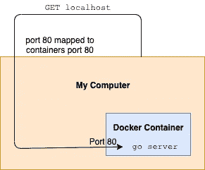
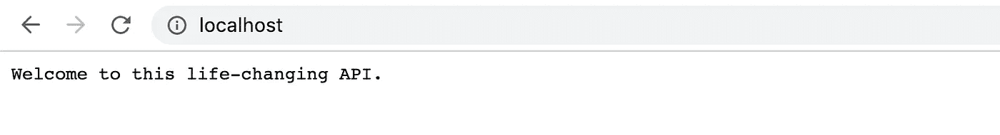
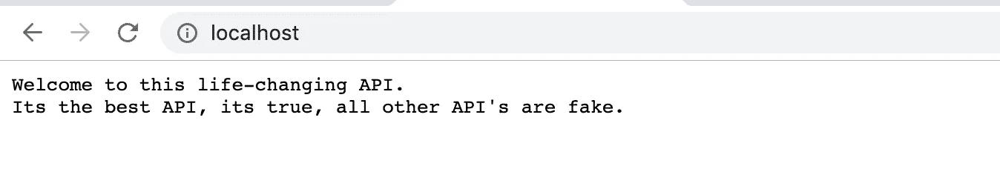

# 具有热重装功能的 Go 开发 Docker

> 原文：<https://levelup.gitconnected.com/docker-for-go-development-a27141f36ba9>

Docker 太牛逼了！它是轻量级的，确保您的所有环境完全相同，易于设置。

在这篇博文中，我将创建一个 Docker 容器来保存一个简单的 Go API。每当源代码发生变化时，Go 服务器都会立即重新加载。

这样我就不必在开发过程中无数次地重建 Docker 图像。🚀



# 创建 Go 模块

在 1.13 版本中，引入了模块。这意味着我再也不用把所有的项目放在同一个 Go 工作区了。

首先，我创建了一个名为`go-docker`的新目录来保存所有文件。

然后，我初始化一个 Git 存储库并创建 Go 模块。

```
git init
git remote add origin git@github.com:Dirk94/go-docker.git
go mod init github.com/dirk94/go-docker
```

您会注意到在我们的目录中有一个`go.mod`文件。这个文件将保存这个模块的所有依赖项，类似于节点开发中的`package.json`文件。

# 构建 API

模块已经设置好了，现在是时候构建我们简单的 API 了。

我将为 API 使用`gorilla/mux`路由包。我可以只使用标准的 Go 路由器，但我想确保依赖关系在 Go 模块中按预期工作，并在应用程序变得更复杂时利用 mux 的优势。

```
go get -u github.com/gorilla/mux
```

运行该命令后，您会看到它作为一个依赖项被添加到了`go.mod`文件中。

接下来，我创建主 Go 文件`commands/runserver.go`。

该 API 所做的只是返回消息“欢迎使用这个改变生活的 API。”

在深入 Docker 容器之前，让我们测试一下这个程序是否有效。为了运行服务器，我使用了`go run`命令。

```
go run commands/runserver.go
Server listening!
```



API 工作正常，棒极了🎉

# 设置 Docker

我首先为这个项目创建一个定制的 Docker 图像。Docker 映像包含一组指令，告诉 Docker 创建什么样的环境。

我使用`golang:latest`图像作为这个新的自定义图像的基础。通过这种方式，我确信 Go 已经正确地建立在我的映像上。

我将整个项目复制到 image `/app`目录中。然后，我通过运行`go mod download`下载依赖项。

最后，我告诉 Docker 运行`go run commands/runserver.go`命令。

为了构建这个映像，我运行以下命令。

```
docker build -t go-docker-image .
```

现在我有了构建 Docker 映像的指令，现在我实际上需要用 Docker 运行它。

```
docker run go-docker-image
Server listening!
```

服务器在 Docker 容器中监听，但是当我在浏览器中访问`localhost`时，我得到一个“拒绝连接”错误。



发生的情况是 Docker 容器在端口 80 上监听传入的请求。但是，主机操作系统没有监听端口 80。因此，当我向`localhost`发送 GET 请求时，它找不到正在运行的服务器。

我画了一张图来概括这个问题——我为我的绘画技巧道歉。



为了解决这个问题，我可以将*容器的*端口 80 映射到*主机的*端口 80。

```
docker run -p 80:80 go-docker-image
```

从概念上讲，图表现在看起来应该是这样的。



当我进入`localhost`时，我看到“欢迎使用这个改变生活的 API。”消息。🤖

# 更改源代码

我想对 API 进行更改。我的一些朋友告诉我，这并没有改变他们的生活，所以是时候升级了。

我在 API 中添加了新的一行。让我们旋转一个新的 Docker 容器。

```
docker run -p 80:80 go-docker-image
```

然而，如果我现在去`localhost`，我仍然会看到旧的消息。



这是因为 *Docker 图像*没有改变。因此，我们必须*重建*映像，以使更改生效。

```
docker build -t go-docker-image .
docker run -p 80:80 go-docker-image
```

现在我确实看到了更新的消息。



# 设置热重装

在每次修改源代码后重新构建 Docker 映像花费的时间太长。让我们建立一个更好的系统。

我将使用[编译守护进程](https://github.com/githubnemo/CompileDaemon)包。如果任何 Go 源文件发生变化，这个包将自动重新构建并重新启动 Go 应用程序。

我更新了`Dockerfile`来下载 CompileDaemon 包。

然后，我改变入口点启动`CompileDaemon`程序。我给程序指定了一个构建和运行命令。每次 Go 文件发生变化时，都会执行这些操作。

我通过跑步重建了形象。

```
docker build -t go-docker-image .
```

运行 Docker 时，我添加了`-v ~/projects/go-docker:/app`标志。这将把主机的`go-docker`目录挂载到 Docker 容器的`/app`目录中。

每当我在我的`go-docker`目录中进行更改时，containers `/app`目录中的文件也会更改。

最后的命令如下所示。*注意* `*-v*` *路径不能是相对的。*

```
docker run -v ~/projects/go-docker:/app -p 80:80 go-docker-image
```

当容器运行时，对源代码进行更改，您会看到它会自动更新。🔥🚀

# 使用 Docker 撰写

现在我必须键入很长的`docker run -v ~/projects/go-docker:/app -p 80:80 go-docker-image`命令来启动我的容器。

这在这个项目中是可行的，因为我只需要一个容器。但是假设我有一个项目，我需要旋转多个容器。运行所有的`docker run`命令会很快变得很累。

解决方法是使用 Docker Compose。这个工具允许您在运行`docker-compose up`命令时指定要启动的容器。

为了设置它，我创建了一个`docker-compose.yml`文件。

在这里，我指定我想要创建一个名为`go-docker-image`的图像。应该使用`./`目录中的`Dockerfile`来构建图像。

我映射端口并设置音量——这次我可以使用相对路径。

为了启动在`docker-compose.yml`文件中指定的容器，我运行`docker-compose up`。

就是这样，我在 Docker 中有一个工作 API，当文件改变时，它会自动重新加载！🙌

你可以在这里查看源代码—[https://github.com/dirk94/go-docker](https://github.com/dirk94/go-docker)