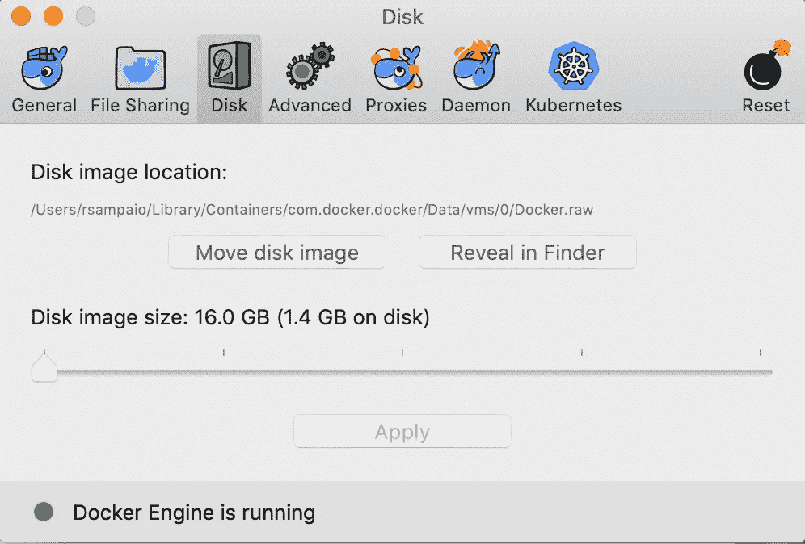
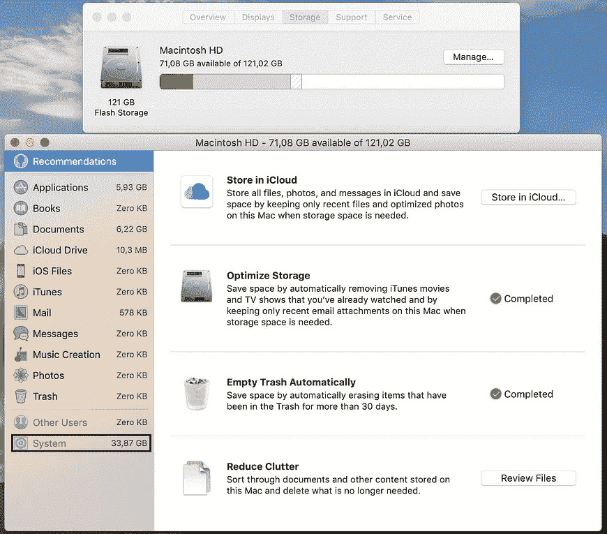

# 导致磁盘空间问题的 Docker

> 原文：<https://levelup.gitconnected.com/docker-for-mac-causing-disk-space-issues-7ff8b14d2c83>

# 磁盘空间问题

MacOS 最近通知我，系统更新将不会执行，因为我的磁盘中没有 12 GB 的可用空间。这是真的，我实际上有 7 个。

我知道有了 120 GB 的 SSD，我肯定不是磁盘空间的大地主。问题是我只在工作中使用我的 MacBook Pro。没有图片，没有电影，没有音乐(只有 Spotify)，没有游戏。

由于我是一名在 [Konduto](https://konduto.com) 工作的程序员，这家公司使用机器学习来防止欺诈，因此处理非常大的文件，我认为数据库转储或大型 CSV 可能是原因。

事实证明并非如此。我存放工作资料的文件夹占用了 3 GB 的磁盘空间，比我预期的要少得多。

我是不是不小心把 Dropbox 上非常大的东西放到了另一台同步到 MacBook Pro 的设备上？

不，事实并非如此。

出于想法，我去了`About This Mac`(点击 OS 工具栏左侧的苹果图标)，然后去了`Storage`标签。

除了报道的**系统**大小:高达 87 GB 之外，没有任何东西真正引人注目。

我打开 iTerm，进入操作系统根目录，按大小排列文件夹:

从大到小对 Unix 中的文件和文件夹进行排序

该命令以人类可读的格式(例如 24K、15M)显示文件夹大小( **du** )，并根据人类可读的输出将结果从小到大排序( **sort** 命令的`h`标志)。因为我想看最大的，所以我用**排序**命令的`r`标志颠倒了顺序。

`/Users`文件夹是最大的一个。所以我进去输入了同样的命令。

在对每个最大的文件夹重复上述步骤后，我在`/Users/rsampaio/Library/Containers/com.docker.docker`结束。该文件夹的大小超过 50 GB。

# 如何减少 Docker 专用的磁盘空间？

好消息:我找到了罪犯。

坏消息:我不知道如何减少 Docker 的空间。

幸运的是，Docker 有一个优秀的文档，我在那里找到了问题的答案。

将 Docker 的**磁盘镜像大小**从 64 GB 改回 16 GB 释放了将近 50 GB 的磁盘空间，我现在可以更新 MacOS 了。

将磁盘映像大小滑块移回 16.0 GB 而不是 16.0 GB，大大减少了 Docker 的磁盘空间使用

> 警告:如果最大尺寸减小，当前文件将被删除，因此所有容器和图像将丢失([https://docs.docker.com/docker-for-mac/space/](https://docs.docker.com/docker-for-mac/space/))

*原载于 2019 年 6 月 11 日*[*【raphaelsampaio.com】*](https://raphaelsampaio.com/tech/2019/02/17/site-de-graca-usando-github-pages-jekyll-lambda-ses.html)*。*