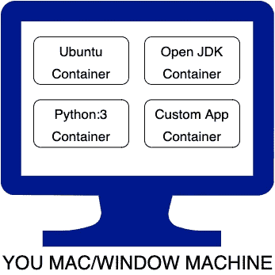
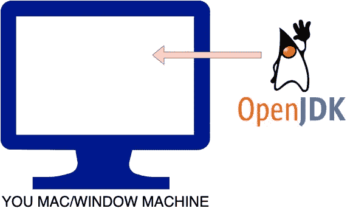
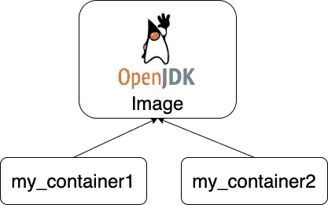
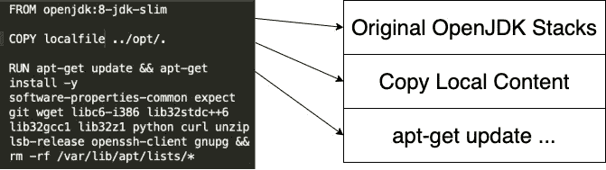

# 最基础的码头工人

> 原文：<https://levelup.gitconnected.com/docker-from-the-very-basic-64f15ac38ed7>

## 学习发展选项

## 将 Docker 理解为独立的本地环境


由[马库斯·斯皮斯克](https://unsplash.com/@markusspiske?utm_source=medium&utm_medium=referral)在 [Unsplash](https://unsplash.com?utm_source=medium&utm_medium=referral) 上拍摄

已经有很多关于 Docker 的教程了。它们有助于我开始理解 Docker，但不能满足我临时设置一些东西的需要(例如，增量地构建`Dockerimage`)，或者有一种增量地调试`Dockerimage`而不需要运行整个 Docker 映像生成的方法。

> 大多数教程从*什么是 Docker* 跳到*创建 Dockerimage* ，忽略了如何逐步创建 *Dockerimage* 的步骤。我可以理解为什么没有包括这一点，但在我的情况下，我需要这一点，因此在这里制作本教程来弥补差距。

# Docker 是什么？

用我自己的话来说，我认为 Docker 是一个超级有用的工具，可以用合适的环境构建一个小容器来运行您的 web 应用程序或执行特定的任务，例如编译和分发您的 Android 应用程序

[](https://medium.com/mobile-app-development-publication/intro-to-docker-building-android-app-cb7fb1b97602) [## docker 简介:构建 Android 应用程序

### 如果您想知道如何将构建您的应用程序卸载到开发之外的另一个自动化流程中…

medium.com](https://medium.com/mobile-app-development-publication/intro-to-docker-building-android-app-cb7fb1b97602) 

假设您有一些运行在本地机器上的虚拟环境容器，但是与本地机器环境完全分离。



酷，用一台机器，你可以随时设置任何不同的环境，而且它们不会互相冲突。对我来说最好的是，我可以随时删除它们，而且干净利落。

## 如何设置 Docker？

要在你的机器上安装 Docker，你只需要安装它。

[](https://docs.docker.com/engine/install/) [## 安装 Docker 引擎

### Docker Engine 可在多种 Linux 平台、macOS 和 Windows 10 上通过 Docker Desktop 获得，并作为…

docs.docker.com](https://docs.docker.com/engine/install/) 

之后，您需要通过运行 Docker 应用程序来运行 Docker 守护程序。这就是你准备好它所需要的。

# 运行您的第一个容器

在您的机器中，让我们假设您有兴趣打开

```
docker run -it --name my-container openjdk:8-jdk-slim
```



*   `run`是通过从映像创建容器来运行它。
*   `-it`是让它交互运行。就像贝壳一样。
*   `--name`是给容器命名，以防以后需要引用它。
*   `--rm`是在运行后移除容器。
*   `openjdk:8-jdk-slim`是您希望用来设置容器的图像。通常来自 [Docker Hub](https://hub.docker.com/) 。你也可以有一个本地图像。

由于这是您第一次运行它，您可能会看到它下载了`openjdk:8-jdk-slim`并以下面的代码结束。

```
Unable to find image 'openjdk:8-jdk-slim' locally
8-jdk-slim: Pulling from library/openjdk
8559a31e96f4: Pull complete
65306eca6b8e: Pull complete
b8f37a6e9e9b: Pull complete
33231475bae0: Pull complete
Digest: sha256:3826479f6ca03bbd11e1e12eb78b856f90bf7cea0f534f7204854c82fd89eda2
Status: Downloaded newer image for openjdk:8-jdk-slim
root@2c867f3bc1da:/#
```

如果我们运行`java -version`，它会显示

```
root@2c867f3bc1da:/# java -version
openjdk version "1.8.0_252"
OpenJDK Runtime Environment (build 1.8.0_252-b09)
OpenJDK 64-Bit Server VM (build 25.252-b09, mixed mode)
root@2c867f3bc1da:/#
```

很好，您可以使用 OpenJDK java，而不会因为任何安装而破坏您的本地机器环境。

要退出容器，你只需输入`exit`，你将回到原来的终端。这也将删除创建的容器。

如果您再次运行下面的

> 注意:我使用`my-container2`运行，因为`my-container`名称已经被第一个使用，否则你会得到消息`docker: Error response from daemon: Conflict. The container name “/my-container” is already in use by container` …不要担心，我会分享如何删除它

```
docker run -it --name my-container**2** --rm openjdk:8-jdk-slim
```

这次不再下载图像了。你将立即被发送到新的提示。

```
root@d1279588bd9e:/#
```

## 幕后

如上所述，当您第一次启动容器时，它会下载图像。在那之后，容器引用链接到图像



要列出您机器上下载的图像，使用命令`docker images`(在另一个终端中)，它将显示图像列表，如下所示。

```
REPOSITORY  TAG         IMAGE ID      CREATED      SIZE
openjdk     8-jdk-slim  ceab49f001b1  4 weeks ago  285MB
```

类似地，要知道活动容器正在运行，使用命令`docker ps`。

```
CONTAINER ID      IMAGE         ...  NAMES
d1279588bd9e openjdk:8-jdk-slim      my-container
```

退出容器后，您将无法使用`docker ps`找到容器。但是如果你使用`docker ps -a`你会看到如下的东西。

```
CONTAINER ID IMAGE  ...   STATUS  ...                 NAMES
d964a09019b2 openjdk      Exited (0) 12 seconds ago   my-container2
5134214c3ea5 openjdk      Exited (0) 12 minutes ago   my-container
```

## 移除容器和图像

docker 的另一个好处是，当它不再使用时，我们可以将其完全删除。

要移除它们，您可以使用`docker container prune`。

```
WARNING! This will remove all stopped containers.
Are you sure you want to continue? [y/N] y
Deleted Containers:
d964a09019b23fc96f81bd52dd73cee63cb296044c08e23e255e91bb3e86e9a7
5134214c3ea5d539393b739e62e678e4ce08675f12ace4d94795c5804e68bd9fTotal reclaimed space: 10B
```

它将删除所有退出的容器。

> 提示，如果你在退出后懒得手动移除容器，可以在运行 docker 容器时添加`--rm`参数。当你退出你的容器，它会自动删除。

移除容器后，您现在可以使用命令`docker image prune -a`移除所有图像(没有其他容器引用)。(注意:如果没有`-a`，它将只移除悬挂的图像)

```
WARNING! This will remove all images without at least one container associated to them.
Are you sure you want to continue? [y/N] y
Deleted Images:
untagged: openjdk:8-jdk-slim
untagged: openjdk@sha256:3826479f6ca03bbd11e1e12eb78b856f90bf7cea0
deleted: sha256:ceab49f001b17bd71be68f2de9d8ded1bea7190da82dd0067c
deleted: sha256:7f9ff1c804e9a64904548cf1f76b235c0525c16968ea0a8aef
deleted: sha256:aa2da704309500fa4bf99a10d3a21fffbe34e4417d9abd3e8c
deleted: sha256:e47aeb6e542620774a5364aff59e1593a8131532980b7dda9c
deleted: sha256:13cb14c2acd34e45446a50af25cb05095a17624678dbafbcc9Total reclaimed space: 284.6MB
```

# 交互式创建 docker 图像

## 访问容器中的本地文件

有时候(事实上大多数时候)我们希望我们的容器与我们的本地文件进行交互，我们该怎么做呢？容器是与本地机器完全分离的环境，因此默认情况下它不允许这样做。

为了将您的容器与本地文件连接起来，我们可以使用`volume`参数

```
docker run -it --name my-container --volume=$(pwd):/localfolder --workdir=/localfolder openjdk:8-jdk-slim
```

*   `--volume=$(pwd):/localfolder`正在将本地文件夹(`pwd`命令显示当前文件夹)映射到容器中的一个文件夹名`localfolder`。
*   `workdir=/localfolder`只是说我们将主要在`localfolder`工作。

一旦您的容器启动，它将在`localfolder`中，它被映射到您所在的本地机器文件夹。

```
root@15c3a84e38ca:/localfolder#
```

如果你做一个`ls`，它会显示文件夹的内容。从这里，您可以使用容器中的本地文件夹文件。

> 注意:如果您将本地文件夹映射到容器中已有的文件夹，例如`opt`，那么您将看不到容器中的文件夹。相反，本地文件夹将优先显示。将一个本地文件夹与一个现有的容器文件夹进行卷映射是一个坏主意，如[这个堆栈溢出](https://stackoverflow.com/questions/62857104/how-to-copy-from-volume-mapped-opt-to-image-opt-folder-in-docker?noredirect=1#comment111159157_62857104)中所解释的。

## 将内容更改为容器

一旦您位于包含映射的本地文件夹的容器中，如果您愿意，您可以将本地文件夹内容复制到容器文件夹中，例如

```
root@15c3a84e38ca:/localfolder# cp localfolderfile ../opt/.
```

或者你想下载一些库的更新，例如

```
apt-get updateapt-get install -y software-properties-common expect git wget libc6-i386 lib32stdc++6 lib32gcc1 lib32z1 python curl unzip lsb-release openssh-client gnupg
```

或者如果你想去掉某样东西，例如

```
rm -rf /var/lib/apt/lists/*
```

## 制作本地图像

在您根据需要修改了容器中的所有内容之后，您可以用它来制作一个图像以供将来使用。

你先从容器里取出`exit`。然后，您可以使用下面的命令从容器中创建图像

```
docker commit my-container my-image
```

您现在可以看到您的图像正在使用`docker images`

> 提示:如果在`exit`之后，你需要重新输入容器(无论什么原因)，你只需要使用`docker start -a -i my-container`

# 使用 Dockerfile 创建 docker 映像

上面的很好，因为我们可以创建一个图像。反复使用它。

然而，如果我们想要一次又一次地创建一个图像，并且在不同的机器上创建相同的图像，更好的方法是使用`Dockerfile`。

使用具有以下内容的`Dockerfile`可以轻松创建上述手动创建的图像

```
FROM openjdk:8-jdk-slim
COPY localfile ../opt/.
RUN apt-get update && apt-get install -y software-properties-common expect git wget libc6-i386 lib32stdc++6 lib32gcc1 lib32z1 python curl unzip lsb-release openssh-client gnupg && rm -rf /var/lib/apt/lists/*
```

使用这个文件，您可以在`Dockerfile`可用的文件夹中运行下面的命令。

```
docker build -t my-image .
```

> 注意`.`显示的是`Dockerfile`所在的当前文件夹。如果它位于另一个文件夹中，则用`anotherfolder/.`替换它

使用`Dockerfile`创建图像的另一个好处是，它是一层一层堆叠的。



要查看堆栈，下面是一个可以帮助您可视化的工具。

[](https://github.com/wagoodman/dive) [## 瓦格德曼/潜水

### 一个探索 docker 图像、图层内容和发现缩小 Docker/OCI 图像大小的方法的工具。

github.com](https://github.com/wagoodman/dive) 

## 超越创造形象

创建图像后，您可能希望将您的图像发布到一个中心位置，例如 DockerHub，以便全球访问，或者您希望将您的应用程序作为一个 web 服务来运行，并通过一个端口来访问它……您可以这样做。

下面的教程应该有助于你继续在 Docker 中探索这个非常基础的东西。

[](https://docker-curriculum.com/) [## 面向初学者的 Docker 教程

### 学习使用 Docker 轻松构建和部署您的分布式应用程序到云中，Docker 由…

docker-curriculum.com](https://docker-curriculum.com/)