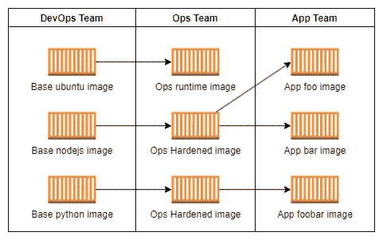
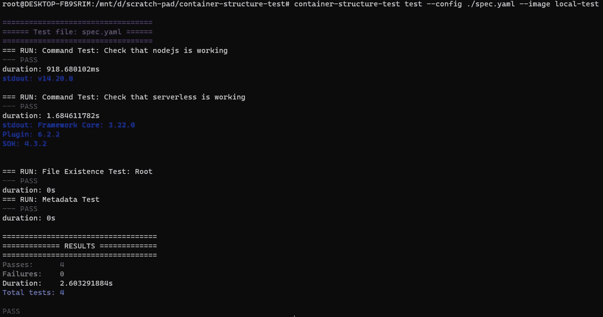

# 集装箱结构测试中的 Docker 图像测试

> 原文：<https://levelup.gitconnected.com/docker-image-testing-with-container-structure-tests-b2b2e5676060>


容器已经成为定义和一致运行软件的领先技术，有助于减少在调试问题或运行应用程序时出现的可怕的“但它在我的系统上有效”的问题。因此，通过将我们的软件及其运行时依赖项包装到一个容器映像中，我们创建了一个您可以测试的人工制品，以确保它在测试生命周期的不同阶段都能按预期工作。既然我们将这些测试期望放在我们正在创建的软件上，为什么我们不对它正在使用的容器运行时进行相同级别的测试呢？

根据应用程序的运行时环境，您可能需要公开特定的标签、环境变量或在图像上构建参数。尽管如此，当您最终构建映像时，您不能保证该映像的消费者的容器映像契约按要求工作。您能确保工具正确安装到您正在构建的当前容器中吗？或者当你传入一个参数时，你的容器按预期启动？

在本文中，我们将介绍如何使用[Google container tools/container-structure-test](https://github.com/GoogleContainerTools/container-structure-test)，您可以根据定义的容器规范对构建的容器映像进行测试，以确保它们符合规范。通过这样做，您可以保证您的容器运行时满足其要求，因此当您使用该容器时，它将按照您的应用程序的预期工作。

# 问题是

假设您运行一个软件平台，该平台涉及为其他所需的服务或应用程序运行许多不同的 Docker 映像。为了更好地管理所有这些映像的创建，最好为运行时映像的外观设置一个规范，包括使用的标签、环境变量和构建参数，这些可能是您的日志记录或 CICD 设置每个人都可以使用的平台级映像所必需的。

要让基础设施中使用的所有容器映像都遵循一套规范，很容易为它们提供一个预配置的基本映像。然后，其他团队可以使用这个映像，并根据任何进一步的需求对其进行扩展。



但是对于图像的所有下游消费者来说，我们如何保证一组稳定的工具和配置存在，而不需要他们发现构建期间的问题是否已经通过了 CICD 质量关？

# 解决方案

为了解决不知道你的容器是否按预期运行的问题，Google 的优秀人员已经用一个叫做容器结构测试的工具解决了这个问题。

[](https://github.com/GoogleContainerTools/container-structure-test) [## GitHub-Google container tools/container-structure-test:验证你的容器的结构…

### 容器结构测试为验证容器映像的结构提供了一个强大的框架。这些测试…

github.com](https://github.com/GoogleContainerTools/container-structure-test) 

这个工具。允许您为容器编写规范，以定义图像应该能够执行的内容。然后，使用提供的 URI，在容器中运行每个定义的测试，以查看它是否满足规范。

因此，这款工具非常适合我们的需求，是一款可脚本化的 CLI 工具，可以集成到我们的 CICD 流程中。我们现在将看看如何定义这些容器规范，并根据映像运行它们。

首先，我们将创建一个简单的 Dockerfile 来定义我们想要测试的运行时。在这个文件中，我们将定义一些在容器中常见的东西，例如在容器中运行的应用程序所需的工具、参数和环境变量。

```
FROM node:14-alpine# Install packages
RUN apk update && apk add --update --no-cache \
    git \
    bash \
    curl \
    openssh \
    python3 \
    py3-pip \
    py-cryptography \
    wget \
    curlRUN apk --no-cache add --virtual builds-deps build-base python3# Update NPM
RUN npm config set unsafe-perm true
RUN npm update -g# Install AWSCLI
RUN pip install --upgrade pip && \
    pip install --upgrade awscli# Install Serverless Framework
RUN npm install -g serverlessENV YOUR_ENV_VAR="SOME VALUE"LABEL org.node.version="14"
LABEL org.your.key="your_value"
```

然后，我们将建立和标记这个图像，所以我们有一个人工制品，我们可以测试。

```
docker build -f . -t test-container
```

现在容器准备好了，我们将编写我们的规范文件。这是用 YAML 构建的，包括应该成功运行的命令等断言，检查具有指定权限的现有文件，并检查构建的映像中的环境变量和标签。

下面的文件显示了测试我们之前定义的测试 Docker 映像的所有运行动作和配置的断言。

```
#config.yaml
schemaVersion: 2.0.0metadataTest:
  env:
    - key: YOUR_ENV_VAR
      value: SOME VALUE
  labels:
    - key: 'org.node.version'
      value: '14'
    - key: 'org.your.key'
      value: 'your_value'fileExistenceTests:
  - name: 'Root'
    path: '/'
    shouldExist: truecommandTests:
  - name: "Check that nodejs is working"
    command: "bash"
    args:
      - -c
      - |
         nodejs --version- name: "Check that serverless is working"
    command: "bash"
    args:
      - -c
      - |
         serverless --version
```

现在已经定义了测试，您可以使用 container-structure-test CLI 工具对容器映像运行这个定义。

```
container-structure-test test --image test-container --config config.yaml
```

该工具将启动一个容器，并针对这个正在运行的容器运行所有测试。这确保了运行时按预期工作，而不仅仅是静态地检查 docker 文件，允许无声的错误悄悄通过。

运行测试后，您将在终端中看到下面的测试输出来报告结果。



正如您所看到的，很容易开始为您的图像定义规范，以确保它们按预期工作，为您的容器发布过程带来新的可靠性水平。

# 包扎

对于创建的示例，您应该已经看到了定义容器规范并针对构建的容器映像运行它是多么容易。作为一个 CLI 工具`container-structure-test`,你可以让它成为任何 CICD 过程的一部分，为你发布的容器设置一个质量关卡，以确保你的构建过程中没有无声的错误进入你的应用程序运行时。

如果您正在寻找更多的 docker 内容，请查看下面的文章，了解如何轻松地将 CLI 包装在 docker 容器中，使其更具可移植性。

[](/make-your-cli-portable-with-docker-c97038fdc601) [## 使用 Docker 让您的 CLI 变得可移植

### 假设你有一个很棒的 CLI 应用程序，但是你对它的安装或上线不满意…

levelup.gitconnected.com](/make-your-cli-portable-with-docker-c97038fdc601) 

# 进一步连接

*   如果你正在考虑获得一个中等订阅，你可以通过使用我的[推荐链接](https://aaron-kt-berry.medium.com/membership)来帮助我。
*   查看我在[媒体](https://medium.com/@aaron-kt-berry)上的其他文章，如果你想了解最新消息，可以通过[电子邮件](https://aaron-kt-berry.medium.com/subscribe)订阅。
*   如果你想聊天，在 [Twitter](https://twitter.com/Aaron_KT_Berry) 或 [LinkedIn](https://www.linkedin.com/in/aaron-kt-berry/) 上与我联系，如果你想雇佣我，我在 [Codementor](https://www.codementor.io/@aaronktberry) 上。

# 分级编码

感谢您成为我们社区的一员！在你离开之前:

*   👏为故事鼓掌，跟着作者走👉
*   📰查看[升级编码出版物](https://levelup.gitconnected.com/?utm_source=pub&utm_medium=post)中的更多内容
*   🔔关注我们:[Twitter](https://twitter.com/gitconnected)|[LinkedIn](https://www.linkedin.com/company/gitconnected)|[时事通讯](https://newsletter.levelup.dev)

🚀👉 [**加入人才集体，找到一份令人惊喜的工作**](https://jobs.levelup.dev/talent/welcome?referral=true)