# Docker 是什么，为什么使用它？

> 原文：<https://levelup.gitconnected.com/docker-in-a-nutshell-84c96fba37c8>

## Docker 是什么，我们为什么要用它？了解关于开源 Docker 容器平台及其部署的所有信息。

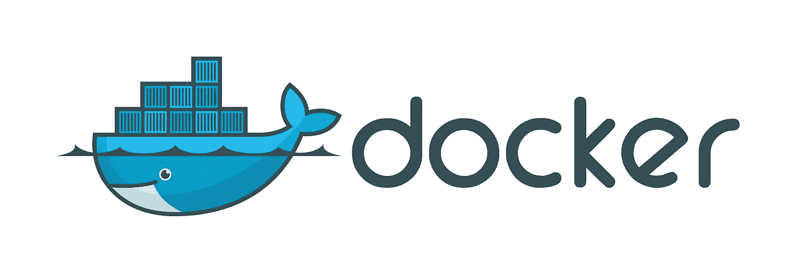

我们将从这个中等故事开头的两个非常重要的问题开始。

**这两个问题是:**

*   什么是[码头工人](https://www.docker.com/)？
*   我们为什么要用 Docker？

首先，让我们通过一个快速演示来说明**我们为什么使用 Docker** 。

让我们看看这个流程图。

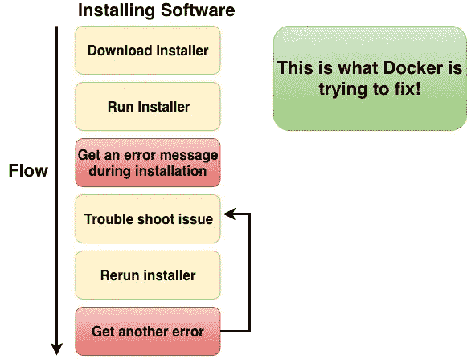

我敢肯定，这种情况在你身上至少发生过一次，就像我在你的电脑上安装软件时遇到的情况一样。

在下载安装程序并运行该安装程序时，您将不可避免地在安装过程中遇到错误。

那你会怎么做？

嗯，你可以通过谷歌搜索来解决这个问题。你试图找到最终解决问题的方法。然后，你再次运行安装程序，却意外地发现，出现了其他错误！

然后你要做的就是一遍又一遍地尝试整个故障诊断过程。嗯，这是 Docker 试图解决的核心问题。

Docker 努力让你在任何电脑上安装和运行软件都尽可能简单明了。

有了 Docker，你可以在任何给定的计算机上以你想要的方式安装和运行任何软件。

不仅仅是你的电脑或个人笔记本电脑、个人台式机，还有网络服务器，比如谷歌云平台或 AWS。或者任何基于云的平台。

在安装和运行软件时，使用典型的安装软件的方式，很容易陷入试图解决所有这些问题的无休止的循环中。在发布这个软件或者把它转移到一个新的环境之后，你不得不重新做所有的事情。

例如，现在让我演示一下用 Redis 执行 Docker 容器是多么容易。

如果你正在使用 Docker，你可以在命令行上运行一个命令。

```
$ docker run -it redis
```

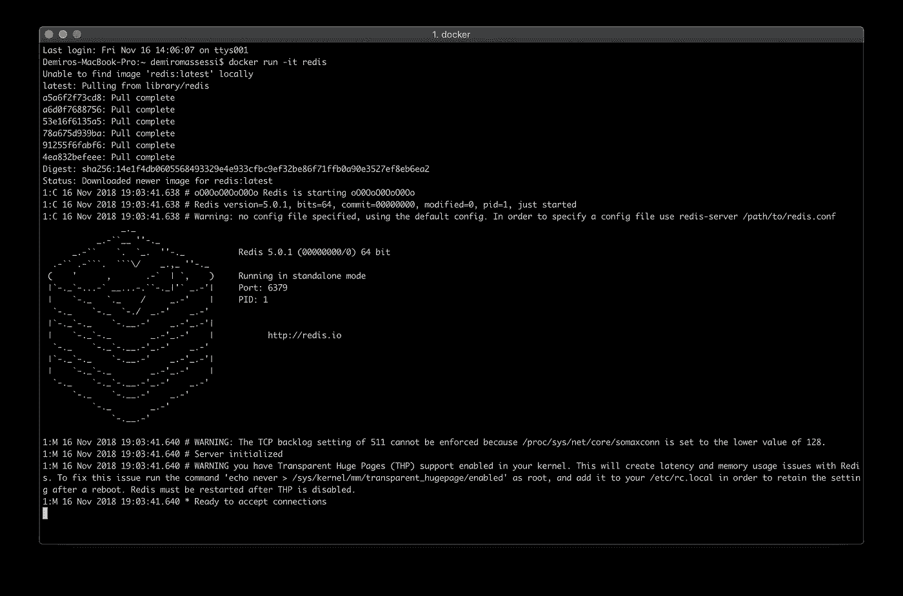

几秒钟之内，Redis 的一个实例就可以在您的计算机上使用了。这意味着没有问题，也没有故障排除。准备出发！

就这么简单。

简而言之，这就是 Docker，它使运行软件变得快捷和容易。

最后，回答“我们为什么要使用 Docker？”是因为它简化了安装和部署软件的过程，而不需要经历一大堆设置或安装活动。

在这篇文章中，我们将了解更多关于为什么我们使用 Docker。

然而，我只是想给你一个快速的例子，说明当你使用 Docker 时，安装和运行一些新软件是多么容易。

# 现在，让我们来回答“Docker 是什么？”。

这是一个更难回答的问题。Docker 通常在整个项目、工具和软件生态系统的上下文中被提及，无论是在博客帖子、文章还是论坛中。

如果有人说他们在项目中使用了 Docker，他们可能指的是 **Docker 客户端**或 **Docker 服务器**，他们可能指的是 **Docker Hub** 或 **Docker Compose** 。

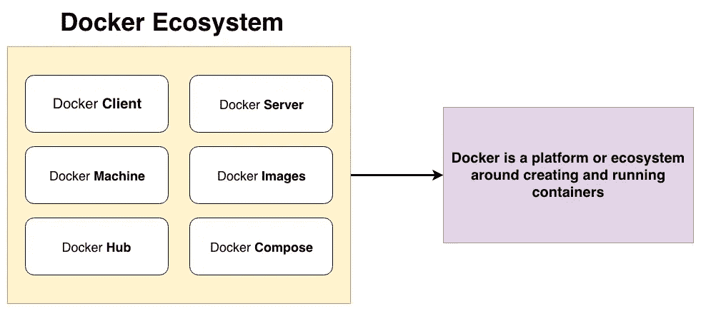

所有这些都是项目、工具和软件，它们一起用于创建管理容器的平台和生态系统。

## **现在，什么是容器？**

就在刚才，当我们在终端'$ docker run redis '上运行该命令，并在后台执行一系列操作时，有两个基本步骤。

在我输入那个命令之后，一个叫做**Docker**CLI**CLI**的东西联系了一个叫做**Docker**Hub 的东西，它下载了一个叫做 **Image** 的文件。

映像是包含运行特定程序所需的所有依赖项和配置的单个文件。

比如 Redis 就是我们刚刚下载的。

该图像保存在您的硬盘上，并在某个时候用于创建一个称为容器的东西。


容器是一个图像的实例。你可以把它想象成一个正在运行的程序。

因此，在高层次上，容器是一个程序，它有自己的一组隔离的硬件资源。在某种程度上，它有自己的一套内存，自己的一套网络技术，以及自己的一套硬盘空间。

尽管我们仍然没有完全理解 Docker 实际上是什么，但至少我们了解到，对 Docker 的引用实际上是指工具和项目的整体集合。

我们还学习了两个重要的术语，一个 **Docker 图像**和一个**容器**。

现在，这些**图像**和**容器**是你在使用 Docker 的整个过程中将要使用的绝对基础。

## **此时，你需要在你的机器上安装一些软件，这样你就可以直接处理图像和容器，我们可以更好地了解它们是如何工作的。**

这是你需要做的。(希望你和我一样有 Mac:)Windows 上的安装没那么简单。

我们将安装一个名为 **Docker CE** 的程序，其中包括两个非常重要的工具。我们将在这篇文章中使用这些工具。

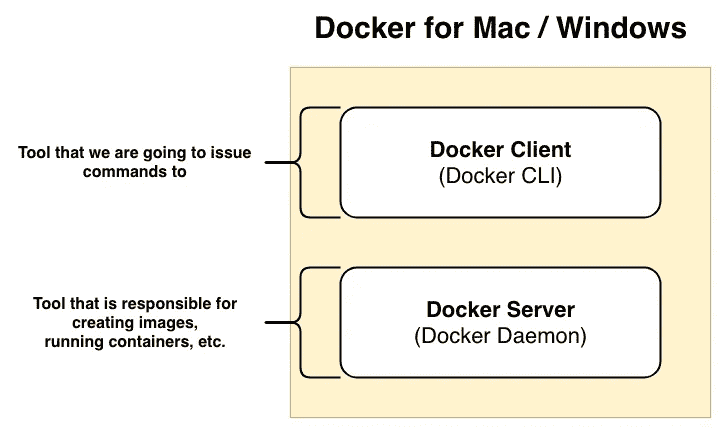

这个包里面的第一个工具是一个叫做 **Docker Client** 的东西，Docker Client(也称为 **Docker CLI** 是一个程序，你将从你的终端与它进行相当多的交互。

Docker 客户端将接受您的命令，并在您将它们输入到终端后计算出如何处理它们。

现在，Docker 客户机本身实际上并不处理容器或图像。Docker 客户端实际上只是一个工具或门户，通过它我们可以与 Docker 服务器交互，Docker 服务器是 Docker CE 包的一个组件。**这也被称为 Docker 守护进程**。

这里的这个程序是实际的工具或软件，它创建容器、图像、维护容器、上传图像，并做你在 Docker 世界中可能想象到的任何事情。

Docker 客户机是用来发布命令的。这是我们与之交互的东西，在幕后，这个客户端正在与 Docker 服务器进行交互。

在现实生活中，您永远不会直接到达 Docker 服务器。这是一种在幕后运行的东西。

让我们看看在 Mac OS 机器上设置过程是如何工作的。

你应该这么做。

我们将首先转到位于[**https://store . Docker . com/editions/community/Docker-CE-desktop-MAC**](https://store.docker.com/editions/community/docker-ce-desktop-mac)的 **Docker CE 页面**，在这里您将创建一个 **Docker Hub 帐户**。

除了下载 Mac 版 Docker CE，我们后面要做的一些事情也需要 Docker Hub。

这是一个非常简单的安装，我不会深入介绍如何安装它，因为我假设你对此很熟悉。安装完成后，我们将通过双击 Docker 来启动它，第一次这样做时，看起来什么也没有发生。
然而，如果你看向屏幕的右侧，你会注意到一个周围有方框的小鲸鱼符号。

大约一分钟后，箱子会停下来。这意味着你的电脑上一切都准备好了。

一旦机器稳定下来，Docker 就成功启动了。

您还必须登录 Docker。

在这种情况下，您将单击这个小按钮，然后您将看到一个链接，上面写着“使用 Docker ID 登录”，因此单击它并使用您在 Docker 网站上的新凭据登录。

在你完成这些之后，最后要做的事情是再次检查一切是否正常。

你需要做的是打开你的终端，你可以在任何文件夹中打开你的终端，并且只需要运行一个命令:

```
$ docker version
```

您应该会在屏幕上看到类似这样的内容。

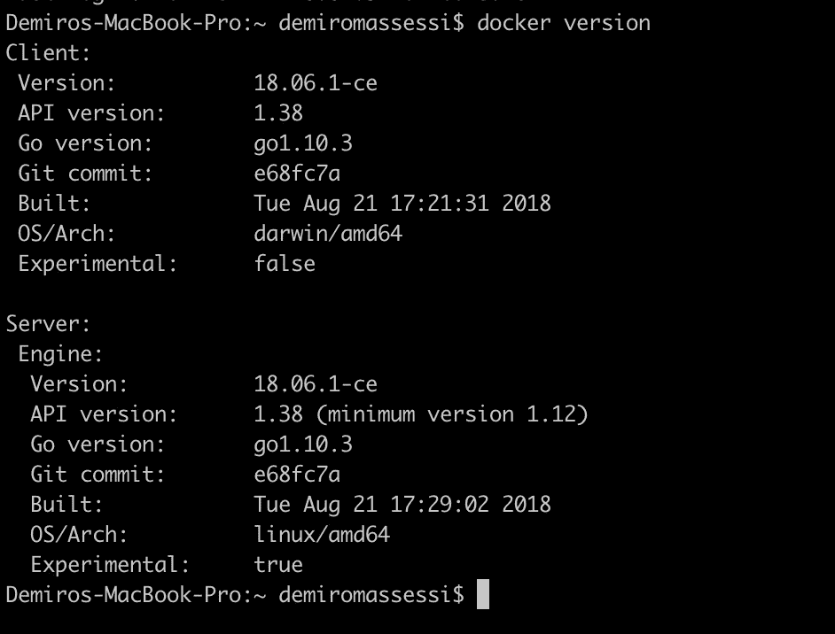

这意味着你已经准备好了，可以走了。

如果您收到一条错误消息，很可能是安装过程中出现了问题，您应该在线搜索答案。简单谷歌一下:)。

现在，我希望您用 Docker 客户端或 Docker CLI 键入我们的第一个命令，这非常重要。

您将运行一个非常短的语句，然后遍历执行命令时发生的一系列高度结构化的事件。

我们将运行命令:

```
$ docker run hello-world
```

是的，这是一个 Hello World 的情况，与计算机科学中的每个新主题一样:)。

但我向你保证，这将是非常迷人的。

你一输入命令，就按回车键。不久之后，您会看到大量文本在屏幕上滚动。

如果你向上滚动，你会看到一个小小的“Docker 你好！”消息，然后你会注意到在它下面有一个当你执行命令时发生的步骤的列表。

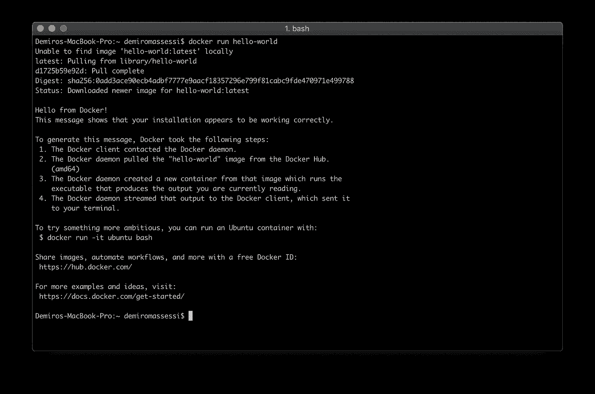

现在，如果你仔细观察，就在命令之后，你可以看到它说“**无法在本地找到图像 hello-world】”。**

记住所有这些，让我们看两个图表来帮助您理解当我们使用这个命令时发生了什么。

所以在终端，您执行了命令' $ docker run hello-world '。

这将启动 **Docker 客户端**或**Docker CLI**。

因此， **Docker CLI** 再次负责接收来自您的指令，对它们进行一些处理，然后将命令传输到 **Docker 服务器**，后者负责控制这项工作。

当我们使用命令' $ docker run hello-world '时，我们要求用名为 hello-world 的图像启动一个新容器，其中包含一个非常小的程序，该程序只有一个目的:打印出“hello，world！”在你的控制台上。

那是那幅图像的唯一目的。

当我们通过 Docker 客户机运行该命令并将其发送到 Docker 服务器时，后台发生了许多事情。


Docker 服务器看到我们试图使用一个名为 hello-world 的映像启动一个新容器。

Dockers 服务器做的第一件事是检查它是否有本地副本，比如你个人计算机上的 hello-world 映像或文件。

所以 Docker 服务器研究了一种叫做图像缓存的东西。图像缓存是 Docker 服务器用来存储图像的缓存。

因为您刚刚在个人电脑上安装了 Docker，所以图像缓存现在是无效的。

您没有任何已经下载的图像。(只要你之前没用过 Docker)。

因为图像缓存是空的，Docker 服务器查询了一个名为 Docker Hub 的免费服务，这是一个免费公共图像的集合，你可以免费下载并在你的个人电脑上使用。

当然，Docker Hub 上有一个，下载的 hello-world 文件被放在您个人计算机的映像缓存中，它可能会在将来的某个时间点快速重新运行，而不必从 Docker Hub 下载。

之后，Docker 服务器说，好的，我已经得到了这个图像，现在可以用它来创建一个容器的实例了。

记住我们刚才说的容器，容器是图像的一个实例。


它的唯一目的是运行一个非常特定的程序，因为它只需要运行一个特定的程序，Docker 服务器的作用基本上是获取这个文件并将其加载到内存中，然后用它创建一个容器，然后在其中执行一个程序，它的唯一目的是打印出消息

这就是运行 docker run 命令时发生的情况。

它延伸到码头中心。它抓取图像，然后用图像创建一个容器。

现在，您会注意到一些有趣的事情:如果您第二次重复$ docker run hello-world 命令，您将不会看到关于下载或无法在本地找到图像的消息，尽管我们以前看到过它。

这是因为我们已经把它下载到了个人电脑的图像缓存中。

所以这里最大的教训是，当你第一次尝试使用这些公开的图片时，你需要做一点下载。

之后，您可以使用该映像更快地启动容器，因为它已经下载到您的计算机上了。

但是我们仍然没有回答容器是什么？

现在你已经了解了容器，是时候了解更多关于你的操作系统如何在你的电脑上运行了。

因此，让我们首先给你一个快速概述你的操作系统。

这是您计算机上操作系统的快速概述。大多数操作系统都有一个内核。

内核是一个连续的软件程序，它控制着当前 PC 上的所有应用程序和与之链接的所有物理设备之间的访问。

如果你在这张图的顶部:

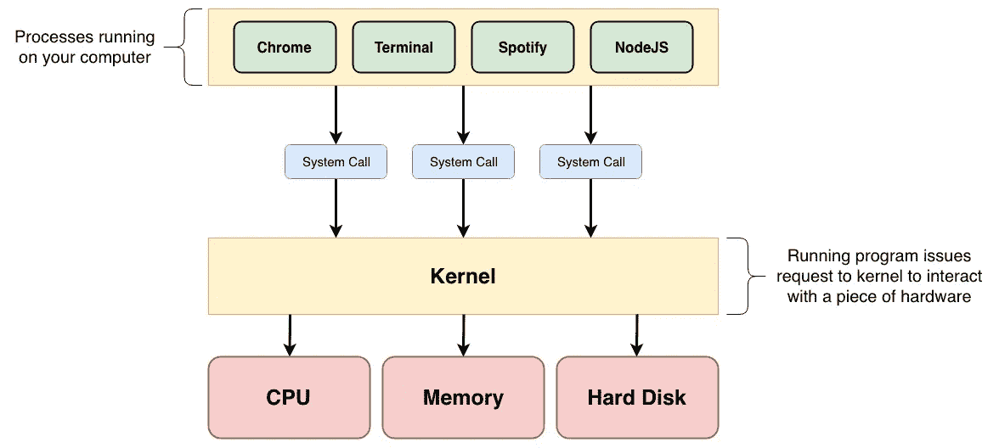

我们有你的电脑运行的不同程序，如 Chrome 或 Terminal、Spotify、NodeJS 等。

如果你曾经使用 NodeJS 在硬盘上写了一个文件，从技术上来说，它不是直接与物理设备对话；相反，NodeJS 告诉你的内核，“嘿，我想在硬盘上写一个文件。”

然后，内核获取这些信息，并最终将其保存到硬盘上。

所以内核总是这种中间层，管理你实际硬盘中这些程序之间的访问。

另一件要记住的事情是，这些运行的应用程序通过系统调用与内核交互。

这些本质上类似于函数调用。

内核公开了各种端点来告诉用户，“嘿，如果你想在硬盘上写一个文件，就在这里使用这个端点或者这个函数。它需要一些数据，然后这些数据将被写入硬盘或内存或其他任何需要的地方。”

现在，从整体上考虑这整个系统。我想请你考虑一个特定的场景。

我想让你想象一下，你的电脑上有两个程序在运行。

可能其中一个是 web 浏览器 Chrome，另一个是 javascript 服务器端运行时 NodeJS。

我们假设在一个疯狂的世界里，Chrome 必须安装 Python 版本 2，NodeJS 必须安装版本 3(现在还不是一个完全疯狂的世界)。

但是我们只能访问我们硬盘上的 Python 版本 2，无论什么原因都不允许我们同时运行两个相同版本的 Python。

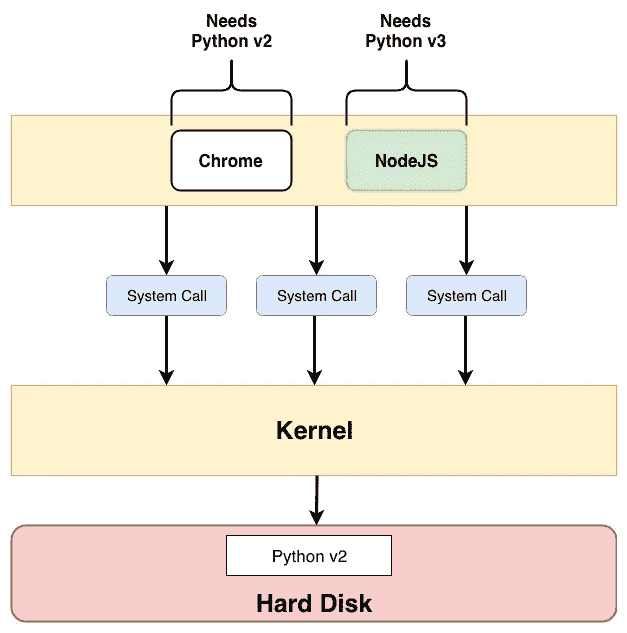

因此，目前 Chrome 可以正常工作，因为它可以访问版本 2，但 NodeJS 不能，因为我们没有 Python 版本 3 的版本或副本。

这又是一个完全虚构的情况。

考虑一下，因为这将引出什么是容器。

那么，我们该如何解决这个问题呢？

然而，实现这一点的一种方法是采用一种称为命名空间的操作系统功能，它允许我们查看所有与我们的计算机相连的各种硬件资源，并分割出这些资源的特定部分。我们可以将硬盘的一部分作为 Python 版本 2 的一个单独部分，另一部分则专门用于 Python 版本 3。

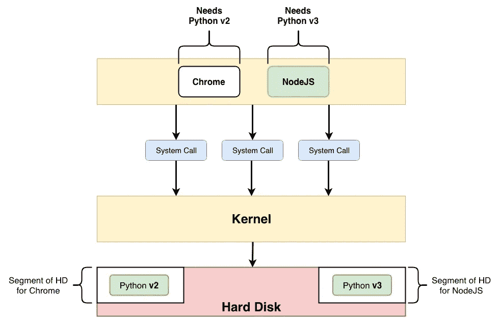

然后，为了确保 Chrome 可以访问正确的段，NodeJS 可以访问另一个段，任何时候他们发出系统调用来读取硬盘上的信息，内核都会查看传入的系统调用，并试图找出它来自哪个进程。

因此，内核可能会回应，“好吧，如果 Chrome 试图从硬盘读取信息，我会将该调用发送到 Python 版本 2 的硬盘的这一小部分，如果 NodeJS 试图从硬盘读取信息，我会将该调用发送到 Python 版本 3 的硬盘的这一小部分”

因此，通过利用这种命名空间，我们可以分割特征。

我们能够确保 Chrome 和 NodeJS 能够在同一台机器上工作。

实际上，这两者都不需要安装 Python。

这只是一个简单的例子。

因此，命名空间，正如我前面提到的，是根据请求它的进程分割硬件资源的行为。命名空间允许我们隔离每个进程或一组进程的资源，我们实际上是在告诉任何时候一个特定的进程请求一个资源，我们将把它定向到给定硬件上他自己的小的专用位置。

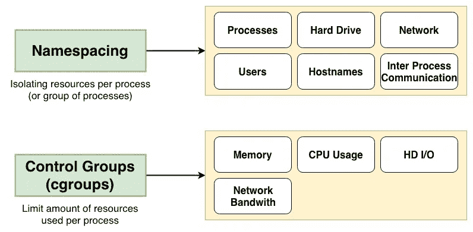

现在命名空间不仅用于硬件，也可以用于软件元素。

我们还可以通过创建子名称空间来限制对进程的访问。例如，我们可能会限制可访问的硬盘驱动器区域，或者可能会使用的网络设备，或者与其他进程通信或观察进程的网络设备。

这些都是我们可以使用命名空间的东西，从本质上限制资源，我们是某种从特定进程重定向资源请求。

与名称空间概念密切相关的另一个特性是控制组，它可以用来限制特定进程可以利用的资源量。

进程由命名空间分隔，命名空间用于指示硬盘驱动器的这个区域专用于某个进程。控制组可以用来限制一个进程可以使用的内存、CPU、输入输出和网络带宽的数量。

这两个特性结合在一起时，允许隔离单个进程并限制其资源。这对于限制单个进程可以使用多少带宽和资源非常有用。

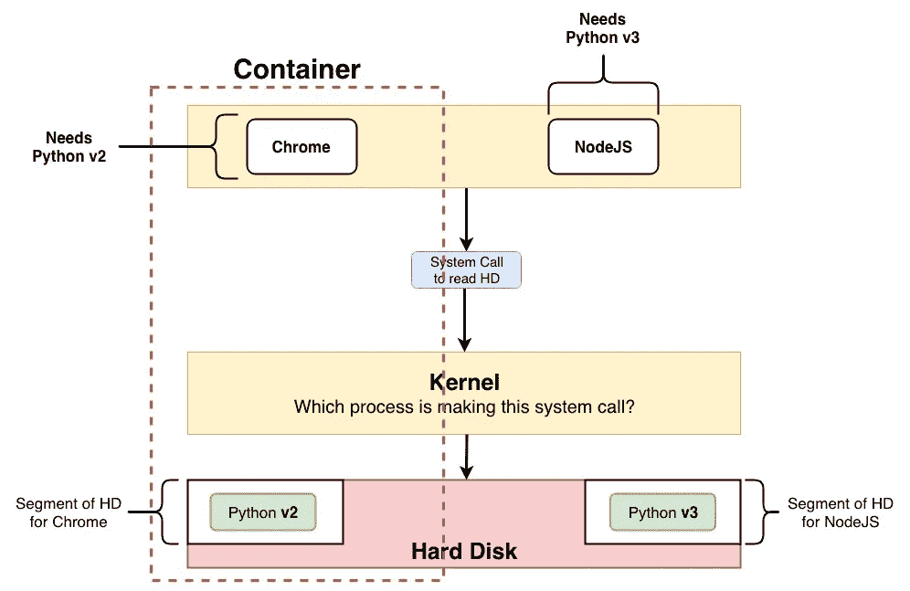

正如你所看到的，你可能在上面的照片中观察到的这种小区域就是我们所说的容器。

所以，当有人告诉你他们有一个容器时，不要认为它是一个存在于你电脑中的有形物体。相反，容器实际上是一个进程或一组进程，有一组专门分配给它的资源。

这是一个图表，在你需要评估情况或考虑容器的时候可能会派上用场。

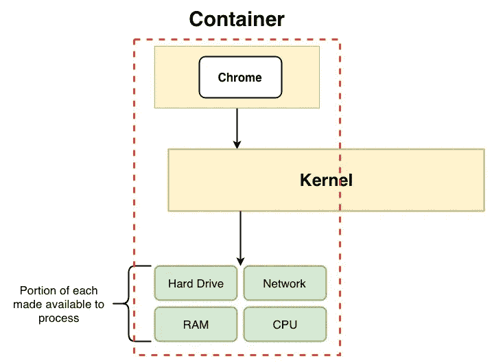

操作结构向内核发送一个系统调用。内核将检查传入的系统调用，并将其发送到硬盘驱动器、RAM、CPU 或其他任何它需要的特定部分。

并且这些资源中的每一个的一部分可用于该单一进程。

现在你可能会问的最后一个问题是:这些容器之间的真正关系是什么？这种单一的过程和资源分组是一种形象吗？单个文件最终是如何创建这个容器？

让我们看一下另一张图，当我们谈论映像时，我们实际上是在谈论文件系统快照。

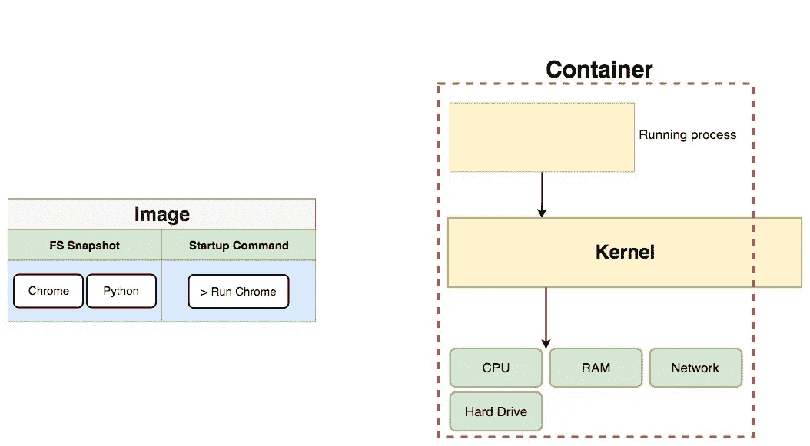

因此，实际上，这是对某一组目录或文件的非常有限的复制粘贴。我们可能有一个只有 Chrome 和 Python 的图像，以及一个特殊的启动命令。

这是当我们拍摄一张图片并把它变成一个容器时，在幕后发生的事情。

内核将隔离硬盘驱动器的一小部分，使其只对这个容器可用。

因此，我们可以想象，在生成这一小部分之后，图像的文件快照被捕获并放在硬盘驱动器的这一小部分中。

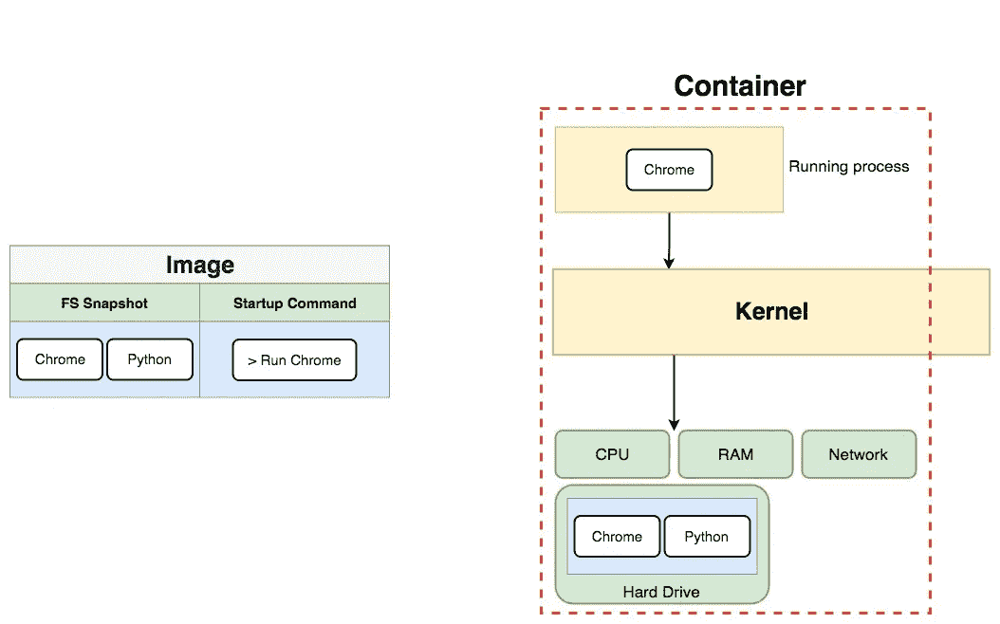

现在，在这个非常具体的资源组中，我们有硬盘的一小部分，只安装了 Chrome 和 Python，基本上没有其他内容。

然后执行建立程序的命令，我们可以认为它类似于启动 Chrome。

所以 Chrome 被调用。

我们启动该流程的一个新实例，然后将其隔离到容器的资源中。

这就是容器和图像之间的关系，也是图像最终被获取并变成运行中的容器的方式。

# 简单回顾一下，然后是最后要补充的内容。

我们说过，容器是一个正在运行的进程，以及计算机上专门分配给该进程的物理资源的子集。

我们还谈到了一个图像和一个正在运行的容器成员之间的关系。

映像实际上是文件系统的快照，以及非常具体的启动命令。

现在，还有一件事:我们之前讨论过通过一个叫做命名空间的过程来隔离这些资源。

此外，我们声明这些控制组在消耗的资源量方面可能是有限的。

现在，命名空间和控制组的这一特性并不默认包含在所有操作系统中。

尽管我之前说过你的操作系统有一个内核，但是命名空间和控制组的这些特性是特定于 Linux 的。

所以命名空间，控制组，属于 Linux，不属于 Windows，不属于 Mac OS。

这可能会让你想知道你目前是如何运行 Docker 的。之后是怎么回事？

你知道我们在 Mac OS 或 Windows 操作系统上运行 Docker 客户端和 Docker 容器。

如果这些是 Linux 特有的特性，那是怎么回事呢？

## **下面是幕后发生的事情:**

当您安装 Docker for Mac 或 Docker for Windows 时，您安装了一个 Linux 虚拟机。

这意味着只要 Docker 在运行，你的计算机上就安装了一个虚拟机。在这个虚拟机中，将生成所有这些容器。

在虚拟机中，我们有一个 Linux 内核，它将在容器中托管运行的进程，并负责限制访问，或者基本上隔离对您计算机上不同硬件资源的访问。

您可以通过打开您的终端并再次执行' $ docker version '命令并查看您的服务器来实际观察这个 Linux 虚拟机的运行。你会看到有一个 OS 入口，它可能不包括你的操作系统；它应该说 Linux 是操作系统。

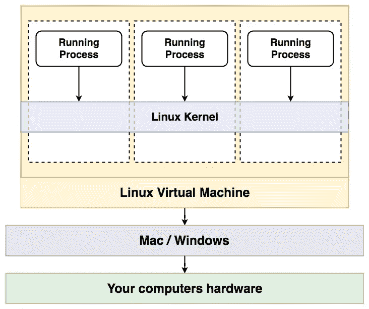

也就是说，你正在运行一个 Linux 虚拟机，它被用来托管你将要使用的所有这些不同的容器。

关于容器和图像，还有很多东西需要学习。然而，这并不意味着是一个全面的码头课程；它只是想为您提供一个关于 Docker 世界的高层次视图和介绍，以便您可以更好地理解它是如何工作的，即使您不是专业的开发人员/工程师，或者只是想发现它是什么，但不需要使用它。

许多区块链项目严重依赖 Docker 来创建和部署网络，因为它让您定义您的网络，然后您可以在几分钟内将它部署到您想要的任何地方，而不需要任何配置。

**Hyperledger 技术** **严重依赖 Docker** 。
**超帐面料**和**超帐锯齿**就是很好的例子。

你想知道人工智能如何帮助你的生意吗？您是否正在寻找一家技术咨询公司来合作并帮助您和您的企业进行数字化转型？我们公司专注于通过在业务创建、运营和发展的所有方面提供专业知识和支持来帮助企业取得成功。我们有技能和经验将您的想法转化为成功的产品和公司。无论你是刚刚起步还是希望扩大现有业务，我们都将帮助你建立和发展你的创业公司。使用下面的链接联系！

[](https://cokixconsulting.com/) [## Cokix 咨询-让您的业务更上一层楼

### 无论您是想创建一家全新的创业公司，还是想扩大现有公司的规模，我们都有工具和专业知识来实现…

cokixconsulting.com](https://cokixconsulting.com/) 

如果你喜欢阅读这样的故事，并想支持我成为一名作家，可以考虑 [**报名成为一名媒体会员**](https://medium.com/@DemiroMassessi/membership) 。每月 5 美元，你可以无限制地阅读媒体上的故事。如果你 [**用我的链接**](https://medium.com/@DemiroMassessi/membership) 注册，我会赚一小笔佣金。

[](https://medium.com/@DemiroMassessi/membership) [## 用我的推荐链接加入媒体- Demy

### 作为一个媒体会员，你的会员费的一部分会给你阅读的作家，你可以完全接触到每一个故事…

medium.com](https://medium.com/@DemiroMassessi/membership) 

## 对新技术感兴趣？看看下面这些故事吧！

[](https://medium.com/coinmonks/blockchain-zero-knowledge-proof-in-a-nutshell-f0684a669a68) [## 区块链零知识证明一言以蔽之

### 今天我们将谈论一个在区块链被称为“零知识证明”的网络安全理念。

medium.com](https://medium.com/coinmonks/blockchain-zero-knowledge-proof-in-a-nutshell-f0684a669a68) [](https://medium.com/coinmonks/blockchain-public-private-key-cryptography-in-a-nutshell-b7776e475e7c) [## 简而言之，区块链公钥/私钥加密

### 公钥/私钥加密在区块链的工作原理，如比特币和以太坊

medium.com](https://medium.com/coinmonks/blockchain-public-private-key-cryptography-in-a-nutshell-b7776e475e7c) [](https://medium.com/coinmonks/blockchain-cryptography-and-hashing-in-a-nutshell-23f4fd7c77b6) [## 简而言之，区块链加密和哈希

### 什么是密码术和散列法？

medium.com](https://medium.com/coinmonks/blockchain-cryptography-and-hashing-in-a-nutshell-23f4fd7c77b6)