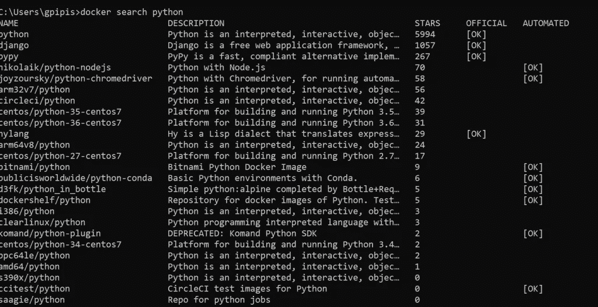
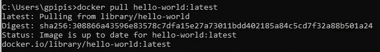
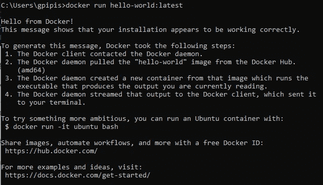
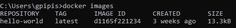
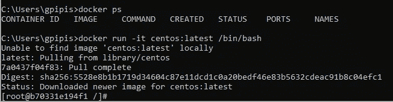
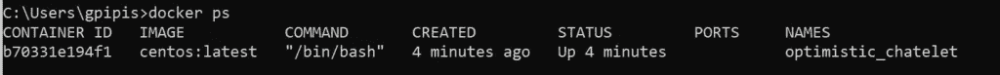
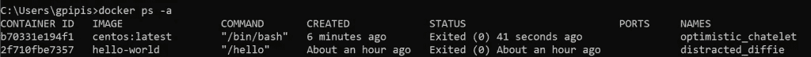
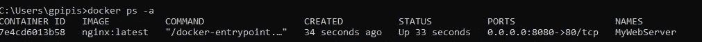

# Docker 快速入门

> 原文：<https://levelup.gitconnected.com/docker-quick-start-d83f78dc6056>

## Docker 初学者教程

[](https://jorgepit-14189.medium.com/membership) [## 用我的推荐链接加入媒体-乔治皮皮斯

### 阅读乔治·皮皮斯(以及媒体上成千上万的其他作家)的每一个故事。您的会员费直接支持…

jorgepit-14189.medium.com](https://jorgepit-14189.medium.com/membership) 

## 如何使用终端从 Docker Hub 搜索 Docker 图片？

假设我们想要搜索 Python 图像。我们可以运行命令:

```
docker search python
```



如我们所见，我们得到了名称、描述、开始以及它是否是官方的和/或自动的。总是试图获得有许多开始的图像，并且更喜欢官方的。

**如何从 Docker Hub 获取图像**

您可以通过运行 docker pull 命令和图像名称从公共存储库中获取图像。假设我们想要获得“hello-world”图像。

```
docker pull hello-world:latest
```



请注意，如果您不使用任何标签，即“:latest”，我们将默认获得最新的。但是，您可以指定特定的版本。

**如何运行 Docker 映像**

我们可以用 run 命令运行 docker 映像。让我们运行“hello-world”图像。

```
docker run hello-world:latest
```

不出所料，我们收到了 Docker 发来的消息"**你好！**“既然本意如此。



**如何获取图像列表**

只需运行`docker images`就可以得到图片列表。在我们的例子中，我们只有`hello-world`。

```
docker images
```



**如何获得运行容器**

获取正在运行的容器的命令是:

```
docker ps
```

**如何检查图像和/或容器**

您可以按如下方式检查集装箱:

```
docker inspect <image_name>
```

**如何在交互模式下运行容器**

如果你想使用终端以交互模式运行一个容器，你应该使用`-it`。让我们运行一下`centos`图像。

```
docker run -it centos:latest /bin/bash
```



现在我们在容器操作系统中！我们可以看到容器正在运行:



如果我们想退出，我们输入`**exit**`。



**如何在后台运行容器**

你应该使用标志`-d`(分离)，命令是:

```
docker run -d nginx:latest
```

**如何停止集装箱**

首先，我们需要使用`ps`命令找到容器 id 或容器名称。

```
docker stop nervous_babbage
```

**如何在容器中执行命令**

如果您有一个正在运行的容器，并且希望以交互模式执行命令，那么您可以运行:

```
docker exec -it <container_name> /bin/bash
```

上面，我们运行了 bin/bash，以便能够开始使用终端与容器进行交互。

**如何删除图像**

您要删除的图像不得使用并且依赖于任何容器。然后，您可以运行

```
docker rmi <image_name>
```

您可以使用标志`-f`强制删除图像，即使它在任何运行的容器中使用。

```
docker rmi -f <image_name>
```

**如何移除所有未运行的容器**

您可以使用以下命令删除所有未运行的容器:

```
docker rm $(docker ps -a -q)
```

**如何映射端口**

您可以使用标志`-p`定义本地端口，如下所示:

```
docker run -d -p 8080:80 --name=MyWebServer nginx:latest
```



**如何挂载数据**

您可以使用 volume 中的标志`-v`在容器中装载数据。

```
docker run -d -p 8080:80 --name=MyWebServer2 -v /mnt/data nginx:latest
```

如果我们想要映射卷装载，我们可以运行以下命令:

```
docker run -d -p 8080:80 --name=MyWebServer2 -v /home/user/data:/user/share/nginx/my_folder nginx:latest
```

现在，无论何时我们在本地 PC 的`data`文件夹中做了更改，都会自动传递到容器中的`my_folder`。

**Dockerfile**

您可以从 Dockerfile 文件构建映像。docker 文件的名称必须只有`**Dockerfile**`，没有任何扩展名，您可以通过运行以下命令来构建您的映像:

```
docker build .
```

注意句号。它指的是 docker 文件所在的工作目录。Dockerfile 文件的结构是:

```
FROM debian:stable 
RUN apt-get update &amp;&amp; apt-get upgrade -y 
ENV MYVALUE my-value 
EXPOSE 80 
CMD ["/usr/sbin/apach2ctl", "-D", "FOREGROUND"]
```

# 参考

[1] [Linux 学院](https://app.linuxacademy.com/)

*原载于*[*https://predictivehacks.com*](https://predictivehacks.com/?all-tips=docker-quick-start)*。*