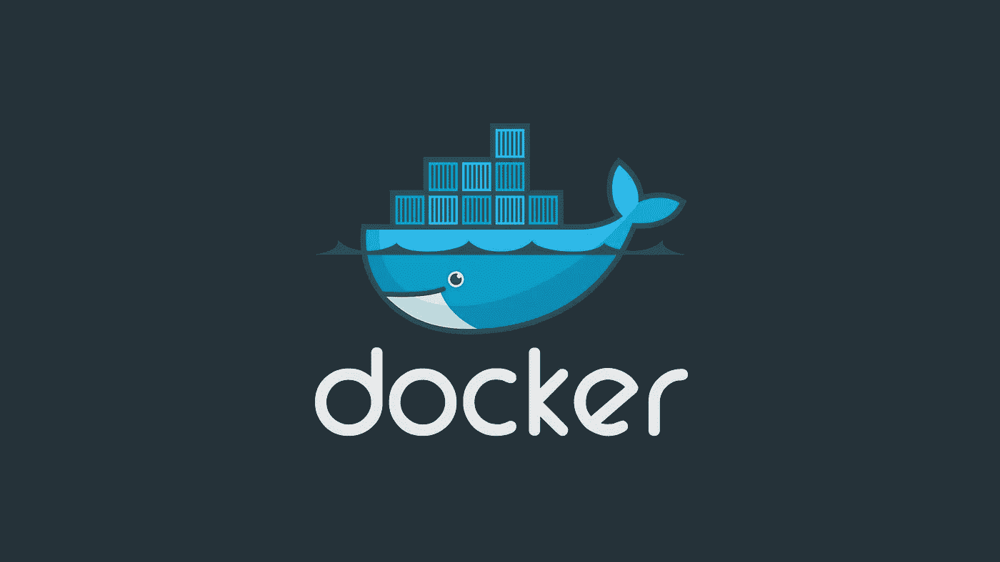

# DevOps 的 Docker 复习工具

> 原文：<https://levelup.gitconnected.com/docker-refresher-for-devops-78b4b1516ada>

## 对于那些刚接触 Docker 或有经验但想要复习的人



我真的很喜欢 Docker，但是每当我有一段时间没有使用它的时候，我都需要快速浏览 Docker 教程来刷新我对所有命令以及如何使用它的记忆。这篇文章是为那些正在使用或曾经使用 Docker 的人准备的，他们只需要快速复习一下。我不打算详细介绍每个命令的作用，因为我假设您已经知道了。

## 安装 Docker

安装 Docker 时，您首先要访问的是官方的“ [Get Docker](https://docs.docker.com/get-docker/) ”页面。对于每一个操作系统和平台来说，按照说明操作真的很容易。

## **验证码头工人**

```
% **docker --version**
Docker version 19.03.13, build 4484c46d9d% **docker run --rm hello-world**
Unable to find image 'hello-world:latest' locally
latest: Pulling from library/hello-world
0e03bdcc26d7: Pull complete 
Digest: sha256:8c5aeeb6a5f3ba4883347d3747a7249f491766ca1caa47e5da5dfcf6b9b717c0
Status: Downloaded newer image for hello-world:latestHello from Docker!
This message shows that your installation appears to be working correctly.
```

"- **rm** "当图像停止运行时移除容器

**导航 Docker**

```
% **docker images**         
REPOSITORY    TAG       IMAGE ID        CREATED          SIZE
hello-world   latest    bf756fb1ae65    10 months ago    13.3kB% **docker ps -a**
CONTAINER ID    IMAGE          COMMAND     CREATED    
STATUS                         PORTS       NAMES
f6a6eb029961    hello-world    "/hello"    About a minute ago   Exited (0) About a minute ago              laughing_bartik% **docker volume ls** DRIVER              VOLUME NAME
local               3ee49be5d5b72ae9bd159c303a9b3063c6df8549fe10d05f254d4e2cb04337b4# display the logs for a specified container
% **docker logs --tail 50 --follow --timestamps ee68ecae1c1b**
2020-10-30T10:17:23.631725622Z 
2020-10-30T10:17:23.631784128Z Hello from Docker!
2020-10-30T10:17:23.631792083Z This message shows that your installation appears to be working correctly.# display the ports exposed on a container called "client-go"
% **docker port client-go**# you can also see exposed container ports like this
% **docker ps -a**
```

**清理**

```
# removes one image
% **docker rmi -f bf756fb1ae65**# removes one container
% **docker rm -f f6a6eb029961**# removes all images
% **docker rmi $(docker images -q)**# removes all stopped containers
% **docker container prune**# another way of removing all stopped containers
% **docker rm $(docker ps -a -q -f status=exited)**# remove volume
% **docker volume rm -f 3ee49be5d5b72ae9bd159c303a9b3063c6df8549fe10d05f254d4e2cb04337b4**# remove all unused local volumes
% **docker volume prune**# another way of removing dangling volumes
% **docker volume rm $(docker volume ls -qf dangling=true)**
```

**图像**

```
# run image version including 'stable' version and remove container
% **docker run --rm ethereum/client-go:stable**# pull down the latest image but don't run it
% **docker pull ethereum/client-go** % **docker pull ethereum/client-go:latest**# run image with chosen name and map to dynamic ports on host (-P)
% **docker run -P --name client-go ethereum/client-go**% **docker run -P --name client-go ethereum/client-go**# manually map ports between image and host (-p)
% **docker run -it -p 8545:8545 -p 30303:30303 ethereum/client-go**# runs a docker image in interactive mode starting by running bash
% **docker run -it ubuntu bash**# run an image as a daemon and don't exit after run (-d)
**docker run -d --name client-go ethereum/client-go:stable**# pass commands through to image after it starts (--rpc --rpcaddr "0.0.0.0")
**docker run -d --name client-go ethereum/client-go --rpc --rpcaddr "0.0.0.0"**# directory on image to a directory on the host (-v /path/on/host:/root/.ethereum)
**docker run -it -p 30303:30303 -v /path/on/host:/root/.ethereum ethereum/client-go**
```

**集装箱**

```
# lists all containers (name of containers is at the end)
% **docker ps -a**# stops a container with the name "client-go"
% **docker stop client-go**# starts a container with the name "client-go"
% **docker start client-go**
```

**Dockerfile** (构建自己的图像)

*   为新图像创建一个工作目录
*   创建一个名为“ **Dockerfile** ”的文件

最基本的例子:

```
% **cat Dockerfile** 
FROM ubuntu:20.04
```

这将使用另一个图像“ **ubuntu:20.04** ”作为基础创建一个图像。你不必这样做，但它大大加快了这个过程。把它当成第一个积木。

要创建名为“**迈克/ubuntu** ”的新图像…

```
% **docker build -t mike/ubuntu .** Sending build context to Docker daemon  2.048kB
Step 1/1 : FROM ubuntu:20.04
20.04: Pulling from library/ubuntu
6a5697faee43: Pull complete 
ba13d3bc422b: Pull complete 
a254829d9e55: Pull complete 
Digest: sha256:fff16eea1a8ae92867721d90c59a75652ea66d29c05294e6e2f898704bdb8cf1
Status: Downloaded newer image for ubuntu:20.04
 ---> d70eaf7277ea
Successfully built d70eaf7277ea
Successfully tagged mike/ubuntu:latest
```

让我们确认图像已经创建。

```
% **docker images **             
REPOSITORY     TAG       IMAGE ID        CREATED       SIZE
mike/ubuntu    latest    d70eaf7277ea    6 days ago    72.9MB
ubuntu         20.04     d70eaf7277ea    6 days ago    72.9MB
```

正如你所见，两幅图像是相同的，因为我们还没有添加我们的定制。

以下是一些有用的 Dockerfile 命令。

```
# maintainer of the Dockerfile
**MAINTAINER Michael Whittle <m.whittle@reply.com>**# you can add Docker tags/labels to the image
**LABEL name="mediumtutorial"**# run a command or series of commands in image while building
**RUN apt-get update -y \
        && apt-get upgrade -y**# can also be run individually
**RUN apt-get update -y
RUN apt-get upgrade -y** **RUN apt-get install python3 -y
RUN ["apt-get", "install", "python3"]**# RUN executes command(s) in a new layer and creates a new image
# RUN is typically used for installing software packages# change the working directory to /tmp
**WORKDIR /tmp**# similar to WORKDIR except you can't do CD /
**CD /tmp**# set an environment variable (can't be updated during build)
**ENV FOO=/bar**# set an variable (can be updated during build)
**ARG FOO2=/bar2**# both ENV and ARG are used the same way but ENV is a constant
# and ARG is a variable in programming terms# use the environment variable
**WORKDIR ${FOO}**# add a file from host to working directory in image
**ADD . $FOO**# normal copying within the image
**COPY \$FOO /tmp2**# sets default command and/or parameters
# can be overwritten from command line when docker container runs
**CMD echo "Hello world"
CMD ["/bin/echo", "Hello world"]****# exposes ports from container to the host**
**EXPOSE 80/tcp
EXPOSE 123/tcp**# ENTRYPOINT configures a container that will run as an executable
**ENTRYPOINT echo "Hello world"
ENTRYPOINT ["/bin/echo", "Hello world"]
ENTRYPOINT ["/bin/bash", "-c", "echo Hello world"]**
```

作为一种想法，您可以为 web 前端创建一个图像，为应用程序后端创建一个图像，为数据库创建一个图像。问题是码头集装箱都运行包含。他们不能互相交流。那么这是怎么做到的呢？

## 安装 Docker 合成

Docker Compose 允许您部署由一个或多个容器和虚拟网络组成的完整解决方案。

```
% **apt-get install docker-compose -y**    # ubuntu, debian etc.
% **yum install docker-compose -y**        # redhat, centos etc.
% **brew install docker-compose**          # macOS
```

## Docker 撰写文件看起来像什么？

这是一个名为“ **example.yml** ”的 docker 撰写文件的示例。

```
version: '3'
services:
  mike.webfe:
    container_name: mike_webfe
    hostname: webfe
    image: mike/webfe
    restart: unless-stopped
    depends_on:
      - mike_appbe
    ports:
      - "80:80"
    networks: 
      - backend
  mike.appbe:
    container_name: mike_appbe
    hostname: appbe
    image: mike/appbe
    restart: unless-stopped
    ports:
      - "80:80"
    networks:
      - backend
    tty: true
networks:
  backend:
    driver: "bridge"
```

**基本 Docker 编写用法**

```
% **docker-compose -p mediumtutorial -f ./example.yml up -d --remove-orphans**% **docker container exec -it mike_webfe /bin/bash**% **docker-compose -p mediumtutorial -f ./example.yml down**
```

如果我错过了其他有用的东西，请在评论中告诉我，我会添加的。

我希望你觉得这篇文章有趣并且有用。如果您想随时了解情况，请不要忘记关注我，注册我的[电子邮件通知](https://whittle.medium.com/subscribe)。

# 迈克尔·惠特尔

*   ***如果你喜欢这个，请*** [***跟我上媒***](https://whittle.medium.com/)
*   ***更多有趣的文章，请*** [***关注我的刊物***](https://medium.com/trading-data-analysis)
*   ***有兴趣合作吗？*** [***我们上 LinkedIn***](https://www.linkedin.com/in/miwhittle/) 连线吧
*   ***支持我和其他媒体作者*** [***在此报名***](https://whittle.medium.com/membership)
*   ***请别忘了为文章鼓掌:)←谢谢！***