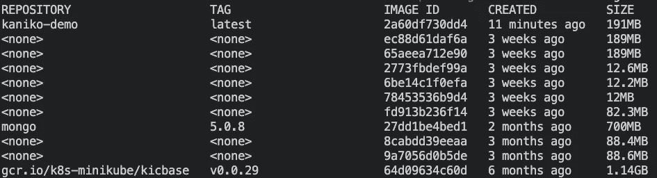
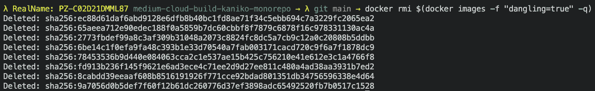
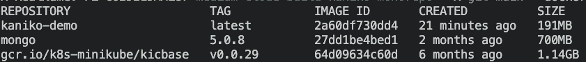

# Docker:移除悬空图像

> 原文：<https://levelup.gitconnected.com/docker-remove-dangling-aka-none-images-8593ef60deda>

在这篇简明教程中，我想向你展示如何从你的文件系统中移除所有令人讨厌的悬空 Docker 图像(`<none>`)图像。


## 寻找悬挂的图像

当您在本地系统上键入`docker images`时，您可能会看到系统上所有 Docker 图像的列表。这些可以是带有适当的存储库名称和标签的“普通”存储库，也可以是通过`<none>`文本指示的“悬空”存储库。

在下图中，您可以看到在我的系统中，我有三个具有正确存储库名称的图像和许多悬挂图像。



docker 图像

## 移除悬挂的图像

如果你知道正确的命令，移除悬挂的图像是非常容易的。

在这种情况下，您可以使用以下简洁的命令来清理您的空间:

```
docker rmi $(docker images -f "dangling=true" -q)
```

在下图中，您可以看到所有悬挂的图像都被移除了:



docker RMI $(docker images-f " dangling = true "-q)



docker 图像

**但是你可能会问，你刚才到底跑了什么？**

让我们从右向左开始。

`docker images -f "dangling=true" -q`:

*   `docker images` —列出位于系统上的所有 Docker 图像
*   `-f "dangling=true"` —过滤(`-f`)图像列表，只返回悬空图像。
*   `-q` —安静输出→仅显示 Docker 图像的图像 id

`docker rmi $INPUT`:

*   `docker rmi` —通过图像 Id 或名称移除 Docker 图像(**R**e**M**ov**I**mages)。您可以提供多个值。
*   `$INPUT` —上述`docker images`命令返回的图像 id 列表。

## 你想联系吗？

如果你想联系我，请通过 LinkedIn 联系我。

另外，请随意查看我的书籍推荐📚。

[](https://mr-pascal.medium.com/my-book-recommendations-4b9f73bf961b) [## 我的书籍推荐

### 在接下来的章节中，你可以找到我对所有日常生活话题的书籍推荐，它们对我帮助很大。

mr-pascal.medium.com](https://mr-pascal.medium.com/my-book-recommendations-4b9f73bf961b) [](https://mr-pascal.medium.com/membership) [## 通过我的推荐链接加入 Medium—Pascal Zwikirsch

### 作为一个媒体会员，你的会员费的一部分会给你阅读的作家，你可以完全接触到每一个故事…

mr-pascal.medium.com](https://mr-pascal.medium.com/membership)