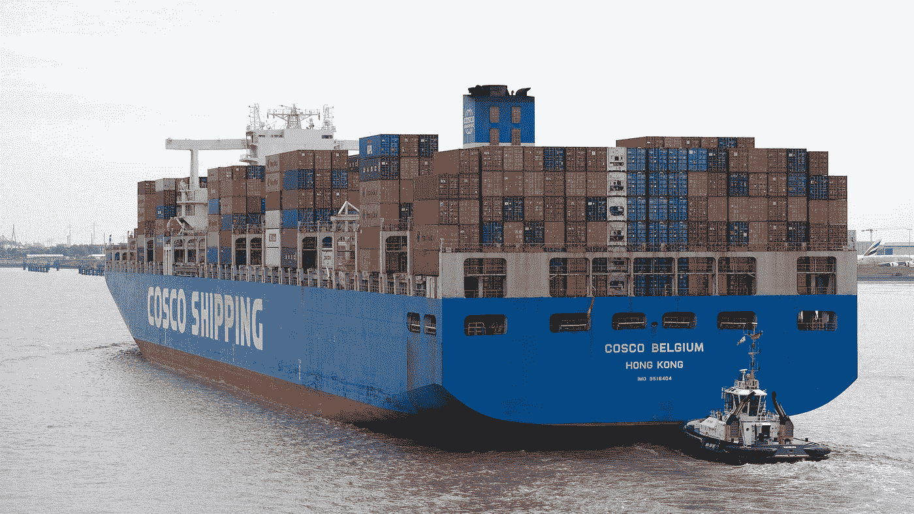
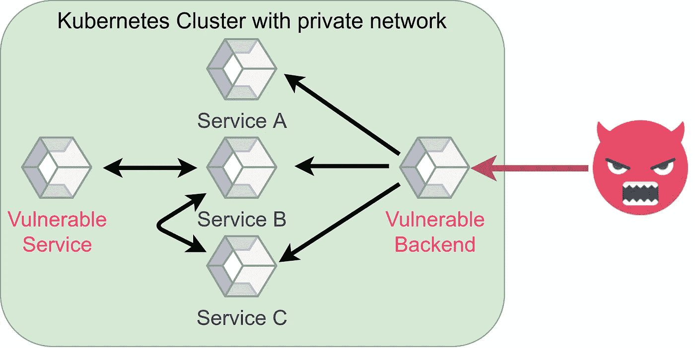

# 码头保安😇

> 原文：<https://levelup.gitconnected.com/docker-security-5f4df118948c>

## 码头工人安全实践指南



安德烈·沙皮洛在 Unsplash[上拍摄的照片](https://unsplash.com?utm_source=medium&utm_medium=referral)

我见过的大多数公司至少在一个项目或服务中部署了 Docker 映像。Docker 之所以伟大，是因为它通过在很大程度上指定环境，使内容具有可复制性。但是，你还是要考虑安全性。让我们仔细看看！

# 主机安全性

所有 Docker 容器都运行在一个主机系统上。主机需要安全，容器也需要安全。

有各种针对 Linux 系统的漏洞扫描、审计和强化工具:

*   Lynis :执行`sudo apt-get install lynis && sudo lynis audit system`并等待几分钟，你会得到一个非常好的报告，指出你可以做些什么来强化你的系统。
*   SELinux :作为内核模块提供强制访问控制(MAC)。托马斯·卡梅隆对 SELinux 进行了[介绍。SELinux 和 AppArmor 的关键点是访问控制策略。默认情况下，Linux 使用自主访问控制(DAC)。SELinux 和 AppArmor 执行 MAC。](https://www.youtube.com/watch?v=_WOKRaM-HI4)[了解更多差异](/effective-access-control-331f883cb0ff)。[。dockerignore](https://medium.com/u/ee455f5da731#dockerignore-file) 文件，以确保某些文件不会被添加。

    ## 在容器中运行非特权用户

    默认情况下，您在 docker 容器中执行的代码使用用户 ID`0`——root 运行。建议不要那样做。您可以通过多种方式改变这一点:

    在 docker 文件中—我更喜欢这个:

    ```
    RUN groupadd -r noroot && useradd -r -g noroot noroot
    USER noroot
    ```

    当您启动容器时:

    ```
    $ docker run -u 1000 -it python:3.9.1-buster bash
    I have no name!@a70ba4f24042:/$ echo $UID
    1000
    ```

    在 Kubernetes 通过`RunAsUser`在`securityContext` ( [docs](https://kubernetes.io/docs/tasks/configure-pod-container/security-context/) )。

    ## 多阶段构建

    如果攻击者能够访问您的容器，您希望他们在那里拥有尽可能少的工具。为此使用[多阶段构建](https://docs.docker.com/develop/develop-images/multistage-build/)。在构建容器中构建您的代码，并在另一个容器中使用构建的工件。另外，你的图片尺寸会变小。

    [Docker 文档](https://docs.docker.com/develop/develop-images/multistage-build/)给出了一个很好的例子:

    ```
    **FROM golang:1.7.3**
    WORKDIR /go/src/github.com/alexellis/href-counter/
    RUN go get -d -v golang.org/x/net/html  
    COPY app.go .
    RUN CGO_ENABLED=0 GOOS=linux go build -a -installsuffix cgo -o app .

    **FROM alpine:latest**  
    RUN apk --no-cache add ca-certificates
    WORKDIR /root/
    COPY **--from=0** /go/src/github.com/alexellis/href-counter/app .
    CMD ["./app"]
    ```

    # 加固你的容器

    ## 只读根文件系统

    这取决于你如何运行 docker 镜像，但是如果你使用`docker run`你可以添加`[--read-only](https://docs.docker.com/engine/reference/commandline/run/)` [标志](https://docs.docker.com/engine/reference/commandline/run/)。这使得根文件系统成为只读的。这意味着如果攻击者进入系统，他们不能在磁盘上存储任何东西或更改任何可执行文件。他们仍然可以改变记忆。

    您还应该意识到，一些非常标准的任务(如创建临时文件)显然不再有效:

    ```
    $ sudo docker run -it **--read-only** python:3.9.1-buster
    Python 3.9.1 (default, Jan 12 2021, 16:45:25) 
    [GCC 8.3.0] on linux
    Type "help", "copyright", "credits" or "license" for more information.
    >>> import tempfile
    >>> a = tempfile.mkdtemp()
    Traceback (most recent call last):
      File "<stdin>", line 1, in <module>
      File "/usr/local/lib/python3.9/tempfile.py", line 348, in mkdtemp
        prefix, suffix, dir, output_type = _sanitize_params(prefix, suffix, dir)
      File "/usr/local/lib/python3.9/tempfile.py", line 118, in _sanitize_params
        dir = gettempdir()
      File "/usr/local/lib/python3.9/tempfile.py", line 287, in gettempdir
        tempdir = _get_default_tempdir()
      File "/usr/local/lib/python3.9/tempfile.py", line 219, in _get_default_tempdir
        raise FileNotFoundError(_errno.ENOENT,
    FileNotFoundError: [Errno 2] No usable temporary directory found in ['/tmp', '/var/tmp', '/usr/tmp', '/']
    ```

    您可以通过将`/tmp`安装为一个卷来解决这个问题:

    ```
    $ sudo docker run -it **--mount source=myvol2,target=/tmp** --read-only python:3.9.1-buster
    Python 3.9.1 (default, Jan 12 2021, 16:45:25) 
    [GCC 8.3.0] on linux
    Type "help", "copyright", "credits" or "license" for more information.
    >>> import tempfile; a = tempfile.mkdtemp() $ sudo docker run --rm -i -v=myvol2:/tmp/v busybox find /tmp/v
    /tmp/v
    /tmp/v/tmpbhw8djco
    ```

    更好的方法是使用主机的临时文件系统:

    ```
    $ sudo docker run -it **--tmpfs /tmp** --read-only python:3.9.1-buster
    ```

    ## 限制能力

    您可以限制 [Linux 内核功能](https://man7.org/linux/man-pages/man7/capabilities.7.html):

    ```
    $ docker run **--cap-drop all** -it python:3.9.1-buster bash
    root@3c568219116e:/# groupadd -r noroot 
    **groupadd: failure while writing changes to /etc/gshadow**
    ```

    然后，您可以授予应用程序所需的权限:

    ```
    $ docker run --cap-drop all --cap-add CHOWN -it python:3.9.1-buster bash
    root@3c568219116e:/# groupadd -r noroot 
    groupadd: failure while writing changes to /etc/gshadow
    ```

    在 Kubernetes 中，这是通过`securityContext` ( [文档](https://kubernetes.io/docs/tasks/configure-pod-container/security-context/))中的`capabilities`来完成的。

    ## 无新权限

    你可能想总是设置`--security-opt=no-new-privileges`。它禁止容器进程获得新的特权( [docs](https://docs.docker.com/engine/reference/run/#security-configuration) )。在 Kubernetes 中，这被称为`allowPrivilegeEscalation` ( [docs](https://kubernetes.io/docs/tasks/configure-pod-container/security-context/) )。

    ## 扫描漏洞

    quay 的 Clair 似乎是扫描容器漏洞的常用工具。不过，到目前为止我还没用过。

    # 集装箱间通信

    “深度防御”的一个关键思想是让攻击者尽可能难走每一步。如果某些东西对于应用程序的运行不是绝对必要的，那么它就是不允许的。限制容器与其他容器的通信方式是其中的一部分。

    

    场景攻击者如何被受控网络通信/容器间通信阻止。图片作者:马丁·托马斯

    大多数公司都有很多不同的微服务在容器中运行。有些容器需要通信，有些不需要。可能有两个存在如上图所示的漏洞。后端有一个漏洞，使得攻击者能够进入容器，另一个服务可能会遭受相同的问题。但是攻击者无法直接与其他易受攻击的服务进行通信，从而避免了伤害。

    看看 [Docker 容器网络](https://docs.docker.com/config/containers/container-networking/)或者 [Kubernetes 网络政策](https://kubernetes.io/docs/concepts/services-networking/network-policies/)。

# 结论

集装箱安全是一个非常广泛的领域。NIST 应用程序容器安全指南比这篇文章更广泛，OWASP Docker 备忘单也差不多长。Tsvi Korren 做了一个关于容器安全性的非常好的演示:

在安全方面，很难推荐该做什么。为了最大限度的安全，你什么都想做。但是一个非常简短且可行的指南应该是:

*   确保使用众所周知的、可信的、经过维护的基础映像。
*   只安装你需要的软件，只复制你使用的文件。如果您需要软件来构建软件，请尝试多阶段构建。
*   使用非超级用户。
*   限制特权/容器间通信。
*   使用只读文件系统。
*   获得自动扫描漏洞并在发现新漏洞时向您发出警报的工作流程。

# 下一步是什么？

在这个关于应用安全(AppSec)的系列文章中，我们已经解释了攻击者的一些技术😈以及防守队员的技术😇：

*   第 1 部分: [SQL 注入](https://medium.com/faun/sql-injections-e8bc9a14c95)😈
*   第二部:[不要泄露秘密](/leaking-secrets-240a3484cb80)😇
*   第 3 部分:[跨站脚本(XSS)](/cross-site-scripting-xss-fd374ce71b2f) 😈
*   第 4 部分:[密码哈希](/password-hashing-eb3b97684636)😇
*   第五部分: [ZIP 炸弹](https://medium.com/bugbountywriteup/zip-bombs-30337a1b0112)😈
*   第六部分:[验证码](https://medium.com/plain-and-simple/captcha-500991bd90a3)😇
*   第 7 部分:[电子邮件欺骗](https://medium.com/bugbountywriteup/email-spoofing-9da8d33406bf)😈
*   第 8 部分:[软件组成分析](https://medium.com/python-in-plain-english/software-composition-analysis-sca-7e573214a98e) (SCA)😇
*   第九部分: [XXE 袭击事件](https://medium.com/faun/xxe-attacks-750e91448e8f)😈
*   第十部分:[有效的访问控制](/effective-access-control-331f883cb0ff)😇
*   第十一部分: [DOS via 十亿次大笑](https://medium.com/bugbountywriteup/dos-via-a-billion-laughs-9a79be96e139)😈
*   第十二部分:[全磁盘加密](https://medium.com/faun/full-disk-encryption-2090489f9760)😇
*   第 13 部分:[不安全的反序列化](https://medium.com/bugbountywriteup/insecure-deserialization-5c64e9943f0e)😈
*   第 14 部分:码头安全😇

这即将到来:

*   CSRF😈
*   磁盘操作系统😈
*   雷多斯😈
*   凭据填充😈
*   密码劫持😈
*   单点登录😇
*   双因素认证😇
*   备份😇

如果您对更多关于 AppSec / InfoSec 的文章感兴趣，请告诉我！