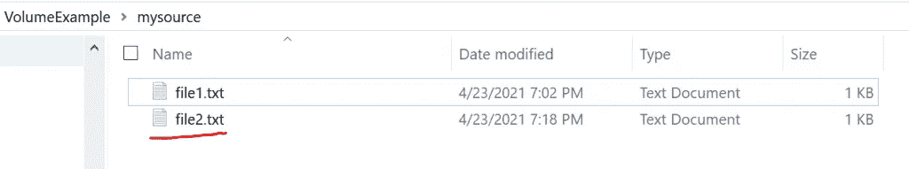

# Docker 储物教程

> 原文：<https://levelup.gitconnected.com/docker-storage-tutorial-ecbd91db5b9>

## Docker 卷的演练教程


不溅

[](https://jorgepit-14189.medium.com/membership) [## 用我的推荐链接加入媒体-乔治皮皮斯

### 阅读乔治·皮皮斯(以及媒体上成千上万的其他作家)的每一个故事。您的会员费直接支持…

jorgepit-14189.medium.com](https://jorgepit-14189.medium.com/membership) 

Docker 有两个主要的数据存储类别，持久的 T7 和非持久的 T9。

# 持久数据存储

持久数据存储是与容器分离的卷。

# 体积:

*   为持久数据使用卷:首先创建卷，然后创建容器。
*   挂载到容器中的目录
*   数据被写入卷中
*   删除容器不会删除卷
*   一等公民
*   使用本地驱动程序
*   第三方驱动程序:块存储、文件存储、对象存储
*   存储位置:Linux: /var/lib/docker/volumes/，Windows:C:\ program data \ Docker \ volumes

# 非持久性数据存储

**非持续性**

*   局部存储器
*   短暂的数据
*   每个集装箱都有
*   依赖于容器的生命周期

**默认情况下所有容器都使用本地存储**

**存放位置**

*   Linux:/var/lib/docker/[存储驱动程序]/
*   windows:C:\ program data \ Docker \ windows filter \

**存储驱动程序**

*   RHEL 使用重叠 2。
*   Ubuntu 使用 overlay2 或 aufs。
*   SUSE 使用 btrfs。
*   Windows 使用自己的。

# 音量命令

列出所有 Docker 音量命令:

```
docker volume -h
```

*   `create`:创建一个卷。
*   `inspect`:显示一个或多个卷的详细信息。
*   `ls`:列表卷。
*   `prune`:移除所有未使用的本地卷。
*   `rm`:删除一个或多个卷。

列出所有卷:

```
docker volume ls
```

创建两个新卷:

```
docker volume create test-volume1 docker volume create test-volume2
```

创建卷时获取可用标志:

```
docker volume create -h
```

检查卷:

```
docker volume inspect test-volume1
```

删除卷:

```
docker volume rm test-volume
```

删除所有未使用的卷:

```
docker volume prune
```

# 绑定安装

绑定挂载从 Docker 早期就已经出现了。与卷相比，它们的功能有限。使用绑定装载，主机上的文件或目录被装载到容器中。

卷使用在主机上 Docker 的存储目录中创建的新目录，Docker 管理该目录的内容。

**使用挂载标志:**

```
docker container run -d --name <NAME> --mount type=bind, source=<SOURCE>, target=<TARGET> <IMAGE>
```

**使用音量标志:**

```
docker container run -d --name <NAME> -v <SOURCE>:<TARGET> <IMAGE>
```

让我们提供一个如何运行带有卷的容器的示例。在我们的工作目录中，我们创建了一个名为的文件夹，该文件夹将与文件夹下的 docker 容器相连接，其中我们的案例是`nginx`。让我们运行命令(注意，我是在 Windows 上，这是在源路径中使用反斜杠的原因):

```
docker container run -d --name nginx_with_volume -v C:\ForTheBlog\VolumeExample\mysource:/mytarget nginx
```

现在，假设我们创建一个名为`**myfile1.txt**`的新文件，放在我们本地 PC 的文件夹下:


现在，我们期望在文件夹下的容器中找到。让我们在交互式终端(`-it`)中运行 bash 命令:

```
docker exec -it nginx_with_volume bash
```

我们在集装箱里。我们可以用`ls`命令搜索文件和目录:

```
ls -ltr
```


我们可以将目录(`cd`)改为`mytarget`:

```
cd mytarget ls -ltr
```


我们可以看到`file1.txt`从我们的本地电脑安装在集装箱内。最后，让我们在`mytarget`文件夹下的容器中创建一个名为`**file2.txt**`的新文件。

```
touch file2.txt echo "A file created within the container" > file2.txt
```


我们期望在本地 PC 的文件夹下找到`**file2.txt**`。正如我们所见，它就在那里！



# 移除容器

既然我们完成了这个教程，是时候清理我们的烂摊子了:)。所以，让我们停下来，然后移除容器。

```
docker stop nginx_with_volume docker rm nginx_with_volume
```

# 参考

[1] [Linux 学院](https://linuxacademy.com/cp/modules/view/id/314)

*原载于*[*https://predictivehacks.com*](https://predictivehacks.com/docker-storage-tutorial/)*。*