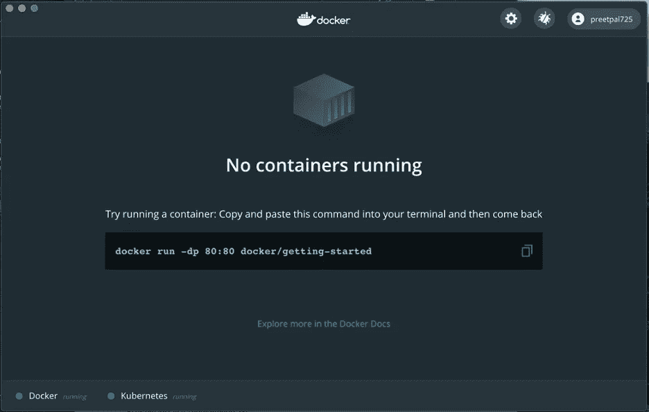
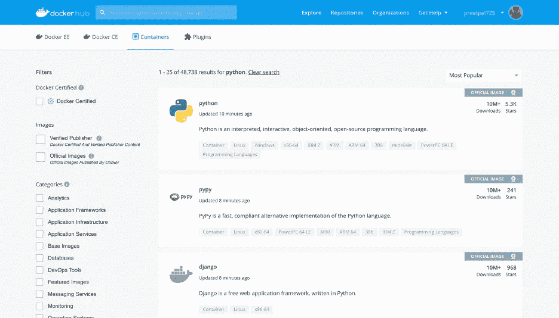
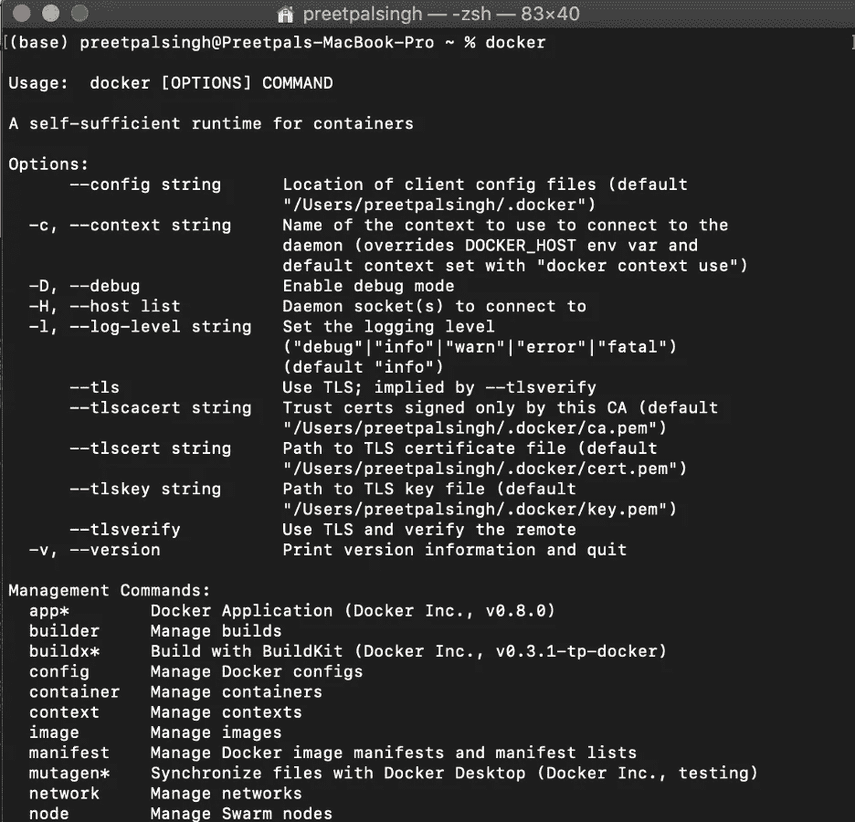
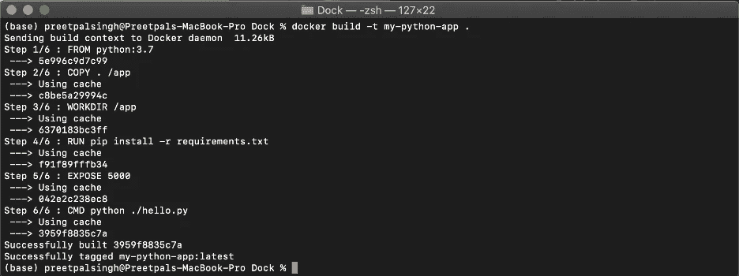
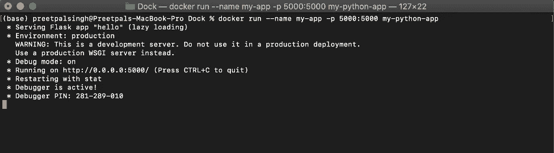
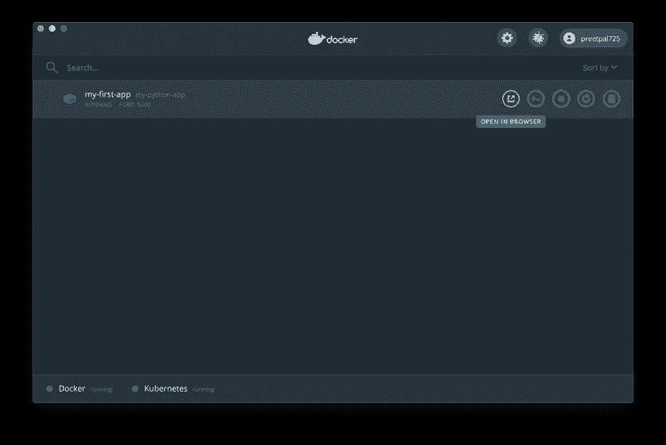
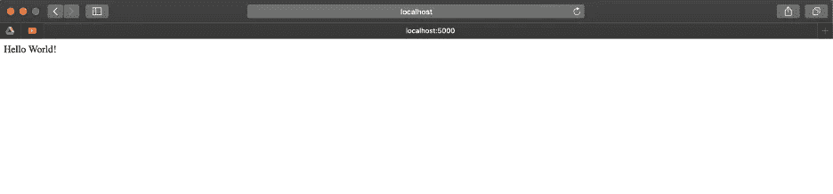
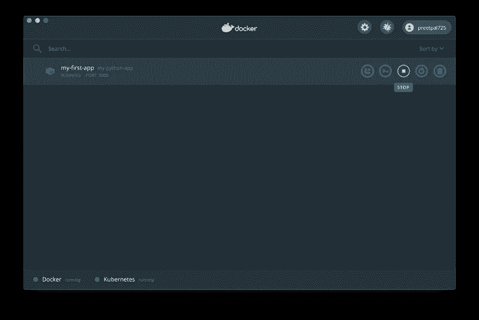

# Python docker

> 原文：<https://levelup.gitconnected.com/docker-with-python-840913f7a340>


合著者: [Himanshu Negi](https://www.linkedin.com/in/himanshunegi26/)

我先简单介绍一下*码头工人*。它旨在通过使用轻量级容器来创建、运行和托管应用程序。它使得任何技术水平的任何开发人员都可以非常容易地共享和运行容器化的应用程序。这些容器让你忘记了使用实际的服务器和虚拟机来托管应用程序。这意味着您不必担心运行应用程序所需的操作系统，从而解决了“*它在我的机器上工作*”这一令人头疼的问题。通过在几分钟内安装运行应用程序所需的包，您可以加快速度，确保开发、测试和生产之间的一致性。您还可以通过项目的图像与团队成员协作，并将其托管在云上。

***Docker image*** 是一个包含源代码、库、依赖项、工具和应用程序运行所需的其他文件的文件。这里要记住的一个要点是，docker 映像是不可变的，这意味着在构建映像之后，如果您想要进行更改，您需要获得一个新的映像，并在其上运行更新后的代码。图像就像一个模板，您不能启动或运行它们，但是您可以使用这些模板来构建一个容器。容器只是一个运行的映像，在你的代码上运行。一旦你创建了一个容器，它就在图像的顶部提供了一个可写层，基本上你现在可以修改它了。

一个 ***Docker 容器*** 是一个开源软件开发平台。容器允许开发人员将应用程序与所有的依赖项(如库)打包在一起，并作为一个包运输。它的主要好处是将应用程序打包在“**容器**”中，使它们具有可移植性。它允许您链接到代码库，构建并测试您的映像，存储手动推送的映像，并链接到 **Docker** Cloud，以便您可以将映像部署到您的主机。

不是每个应用程序托管每个操作系统，而是可以共享一些公共资源，有一种叫做“ ***docker engine*** ”的东西，它位于操作系统之上。

简而言之，“*服务器中的发货代码不再太难了。*”

无论您是数据工程师还是每天使用 python 运行机器学习任务的数据科学家，这都是一个创建“Hello World！”的简单分步指南 python 应用程序，可以帮助你理解和熟悉 Docker 容器过程。

# 下载并安装 Docker

Docker 在 Windows 和 Mac 上免费公开发布，你可以通过链接轻松下载:【https://www.docker.com/products/docker-desktop 

按照简单的步骤很容易安装它，一旦你下载了它，打开 Docker 仪表板，你会看到这样的屏幕。



# **构建容器和托管应用程序的步骤**

# **第一步:编写“hello.py”文件**

写一句“你好世界！”python 中的 flask API，并保存在一个文件夹中。

```
from flask import Flaskapp = Flask(__name__) @app.route(“/”)def main(): return “Hello World!” if __name__ == “__main__”: app.run(host=”0.0.0.0", port=int(“5000”), debug=True)
```

# **第二步:设定你的需求**

在“requirements.txt”文件中提及运行应用程序所需的所有要求和版本。在我们的例子中，我们只需要“flask”库来托管我们的应用程序。

```
flask
```

# 步骤 3:创建 Dockerfile 文件



创建一个“ *dockerfile* ”，并提及您想要使用的图像。对于 python，在 [docker hub](https://hub.docker.com/search?q=&type=image) 中有许多图像可用，你可以使用其中的任何一个。它们都是独立于根操作系统轻量级 python 应用程序。

```
FROM python:3.7COPY . /appWORKDIR /appRUN pip install -r requirements.txtEXPOSE 5000CMD python ./hello.py
```

FROM 表示您希望 docker 使用的图像。COPY 命令会将所有文件从本地目录复制到工作目录“/app”中。WORKDIR 命令将设置工作目录。运行命令将运行“pip install”命令，并将安装 requirement.txt 文件中提到的所有要求。EXPOSE 命令将启用承载应用程序的端口。

# 步骤 4:建立 Docker 图像

如果您使用的是 MacBook 或命令提示符，请打开您的终端；如果您使用的是 Windows PC，请转到您保存上述文件的位置，并编写以下命令:

```
$ docker
```



```
$ docker build -t my-python-app .
```



您将看到一条消息，说明映像已经成功构建。

# **步骤 5:运行 docker 容器**

```
$ docker run — name my-app -p 5000:5000 my-python-app
```

注意:name my-app 是一个可选参数。



# **步骤 6:在本地主机上打开应用**

在 docker 仪表板中，将光标拖至容器名称，即“my-python-app ”,然后单击“在浏览器中打开”按钮。



这将打开你的默认浏览器，你会看到“Hello World！”写在那里！



# **步骤 7:停止容器**

你可以通过点击“停止”按钮来停止你的容器。

