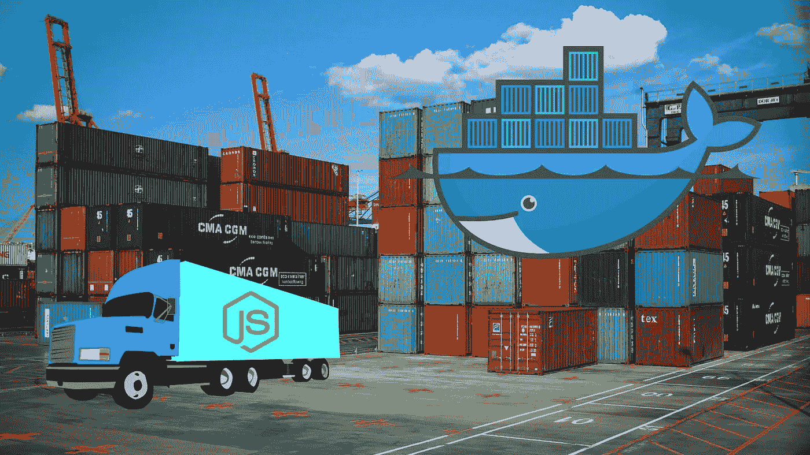
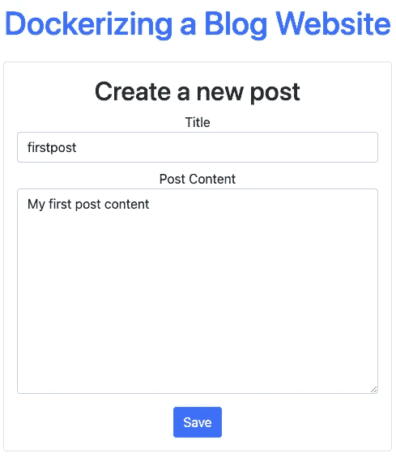
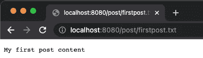

# 将您的 Nodejs 应用程序归档

> 原文：<https://levelup.gitconnected.com/dockerize-your-nodejs-application-93eea25b909a>



# 目标

本文的目标是展示一个例子，它将一个 nodejs 应用程序归档并使用 docker 卷存储应用程序数据。我将使用一个非常简单的例子，但是您可以应用相同的步骤来 dockerize 任何 nodejs 应用程序。

为此，我将使用一个用 nodejs 构建的简单的单页博客网站。如果您有您想要的应用程序，那么就使用它，否则就克隆我正在使用的同一个库，让我们开始吧。

知识库链接:【https://github.com/hayk-simonyan/dockerized-blog-website 

# 让我们整理一下

## 1.创建 Dockerfile 文件

首先，你需要`cd {into_your_project}`，在我这里是`cd dockerized-blog-website`

现在，您需要创建一个 **Dockerfile** ，这是一个**文件，您可以在其中定义 docker 映像应该如何配置和构建。稍后，您将基于该文件构建您的映像，docker 将自上而下执行这里列出的所有命令。**

```
FROM node WORKDIR /blogapp COPY package.json . RUN npm install COPY . . EXPOSE 8080 CMD [“node”, “server.js”]
```

让我们看看这个文件包含了什么。我们在来自 [DockerHub](https://hub.docker.com/) 的节点图像上构建我们的图像。然后我们将主工作目录设置为`/blogapp`文件夹(可选)。我们将`package.json`复制到`/blogapp`库中，并运行`npm install`来安装`node_modules`。

之后，我们将剩余的内容复制到`/blogapp`中。然后我们公开端口`8080`，因为我们的`server.js`监听端口`8080` - `app.listen(8080)`，如果你的应用运行在不同的端口上，你应该公开那个端口而不是`8080`。最后，我们通过运行`node server.js`启动我们的服务器

确保您在项目的根级别创建了 docker 文件。

## 2.使用 Dockerfile 文件构建映像

现在我们有了 docker 文件，我们可以创建一个图像。在您的项目存储库中运行

`docker build . -t blogapp:1.0`

`docker build .` **使用您的 docker 文件**构建新图像。使用`-t option`给你的图像命名(`blogapp`)和版本(`1.0`)

检查它是否创建成功，运行 docker images 并在列表中找到您的图像

```
REPOSITORY | TAG   | IMAGE ID     | CREATED        | SIZE
blogapp    | 1.0   | a6778e6bb622 | 5 seconds ago  | 914MB
```

## 3.创建一个容器

在我的应用程序中，我将帖子作为文本文件存储在`/post`文件夹中。因此 docker 也会这样做，并将帖子保存在容器内的`/post`文件夹中。但是之后，如果容器被移除，这些在`/post`文件夹中的帖子将会随着容器一起被移除。

所以我们需要某种方法来备份这个`/post`文件夹，以确保我们不会丢失用户数据。为此，我们可以使用 **docker volumes** 来安全地备份重要数据。

[**卷**](https://docs.docker.com/storage/volumes/) 是您主机上的文件夹，它们被“挂载”(可用)在容器中。即使容器被移除，卷仍然存在。容器可以在卷中读写数据。

因此，我将基于刚刚构建的图像创建我的容器。我还将在同一个命令中创建一个卷来存储来自`/post`文件夹的所有文件，以确保容器被移除时的安全。

```
docker run -p 3000:8080 —-name blogapp -v post:/blogapp/post a6778e6bb622
```

`-p 3000:8080`指定您将在哪个端口上运行容器中的这个应用程序。`8080`是您在**docker 文件**中指定的相同端口，这是我们公开的端口，而`3000`是应用程序将在其上运行的容器中的端口。使用`--name`选项，您可以命名您的容器(blogapp)。

`-v post:/blogapp/post`创建一个名为`post`的**卷**，它被挂载到我们容器内的`/blogapp/post`文件夹中。这意味着在我们的应用程序中创建的任何 post 都将存储在我们主机上名为`post`的卷中。而`a6778e6bb622`是我们用 Dockerfile 构建的图像的 id。

运行`docker ps`再次检查容器是否正在运行

```
CONTAINER ID | IMAGE        | ... | NAMES
ab31a3adb143 | a6778e6bb622 | ... | blogapp
```

## 4.打开应用程序并将数据储存在宗卷中

现在你的容器在端口`3000`上运行，如果你访问 [http://localhost:3000](http://localhost:3000) 你应该会看到你的应用在运行。



例如，试着创建一个标题为`firstpost`和任何内容的新帖子。然后访问[http://localhost:3000/post/first post . txt](http://localhost:3000/post/post2.txt)。你应该在这里看到你的帖子



要查看卷是否已创建，请运行`docker volume ls`

```
DRIVER | VOLUME NAME
local  | post
```

## 5.停止、移除、重新启动容器，并确保数据存储在卷中

使用容器名称`docker stop blogapp`停止容器

取出容器`docker rm blogapp`

现在，用我们上面使用的命令重新启动您的容器

```
docker run -p 3000:8080 — name blogapp -v post:/blogapp/post a6778e6bb622
```

并访问[http://localhost:3000/post/first post . txt](http://localhost:3000/post/post2.txt)。您应该仍然可以看到您创建的文章，这意味着它存储在 docker 卷中，并且在容器移除后仍然存在。


# 概括起来

这是一个使用卷将 nodejs 应用程序归档的例子。正如我们所见，容器可以读/写数据，但是如果容器被移除，写入的数据将会丢失。因此，我们使用 docker 卷，它是主机上的文件夹，由 docker 管理，并装入容器中。

在本例中，我们使用了一个命名卷。有 3 种类型的卷可供使用—命名卷、匿名卷和绑定装载。如果你想了解更多，我会在下面的参考资料中留下一个链接。

# 资源

[https://docs.docker.com/get-started/overview/](https://docs.docker.com/get-started/overview/)
[https://docs.docker.com/get-started/02_our_app/](https://docs.docker.com/get-started/02_our_app/)
[https://docs.docker.com/storage/volumes/](https://docs.docker.com/storage/volumes/)
[https://hub.docker.com/](https://hub.docker.com/)
[https://docs . docker . com/develop/develop-images/docker file _ best-practices/](https://docs.docker.com/develop/develop-images/dockerfile_best-practices/)