# 用 Go、Gorm、JWT、PostgreSQL、MySQL 和 Testing 编写 CRUD RESTful API

> 原文：<https://levelup.gitconnected.com/dockerized-crud-restful-api-with-go-gorm-jwt-postgresql-mysql-and-testing-61d731430bd8>

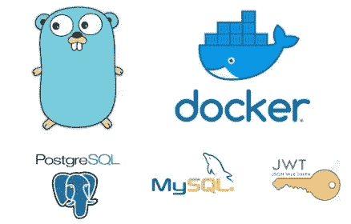

这是我们在这里构建的 API 的第 2 部分——在这一部分中，我们将对应用进行 Dockerize。你也可以在这里获得代码[，这是文章的先决条件。有了这些代码，您就可以继续对应用程序进行 Dockerizing 了。](https://github.com/victorsteven/Go-JWT-Postgres-Mysql-Restful-API)

链接到[第一篇](/crud-restful-api-with-go-gorm-jwt-postgres-mysql-and-testing-460a85ab7121?source=friends_link&sk=13d172e0aec3b14f758c0968a8798145)

在上一篇文章中，我们说过我们将从头到尾构建 API。我们构建了所有的端点，并为它们编写了测试用例。

现在，我们将对应用程序进行归档。

【本文简介:

*   在此处将之前构建的 API[归档](/crud-restful-api-with-go-gorm-jwt-postgres-mysql-and-testing-460a85ab7121?source=friends_link&sk=13d172e0aec3b14f758c0968a8798145)

**以后的文章:**

*   [使用 minikube](/deploying-dockerized-golang-api-on-kubernetes-with-postgresql-mysql-d190e27ac09f?source=friends_link&sk=24aacc3d3ef2dbba4526818f27be0ec9) 在本地将 dockerized 应用程序部署到 **kubernetes**
*   将 dockerized 应用程序部署到 AWS、Google Cloud 或数字海洋
*   集成工具，如 Travis、Circle CI 等
*   使用 React/VueJS 消费 API

## 术语的定义

**码头工人**

**Docker** 是一组[平台即服务](https://en.wikipedia.org/wiki/Platform-as-a-service) (PaaS)产品，使用操作系统级虚拟化来交付称为容器的软件包中的软件。容器是相互隔离的，并且捆绑了它们自己的软件、库和配置文件。他们可以通过明确定义的渠道相互交流。所有容器都由单一操作系统内核运行，因此比虚拟机更轻量级。([维基百科](https://en.wikipedia.org/wiki/Docker_(software)))

**Docker 图像**

Docker 映像是由多层组成的文件，用于执行 Docker 容器中的代码。一个[映像](https://searchitoperations.techtarget.com/definition/container-image)是从一个完整的可执行版本的应用程序的指令(在 docker 文件中)中构建的，它依赖于主机操作系统[内核](https://searchdatacenter.techtarget.com/definition/kernel)。当 Docker 用户运行一个图像时，它会成为该容器的一个或多个实例。( [TechTarget](https://searchitoperations.techtarget.com/definition/Docker-image) )

**码头集装箱**

容器是一个标准的软件单元，它将代码及其所有依赖项打包，以便应用程序能够快速可靠地从一个计算环境运行到另一个计算环境。Docker 容器映像是一个轻量级的、独立的、可执行的软件包，包括运行应用程序所需的一切:代码、运行时、系统工具、系统库和设置。([Docker.com](https://www.docker.com/resources/what-container))

容器不同于虚拟机(VM ),虚拟机在物理硬件资源的抽象层上将整个操作系统与可执行代码封装在一起。( [TechTarget](https://searchitoperations.techtarget.com/definition/Docker-image) )

# 让我们开始吧

在此获取此商品的回购[。](https://github.com/victorsteven/Dockerized-Golang-Postgres-Mysql-API/tree/master)

你还应该在你的机器上安装 docker。

可以使用 **PostgreSQL** 或者 B **ySQL** 。我努力让你选择适合你的。本文中的默认数据库是 PostgreSQL。

# **步骤 1:为应用程序构建 Docker 映像。**

我们通过从项目根目录创建一个 **Dockerfile** 来做到这一点:

```
touch Dockerfile
```

内容如下:

Dockerfile 文件

正如所看到的，该文件是合理的自我解释，但我仍然想讨论一些重要的细节:

*   我们使用多阶段构建构建了一个优化的 Golang 图像。这是因为使用`golang:latest`会创建消耗大量内存的图像，因此不利于生产。所以我们用了很轻的`golang:alpine`。一个巨大的 17.9 兆字节的图像。印象深刻！

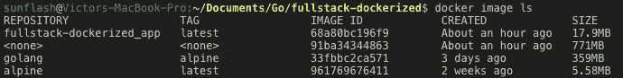

*   另一件值得注意的事情是`.env`文件。您可以看到我们是如何将它添加到 Dockerfile 文件中的。这对我们的环境变量至关重要。

# 步骤 2:使用 docker-compose 构建应用程序服务。

我们的应用程序需要不止一个容器/服务。我们需要一个容器来装:

*   API 的应用程序容器/服务
*   数据库容器/服务
*   数据库管理工具，如 pgadmin(使用 Postgres)或 phpmyadmin (mysql)

记住所有这些，我们将使用`**docker compose**`来定义我们的应用程序需要的所有服务(容器)。

从根目录创建一个 **docker-compose.yml** 文件:

```
touch docker-compose.yml
```

这是 mysql 和 postgresql 的内容:

docker-compose.yml

如图所示， **PostgreSQL** 是默认数据库。如果您使用的是 MySQL ，只需注释 postgres 代码。注意，不要在 postgres 和 mysql 都没有注释的情况下运行 compose 文件，以避免任何可能占用您宝贵时间一两个小时的问题。

**简单来说:**

对于 PostgreSQL 用户:

postgres-docker-compose.yml

对于 MySQL 用户:

mysql-docker-compose.yml

够公平吗？酷毙了。

所以，就用基于你数据库的那个吧。请记住，无论您选择什么，文件的名称都应该是:`docker-compose.yml`

**数据库工具:**

如果您希望您的应用程序使用 **postgresql** ，我还添加了 **pgadmin** 服务，它为您提供了查看数据库的 GUI。这将进一步解释。

如果您希望您的应用程序使用 mysql，我还添加了 phpmyadmin 服务，它为您提供了查看数据库的 GUI。这也将被进一步解释。

# **第三步:编辑你的。环境值**

从上一篇文章开始，对`.env`文件进行了修改。确保您文件看起来像这样:

请注意上述文件中的以下内容:

*   使用 PostgreSQL。要使用 mysql，注释 postgres 并取消注释 mysql 细节。或者说，去掉那些不吸引你的。
*   观察 **DB_HOST。**这是从 **docker-compose.yml** 文件中服务的**名称**得到的。如果你想在你的**本地**机器上运行这个应用程序，用值 127.0.0.1 注释活动的那个并取消注释主机。

# **第四步:运行应用**

我们现在准备创建并启动 docker-compose 中列出的所有容器/服务。

运行:

```
docker-compose up
```

当你的申请快到了的时候，你可能需要喝杯咖啡。

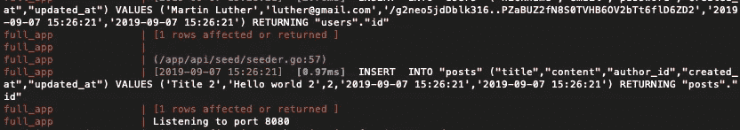

从第一篇文章开始，我们就植入了数据库，以防你被上面的截图所困扰。我只想让你把注意力集中在“监听端口 8080”上。

这表明您的应用程序已经成功启动。

现在您已经确认一切正常，您可以使用以下命令停止应用程序运行:

```
docker-compose down 
```

然后使用以下命令在后台再次运行应用程序:

```
docker-compose up -d
```

上述命令将不会在终端中显示任何日志，因为应用程序现在正在后台运行。

明智的做法是先运行 **docker-compose up。**因此，如果出现问题，您可以在日志中轻松查看并解决它们。

## 可能的问题

i. **环境变量的问题:**也许您在`.env`文件中使用了无效的细节，这可能会破坏您的构建。运行`docker-compose up`时仔细阅读日志。如果您发现任何问题并解决了，使用 **Ctrl+C.** 终止该过程

使用以下命令停止运行进程:

```
docker-compose down --remove-orphans --volumes 
```

移除卷的原因:第一个构建已经为您创建了卷。该卷保存了以前的凭据，因此您必须删除以前的卷，以反映更新的详细信息。

然后，要重新构建，请使用:

```
docker-compose up --build
```

观察`**--build**`。

二。**任何其他问题:**如果您有任何其他问题，请尝试阅读日志并修复它们。然后按照完全相同的过程重新构建。

## **成功构建**

当构建成功时，高高兴兴地到您的浏览器或邮差那里访问:

```
http://localhost:8080
```

你将受到热烈欢迎:

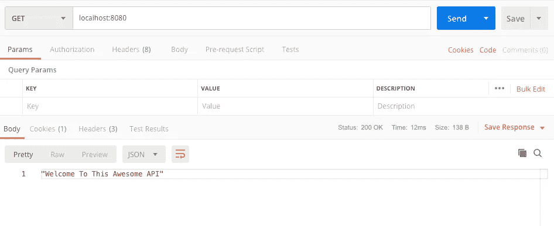

我们在数据库中有两个用户和两个帖子数据，所以如果您访问:

```
http://localhost:8080/users
```

您将看到所有用户的显示

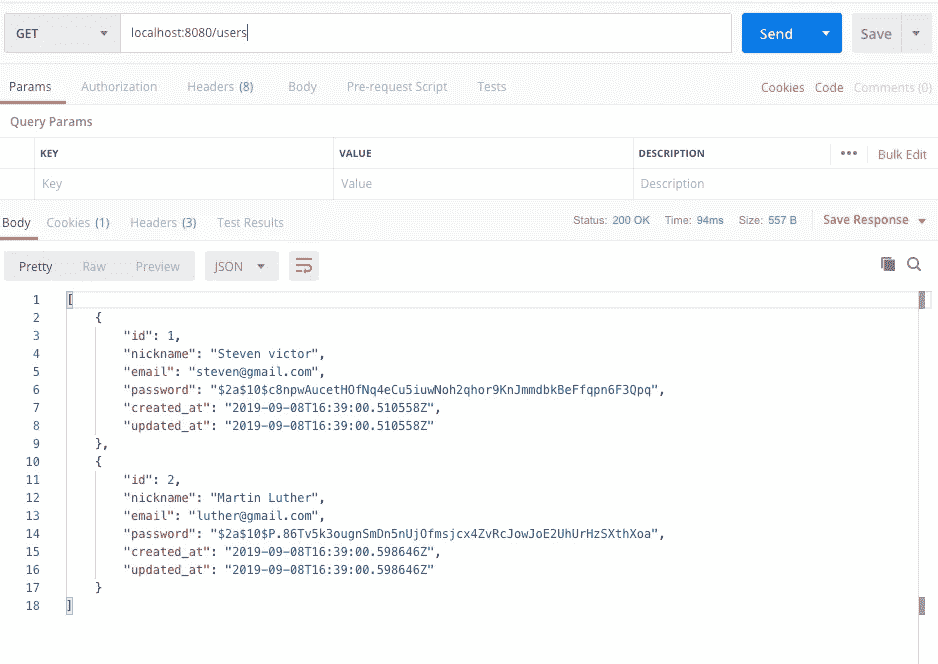

注意，Docker 全权负责。该应用程序不依赖于您的系统 Go、postgres、mysql、pgadmin 或 phpmyadmin 安装。一切由 docker 提供。

**注意:上面的程序是用 postgresql 运行的，如果你用的是 mysql，从。env 文件和使用 mysql 的细节。**

# 步骤 5:使用 GUI 工具使用数据库

还记得我们添加了像 pgadmin(用于 postgres 数据库)和 phpmyadmin(用于 mysql 数据库)这样的工具。

无论您使用哪个数据库，让我们从这些工具中查看数据库。

**答:pgadmin**

这是用于 postgres 数据库。如果您用 postgres 数据库启动您的应用程序，我们为 pgadmin(如 docker-compose.yml 中所示)文件公开端口 **5050** 。我们将使用该端口打开 pgadmin。

转到您的浏览器并打开:

```
http://localhost:5050
```

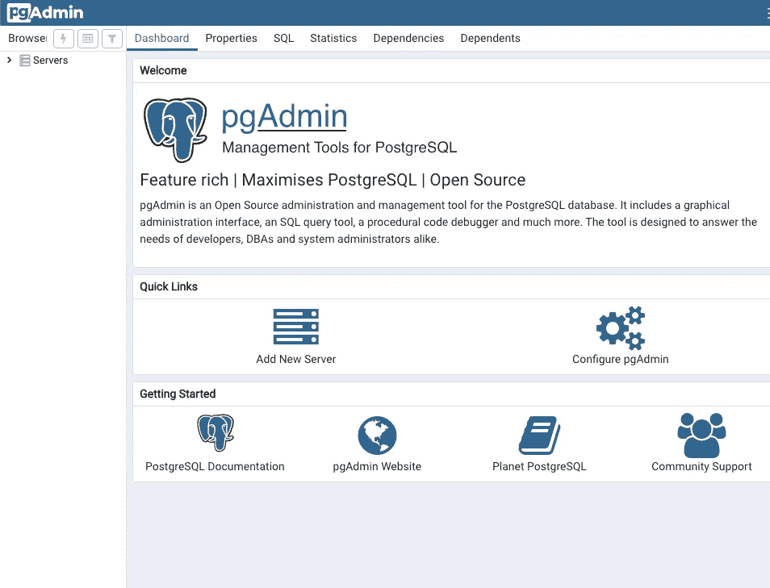

一、右键点击**服务器**，新建一个服务器。选择**创建**然后选择**服务器**:

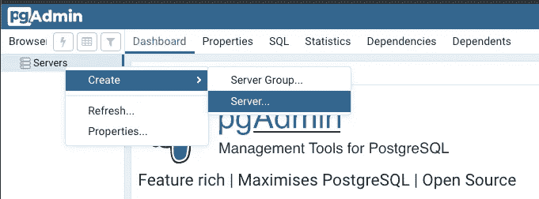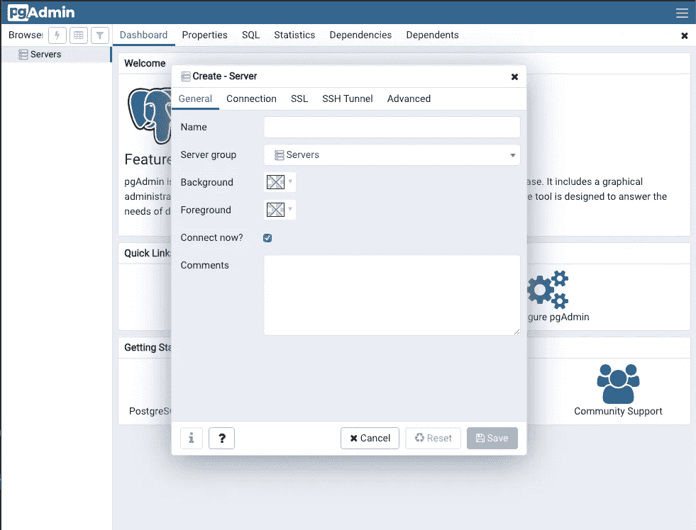

二。填写您想要的任何**名称**。

三。点击连接选项卡:

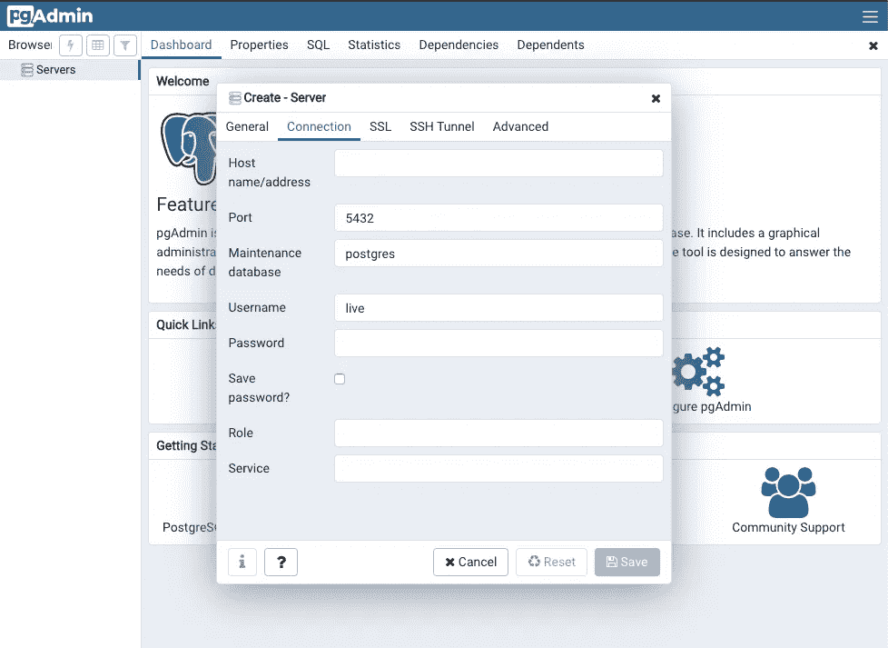

记住，我们同意当你的构建成功时，你可以使用`docker-compose up -d`。你留着你的吗？

我们将从数据库中获取**主机** **名称**。在终端中，列出正在运行的容器列表:

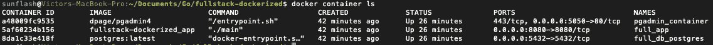

从上面的截图中复制 **full_db_postgres** 容器的 ID，它是: **8da1c33e418f**

在这里使用它:

```
docker inspect <container_id> | grep IPAddress
```

我的输出是:

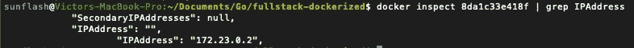

得到那个 IP 地址，那就是**主机名**

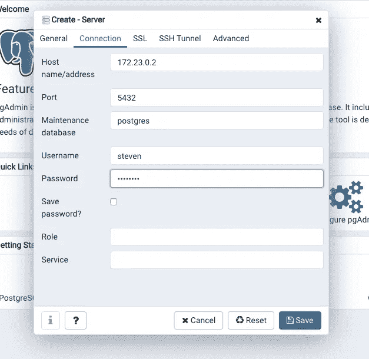

**用户名**和**密码**是来自你的**的。env** 文件。

成功登录后，您将看到您在`.env`文件中指定的数据库

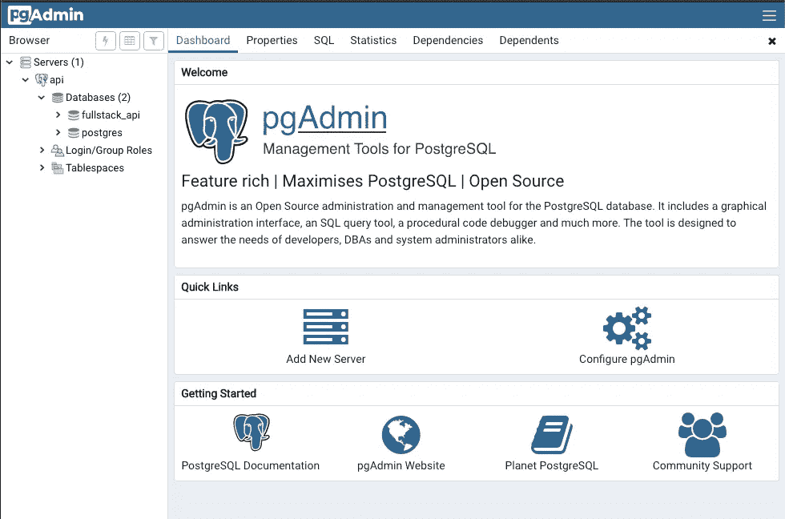

太好了！

b. phpmyadmin

如果你正在使用 mysql 数据库，这是给你的。

从 **docker-compose.yml** 文件中，我们暴露了端口 **9090**

因此，为了成功构建，请在浏览器中打开:

```
[http://localhost](http://localhost):9090
```

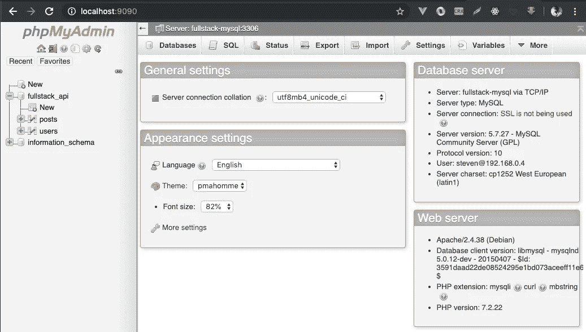

太好了！

# 步骤 6:关闭应用程序

成功测试应用程序后，您可以使用以下命令将其关闭:

```
docker-compose down
```

或者也删除卷:

```
docker-compose down --remove-orphans --volumes 
```

如果要删除所有悬挂图像，请运行:

```
docker system prune 
```

要删除所有未使用的图像，而不仅仅是悬挂的图像，请运行:

```
docker system prune -a
```

要删除所有未使用的映像，而不仅仅是悬挂的映像和卷，请运行:

```
docker system prune -a --volumes
```

# 在 Docker 上运行测试用例

到目前为止，我们已经能够运行我们的应用程序，但是如果我们想像在第 1 篇文章中没有 docker 的情况下那样测试应用程序，该怎么办呢？

注意:如果您阅读了第 1 篇文章，我对我们测试的目录结构做了一些修改。现在一切都在`/tests`目录中。没有子包，我认为这更简单，所以我们只运行一个测试套件，而不是前一篇文章中的两个。

这就是我的意思:

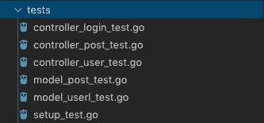

如果你决定不改变，你现在所拥有的仍然会起作用。

# **步骤 7:** 为应用程序构建一个测试 Docker 映像。

请注意，我们没有使用相同的 Dockefile 进行测试。我们将创建一个自定义 docker 文件。

在根目录下，创建`Dockerfile.test`

这是内容:

`Dockerfile.test`

# 步骤 8:使用 docker-compose 构建测试应用程序服务。

记住 **postgres** 被用作默认值。如果您正在使用 **mysql** ，请评论 **postgres** 细节，并取消评论 **mysql** 细节。

创建测试合成文件:

```
touch docker-compose.test.yml
```

docker-compose.test.yml

从上面的文件中可以看出，我们声明了要构建的 Dockerfile 文件。

# 步骤 9:运行测试

确保您的 postgres/mysql 测试数据配置在您的**中。env** 文件并取消注释。在**第三步**可以看到我的。

现在运行测试，

```
docker-compose -f docker-compose.test.yml up --build --abort-on-container-exit
```

`--abort-on-container-exit`标志是必要的，因为如果省略该标志，包含集成服务的其他容器将在测试完成后挂起。

这是运行测试时终端中最后一个细节的屏幕截图:

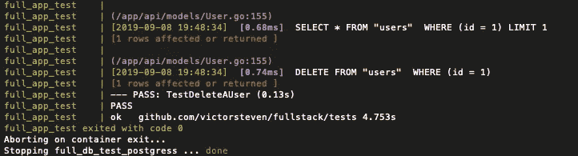

我们的**测试套件**通过了！

太好了！

**可能出现的问题**

是的，运行 docker 可能会有问题。遵循步骤 4 中列出的步骤。为了诊断和处理可能遇到的任何错误，仔细阅读日志是非常重要的。

# **结论**

在第 1 篇文章中，我们构建了一个 **API。**在本文中，我们对 **API 进行了码头化。**

在以后的文章中:

*   [我们将部署到 kubernetes 集群](/deploying-dockerized-golang-api-on-kubernetes-with-postgresql-mysql-d190e27ac09f?source=friends_link&sk=24aacc3d3ef2dbba4526818f27be0ec9)
*   整合特拉维斯
*   用 React/Vue 消费 API。

敬请期待！

关注以获取更新。

## 点击获取本文[的完整代码](https://github.com/victorsteven/Dockerized-Golang-Postgres-Mysql-API)

码头作业快乐！